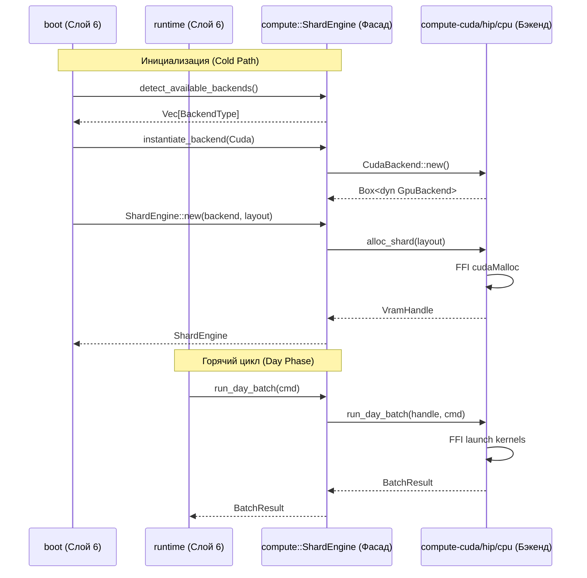

spec_compute

> Версия спеки: 1.0   
> Дата: 2026-06-23   
> Статус: Verified   

---

## §1. Идентификация

| Поле | Значение |
|---|---|
| Название | `compute` |
| Слой | Слой 3 — Compute |
| Тип | Library (`lib`) |
| no_std | **Нет** (зависит от динамического выбора бэкендов в рантайме, системного аллокатора кучи хоста для инкапсуляции трейтов бэкенда) |
| Описание | Фасадный крейт Слоя 3, реализующий автоматический выбор вычислительного бэкенда, управление общим VRAM-состоянием и оркестрацию исполнения шарда через ShardEngine. |

---

## §2. Стек и Окружение

### §2.1. Внутренние зависимости (inbound)

| Крейт | Что используется | Зачем |
|---|---|---|
| compute-api | GpuBackend, VramHandle, ShardLayout, DayBatchCmd, BatchResult, OutputFrame, TelemetryFrame, ComputeApiError | Абстракция интерфейса вычислителя HAL, дескрипторов ресурсов и DTO запуска. |
| compute-cpu | CpuBackend (optional, default) | Резервный CPU-вычислитель при отсутствии GPU. |
| compute-cuda | CudaBackend (optional) | NVIDIA CUDA вычислитель для высокопроизводительных запусков. |
| compute-hip | HipBackend (optional) | AMD HIP вычислитель для ROCm-совместимых сред. |

### §2.2. Внешние зависимости

Секция не применима к данному крейту: крейт использует исключительно внутренние зависимости Слоя 3 и стандартную библиотеку Rust.

### §2.3. Feature Flags

| Feature | Default | Что включает |
|---|---|---|
| `cpu` | Да | Поддержку многопоточного CPU бэкенда на базе планировщика Rayon. |
| `cuda` | Нет | Поддержку NVIDIA CUDA бэкенда и компиляцию CUDA-ядер (`nvcc`). |
| `hip` | Нет | Поддержку AMD HIP бэкенда и компиляцию HIP-ядер (`hipcc`). |

---

## §3. Инварианты

### §3.1. Структурные инварианты

- **INV-COMPUTE-001**: *Инкапсуляция бэкенда через GpuBackend*.
  - *Обоснование*: Структура `ShardEngine` обязана скрывать под капотом `Box<dyn GpuBackend>` и обращаться к конкретному вычислителю исключительно через абстрактный трейт HAL.
  - *Следствие нарушения*: Протекание платформозависимых структур бэкендов наружу в оркестратор и сетевой слой.
  - *Где проверяется*: compile-time, проверка сигнатур Rust.

- **INV-COMPUTE-004**: *Stateless Фасад (Zero-State Proxy)*.
  - *Обоснование*: Фасад `ShardEngine` обязан служить исключительно маршрутизатором. Хранение любого состояния симуляции (например, контекста отладчика `ephys_state` или счетчиков тиков) внутри структуры `ShardEngine` запрещено. Всё состояние живет в VRAM или передается через иммутабельный `DayBatchCmd`.
  - *Следствие нарушения*: Рассинхронизация с реальным содержимым видеопамяти, гонки данных при параллельном исполнении, нарушение Data-Oriented Design.
  - *Где проверяется*: compile-time (строгий контроль полей структуры `ShardEngine`).

### §3.2. Семантические инварианты

- **INV-COMPUTE-002**: *Детерминированный выбор бэкенда при инициализации*.
  - *Обоснование*: Выбор бэкенда (Cuda, Hip, Cpu) должен происходить в строго заданном приоритете.
  - *Следствие нарушения*: Непредсказуемый запуск медленного CPU бэкенда при исправной видеокарте.
  - *Где проверяется*: Юнит-тест `test_backend_auto_selection`.

- **INV-COMPUTE-003**: *Гарантия Teardown до Drop*.
  - *Обоснование*: Для предотвращения паник при деинициализации драйвера GPU операционной системой до уничтожения Rust-ресурсов, `ShardEngine` обязан предоставлять метод `teardown()`.
  - *Следствие нарушения*: Exit Crash / Heap Corruption (ошибка 0xc0000374) при штатной остановке симулятора.
  - *Где проверяется*: Интеграционный тест `test_teardown_drop_race_safety`.

- **INV-COMPUTE-005**: *Zero-Cost Фасад (Batch-Level Dispatch)*.
  - *Обоснование*: Вызов методов через `Box<dyn GpuBackend>` требует обращения к vtable. Для сохранения механической симпатии к железу, виртуальные вызовы обязаны происходить строго один раз за батч (на уровне `run_day_batch`), а не потиково внутри горячего цикла.
  - *Следствие нарушения*: Деградация пропускной способности (TPS) из-за накладных расходов на динамическую диспетчеризацию и разрушения кэша инструкций CPU.
  - *Где проверяется*: Архитектурный линтер / Code Review (отсутствие `dyn` вызовов в потиковых циклах).

### §3.3. Межкрейтовые инварианты

Секция не применима к данному крейту: межкрейтовые инварианты детерминизма и структуры данных принадлежат и проверяются другими крейтами.

---

## §4. Публичный API

### §4.1. Типы

#### ShardEngine

```rust
pub struct ShardEngine {
    backend: Box<dyn GpuBackend>,
    handle: VramHandle,
    layout: ShardLayout,
    is_teared_down: bool,
}
```

- **Семантика**: Оркестратор конкретного вычислительного шарда. Владеет контекстом выделенной памяти (`VramHandle`) и абстрактным трейтом бэкенда `Box<dyn GpuBackend>`. Фасад является полностью stateless между исполнением батчей.
- **Жизненный цикл**: Инициализируется загрузчиком (`bootloader`) при старте шарда. Обязан явно освобождать аппаратную память через `teardown()` до деструкции в `Drop` для предотвращения гонок деинициализации драйвера операционной системы.
- **Ограничения на значения**: Поле `handle` должно оставаться валидным до вызова `teardown()`.

#### BackendType

```rust
#[derive(Debug, Clone, Copy, PartialEq, Eq)]
pub enum BackendType {
    Cuda,
    Hip,
    Cpu,
}
```

- **Семантика**: Поддерживаемые вычислительные платформы для симуляции. Применяется для динамической автодетекции железа при старте и инициализации соответствующего бэкенда.

### §4.2. Трейты

Секция не применима к данному крейту: крейт предоставляет фасадную реализацию оркестратора и функции инициализации, а не абстрактные трейты.

### §4.3. Функции

#### pub fn detect_available_backends() -> Vec<BackendType>

- **Назначение**: Опрашивает хост на наличие совместимых графических ускорителей и возвращает список доступных бэкендов в порядке приоритета.
- **Предусловия**: Нет.
- **Постусловия**: Возвращает непустой список (как минимум `BackendType::Cpu`, если включена фича `cpu`).
- **Сложность**: O(1).
- **Паника**: Никогда.

#### pub fn instantiate_backend(backend: BackendType, device_id: Option<i32>) -> Result<Box<dyn GpuBackend>, ComputeApiError>

- **Назначение**: Создает инстанс конкретного бэкенда для указанного GPU.
- **Предусловия**: Выбранный бэкенд должен быть скомпилирован в сборке (соответствующая cargo feature должна быть включена).
- **Постусловия**: Возвращает валидный `Box<dyn GpuBackend>` или ошибку инициализации (например, `DeviceLost` или `VendorError`).
- **Сложность**: O(1).
- **Паника**: Никогда.

#### `impl ShardEngine`

```rust
impl ShardEngine {
    /// Инициализирует ShardEngine, аллоцируя VRAM под переданный макет
    pub fn new(backend: Box<dyn GpuBackend>, layout: ShardLayout) -> Result<Self, ComputeApiError> {
        // ...
    }

    /// Загружает начальное состояние шарда в память вычислителя
    pub fn upload_state(&self, state: &[u8]) -> Result<(), ComputeApiError> {
        // ...
    }

    /// Загружает 64-байтные профили нейронов в Constant Memory (L1 Cache)
    pub fn upload_variants(&self, variants: &[VariantParameters]) -> Result<(), ComputeApiError> {
        // ...
    }

    /// Выполняет вычисление батча тиков (Day Phase)
    pub fn run_day_batch(&self, cmd: &DayBatchCmd) -> Result<BatchResult, ComputeApiError> {
        // ...
    }

    /// Выгружает результаты моторных команд на хост
    pub fn download_output(&self) -> Result<OutputFrame, ComputeApiError> {
        // ...
    }

    /// Выгружает телеметрию активности шарда на хост
    pub fn download_telemetry(&self) -> Result<TelemetryFrame, ComputeApiError> {
        // ...
    }

    /// O(1) патчинг графа межшардовых связей без реаллокации VRAM
    pub fn patch_ghosts(&self, patches: &[GhostPatch]) -> Result<(), ComputeApiError> {
        // ...
    }

    /// Запускает Segmented Radix Sort в VRAM для вытеснения пустых слотов в конец массива
    pub fn run_sort_and_prune(&self, prune_threshold: i16) -> Result<(), ComputeApiError> {
        // ...
    }

    /// Освобождает ресурсы VRAM через бэкенд до срабатывания Drop
    pub fn teardown(&mut self) -> Result<(), ComputeApiError> {
        // ...
    }
}

impl Drop for ShardEngine {
    /// Гарантированный фолбэк очистки VRAM при панике или аварийном завершении оркестратора.
    /// Проверяет флаг `is_teared_down`. Если `teardown()` не был вызван явно, 
    /// вызывает `backend.free(self.handle)`. 
    /// Любые исключения драйвера GPU (C-FFI) на этом этапе жестко перехватываются 
    /// и гасятся (silent drop) для предотвращения double-panic abort.
    fn drop(&mut self) {
        // ...
    }
}
```

- **Семантика**: Набор оркестрирующих методов для исполнения HFT-цикла и управления памятью шарда.
- **Паника**:
  - `run_day_batch` паникует при вызове после выполненного `teardown()`.

### §4.4. Константы и Магические Числа

Секция не применима к данному крейту: крейт не содержит собственных констант или магических чисел, делегируя их в `compute-api` и `layout`.

---

## §5. Доменная Логика

Единая точка входа (фасад) для инициализации и исполнения HFT-цикла (Day Phase) на шарде. Крейт инкапсулирует выбор аппаратного бэкенда (CUDA, HIP, CPU) и управление VRAM/RAM-памятью внутри `ShardEngine`.

Выделение фасада в отдельный крейт изолирует `runtime` (Слой 6) от сырых FFI-указателей и деталей конкретных платформенных драйверов, предоставляя единый абстрактный контракт через `Box<dyn GpuBackend>`. Это делает возможной динамическую автодетекцию железа при старте и горячее переключение на CPU-фолбэк (Fallback) при отказе видеокарты без рефакторинга бизнес-логики.

Доменная проблема, которую решает крейт — безопасное управление жизненным циклом аппаратного шарда. Он координирует Zero-Copy загрузку SoA-состояний, асинхронную отработку батча тиков и выгрузку моторных команд (DMA), гарантируя, что ни одна паника драйвера не просочится в сеть без конвертации в контролируемый `ComputeApiError`.

---

## §6. Алгоритмы и Формулы

### §6.1. Автоматический выбор бэкенда (Backend Auto-Selection Sequence)

**Вход**: Приоритеты фича-флагов, наличие физических устройств.  
**Выход**: Выбранный `BackendType`.  
**Детерминизм**: Да.

**Формула / Псевдокод:**

```rust
// Псевдокод
fn auto_select_backend() -> BackendType {
    #[cfg(feature = "cuda")]
    if has_nvidia_gpu() {
        return BackendType::Cuda;
    }
    #[cfg(feature = "hip")]
    if has_amd_gpu() {
        return BackendType::Hip;
    }
    BackendType::Cpu
}
```

---

## §7. Структуры Данных и Memory Layout

Секция не применима к данному крейту: физический memory layout SoA-массивов полностью делегирован крейту `layout` (см. [spec_layout.md §7]).

---

## §8. Граничные Случаи и Особые Сценарии

### §8.1. Граничные значения

| # | Ситуация | Ожидаемое поведение |
|---|---|---|
| E-066 | **No Backends Available**: Ни одна из фич не включена или физически отсутствуют доступные GPU/CPU-ресурсы на машине. | Метод `instantiate_backend` возвращает `Err(ComputeApiError::DeviceLost)`. |
| E-067 | **Double Teardown**: Повторный вызов `teardown()` на `ShardEngine`. | Метод игнорирует повторный вызов и возвращает `Ok(())`. |
| E-068 | **Device Failure in Flight**: Отказ GPU во время работы `ShardEngine`. | Возвращает `Err(ComputeApiError::DeviceLost)`, позволяя оркестратору переключиться на резервный CPU-бэкенд. |
| E-069 | **Invalid Device ID**: Передан несуществующий или недоступный индекс `device_id` (например, 99) в `instantiate_backend`. | Метод возвращает `Err(ComputeApiError::DeviceLost)`. |
| E-070 | **VRAM Out of Memory on Shard Creation**: Видеопамять GPU переполнена в момент инициализации `ShardEngine::new`. | Конструктор возвращает `Err(ComputeApiError::OutOfMemory)`. |

### §8.2. Состояния гонки и конкурентность

| # | Сценарий | Защита |
|---|---|---|
| R-023 | **Teardown-Drop Race**: Попытка деаллокации VRAM в `Drop` при падении или нештатном выходе без явного вызова `teardown()`. | `Drop` проверяет внутренний флаг `is_teared_down` и производит очистку, перехватывая и гася паники C-FFI во избежание double-panic abort. |

### §8.3. Деградация и Recovery

| # | Отказ | Поведение | Восстановление |
|---|---|---|---|
| D-017 | **Fallback Recovery Delay**: Переключение с GPU на CPU при аппаратном отказе видеокарты. | Процесс инициализации резервного бэкенда и загрузки последнего снапшота состояния (`upload_state`) вносит временную задержку в HFT-цикл. | Оркестратор производит горячее переключение на CPU бэкенд и накатывает состояние из чекпоинта (задержка до 500 мс). |
| D-018 | **CPU Fallback Throughput Degradation**: После переключения на CPU-вычислитель производительность (TPS) падает до уровня хост-процессора. | Симуляция не останавливается, но производительность падает, срывая latency-бюджет реального времени. | Оркестратор адаптирует шаг по времени или разносит шарды по другим процессам для снижения нагрузки. |

---

## §9. Ошибки

### §9.1. Перечисление ошибок

Крейт не объявляет собственных ошибок, а повторно экспортирует `ComputeApiError` из [spec_compute_api.md §9.1].

### §9.2. Стратегия обработки

| Ошибка | Восстановимая? | Рекомендация вызывающему |
|---|---|---|
| `OutOfMemory` | Да | Выполнить очистку неиспользуемых шардов или завершить работу узла (перебалансировка). |
| `CapacityExceeded` | Да | Отклонить патч маршрутизации, инициировать перебалансировку на уровне оркестратора. |
| `InvalidHandle` | Нет | Аварийный останов (ошибка жизненного цикла дескрипторов в оркестраторе). |
| `DeviceLost` | Да | Выполнить автодетекцию бэкендов и инициировать переключение на CPU fallback. |
| `InvalidLayout` | Нет | Прервать загрузку, залогировать сбой контракта C-ABI. |
| `DmaTransferFailed` | Да | Повторить транзакцию. При повторном сбое PCIe-шины перевести бэкенд в статус `DeviceLost`. |
| `VendorError` | Да | Записать сырой код драйвера в телеметрию для отладки и переключиться на CPU fallback. |

### §9.3. Паники

| Условие | Почему паника, а не Err |
|---|---|
| Вызов `run_day_batch`, `upload_state` или `download_*` после успешного `teardown()`. | Использование `ShardEngine` после явного освобождения аппаратных ресурсов (Use-After-Free). Жесткое нарушение контракта жизненного цикла, сигнализирующее о баге в логике оркестратора. |

---

## §10. Зависимости и Интеграция

### §10.1. Что крейт потребляет (inbound)

| Крейт-источник | Что используем | Какой контракт ожидаем |
|---|---|---|
| compute-api | `GpuBackend`, `VramHandle`, `ShardLayout`, `DayBatchCmd`, `BatchResult`, `ComputeApiError` | Единый неизменяемый HAL-интерфейс и DTO для передачи команд в вычислитель без аллокаций. |
| compute-cpu | `CpuBackend` (опционально) | Гарантия предоставления fallback-вычислителя при отсутствии графических ускорителей. |
| compute-cuda | `CudaBackend` (опционально) | Имплементация вычислителя для платформы NVIDIA. |
| compute-hip | `HipBackend` (опционально) | Имплементация вычислителя для платформы AMD. |

### §10.2. Кто потребляет крейт (outbound / обратные зависимости)

Ни один крейт ниже Слоя 6 (кроме тестовых утилит) не имеет права зависеть от фасада `compute`.

| Крейт-потребитель | Что использует | Какой контракт мы обязаны сохранить |
|---|---|---|
| boot | `detect_available_backends()`, `instantiate_backend()`, `ShardEngine::new()`, `upload_state()`, `upload_variants()` | Детерминированный опрос оборудования, безопасная инициализация VRAM-буферов и загрузка констант в L1 Cache при старте ноды. |
| runtime | `ShardEngine::run_day_batch()`, `download_output()`, `download_telemetry()`, `patch_ghosts()`, `teardown()` | Zero-Cost маршрутизация HFT-цикла без блокировок, безопасное управление жизненным циклом (teardown до Drop). |
| test-harness | `ShardEngine` | Инкапсуляция бэкендов для проведения сквозного дифференциального тестирования CPU vs GPU (сравнение результатов бит-в-бит). |

### §10.3. Диаграмма взаимодействия



---

## §11. Стратегия Тестирования

### §11.1. Юнит-тесты

| Тест | Что проверяет | Связанный инвариант / Граничный случай |
|---|---|---|
| `test_backend_auto_selection` | Проверка приоритетов детекции бэкендов в зависимости от фич и оборудования. | `INV-COMPUTE-002` |
| `test_engine_teardown_safety` | Вызов `teardown()` освобождает VRAM и переводит `is_teared_down` в `true`. Последующие вызовы вычислительных методов паникуют. | `INV-COMPUTE-003`, паника Use-After-Free |
| `test_double_teardown_safety` | Проверка устойчивости к повторным вызовам `teardown()`. | `E-067` |
| `test_engine_upload_download` | Передача данных хост-девайс-хост через `ShardEngine` с инкапсулированным бэкендом. | `INV-COMPUTE-001` |
| `test_stateless_facade_integrity` | Проверка отсутствия накопления изменяемого состояния или отладчика в полях структуры `ShardEngine`. | `INV-COMPUTE-004` |
| `test_engine_upload_variants` | Проверка корректной маршрутизации и прошивки DOD-параметров нейронов в Constant Memory / L1-кэш выбранного бэкенда. | `INV-COMPUTE-001`, `INV-COMPUTE-004` |
| `test_engine_patch_ghosts_routing` | Проверка передачи DTO-запроса на патчинг межшардовых связей в VRAM без реаллокации. | `INV-COMPUTE-001` |
| `test_engine_run_sort_and_prune_trigger` | Проверка инициализации Segmented Radix Sort на VRAM-буферах через фасад. | `INV-COMPUTE-001` |
| `test_engine_telemetry_download` | Проверка извлечения фрейма активности шарда из бэкенда без утечек и блокировок. | `INV-COMPUTE-001`, `INV-COMPUTE-004` |
| `test_instantiate_invalid_device` | Передача некорректного `device_id` (например, 99) в `instantiate_backend` возвращает `DeviceLost`. | `E-069` |
| `test_instantiate_no_backends` | Попытка инициализации бэкенда при отсутствии скомпилированных фич возвращает `DeviceLost`. | `E-066` |

### §11.2. Property-based тесты

Секция не применима к данному крейту: тестирование корректности вычислительного ядра выполняется с помощью дифференциального тестирования на эталонных графах в `test-harness`.

### §11.3. Интеграционные тесты

| Тест | Крейты-участники | Сценарий | Связанный инвариант / Граничный случай |
|---|---|---|---|
| `test_gpu_to_cpu_fallback_recovery` | `compute`, `compute-cpu`, `compute-cuda` / `compute-hip` | Имитация TDR ошибки на GPU во время исполнения горячего цикла, проверка перехвата ошибки `DeviceLost` в `ShardEngine` и переключения на `CpuBackend`. | `E-068`, `D-017`, `D-018` |
| `test_teardown_drop_race_safety` | `compute`, `compute-cuda` / `compute-hip` | Уничтожение `ShardEngine` без явного вызова `teardown()`. Проверка очистки VRAM в `Drop` и глушения FFI-паник драйвера. | `R-023`, `INV-COMPUTE-003` |
| `test_vram_oom_handling` | `compute`, `compute-cuda` / `compute-hip` | Аллокация шарда при нехватке видеопамяти. Проверка корректного освобождения ресурсов и трансляции ошибки. | `E-070` |
| `test_zero_cost_facade_bench` | `compute`, `compute-cuda`, `test-harness` | Профилирование запусков батча на предмет отсутствия `dyn` вызовов vtable бэкенда внутри потикового цикла. | `INV-COMPUTE-005` |

### §11.4. Тесты производительности

| Бенчмарк | Метрика | Порог | Связанный инвариант / Граничный случай |
|---|---|---|---|
| `bench_backend_instantiation_latency` | latency p99 | < 500 ms (NVIDIA/AMD драйвер прогрет) | — |

---

## §12. Бюджеты и Ограничения

### §12.1. Память

| Ресурс | Бюджет | Как считается |
|---|---|---|
| Оверхед кучи хоста | < 1 KB | Инкапсуляция ShardEngine и дескрипторов бэкендов |

### §12.2. Латентность

| Операция | Бюджет (p99) | Условия |
|---|---|---|
| Инициализация бэкенда | < 500 ms | NVIDIA/AMD драйвер прогрет |
| CPU Fallback Switch | < 10 ms | Горячая замена бэкенда в рантайме |

### §12.3. Compile-time

| Ограничение | Значение |
|---|---|
| Время сборки крейта `compute` | < 15 секунд |

---

Checklist Полноты (A.3)

- ✅ Все публичные типы описаны в §4 — Описаны `ShardEngine` и `BackendType`.
- ✅ Все инварианты из §3 имеют соответствующий пункт в §11 (тесты) — Все инварианты покрыты тестами в §11.1 и §11.3.
- ✅ Все `Err`-варианты перечислены в §9 — Специфицирован маппинг ошибок.
- ✅ Все крейты-потребители перечислены в §10.2 — Описаны `boot`, `runtime` и `test-harness`.
- ✅ Нет ни одного «магического числа» без объяснения — Магические числа отсутствуют.
- ✅ Все формулы имеют единицы измерения — Формулы вычислений нейрофизиологии не применимы.
- ✅ Граничные случаи из §8 покрыты тестами в §11 — Все граничные случаи, гонки и деградации перекрыты сценариями тестов.
- ✅ Все константы описаны в §4.4 — Раздел N/A, константы вынесены в `compute-api`.
