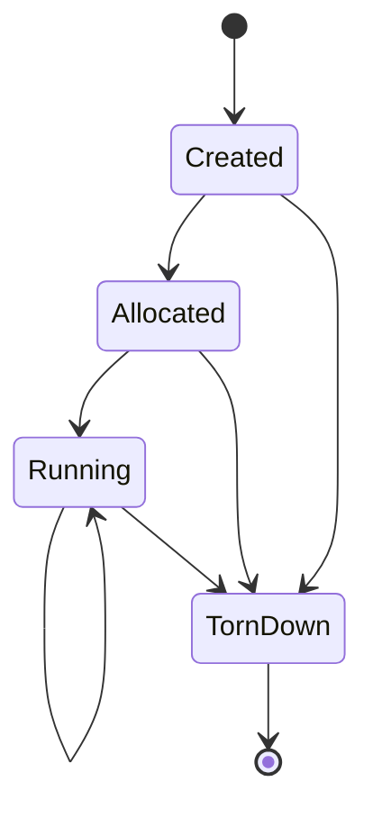

# spec_compute

> Версия спеки: 2.0  
> Дата: 2026-06-29  
> Статус: Draft (Architecture Pass 1)

---

## §1. Идентификация

| Поле | Значение |
|---|---|
| **Имя крейта** | `compute` |
| **Слой** | Слой 3 — Фасад Вычислений (Compute Execution Facade) |
| **Тип** | Library (`lib`) |
| **no_std** | Нет (`false`) — требуется динамический выбор бэкендов в рантайме, использование `Box<dyn ComputeBackend>` и управление коллекциями |
| **Описание** | Главный фасадный крейт Слоя 3, инкапсулирующий выбор аппаратного бэкенда (CPU, CUDA, HIP, Mock), связывающий непрозрачные дескрипторы VRAM с вызовом вычислителя и оркеструющий жизненный цикл шарда через структуру `ShardEngine`. Крейт предоставляет высокоуровневый безопасный API для модулей `boot` и `runtime`, изолируя их от FFI-указателей и библиотек вендоров. |

---

## §2. Стек и Окружение

### §2.1. Внутренние зависимости (inbound)

| Крейт | Что используется | Зачем |
|---|---|---|
| `compute-api` (Слой 3) | `ComputeBackend`, `BackendKind`, `BackendCapabilities`, `VramHandle`, `ShardAllocSpec`, `ShardUpload`, `DayBatchCmd`, `BatchResult`, `ComputeApiError` | Аппаратно-независимый HAL контракт бэкендов вычислений, дескрипторы ресурсов и DTO вызовов. |
| `compute-cpu` (Слой 3, optional) | `CpuBackend` | Резервный или базовый многопоточный CPU-вычислитель. |
| `compute-cuda` (Слой 3, optional) | `CudaBackend` | Высокопроизводительный вычислитель для видеокарт NVIDIA CUDA. |
| `compute-hip` (Слой 3, optional) | `HipBackend` | Вычислитель для видеокарт AMD ROCm/HIP. |

### §2.2. Зависимые компоненты (outbound consumers)

| Крейт / Компонент | Роль в системе и взаимодействие |
|---|---|
| `boot` (Слой 6) | Передает подготовленные байтовые блобы в `compute` для аллокации и первоначальной загрузки VRAM через поэтапный API без вызова сырого FFI. |
| `runtime` (Слой 6) | Управляет выполнением горячего цикла (hot path), вызывая метод `run_day_batch` структуры `ShardEngine` на каждый батч тиков. |

### §2.3. Внешние зависимости

Секция не применима к данному крейту: крейт использует исключительно внутренние зависимости Слоя 3 и стандартную библиотеку Rust. Сторонние SDK изолированы внутри бэкендов.

### §2.4. Feature Flags и Подключение Бэкендов

Целевая политика v2.0 (Target Policy v2.0) заменяет legacy-имена фичей на стандартизированные:

| Feature Flag | Default | Подключаемый Крейт | Описание |
|---|---|---|---|
| `cpu` | Да | `compute-cpu` | Включает поддержку многопоточного CPU бэкенда. |
| `cuda` | Нет | `compute-cuda` | Включает поддержку бэкенда NVIDIA CUDA. |
| `hip` | Нет | `compute-hip` | Включает поддержку бэкенда AMD ROCm/HIP *(Целевая замена legacy-флага `amd`)*. |
| `mock` | Нет | Внутренний Mock | Включает тестовый Mock-бэкенд *(Целевая замена legacy-флаг `mock-gpu`)*. |

---

## §3. Ownership Boundaries (Границы Владения)

| Модуль / Крейт | Монопольная Зона Владения (Single Source of Truth) | Строгие Запреты (Что категорически запрещено в крейте) |
|---|---|---|
| **`compute`** (Слой 3) | **Фасад Вычислений и Реестр Бэкендов**: Публичный фасад `ShardEngine`, автоматический выбор бэкенда (`BackendPreference`), feature-gated подключение бэкендов, связка `VramHandle` с выбранным `ComputeBackend`, управление автоматом состояний жизненного цикла (`Created`/`Allocated`/`Running`/`TornDown`) и предоставление безопасного высокоуровневого API для `boot` и `runtime`. | Запрещено объявление базовых DTO и трейтов (владелец `compute-api`), реализация CUDA/HIP/CPU ядер и FFI-символов (владельцы конкретные бэкенды), утечка сырых указателей (`*mut u8`), парсинг файлов архивов и конфигов (владельцы `vfs`/`config`), планирование потоков рантайма и IPC (владельцы `runtime`/`ipc`), а также расчёт физических формул (владелец `physics`). |
| **`compute-api`** (Слой 3) | **HAL Контракт**: Публичный трейт `ComputeBackend`, `VramHandle`, DTO вызовов и базовые ошибки `ComputeApiError`. | Запрещена логика автовыбора бэкендов и хранение ресурсов шарда. |
| **Бэкенды** (`compute-cuda`/`hip`/`cpu`) | **Физическая Аллокация и Ядра**: Код ядер, вендорские FFI вызовы, управление асинхронными стримами. | Запрещена прямая публикация бэкендов в `runtime` в обход фасада `compute`. |
| **`boot`** / **`runtime`** (Слой 6) | **Оркестрация Симуляции**: Управление жизненным циклом ноды, расписание тиков и сетевая маршрутизация. | Запрещен прямой вызов FFI-функций бэкендов или самостоятельная загрузка констант в VRAM в обход `ShardEngine`. |

---

## §4. Выбор Бэкенда и Управление Контекстом (Backend Selection)

Управление выбором вычислителя осуществляется через структуру предпочтений `BackendPreference`.

### §4.1. Конфигурация Предпочтения Бэкенда
```rust
#[derive(Debug, Clone, PartialEq, Eq)]
pub enum BackendPreference {
    Auto,
    Cpu,
    Cuda { device_id: u32 },
    Hip { device_id: u32 },
    Mock,
}
```

### §4.2. Правила Выбора и Политика Ошибок (Error & Fallback Policy)
1. **Разграничение Ошибок Сборки и Доступности Устройств**:
   - Если запрошенный бэкенд не был включен на этапе компиляции Cargo, вызов прерывается с ошибкой `ComputeError::FeatureNotCompiled { feature: &'static str }`.
   - Если feature flag включен, но физическое устройство, драйвер или контекст бэкенда недоступен в ОС, вызов возвращает ошибку `ComputeError::BackendUnavailable { backend: BackendKind, reason: &'static str }`.
2. **Явный Запрос (Explicit Preference)**: При явном указании бэкенда (например, `BackendPreference::Cuda { device_id: 0 }`), фасад пытается инициализировать только его. При недоступности или отсутствии фичи возвращается соответствующая ошибка (`FeatureNotCompiled` или `BackendUnavailable`). Тихое переключение (silent fallback) на CPU при явном запросе **запрещено**.
3. **Автоматический Режим (`BackendPreference::Auto`)**: Запускает детерминированный алгоритм автодетекции, опрашивая **только собранные** бэкенды в порядке целевого приоритета v2.0:
   - **Приоритет 1**: NVIDIA CUDA (если собрано с фичей `cuda` и доступно GPU устройство).
   - **Приоритет 2**: AMD HIP (если собрано с фичей `hip` и доступно ROCm устройство).
   - **Приоритет 3**: Multi-threaded CPU (если собрано с фичей `cpu`).
   - Если ни один из собранных бэкендов недоступен, возвращается ошибка `ComputeError::NoBackendAvailable`.

---

## §5. Архитектура и Автомат Состояний `ShardEngine`

Фасад `ShardEngine` хранит жизненный цикл конкретного вычислительного шарда. В отличие от концепции фасада без состояния (stateless proxy), `ShardEngine` **может и должен** хранить опциональный дескриптор ресурсов `Option<VramHandle>`, текущее состояние жизненного цикла, выбранную реализацию бэкенда `Box<dyn ComputeBackend>`, характеристики оборудования `BackendCapabilities` и буферы ввода-вывода, но **не хранит** биологическую истину симуляции (которая живет в VRAM).

### §5.1. Автомат Состояний Жизненного Цикла (Lifecycle States)



- **`Created`**: Экземпляр инициализирован (`new`), бэкенд выбран, VRAM не выделена (`handle == None`).
- **`Allocated`**: Буферы VRAM успешно аллоцированы через `allocate_vram`, получен `Some(VramHandle)`.
- **`Running`**: Состояние инициализировано данными (`upload_shard`), шард готов к автономному выполнению горячего цикла.
- **`TornDown`**: Память VRAM явно освобождена, дескриптор сброшен в `None`, контекст бэкенда деинициализирован.

### §5.2. Концептуальный Поэтапный API `ShardEngine` (Staged API)
Для точного соответствия фазам загрузочного пайплайна модуля `boot` (`VramAlloc` и `DataUpload`), `ShardEngine` предоставляет поэтапный API:

```rust
pub struct ShardEngine {
    backend: Box<dyn ComputeBackend>,
    handle: Option<VramHandle>,
    state: LifecycleState,
    capabilities: BackendCapabilities,
}

impl ShardEngine {
    /// Инициализация контекста и выбор бэкенда (Состояние Created)
    pub fn new(pref: BackendPreference) -> Result<Self, ComputeError>;
    
    /// Поэтапная аллокация VRAM памяти (Переход Created -> Allocated)
    pub fn allocate_vram(&mut self, spec: ShardAllocSpec) -> Result<(), ComputeError>;
    
    /// Поэтапная загрузка байтовых блобов в VRAM (Переход Allocated -> Running)
    pub fn upload_shard(&mut self, upload: ShardUpload<'_>) -> Result<(), ComputeError>;
    
    /// Запуск автономного горячего цикла вычислений на батч тиков
    pub fn run_day_batch(&mut self, cmd: DayBatchCmd<'_>) -> Result<BatchResult, ComputeError>;
    
    /// Явное освобождение ресурсов VRAM и деинициализация (Переход в TornDown)
    pub fn teardown(&mut self) -> Result<(), ComputeError>;

    /// Вспомогательный конструктор для единовременной загрузки в одну операцию
    pub fn bootstrap(pref: BackendPreference, spec: ShardAllocSpec, upload: ShardUpload<'_>) -> Result<Self, ComputeError>;
}
```

### §5.3. Запрет Утечки Сырых Указателей и Операции Синхронизации
Публичный API `ShardEngine` **строго запрещает** раскрытие сырых указателей на память VRAM/RAM (`*mut u8`, `*const u8`, `ShardVramPtrs`). 
- Окончательное владение операциями синхронизации Ghost-аксонов, сортировки и применения патчей является межспецификационным долгом (cross-spec debt). Если итоговое владение этими операциями будет заблокировано за крейтом `compute`, фасад предоставит исключительно safe-методы и типизированные DTO без утечки указателей.

### §5.4. Делегирование Загрузки Вариантных Параметров
Загрузка вариантов нейронов (`VariantParameters`) и физических констант делегируется бэкенду через фасад `compute`. Крейт `compute` владеет операцией загрузки/делегирования, но **не владеет** бинарным форматом структур (владелец `layout`) и расчетом их значений (владельцы `config`/`physics`). Публичный API не принимает структуры `layout` напрямую до окончательного утверждения формы DTO/блобов.

---

## §6. Иерархия Ошибок (`ComputeError`)

Все ошибки фасада вычислений оборачиваются в типизированный enum `ComputeError`:

```rust
#[derive(Debug)]
pub enum ComputeError {
    BackendUnavailable { backend: BackendKind, reason: &'static str },
    FeatureNotCompiled { feature: &'static str },
    NoBackendAvailable,
    InvalidLifecycleState { current: LifecycleState, expected: &'static str },
    UploadFailed,
    OutputUnavailable,
    ApiError(ComputeApiError),
}
```

---

## §7. Требуемые Инварианты

- **INV-COMPUTE-001**: `ShardEngine` инкапсулирует вычислительный бэкенд строго через динамический трейт `Box<dyn ComputeBackend>`.
- **INV-COMPUTE-002**: Выбор бэкенда при `BackendPreference::Auto` является строго детерминированным (CUDA -> HIP -> CPU).
- **INV-COMPUTE-003**: При попытке вызова нескомпилированного бэкенда возвращается `ComputeError::FeatureNotCompiled`, а при отсутствии устройства — `ComputeError::BackendUnavailable` (без тихого фолбэка на CPU).
- **INV-COMPUTE-004**: Публичный API `ShardEngine` не раскрывает сырые указатели (`*mut u8`) и C-ABI структуры указателей в `boot` или `runtime`.
- **INV-COMPUTE-005**: Виртуальные вызовы вычислений через vtable происходят строго один раз за батч (`run_day_batch`), а не на каждый отдельный тик внутри горячего цикла.
- **INV-COMPUTE-006**: Метод `teardown()` является идемпотентным и гарантирует безопасное освобождение VRAM с переводом `handle` в `None`.
- **INV-COMPUTE-007**: Реализация `Drop` у `ShardEngine` выполняет только защитную очистку ресурсов без вызова паник.

---

## §8. Golden Tests / Обязательная Матрица Тестирования

Крейт `compute` обязан быть покрыт набором автоматических интеграционных и юнит-тестов:

1. **Детерминизм Автовыбора Бэкенда (`test_auto_backend_selection_priority`)**: Проверка строгого порядка приоритетов CUDA -> HIP -> CPU на эмулированном окружении.
2. **Разграничение Ошибок Недоступности и Сборки (`test_explicit_backend_error_policy`)**: Проверка возврата `FeatureNotCompiled` и `BackendUnavailable` без тихого переключения на CPU.
3. **Работа CPU по умолчанию (`test_cpu_fallback_when_gpu_disabled`)**: Проверка успешной работы CPU-пути при отсутствии GPU.
4. **Абстракция Рантайма от Типа Бэкенда (`test_runtime_batch_execution_transparency`)**: Выполнение батча тиков через `run_day_batch` без знания рантайма о конкретном железе.
5. **Поэтапная Загрузка через Фасад без FFI (`test_boot_staged_allocation_without_raw_ffi`)**: Проверка последовательного вызова `allocate_vram` и `upload_shard` модулем `boot` без сырого FFI.
6. **Отсутствие Сырых Указателей в API (`test_no_raw_pointers_in_public_api`)**: Компиляционная проверка отсутствия `*mut u8` в публичных сигнатурах `ShardEngine`.
7. **Батчевая Диспетчеризация (`test_single_dispatch_per_batch`)**: Проверка вызова бэкенда строго один раз на батч тиков.
8. **Идемпотентность Teardown (`test_idempotent_teardown`)**: Повторный вызов `teardown()` не приводит к ошибкам или двойному освобождению памяти.
9. **Контроль Переходов Поэтапного Автомата (`test_invalid_lifecycle_transition_rejected`)**: Вызов `run_day_batch` до `upload_shard` или после `teardown` возвращает `InvalidLifecycleState`.
10. **Проверка Миграции Имен Фичей (`test_feature_names_compatibility`)**: Проверка работоспособности фичей `hip` и `mock` в рамках целевой политики v2.0.
11. **Проверка Вызовов на Mock-Бэкенде (`test_mock_backend_verification`)**: Проверка последовательности вызовов и геометрии загружаемых данных через Mock-бэкенд.

---

## §9. Open Questions / Review Debt (Открытые Вопросы и Противоречия)

В процессе анализа спецификации фасада вычислений выявлены следующие открытые вопросы для согласования:

1. **Проверка Совместимости Сборки при Миграции Имен Фичей**:
   - *Контекст*: Зафиксирована целевая политика v2.0 на замену legacy-имен `amd` и `mock-gpu` на `hip` и `mock`.
   - *Вопрос*: Требуется ли временное сохранение псевдонимов (aliases) фичей в `Cargo.toml` на период миграции?

2. **Аффинность Потоков ОС и Маркер `Send` для `ShardEngine`**:
   - *Контекст*: Модуль `runtime` выделяет отдельный OS-thread на каждый шард. Контексты некоторых GPU бэкендов привязаны к создавшему их потоку (Thread-Affine).
   - *Вопрос*: Должен ли `ShardEngine` быть `Send` для передачи из потока `boot` в поток шарда, или `ShardEngine` должен создаваться строго внутри целевого OS-потока шарда по загрузочному плану?

3. **Точный Приоритет Автовыбора для Кроссплатформенных Сборщиков**:
   - *Контекст*: На некоторых системах могут быть одновременно установлены драйверы разных вендоров.
   - *Вопрос*: Является ли порядок CUDA -> HIP -> CPU универсальным для всех ОС, или требуется гибкая настройка приоритетов?

4. **Синхронная vs Асинхронная Модель API Выполнения Батча**:
   - *Контекст*: Метод `run_day_batch` в текущей версии является блокирующим.
   - *Вопрос*: Требуется ли введение асинхронной модели `submit_batch` / `poll_batch` на уровне фасада `ShardEngine`?

5. **Монопольный Владелец Pinned Host Буферов Ввода-Вывода**:
   - *Контекст*: Закрепощенные страницы памяти хоста (Pinned Memory) необходимы для скоростного DMA.
   - *Вопрос*: Кто владеет Pinned-буферами — фасад `compute` или IPC/runtime swapchain?

6. **Зона Владения Операциями Синхронизации Ghost-Аксонов и Сортировки**:
   - *Контекст*: Межзоновые патчи и примитивы сортировки спайков затрагивают сетевой стек и вычисления.
   - *Вопрос*: Относятся ли методы синхронизации Ghost-слотов к фасаду `compute` или выносятся в `runtime`/`network`?

7. **Маршрутизация Данных Отладчика Ephys**:
   - *Контекст*: Снимок осциллограмм Ephys передается в Python SDK.
   - *Вопрос*: Проходит ли поток осциллограмм через `ShardEngine`, или отправляется напрямую через IPC сокет в формате `EphysShm`?
