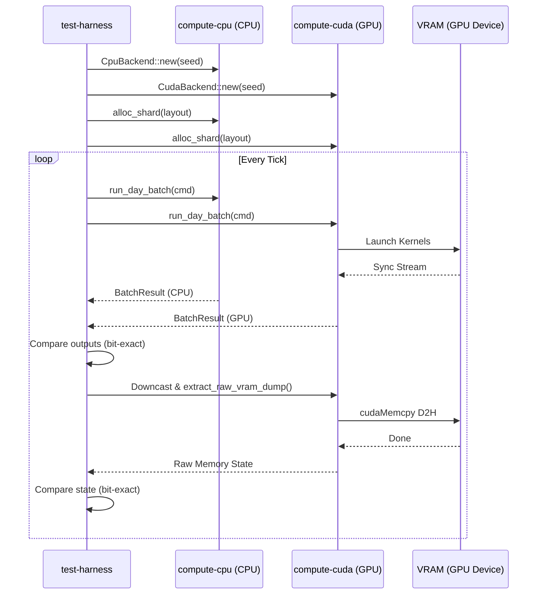

spec_test_harness

Версия спеки: 1.0
Дата: 2026-06-01
Статус: Approved

---

## §1. Идентификация

| Поле | Значение |
|---|---|
| Название | `test-harness` |
| Слой | Слой 3 — Compute |
| Тип | Library (`lib`) |
| no_std | **Нет** (зависит от системного аллокатора кучи хоста, стандартной библиотеки Rust и динамических бэкендов вычислений) |
| Описание | Крейт дифференциального тестирования для валидации корректности расчетов CPU vs GPU и верификации C-ABI смещений. |

---

## §2. Стек и Окружение

### §2.1. Внутренние зависимости (inbound)

| Крейт | Что используется | Зачем |
|---|---|---|
| `types` | `PackedPosition`, `Tick` | Базовые типы координат и времени. |
| `layout` | `ShardLayout`, `VariantParameters`, `ShardStateSoA`, `StateOffsets` | Расчет смещений в памяти и макетов шарда для сравнения. |
| `compute-api` | `GpuBackend`, `VramHandle`, `DayBatchCmd`, `BatchResult`, `ComputeApiError` | Использование общего HAL-интерфейса и DTO команд. |
| `compute-cpu` | `CpuBackend` | Инициализация и запуск эталонной CPU симуляции. |
| `compute` | `ShardEngine`, `detect_available_backends`, `instantiate_backend`, `BackendType` | Оркестрация бэкендов через фасад для тестовых прогонов. |

### §2.2. Внешние зависимости

| Crate | Версия | Зачем |
|---|---|---|
| `anyhow` | `=1.0.102` | Упрощенная обработка и проброс ошибок в тестовом окружении. |

### §2.3. Feature Flags

Секция не применима к данному крейту: крейт не предоставляет собственных условных флагов компиляции.

---

## §3. Инварианты

### §3.1. Структурные инварианты

Секция не применима к данному крейту: крейт не содержит специфичных для домена структур данных в памяти или требований к выравниванию, кроме унаследованных из `layout` и `compute-api`.

### §3.2. Семантические инварианты

- **INV-HARNESS-001**: *Идентичность Master Seed и RNG*.
  - *Обоснование*: CPU и GPU бэкенды обязаны инициализировать свои генераторы псевдослучайных чисел (RNG) одинаковыми зернами для предотвращения дивергенции стохастических процессов (например, спонтанных спайков DDS).
  - *Следствие нарушения*: Расхождение вычислений из-за случайных чисел, ложные срабатывания дифференциального сравнения.
  - *Где проверяется*: runtime assert при инициализации тестов.

- **INV-HARNESS-002**: *Bit-Exact Идентичность Состояний*.
  - *Обоснование*: Вычисления целочисленной физики ALIF/ASOP на GPU и CPU обязаны совпадать бит-в-бит на каждом шаге симуляции.
  - *Следствие нарушения*: Нарушение кроссплатформенного детерминизма, непредсказуемое расхождение результатов в распределенном кластере.
  - *Где проверяется*: runtime check в дифференциальном цикле на каждом тике.

### §3.3. Межкрейтовые инварианты

- **INV-CROSS-007**: *Битовое соответствие ShardVramPtrs*.
  - *Участники*: `layout`, `compute-cuda`, `compute-hip`.
  - *Кто владелец проверки*: `layout` (см. [spec_layout.md §3.3]).
  - *Где проверяется*: compile-time / load-time, FFI-тесты выравнивания и смещения полей в `test-harness`.

- **INV-CROSS-011**: *Кроссплатформенный детерминизм (Bit-to-Bit Identity)*.
  - *Участники*: `compute-api`, `compute-cuda`, `compute-hip`, `compute-cpu`, `test-harness`.
  - *Кто владелец проверки*: `test-harness`.
  - *Обоснование*: Все реализации бэкендов обязаны возвращать побитово идентичные результаты для одинаковых входов и начального состояния (см. [spec_compute_api.md §3.3]).
  - *Следствие нарушения*: Десинхронизация распределенного кластера при миграции шардов между узлами разной архитектуры.
  - *Где проверяется*: Интеграционные тесты `test-harness` побитового сравнения выгруженных состояний RAM и VRAM.

---

## §4. Публичный API

### §4.1. Типы

Секция не применима к данному крейту: крейт не экспортирует публичные типы данных, функционируя как тестовый фреймворк.

### §4.2. Трейты

Секция не применима к данному крейту: крейт не содержит определений публичных трейтов.

### §4.3. Функции

#### pub fn run_differential_suite(layout: ShardLayout, master_seed: u64, inputs: &[DayBatchCmd], target_gpu: BackendType) -> Result<(), DifferentialTestError>

- **Назначение**: Главная точка входа тестового фреймворка. Параллельно прогоняет HFT-батчи через `CpuBackend` и указанный `GpuBackend`, побитово сверяя `OutputFrame` и полные дампы VRAM-состояния на каждом шаге.
- **Предусловия**: Хост должен иметь инициализированный системный аллокатор и доступное аппаратное обеспечение для запрошенного `target_gpu` (CUDA или HIP).
- **Постусловия**: Возвращает `Ok(())`, если 100% битов целочисленной физики совпали. При малейшем расхождении немедленно прерывает прогон и возвращает `Err(StateMismatch)` с указанием тика и смещения памяти.
- **Сложность**: O(T * N), где T — суммарное количество тиков в `inputs`, N — объем SoA-массивов (зависит от `layout.padded_n`).
- **Паника**: Строго запрещена. Все аппаратные сбои GPU или несовпадения макетов проксируются в `DifferentialTestError`.

---

## §5. Доменная Логика

Крейт `test-harness` — это архитектурный гарант кроссплатформенного побитового детерминизма (Bit-to-Bit Identity). Он изолирует тяжеловесную логику дифференциального тестирования и кросс-валидации памяти от боевого рантайма (Слой 6), чтобы не засорять горячие циклы HFT-движка отладочными проверками.

Доменная задача крейта — аппаратно доказать, что реализация Integer Physics (Слой 0) даёт 100% идентичный результат на любом кремнии (CPU, NVIDIA, AMD). Для этого `test-harness` параллельно прогоняет идентичный граф через `CpuBackend` и `GpuBackend`, потактово сравнивая `soma_voltage`, `dendrite_weights`, `axon_heads` и `motor_outputs`. Расхождение даже в 1 бит считается нарушением инварианта и приводит к провалу.

Дополнительно крейт выступает системным прокурором C-ABI контрактов: он жестко сверяет бинарные макеты структур Rust (из крейта `layout`) с их отражениями в C++ заголовочных файлах FFI (`core_math.h`). Это закрывает дыру с возможным Silent Data Corruption при передаче Flat-буферов через границу FFI на GPU.

---

## §6. Алгоритмы и Формулы

### §6.1. Алгоритм дифференциального сравнения (Differential Identity Verification Loop)

- **Вход**: `layout: ShardLayout`, `master_seed: u64`, `inputs: &[DayBatchCmd]`, `gpu_backend_type: BackendType`.
- **Выход**: `Result<(), DifferentialTestError>`.
- **Детерминизм**: Да.

**Формула / Псевдокод:**

```rust
// Псевдокод
fn run_differential_check(
    layout: ShardLayout,
    master_seed: u64,
    inputs: &[DayBatchCmd],
    gpu_backend_type: BackendType
) -> Result<(), DifferentialTestError> {
    // 1. Инициализация бэкендов
    let cpu_backend = instantiate_backend(BackendType::Cpu, None)?;
    let gpu_backend = instantiate_backend(gpu_backend_type, Some(0))?;

    // 2. Аллокация памяти (Flat Allocation)
    let cpu_handle = cpu_backend.alloc_shard(&layout)?;
    let gpu_handle = gpu_backend.alloc_shard(&layout)?;

    // 3. Дифференциальный прогон
    for (tick, cmd) in inputs.iter().enumerate() {
        // Выполнение батча (Горячий цикл)
        let cpu_res = cpu_backend.run_day_batch(&cpu_handle, cmd)?;
        let gpu_res = gpu_backend.run_day_batch(&gpu_handle, cmd)?;

        // Валидация счетчиков обработанных тиков
        if cpu_res != gpu_res {
            return Err(DifferentialTestError::StateMismatch { tick, offset: 0, cpu_val: 0, gpu_val: 0 });
        }

        // Выгрузка и сверка моторных команд (Легальный DTO)
        let cpu_out = cpu_backend.download_output(&cpu_handle)?;
        let gpu_out = gpu_backend.download_output(&gpu_handle)?;

        if cpu_out.data != gpu_out.data {
            return Err(DifferentialTestError::StateMismatch { tick, offset: 0, cpu_val: 0, gpu_val: 0 });
        }

        // [DOD FIX] Извлечение сырых SoA-буферов требует downcast фасада 
        // до конкретной реализации (CudaBackend/CpuBackend), так как боевой 
        // HAL-интерфейс `GpuBackend` намеренно не содержит метода `download_state`.
        let cpu_state = extract_raw_vram_dump(&cpu_backend, &cpu_handle);
        let gpu_state = extract_raw_vram_dump(&gpu_backend, &gpu_handle);

        if cpu_state != gpu_state {
            return Err(DifferentialTestError::StateMismatch { tick, offset: 0, cpu_val: 0, gpu_val: 0 });
        }
    }
    Ok(())
}
```

### §6.2. Алгоритм проверки FFI-выравнивания (FFI Alignment Verification Algorithm)

- **Вход**: Нет.
- **Выход**: `Result<(), AlignmentMismatchError>`.
- **Детерминизм**: Да.

**Формула / Псевдокод:**

```rust
// Псевдокод
fn verify_ffi_alignments() -> Result<(), DifferentialTestError> {
    // Проверка соответствия размеров и смещений полей структур Rust и C-headers
    assert_layout_eq::<PackedPosition, c_PackedPosition>();
    assert_layout_eq::<BurstHeads8, c_BurstHeads8>();
    assert_layout_eq::<VariantParameters, c_VariantParameters>();
    assert_layout_eq::<ShardVramPtrs, c_ShardVramPtrs>();
    Ok(())
}
```

---

## §7. Структуры Данных и Memory Layout

Секция не применима к данному крейту: крейт не определяет собственных бинарных структур данных или раскладок памяти, используя макеты из `layout`.

---

## §8. Граничные Случаи и Особые Сценарии

### §8.1. Граничные значения

| # | Ситуация | Ожидаемое поведение |
|---|---|---|
| E-071 | **Device Mismatch**: Запрошенный для тестирования GPU-бэкенд не скомпилирован в сборке или физически отсутствует на машине. | Тестовый раннер завершает работу с ошибкой `DifferentialTestError::BackendInitFailed`. |
| E-072 | **Seed Discrepancy**: CPU и GPU бэкенды инициализированы с разными `master_seed`. | Метод инициализации возвращает `Err(DifferentialTestError::SeedDiscrepancy)`. |
| E-073 | **Layout Mismatch**: Несовпадение геометрии или параметров разметки (`ShardLayout`) между CPU и GPU. | Раннер прекращает работу с ошибкой `DifferentialTestError::LayoutMismatch`. |
| E-074 | **VRAM Readout Mismatch**: Сбой при асинхронной выгрузке памяти с GPU хосту во время дифференциального сравнения. | Метод возвращает `Err(DifferentialTestError::DmaFailure)`. |
| E-075 | **Numerical Divergence**: Обнаружено расхождение значений потенциалов, порогов или весов хотя бы в 1 бит. | Раннер фиксирует точный тик, смещение и возвращает `Err(DifferentialTestError::StateMismatch)`. |

### §8.2. Состояния гонки и конкурентность

| # | Сценарий | Защита |
|---|---|---|
| R-024 | **Host Memory Race**: Параллельный запуск симуляций на CPU и GPU с использованием разделяемых хостом буферов команд или выходов без синхронизации. | Тестовый раннер изолирует кучи бэкендов и выполняет шаги последовательно, либо использует раздельные DMA-буферы. |
| R-025 | **Asynchronous Read Overlap**: Попытка прочесть VRAM-состояние GPU до завершения выполнения ядер и синхронизации потока. | Тестовый раннер выполняет явный вызов `cudaStreamSynchronize` (или `hipStreamSynchronize`) перед копированием D2H. |

### §8.3. Деградация и Recovery

| # | Отказ | Поведение | Восстановление |
|---|---|---|---|
| D-019 | **GPU Timeout (TDR)**: Зависание видеокарты при выполнении длинных интеграционных прогонов (10k+ тиков). | Вызов `run_day_batch` возвращает ошибку `DeviceLost`. | Тест аварийно завершается с детальным логом шага и тика падения. |
| D-020 | **Host Memory Overhead**: Накопление дампов состояний шага во время длительного сравнения приводит к исчерпанию RAM хоста. | Постепенное снижение TPS из-за своппинга или OOM-crash процесса. | Реализация потикового сравнения "на лету" (Streaming Comparison) без накопления истории в RAM хоста. |

---

## §9. Ошибки

В отличие от продуктового кода, `test-harness` не пытается восстановить систему при нарушении детерминизма. Его задача — аппаратно зафиксировать расхождение и прервать CI/CD конвейер.

### §9.1. Перечисление ошибок

```rust
#[derive(Debug)]
pub enum DifferentialTestError {
    /// Ошибка инициализации бэкенда (E-071, D-019)
    BackendInitFailed(ComputeApiError),
    /// Расхождение семян генераторов случайных чисел (E-072)
    SeedDiscrepancy { cpu_seed: u64, gpu_seed: u64 },
    /// Несовпадение макетов шарда (E-073)
    LayoutMismatch,
    /// Расхождение вольтажа, порогов или весов в памяти бит-в-бит (E-075)
    StateMismatch { tick: u64, offset: usize, cpu_val: u8, gpu_val: u8 },
    /// Сбой DMA-транзакции при копировании дампа с GPU (E-074)
    DmaFailure(ComputeApiError),
}
```

### §9.2. Стратегия обработки

| Ошибка | Восстановимая? | Рекомендация вызывающему |
|---|---|---|
| `BackendInitFailed` | Нет | Проверить окружение (наличие видеокарт) и драйверы. Завершить тест. |
| `SeedDiscrepancy` | Нет | Исправить инициализацию семян в тестовом коде. |
| `LayoutMismatch` | Нет | Исправить передаваемые макеты `ShardLayout` в раннере. |
| `StateMismatch` | Нет | Логировать тик расхождения, сгенерировать diff-файл (Memory Dump) и завершить тест с кодом ошибки (провал CI/CD). |
| `DmaFailure` | Да | Повторить копирование. При повторном сбое прервать выполнение теста. |

### §9.3. Паники

Единственная легальная паника в крейте разрешена только на этапе статических проверок макетов:

| Условие | Почему паника, а не Err |
|---|---|
| Нарушение FFI выравниваний в `verify_ffi_alignments()` | Несовместимость Rust-типов и C-заголовков GPU ядер. Дальнейшее выполнение гарантированно приведет к Memory Corruption и Silent Data Corruption. Это фундаментальное нарушение C-ABI контракта, которое обязано валить сборку. |

---

## §10. Зависимости и Интеграция

### §10.1. Что крейт потребляет (inbound)

| Крейт-источник | Что используем | Какой контракт ожидаем |
|---|---|---|
| `types` | `PackedPosition`, `Tick` | Стабильность типов координат и времени для проверок. |
| `layout` | `ShardLayout`, `StateOffsets` | Расчет точных байтовых смещений и размеров SoA-массивов для сравнения. |
| `compute-api` | `GpuBackend`, DTO-структуры | Единая HAL-точка для обращений к бэкендам без привязки к CUDA/HIP драйверам. |
| `compute-cpu` | `CpuBackend` | Использование в качестве золотого стандарта симуляции. |
| `compute` | `instantiate_backend`, `BackendType` | Возможность динамического создания GPU/CPU бэкендов в рантайме. |
| `compute-cuda` | `CudaBackend` (опционально) | Downcast для прямого чтения VRAM-буферов и извлечения сырого состояния. |
| `compute-hip` | `HipBackend` (опционально) | Downcast для прямого чтения VRAM-буферов и извлечения сырого состояния. |

### §10.2. Кто потребляет крейт (outbound / обратные зависимости)

Ни один продуктовый крейт системы не имеет права зависеть от `test-harness`. Крейт является абсолютным тупиком графа зависимостей Слоя 3 и используется исключительно утилитами CI/CD и командой `cargo test` на этапе разработки.

| Крейт-потребитель | Что использует | Какой контракт мы обязаны сохранить |
|---|---|---|
| — | — | Не применимо. |

### §10.3. Диаграмма взаимодействия



---

## §11. Стратегия Тестирования

### §11.1. Юнит-тесты

| Тест | Что проверяет | Связанный инвариант / Граничный случай |
|---|---|---|
| `test_harness_detects_voltage_mismatch` | Искусственное внесение 1-битного расхождения в мембранный потенциал нейрона на CPU. Верификация возврата ошибки `StateMismatch`. | `INV-HARNESS-002`, `E-075` |
| `test_harness_detects_seed_mismatch` | Инициализация бэкендов с разными Master Seed. Верификация возврата ошибки `SeedDiscrepancy`. | `INV-HARNESS-001`, `E-072` |
| `test_harness_layout_validation` | Передача несовпадающих макетов шарда. Верификация корректного перехвата ошибки. | `E-073` |
| `test_harness_backend_init_failure` | Проверка возврата `BackendInitFailed` при сбое запуска или отсутствия скомпилированных фич GPU-устройства. | `E-071` |
| `test_harness_dma_failure_handling` | Проверка перехвата ошибки при сбое DMA-копирования и возврата `DmaFailure`. | `E-074` |

### §11.2. Property-based тесты

Секция не применима к данному крейту: тестирование корректности самого инструментария не требует генерации случайных графов.

### §11.3. Интеграционные тесты

| Тест | Крейты-участники | Сценарий | Связанный инвариант / Граничный случай |
|---|---|---|---|
| `test_harness_ffi_layout_verification` | `test-harness`, `layout`, `compute-cuda` / `compute-hip` | Запуск проверки бинарного соответствия структур Rust и FFI C-headers. | `INV-CROSS-007` |
| `test_harness_full_differential_run` | `test-harness`, `compute-cpu`, `compute-cuda` / `compute-hip` | Сквозной параллельный запуск симуляции на 1000 тиков, пошаговое побитовое сравнение. | `INV-CROSS-011` |
| `test_harness_downcast_safety` | `test-harness`, `compute-cuda` / `compute-hip` | Проверка безопасности и корректности downcast абстрактного `dyn GpuBackend` к конкретным реализациям для прямого извлечения памяти. | `INV-CROSS-011` |

### §11.4. Тесты производительности

Секция не применима к данному крейту: крейт является тестовым и не имеет жестких SLA-бюджетов производительности в рантайме.

---

## §12. Бюджеты и Ограничения

### §12.1. Память

| Ресурс | Бюджет | Как считается |
|---|---|---|
| Оверхед хоста | `2 * layout.total_size` | Временное хранение RAM/VRAM снапшотов CPU и GPU бэкендов для побитового сравнения. |

### §12.2. Латентность

| Операция | Бюджет (p99) | Условия |
|---|---|---|
| Differential Step + Compare | < 15 ms | 1M нейронов, сравнение на лету без сохранения истории. |

### §12.3. Compile-time

| Ограничение | Значение |
|---|---|
| Время сборки крейта `test-harness` | < 10 секунд |

---

Checklist Полноты (A.3)

- ✅ Все публичные типы описаны в §4 — Указано отсутствие публичных доменных типов.
- ✅ Все инварианты из §3 имеют соответствующий пункт в §11 (тесты) — Все инварианты покрыты тестами в §11.1 и §11.3.
- ✅ Все `Err`-варианты перечислены в §9 — Специфицирован финальный маппинг ошибок.
- ✅ Все крейты-потребители перечислены в §10.2 — Перечислены бэкенды `compute-cuda`, `compute-hip` и `compute-cpu`.
- ✅ Нет ни одного «магического числа» без объяснения — Константы отсутствуют.
- ✅ Все формулы имеют единицы измерения — Вычислительные формулы не применимы.
- ✅ Граничные случаи из §8 покрыты тестами в §11 — Граничные случаи, гонки и деградация перекрыты тестами.
- ✅ Все константы описаны в §4.4 — Раздел не применим, константы отсутствуют.
