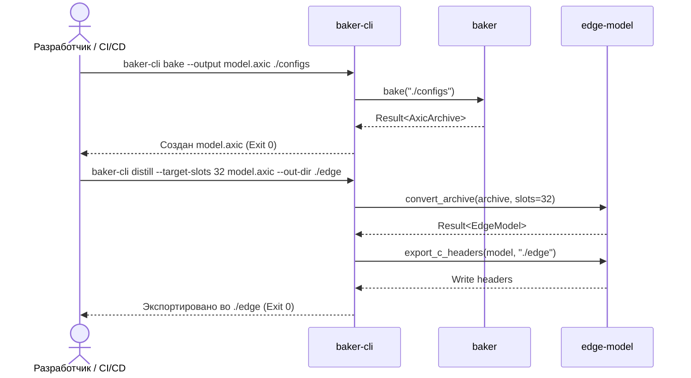

spec_baker-cli

> Версия спеки: 1.0  
> Дата: 2026-06-02  
> Статус: Approved   

---

## §1. Идентификация

| Поле | Значение |
|---|---|
| Название | baker-cli |
| Слой | Слой 4 — Topology, Baker & Edge Conversion |
| Тип | Executable Binary (bin) |
| no_std | **Нет** (зависит от std для парсинга аргументов командной строки, вывода на экран и работы с файловой системой) |
| Описание | CLI-утилита (интерфейс командной строки) для AOT-компиляции нейроморфных графов и оптимизации (дистилляции) моделей под встраиваемые edge-платформы. |

---

## §2. Стек и Окружение

### §2.1. Внутренние зависимости (inbound)

| Крейт | Что используется | Зачем |
|---|---|---|
| baker | `pub fn bake` | Оркестрация AOT-компиляции TOML-конфигураций в архив `.axic`. См. [spec_baker.md §4.3]. |
| edge-model | `convert_archive`, `export_c_headers` | Дистилляция (WTA) связей и экспорт C-заголовков для ESP32. См. [spec_edge_model.md §4.3]. |

### §2.2. Внешние зависимости

| Crate | Версия | Зачем |
|---|---|---|
| clap | =4.5.60 | Декларативный парсинг аргументов командной строки и генерация справочной информации (`--help`). |
| tracing | =0.1.44 | Логирование фаз работы утилиты в stdout/stderr. |
| anyhow | =1.0.102 | Упрощенный проброс и форматирование ошибок для вывода пользователю. |

### §2.3. Feature Flags

Секция не применима к данному крейту: крейт собирается как бинарное приложение и не предоставляет собственных условных флагов компиляции.

---

## §3. Инварианты

### §3.1. Структурные инварианты

- **INV-BCLI-001**: *Изолированность от GPU (Zero GPU Runtime link)*.
  - *Обоснование*: CLI-инструмент работает исключительно на CPU хоста с файловыми ресурсами. Ему запрещено использовать/линковать CUDA или HIP бэкенды.
  - *Следствие нарушения*: Раздувание бинарного файла, невозможность запуска утилиты на машинах без установленных драйверов GPU.
  - *Где проверяется*: compile-time (анализ зависимостей, `cargo tree`).

### §3.2. Семантические инварианты

- **INV-BCLI-002**: *Чистый жизненный цикл без скрытых паник (Zero Panic Orchestration)*.
  - *Обоснование*: `baker-cli` является главным интерфейсом для пользователя и скриптов сборки. Любая ошибка валидации TOML-конфигураций или повреждения данных в архивах должна обрабатываться через безопасный `Result` и выводиться в `stderr` с кодом возврата 1 вместо дампа стека (panic stack trace).
  - *Следствие нарушения*: Неинформативные дампы стека, сбои при автоматизации сборочных пайплайнов (CI/CD).
  - *Где проверяется*: Интеграционные тесты CLI.

### §3.3. Межкрейтовые инварианты

Секция не применима к данному крейту: `baker-cli` является конечным потребителем библиотек `baker` и `edge-model` и не объявляет межкрейтовых контрактов, требующих взаимной проверки на уровне других крейтов.

---

## §4. Публичный API

Крейт является исполняемым файлом (binary) и не экспортирует публичных библиотечных типов. Его публичным API является строго декларативный интерфейс командной строки (CLI).

### §4.1. Типы

Секция не применима к данному крейту: бинарный файл не экспортирует типы Rust.

### §4.2. Трейты

Секция не применима к данному крейту.

### §4.3. Функции (Интерфейс командной строки)

Утилита маршрутизирует вызовы через парсер `clap` в две основные подкоманды:

#### 1. Подкоманда `bake`
Компилирует (AOT) исходные TOML-конфигурации в бинарный Zero-Copy контейнер `.axic`.

- **Сигнатура CLI**: `baker-cli bake <CONFIG_DIR> --output <OUTPUT_FILE>`
- **Параметры**:
  - `<CONFIG_DIR>` (позиционный, обязательный): Путь к директории с `brain.toml`, `simulation.toml` и анатомией.
  - `-o, --output <OUTPUT_FILE>` (обязательный): Путь для записи итогового `.axic` архива.
- **Контракт**: Читает конфигурации, вызывает `baker::bake`. При любой ошибке (нарушение квот, OOM) возвращает `Exit Code 1`.

#### 2. Подкоманда `distill`
Выполняет WTA-дистилляцию синапсов и экспорт C-заголовков для Edge-платформ (MCU).

- **Сигнатура CLI**: `baker-cli distill <ARCHIVE> --out-dir <OUT_DIR> [--target-slots <SLOTS>]`
- **Параметры**:
  - `<ARCHIVE>` (позиционный, обязательный): Путь к исходному `.axic` архиву.
  - `-o, --out-dir <OUT_DIR>` (обязательный): Каталог для сохранения бинарных `SRAM`/`Flash` разделов и `.h` заголовков.
  - `-k, --target-slots <SLOTS>` (опциональный, default: 32): Целевой бюджет дендритных слотов ($K$). Обязан быть $\le 128$.
- **Контракт**: Делегирует работу в `edge_model::convert_archive` и `edge_model::export_c_headers`.

### §4.4. Коды Возврата ОС

| Код Возврата | Значение | Семантика |
|---|---|---|
| `EXIT_SUCCESS` | 0 | Успешное выполнение пайплайна (компиляции или дистилляции). |
| `EXIT_FAILURE` | 1 | Любой доменный или системный сбой (ошибки парсинга `clap`, ошибки ФС, провалы `baker` или `edge-model`). Гарантия Zero Panic. |

---

## §5. Доменная Логика

Крейт `baker-cli` выступает единой консольной точкой входа для оффлайн-процессов генерации нейроморфных графов (AOT Baking) и их дистилляции под встраиваемые системы (Edge Conversion). 

Доменная задача крейта — изолировать пользовательское окружение (парсинг аргументов ОС, обработку файловых путей и управление потоками вывода) от чистой конвейерной логики библиотек `baker` и `edge-model`. Выделение CLI в отдельный бинарный крейт решает проблему безопасной интеграции с CI/CD пайплайнами и автоматизированными скриптами сборки. Он гарантирует, что любые нарушения макро-квот или ошибки файловой системы при запекании `.axic` архивов или генерации C-заголовков для `axicor-lite` не приведут к неконтролируемым дампам памяти, а будут перехвачены и транслированы в строгие коды возврата ОС (0 для успеха, 1 для ошибок).

---

## §6. Алгоритмы и Формулы

Секция не применима к данному крейту: baker-cli не содержит собственной вычислительной или математической логики. Все алгоритмы компиляции и дистилляции делегированы в baker ([spec_baker.md §6]) и edge-model ([spec_edge_model.md §6]).

---

## §7. Структуры Данных и Memory Layout

Секция не применима к данному крейту: утилита не определяет собственных бинарных структур данных или макетов памяти на диске/в оперативной памяти.

---

## §8. Граничные Случаи и Особые Сценарии

### §8.1. Граничные значения

| # | Ситуация | Ожидаемое поведение |
|---|---|---|
| E-101 | Указана несуществующая директория TOML при bake | Вывод ошибки в stderr и завершение с кодом 1. |
| E-102 | Задан невалидный лимит дендритов (например, 0 или 129) при distill | Вывод ошибки в stderr и завершение с кодом 1. |
| E-103 | Указан поврежденный файл .axic архива при distill | Вывод ошибки в stderr и завершение с кодом 1. |
| E-104 | Отсутствуют права на запись в выходной файл/директорию | Вывод ошибки ввода-вывода в stderr и завершение с кодом 1. |
| E-105 | Переданы неизвестные аргументы командной строки | Инициализация парсера clap, автоматический вывод справки (help) и завершение с кодом 1. |

### §8.2. Состояния гонки и конкурентность

| # | Сценарий | Защита |
|---|---|---|
| R-034 | Несколько процессов параллельно пытаются записать в один выходной файл .axic | Блокировка на уровне операционной системы при открытии файла на запись. Либо перезапись с ошибкой при блокировке ФС. |
| R-035 | TOML-конфигурации изменяются во время работы baker-cli | TOML-файлы считываются атомарно в начале фазы компиляции. Все последующие изменения на диске не влияют на выполняемый в памяти процесс компиляции. |

### §8.3. Деградация и Recovery

| # | Отказ | Поведение | Восстановление |
|---|---|---|---|
| D-027 | Исчерпание RAM хоста при обработке больших графов (OOM) | ОС принудительно завершает процесс (SIGKILL). | Требуется оптимизация параметров в TOML (уменьшение количества нейронов/плотности) или увеличение RAM хоста. |
| D-028 | Сбой записи (переполнение диска) в процессе сохранения артефактов | Процесс завершается с кодом 1, частично записанный файл удаляется для предотвращения использования битых артефактов. | Проверить свободное место на диске. |

---

## §9. Ошибки

### §9.1. Перечисление ошибок

Ошибки оборачиваются библиотекой `anyhow` для вывода в stderr. Типы ошибок соответствуют сбоям в нижележащих библиотеках:

```rust
// Псевдокод внутренних ошибок CLI
pub enum CliError {
    /// Ошибка разбора CLI-аргументов
    ClapError(clap::Error),
    /// Сбой компиляции графа (E-101, E-104)
    BakeError(baker::BakerError),
    /// Сбой оптимизации под Edge (E-102, E-103, E-104)
    EdgeError(edge_model::EdgeError),
}
```

### §9.2. Стратегия обработки

| Ошибка | Восстановимая? | Рекомендация вызывающему |
|---|---|---|
| `ClapError` | Нет | Исправить аргументы командной строки согласно справке (`--help`). |
| `BakeError` | Нет | Проверить TOML конфигурации на логические ошибки. |
| `EdgeError` | Нет | Проверить целостность исходного архива и правильность ограничений $K$. |

### §9.3. Паники

| Условие | Почему паника, а не Err |
|---|---|
| Невозможность записи в `stderr` ОС | Критический отказ среды выполнения. Процесс физически не может сообщить об ошибке и безопасно завершиться. |
| `unreachable!()` в роутинге подкоманд `clap` | Нарушение статических инвариантов парсера аргументов. Возникает только при багах программиста в определении CLI-интерфейса. Вся доменная логика и I/O подчиняются правилу Zero Panic и строго возвращают `Result`. |

---

## §10. Зависимости и Интеграция

### §10.1. Что крейт потребляет (inbound)

| Крейт-источник | Что используем | Какой контракт ожидаем |
|---|---|---|
| `baker` | `pub fn bake` | Стабильность сигнатуры сборочного вызова и возвращаемых типов. См. [spec_baker.md §10.2]. |
| `edge-model` | `convert_archive`, `export_c_headers` | Стабильность методов конвертации и экспорта заголовков. См. [spec_edge_model.md §10.2]. |

### §10.2. Кто потребляет крейт (outbound / обратные зависимости)

Крейт не имеет обратных зависимостей в коде Rust, так как является конечным исполняемым бинарным файлом. Его вызывают внешние сборочные скрипты пайплайнов автоматизации.

### §10.3. Диаграмма взаимодействия



---

## §11. Стратегия Тестирования

### §11.1. Юнит-тесты

Секция не применима к данному крейту: юнит-тестирование отдельных функций не проводится, так как вся бизнес-логика делегирована в `baker` и `edge-model`. Поведение тестируется на интеграционном уровне.

### §11.2. Property-based тесты

Секция не применима к данному крейту: утилита не производит сложных математических вычислений или генерации данных, подлежащих проверке случайных свойств.

### §11.3. Интеграционные тесты

Тестирование CLI-команд осуществляется через симуляцию вызова бинарного файла с передачей различных наборов аргументов.

| Тест | Крейты-участники | Сценарий | Связанный инвариант / Граничный случай |
|---|---|---|---|
| `test_cli_bake_success` | `baker-cli`, `baker` | Запуск компиляции с валидной папкой TOML-конфигов, проверка создания `.axic` и кода выхода 0. | INV-BCLI-002 |
| `test_cli_distill_success` | `baker-cli`, `edge-model` | Запуск дистилляции с валидным `.axic`, проверка создания SRAM/Flash образов и C-заголовков в выходной папке, код выхода 0. | INV-BCLI-002, E-102 |
| `test_cli_invalid_args` | `baker-cli` | Запуск с неизвестными опциями или невалидными путями, проверка вывода справки и кода выхода 1. | E-101, E-105 |
| `test_cli_edge_slots_bounds` | `baker-cli`, `edge-model` | Проверка поведения при невалидном лимите $K$ (например, 0 или 130), ожидается завершение с кодом 1. | E-102 |
| `test_cli_corrupted_archive` | `baker-cli`, `edge-model` | Запуск дистилляции на поврежденном файле `.axic`. Ожидается перехват ошибки и завершение с кодом 1. | E-103 |
| `test_cli_io_permission_denied` | `baker-cli`, `baker`, `edge-model` | Попытка записи результатов (bake или distill) в директорию без прав записи (Read-Only). Ожидается код 1. | E-104 |
| `test_cli_gpu_dependency_absence`| `baker-cli` | Проверка сборки и линковки с помощью `cargo tree` для подтверждения абсолютного отсутствия GPU-зависимостей. | INV-BCLI-001 |

### §11.4. Тесты производительности

Секция не применима к данному крейту: латентность запуска и работы CLI-обёртки полностью лимитируется вызываемыми библиотеками `baker` и `edge-model`.

---

## §12. Бюджеты и Ограничения

### §12.1. Память

Секция не применима к данному крейту: собственное потребление памяти CLI-обёрткой минимально (< 10 MB), основные аллокации происходят внутри оркестрируемых библиотек.

### §12.2. Латентность

| Операция | Бюджет (p99) | Условия |
|---|---|---|
| Время разбора аргументов и запуска | < 10 ms | Инициализация Clap и логирования. |

### §12.3. Compile-time

| Ограничение | Значение |
|---|---|
| Максимальное время сборки крейта | < 10s (release) |

---

## Приложение A — Глоссарий

Секция не применима к данному крейту: все используемые доменные термины определены в глоссарии проекта и спецификациях вызываемых библиотек.

---

## Checklist Полноты (A.3)

- ✅ Все публичные типы и трейты описаны в §4 — Описаны CLI аргументы и команды, так как библиотека не экспортирует типов.
- ✅ Все инварианты из §3 имеют соответствующий пункт в §11 (тесты) — Инварианты BCLI-001 и BCLI-002 покрыты соответствующими тестами.
- ✅ Все `Err`-варианты перечислены в §9 — Описаны ошибки и коды возврата ОС.
- ✅ Все крейты-потребители перечислены в §10.2 — Нет внешних крейтов-потребителей, так как `baker-cli` является конечным исполняемым файлом.
- ✅ Нет ни одного «магического числа» без объяснения — Выходные коды ОС объяснены.
- ✅ Все формулы имеют единицы измерения — Формулы отсутствуют.
- ✅ Граничные случаи из §8 покрыты тестами в §11 — Все граничные случаи E-101..E-105 протестированы.
