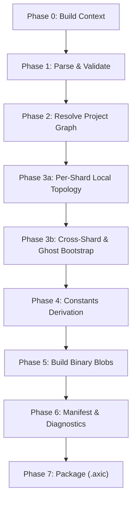

# spec_baker

> Версия спеки: 2.0  
> Дата: 2026-06-29  
> Статус: Draft (Architecture Pass 1)

---

## §1. Идентификация

| Поле | Значение |
|---|---|
| **Имя крейта** | `baker` |
| **Слой** | Слой 4 — Geometry, Growth & Connectome Generation (`L4`) |
| **Тип** | Library (`lib`) |
| **no_std** | Нет (`false`) — требуется доступ к файловой системе (`std::fs`), работа с путями (`PathBuf`), системный аллокатор, временные каталоги и отчетность |
| **Описание** | Оркестратор компиляции Ahead-of-Time (AOT Compile Orchestrator) для AxiEngine. Крейт принимает проектный или snapshot-бандл и всегда самостоятельно выполняет повторный парсинг и Shift-Left валидацию через `config`, строит детерминированный граф сборки, вызывает алгоритмы `topology` для геометрии/роста, использует `layout` для бинарных C-ABI макетов, `physics` для деривации констант и `vfs` исключительно для финальной упаковки контейнера `.axic`. Крейт не владеет TOML-схемами, формулами физики, алгоритмами роста, оглавлением TOC контейнера или рантайм-вычислениями. |

---

## §2. Стек и Окружение

### §2.1. Внутренние зависимости (inbound)

| Крейт | Что используется | Зачем |
|---|---|---|
| `types` (Слой 0) | `MasterSeed`, `PackedPosition`, `PackedTarget`, `SomaFlags`, `AXON_SENTINEL`, `EMPTY_PIXEL` | Базовые типы зерён ГПСЧ, координат, упакованных таргетов и маркеров-сентинелов. |
| `layout` (Слой 1) | `StateFileHeader`, `AxonsFileHeader`, `PathsFileHeader`, `VariantParameters`, `BurstHeads8`, `StateOffsets`, математика размеров блобов | Формирование C-ABI бинарных макетов, заголовков файлов и смещений SoA-плоскостей. |
| `config` (Слой 1) | `ModelConfig`, `DepartmentConfig`, `ShardConfig`, утилиты `parse_*` и `validate_*` | Парсинг и Shift-Left валидация декларативных конфигурационных файлов проекта. |
| `physics` (Слой 0) | Хелперы деривации констант (например, `compute_v_seg`, деривация DDS) | Деривация физических параметров без дублирования формул. |
| `topology` (Слой 4) | `place_somas`, воксельные сетки, рост аксонов, разрешенные сокеты/тракты | Пространственное размещение сом, проращивание путей аксонов и бутстрап графа. |
| `vfs` (Слой 2) | API упаковки архивов (`pack_directory` / `AxicPacker`) | Финальная упаковка скомпилированных артефактов в контейнер `.axic` с выравниванием. |

### §2.2. Зависимые Компоненты (outbound consumers)

| Крейт / Компонент | Роль в системе и взаимодействие |
|---|---|
| `baker-cli` (Слой 4) | Консольная утилита компиляции обертывает библиотеку `baker` для работы из командной строки. |
| AxiCAD / Editor Store | Внешние инструменты разработки используют `baker` для генерации проверочных артефактов и получения диагностических отчетов компиляции. |

### §2.3. Внешние Зависимости

| Crate | Версия | Сфера использования |
|---|---|---|
| `tracing` | `=0.1.40` | Логирование этапов сборки, прогресса и диагностических событий компилятора. |
| `tempfile` | `=3.8.0` | Создание и изолированная утилизация временных стадийных каталогов компиляции. |

> [!IMPORTANT]
> Версии внешних утилитарных библиотек (`tracing`, `tempfile`) зафиксированы в качестве целевых рабочих флагов сборки (отдельный учет централизованного фиксирования зависимостей вынесен в review debt, §11). Прямые зависимости от вычислительных бэкендов (`compute`, `compute-api`, `compute-cuda`, `compute-hip`), межпроцессного взаимодействия (`ipc`), сетевых протоколов (`wire`, `net`, `transport`) или рантайма (`boot`) категорически запрещены.

### §2.4. Feature Flags

Секция публичных feature flags не используется. Крейт собирается как выделенная компиляционная библиотека.

---

## §3. Ownership Boundaries (Границы Владения)

| Модуль / Крейт | Монопольная Зона Владения (Single Source of Truth) | Строгие Запреты (Что категорически запрещено в крейте) |
|---|---|---|
| **`baker`** (Слой 4) | **Оркестрация и Сборка Артефактов Компиляции**: Строгий порядок фаз компилятора, разрешение графа проекта по файлам моделей/отделов/шардов, разрешение конечных точек связей (Endpoint Resolution), проверка границ файловой системы проекта (Path Containment), детерминированное именование артефактов и манифеста, семантический выбор файлов для `.axic`, сборка байтовых блобов по правилам `layout`, формирование отчетов компиляции (`BakeReport`) и диагностик (Fail-Fast). | Запрещены объявление и валидация TOML DTO (владелец `config`), C-ABI выравнивание полей и смещения (владелец `layout`), формат контейнера `.axic` и оглавление TOC (владелец `vfs`), алгоритмы роста и геометрии (владелец `topology`), физические формулы (владелец `physics`), политики загрузки рантайма (владелец `boot`), запуск CPU/GPU ядер (владельцы `compute-api`/`compute`), SHM/mmap (владелец `ipc`), сетевые DTO (владельцы `wire`/`net`), а также кеш артефактов AxiCAD. |
| **`config`** (Слой 1) | **Декларативные Данные**: TOML DTO и утилиты валидации. | Запрещен запуск проращивания графа и генерация бинарных блобов. |
| **`layout`** (Слой 1) | **Макеты Памяти и ABI**: C-ABI структуры и расчет размеров блобов. | Запрещена оркестрация фаз сборки проекта. |
| **`vfs`** (Слой 2) | **Контейнеры**: Формат `.axic`, заголовки архива и таблицы TOC. | Запрещен выбор бизнес-логики включаемых файлов. |

---

## §4. Модель Запроса Компиляции (`BakeRequest`) и Границы Путей (Path Containment)

Компилятор принимает полнотекстовый запрос сборки через структуру `BakeRequest` без прямой мутации исходных файлов:

```rust
pub struct BakeRequest {
    pub input: BakeInput,
    pub output_axic_path: PathBuf,
    pub staging_dir: Option<PathBuf>,
    pub target_profile: TargetProfile,
    pub deterministic_options: DeterministicOptions,
    pub snapshot_id: Option<String>,
}

pub enum BakeInput {
    ProjectRoot(PathBuf),
    SnapshotBundle(PathBuf),
}
```

1. **Неизменяемость Исходников (Read-Only Source Guarantee)**: Входные TOML-файлы и геометрия читаются строго через parsing API крейта `config` и никогда не модифицируются на диске в процессе компиляции. Поле `snapshot_id` используется исключительно как метаданные отчета (`BakeReport`) и категорически исключается из внутренних байтов архива `.axic` во избежание нарушения детерминизма.
2. **Проверка Границ Путей (Path Containment Check)**: Крейт `baker` нормализует все относительные пути к файлам компонентов внутри `config` и проверяет жесткое ограничение: ни один файл проекта не должен выходить за границы каталога `ProjectRoot` или `SnapshotBundle` (защита от выхода через `../`).

---

## §5. Конвейер Компиляции v2 (Compile Pipeline v2)

Компиляция нейроморфного графа выполняется через однонаправленный 9-фазный конвейер:



### §5.1. Фазы Конвейера Компиляции
- **Phase 0: Build Context**: Фиксация версий движка и спецификаций, версии схемы, `master_seed`, целевого профиля сборки и флагов детерминизма.
- **Phase 1: Parse & Validate**: Самостоятельная повторная загрузка `model.toml`, `department.toml` и `shard.toml` строго через функции `config::parse_*` и запуск `validate_*`. Проверка границ путей файлов (Path Containment). Ранний прерывающий останов (Fail-Fast) до выделения памяти под геометрию.
- **Phase 2: Resolve Project Graph**: Разрешение связей между отделами и шардами, проверка путей конечных точек, валидация направлений и форм сокетов. Связывание `connections.id` со стабильными ссылками связей. Подготовка структурированных геометрий `ResolvedSocketGeometry` и `ResolvedTractGeometry` для `topology`.
- **Phase 3a: Per-Shard Local Topology Generation**: Вызов `topology::place_somas` и построение пространственных сеток (`SomaSpatialGrid`, `AxonSegmentGrid`) локально для всех шардов проекта.
- **Phase 3b: Cross-Shard Connection & Ghost Bootstrap**: Разрешение межшардовых связей и бутстрап Ghost-аксонов строго после того, как подготовлены локальные топологии всех шардов-источников и шардов-назначений.
- **Phase 4: Variant & Physical Constants Derivation**: Сборка бинарного макета `layout::VariantParameters` из профилей `config::NeuronType` с вызовом физических хелперов (`compute_v_seg`). Политика упаковывания таблицы вариантов зафиксирована как часть бинарных макетов или метаданных архива (review debt, §11).
- **Phase 5: Build Binary Blobs**: Генерация бинарных дампов строго через функции расчета размеров и смещений крейта `layout`:
  - Дамп `.state`: заголовки и SoA-плоскости памяти.
  - Дамп `.axons`: бинарный массив аксонных головок (`BurstHeads8`).
  - Дамп `.paths`: матрицы путей аксонов, соблюдающие контракт 256 сегментов.
  - Опциональные файлы I/O (`.gxi`, `.gxo`, `.ghosts`) выводятся в статус ожидания (pending / review debt) до полного согласования владельцев их C-ABI заголовков.
- **Phase 6: Manifest & Diagnostics**: Формирование машиночитаемого отчета компиляции `BakeReport` и манифеста артефактов `BakeArtifactManifest` с расчетом побитовых хэш-сумм SHA-256.
- **Phase 7: Package**: Вызов API упаковки `vfs` (`AxicPacker`) для создания финального `.axic` файла. `baker` передает список скомпилированных файлов, а `vfs` формирует заголовок и таблицу TOC.

---

## §6. Побитовый Детерминизм Компиляции (Determinism Policy)

1. **Побитовая Воспроизводимость**: Выходные байты `.axic` контейнера обязаны быть 100% идентичными при повторной компиляции из одинакового входного бандла с совпадающими версиями и `master_seed`. Переменное поле `snapshot_id` исключается из внутреннего содержимого архива.
2. **Детерминированный Порядок**: Сортировка отделов, шардов, связей и генерируемых артефактов выполняется по явным алгоритмическим ключам (алфавитный порядок идентификаторов, `shard_id`).
3. **Запрет Недетерминированных Источников**: Категорически запрещено внедрение временных штампов системы (`SystemTime`), использование случайных хэшеров (`RandomState`) и недетерминированный параллелизм при сборке файлов. Параллельная генерация шардов допускается только при условии строго детерминированного порядка финального слияния.

---

## §7. Модель Артефактов и Манифест (`BakeArtifactManifest`)

По завершении Фазы 6 компилятор формирует концептуальный манифест артефактов сборки, включающий явное поле `kind`:

```rust
pub struct BakeArtifactManifest {
    pub input_digest: [u8; 32],
    pub engine_spec_version: String,
    pub master_seed: u64,
    pub artifacts: Vec<ArtifactEntry>,
}

pub struct ArtifactEntry {
    pub artifact_name: String,
    pub kind: ArtifactKind,
    pub relative_path: String,
    pub byte_len: u64,
    pub hash_sha256: [u8; 32],
    pub required_for_boot: bool,
    pub source_refs: Vec<String>,
}

#[derive(Debug, Clone, PartialEq, Eq)]
pub enum ArtifactKind {
    StateBlob,
    AxonsBlob,
    PathsBlob,
    VariantTable,
    IoDescriptor,
    ArchiveManifest,
}
```

Кеш артефактов компиляции принадлежит внешнему потребителю (AxiCAD / Editor Store). Крейт `baker` не управляет кешем диска, а только отдает структуры `BakeReport` и `BakeArtifactManifest`.

---

## §8. Иерархия Ошибок Компилятора и Диагностика (`BakerError`)

Любые сбои в процессе работы компилятора прерывают сборку и возвращают типизированную ошибку `BakerError`. Каждая ошибка или диагностическое сообщение содержит фазу сборки (`phase`), стабильный код (`code`), уровень серьезности (`severity`) и ссылку на источник (`source_ref`):

```rust
#[derive(Debug)]
pub struct BakerDiagnostic {
    pub phase: CompilePhase,
    pub code: &'static str,
    pub severity: DiagnosticSeverity,
    pub message: String,
    pub source_ref: Option<String>,
}

#[derive(Debug)]
pub enum BakerError {
    ConfigParseOrValidationError(BakerDiagnostic),
    ProjectGraphResolutionError(BakerDiagnostic),
    MissingReferencedEntity(BakerDiagnostic),
    InvalidConnectionDirection(BakerDiagnostic),
    IncompatibleSocketShape(BakerDiagnostic),
    PathEscapeAttempt(BakerDiagnostic),
    TopologyErrorWrapper(BakerDiagnostic),
    LayoutBlobConstructionError(BakerDiagnostic),
    VfsPackagingErrorWrapper(BakerDiagnostic),
    NondeterministicOrderingViolation(BakerDiagnostic),
    OutputPathError(BakerDiagnostic),
}
```

---

## §9. Требуемые Инварианты

- **INV-BAKER-001**: `baker` ни при каких условиях не парсит TOML вручную в обход официального API крейта `config`.
- **INV-BAKER-002**: `baker` ни при каких условиях не объявляет собственные константы C-ABI смещений или выравниваний памяти (единственный источник — `layout`).
- **INV-BAKER-003**: `baker` не создает вычислительные ресурсы GPU/CPU и не зависит от бэкендов вычислений.
- **INV-BAKER-004**: `baker` ни при каких условиях не модифицирует исходные TOML-файлы проекта при компиляции.
- **INV-BAKER-005**: Все сгенерированные бинарные блобы строго соответствуют размерам и выравниваниям, рассчитанным в `layout`.
- **INV-BAKER-006**: Все скомпилированные артефакты являются детерминированно деривируемыми и 100% воспроизводимыми по побитовой хэш-сумме, а поле `snapshot_id` не попадает во внутренности `.axic`.
- **INV-BAKER-007**: Каждый идентификатор связи в проекте обязан успешно разрешаться в существующие конечные точки до начала третьей фазы компиляции.
- **INV-BAKER-008**: При возникновении любой ошибки на любой фазе конвейера генерация финального `.axic` архива блокируется (Fail-Fast).
- **INV-BAKER-009**: Любая попытка обращения к файлам за пределами корневого каталога проекта (`Path Containment Escape`) вызывает немедленный останов с ошибкой `PathEscapeAttempt`.

---

## §10. Golden Tests / Обязательная Матрица Тестирования

Крейт `baker` обязан быть покрыт набором автоматических тестов:

1. **Воспроизводимость Байтов Архива (`test_baker_reproducible_archive_bytes`)**: Верификация побитового совпадения скомпилированного `.axic` файла при повторной сборке с одинаковым seed.
2. **Ранний Останов на Битом Конфиге (`test_baker_fails_fast_on_invalid_config`)**: Проверка возврата ошибки на Фазе 1 при некорректных параметрах TOML.
3. **Защита от Выхода за Границы Пути (`test_baker_rejects_config_path_escape`)**: Проверка немедленного возврата ошибки `PathEscapeAttempt` при попытке ухода через `../`.
4. **Исключение Переменного Snapshot ID из Архива (`test_baker_manifest_excludes_volatile_snapshot_id_from_archive`)**: Верификация того, что изменение `snapshot_id` в `BakeRequest` не меняет ни одного байта внутри `.axic`.
5. **Политика Упаковки Таблицы Вариантов (`test_baker_variant_parameters_artifact_policy`)**: Проверка генерации блоба `VariantParameters` и его регистрации в манифесте со статусом `ArtifactKind::VariantTable`.
6. **Ожидание Завершения Локальных Топологий до Ghost Bootstrap (`test_baker_cross_shard_generation_waits_for_all_local_topology`)**: Проверка того, что Фаза 3b запускается строго после полного завершения Фазы 3a для всех шардов.
7. **Формирование Фазы и Источника в Диагностиках (`test_baker_reports_phase_and_source_ref_on_error`)**: Проверка сохранения кодов ошибок, фаз компиляции и `source_ref` при возникновении сбоя.
8. **Браковка Отсутствующего Шарда (`test_baker_rejects_missing_shard_reference`)**: Возврат ошибки при ссылке на несуществующий шард.
9. **Браковка Отсутствующего Сокета (`test_baker_rejects_missing_socket_reference`)**: Возврат ошибки при отсутствии объявленного сокета.
10. **Проверка Несоответствия Направлений Связей (`test_baker_rejects_direction_mismatch`)**: Проверка ошибки при попытке соединить два входных или два выходных сокета.
11. **Использование Только Официального Config API (`test_baker_uses_config_parse_api_only`)**: Статический контроль отсутствия сторонних TOML-парсеров.
12. **Использование Математики Layout (`test_baker_uses_layout_blob_size_math`)**: Проверка того, что размеры генерируемых блобов запрашиваются из `layout`.
13. **Изоляция от Compute и Network (`test_baker_does_not_depend_on_compute_or_ipc_or_net`)**: Проверка отсутствия зависимостей от `compute`, `ipc`, `wire`.
14. **Полнота Манифеста Артефактов (`test_baker_artifact_manifest_contains_hashes_and_versions`)**: Верификация наличия хэшей SHA-256, версий спецификаций и типов `kind` в `BakeArtifactManifest`.
15. **Вызов Упаковщика VFS без Задания TOC (`test_baker_calls_vfs_packer_without_defining_axic_toc`)**: Проверка того, что `baker` не форматирует заголовок `.axic` вручную.
16. **Неизменяемость Исходных TOML Файлов (`test_baker_does_not_mutate_source_toml`)**: Проверка совпадения хэш-сумм исходных файлов проекта до и после компиляции.
17. **Детерминированный Порядок Артефактов (`test_baker_deterministic_ordering_of_artifacts`)**: Проверка независимости порядка файлов в манифесте от файловой системы ОС.

---

## §11. Open Questions / Review Debt (Открытые Вопросы и Противоречия)

1. **Минимальный Набор Файлов Архива для Загрузки Рантаймом (`boot`)**:
   - *Контекст*: Компилятор генерирует дампы состояния, аксонов и путей.
   - *Вопрос*: Каков обязательный минимальный перечень файлов внутри `.axic` архива, необходимый для работы компонента `boot`?

2. **Статус и Владение Заголовками Файлов I/O (`.gxi`, `.gxo`, `.ghosts`)**:
   - *Контекст*: Опциональные файлы входов/выходов и ghost-связей находятся в статусе ожидания (pending debt).
   - *Вопрос*: В каком крейте (`layout` или `wire`) должны объявляться C-ABI заголовки и структуры этих файлов?

3. **Формат Хранения и Передачи Геометрии Трактов**:
   - *Контекст*: `baker` передает в `topology` подготовленную структуру `ResolvedTractGeometry`.
   - *Вопрос*: В каком формате хранится геометрия трактов редактора и как именно выполняется ее первичный резолвинг?

4. **Инжекция Поля Начального Веса `initial_synapse_weight`**:
   - *Контекст*: Поле начального веса учитывается в `VariantParameters`, но временно отсутствует в TOML-схемах `config`.
   - *Вопрос*: Каким образом значение базового синаптического веса передается из конфигурации проекта в макеты `layout`?

5. **Централизованное Фиксирование Версий Внешних Зависимостей (Workspace-Wide Pinning)**:
   - *Контекст*: Версии `tracing` и `tempfile` зафиксированы в спецификации.
   - *Вопрос*: Требуется ли централизованный манифест версий зависимостей на уровне всего workspace для исключения дрифта сторонних крейтов?

6. **Схема Событий Прогресса Компиляции (Progress Event Schema)**:
   - *Контекст*: Внешние GUI-инструменты требуют пошагового отслеживания прогресса сборки.
   - *Вопрос*: Должна ли общая схема событий прогресса объявляться в `baker` или относиться к `baker-cli` / AxiCAD SDK?

7. **Управление Промежуточными Кекпоинтами Сборки**:
   - *Контекст*: При сборке больших проектов кеширование промежуточных шардов ускоряет повторную компиляцию.
   - *Вопрос*: Выполняется ли кеширование промежуточных результатов внутри `baker` или полностью управляется кешем артефактов AxiCAD?
