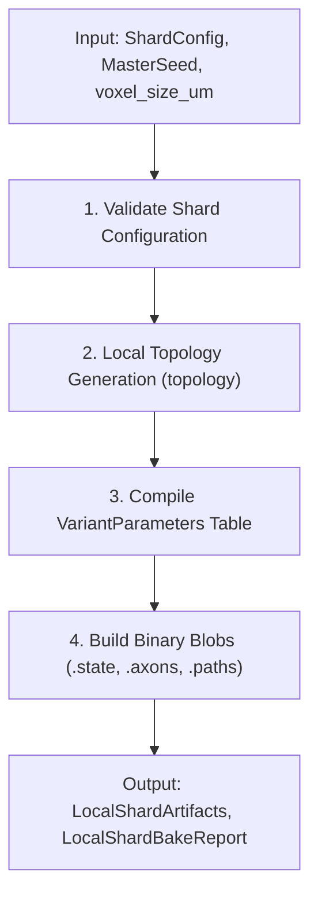
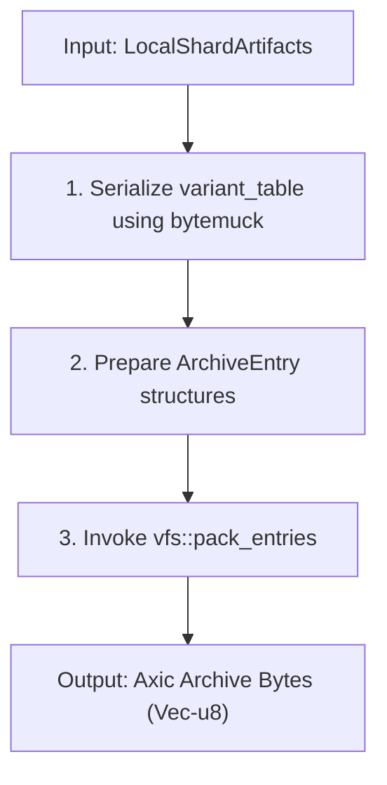

# spec_baker

> Версия спеки: 2.2  
> Дата: 2026-07-01  
> Статус: Approved / Ready for Implementation (Stage B: Local .axic Packaging)

---

## §1. Идентификация

| Поле | Значение |
|---|---|
| **Имя крейта** | `baker` |
| **Слой** | Слой 4 — Geometry, Growth & Connectome Generation (`L4`) |
| **Тип** | Library (`lib`) |
| **no_std** | Нет (`false`) — требуется доступ к системному аллокатору, временным структурам памяти и отчетности |
| **Описание** | Оркестратор компиляции Ahead-of-Time (AOT Compile Orchestrator) для AxiEngine. В рамках Stage A крейт принимает конфигурацию шарда, seed и voxel size, запускает пайплайн генерации локальной топологии (`topology`) и осуществляет сборку локального single-shard набора артефактов в памяти. Stage B добавляет возможность упаковки этих сгенерированных артефактов в монолитный ROM-контейнер формата `.axic` через крейт `vfs`. |

---

## §2. Стек и Окружение

### §2.1. Внутренние зависимости (inbound)

| Крейт | Что используется | Зачем |
|---|---|---|
| `types` (Слой 0) | `MasterSeed`, `PackedPosition`, `PackedTarget`, `SomaFlags`, `AXON_SENTINEL`, `EMPTY_PIXEL` | Базовые типы зерён ГПСЧ, координат, упакованных таргетов и маркеров-сентинелов. |
| `layout` (Слой 1) | `StateFileHeader`, `AxonsFileHeader`, `PathsFileHeader`, `VariantParameters`, `BurstHeads8`, `StateOffsets`, математика размеров блобов, выравнивание `align_to_padded_n` | Формирование C-ABI бинарных макетов, заголовков файлов и смещений SoA-плоскостей. |
| `config` (Слой 1) | `ShardConfig`, `NeuronType`, `validate_shard` | Валидация анатомии шарда и доступ к профилям типов нейронов. |
| `physics` (Слой 0) | Хелперы деривации констант (`compile_dds_heartbeat`, `MASS_TO_CHARGE_SHIFT`, `MIN_WEIGHT_LIMIT`) | Деривация физических параметров и констант весов. |
| `topology` | `generate_single_shard_topology`, `grow_local_axons`, `form_local_synapses`, DTO структуры результатов | Вызов алгоритмов размещения сом, роста аксонов и формирования локальных синаптических связей. |
| `vfs` (Слой 2) | `ArchiveEntry`, `pack_entries`, `VfsError` | Низкоуровневая упаковка готовых байтовых артефактов в `.axic`. |

---

## §3. Scope Stage A (Локальные артефакты шарда в памяти)

### §3.1. Реализовано в Stage A
- Компиляция локального single-shard набора артефактов в памяти.
- Вызов последовательного конвейера `topology` (Stage A + B1 + B2).
- Генерация байтовых блобов по C-ABI макетам `layout` (`.state`, `.axons`, `.paths`).
- Сборка таблицы `VariantParameters` для всех типов нейронов шарда.
- Возврат отчета компиляции и сырых бинарных буферов.

### §3.2. Deferred (Отложено для будущих стадий)
- Проверка границ файловой системы (`Path Containment`) и сохранение на диск.
- Мультишардовая сборка, ghost/handover связи, маршрутизация трактов (`tract routing`).
- Распределенное выполнение компиляции.
- Системы отслеживания прогресса компиляции (`progress events`).
- Кеширование промежуточных результатов и чекпоинты (`checkpoints`).

---

## §3.3. Scope Stage B (Локальная упаковка .axic)

### §3.3.1. Реализовано в Stage B
- Сериализация таблицы `variant_table` как raw C-ABI bytes через `bytemuck::cast_slice`.
- Сборка `.axic` из 4 логических archive paths:
  - `state.bin`
  - `axons.bin`
  - `paths.bin`
  - `variant_table.bin`
- Вызов `vfs::pack_entries` для упаковки набора файлов в памяти.
- Возврат результирующего `Vec<u8>` буфера с байтами архива.
- Детерминированный порядок файлов в оглавлении TOC делегируется внутренним правилам сортировки в `vfs`.

### §3.3.2. Deferred (Отложено для будущих стадий)
- Запись упакованного `.axic` на диск хоста.
- Выбор обязательного boot-набора файлов (Boot Required Policy).
- Сборка файла метаданных `manifest.toml`.
- Обход директорий хостовой файловой системы (Directory Walking).
- Мультишардовый макет пакетов (Multi-shard package layout).
- Сжатие данных и вычисление контрольных сумм элементов (Compression / Checksums).
- Экспорт содержимого архива в SHM / Temp директории.

---

## §4. Конвейеры Компиляции и Упаковки (Compile & Pack Pipelines)

### §4.1. Сборка локального шарда в памяти (Stage A)
В рамках Stage A сборка шарда выполняется в строго последовательном конвейере в памяти:



### §4.2. Упаковка локального шарда в .axic (Stage B)
В рамках Stage B сгенерированные артефакты упаковываются в архив:



---

## §5. API и DTO крейта

### §5.1. Структуры данных

```rust
use config::ShardConfig;
use types::MasterSeed;
use layout::VariantParameters;

/// Входные данные для сборки локального шарда.
pub struct LocalShardBakeInput<'a> {
    pub shard_config: &'a ShardConfig,
    pub master_seed: MasterSeed,
    pub voxel_size_um: f32,
}

/// Скомпилированные бинарные артефакты шарда в памяти.
pub struct LocalShardArtifacts {
    pub state_blob: Vec<u8>,
    pub axons_blob: Vec<u8>,
    pub paths_blob: Vec<u8>,
    pub variant_table: [VariantParameters; layout::VARIANT_LUT_LEN],
}

/// Статистический отчет о сборке локального шарда.
pub struct LocalShardBakeReport {
    pub total_somas: u32,
    pub total_axons: u32,
    pub total_synapses: u32,
    pub dropped_candidates: u64,
}

/// Возможные ошибки сборщика.
#[derive(Debug, thiserror::Error)]
pub enum BakerError {
    #[error("Configuration validation error: {0}")]
    ConfigError(#[from] config::ConfigError),
    #[error("Topology generation error: {0}")]
    TopologyError(#[from] topology::TopologyError),
    #[error("Layout layout capacity/arithmetic error")]
    LayoutError,
    #[error("VFS archive packaging error: {0}")]
    VfsError(#[from] vfs::VfsError),
}
```

### §5.2. Точки входа

```rust
/// Выполняет сборку локального шарда из предоставленной конфигурации в память.
pub fn bake_local_shard(
    input: &LocalShardBakeInput,
) -> Result<(LocalShardArtifacts, LocalShardBakeReport), BakerError>;

/// Упаковывает скомпилированные бинарные артефакты шарда в .axic архив буфер.
pub fn pack_local_shard_artifacts(
    artifacts: &LocalShardArtifacts,
) -> Result<Vec<u8>, BakerError>;

/// Склеенный вызов: компилирует шард и сразу упаковывает его в .axic контейнер.
pub fn bake_local_shard_axic(
    input: &LocalShardBakeInput,
) -> Result<(Vec<u8>, LocalShardBakeReport), BakerError>;
```

---

## §6. Правила генерации бинарных блобов

### §6.1. Правила записи `.state`
1. **Заголовок**: Блоб начинается с заголовка `layout::StateFileHeader`, в котором заполняются метаданные (включая `magic`, `version`, `padded_n`, `total_axons` — заголовок НЕ содержит `total_somas`). Для Stage A выполняется тождество `total_axons == total_somas`, но в заголовок пишется именно `total_axons`.
2. **Выравнивание**: Число сом выравнивается до `padded_n` с помощью `layout::align_to_padded_n(total_somas)`.
3. **Размер**: Общий размер выделяемого буфера вычисляется как `layout::calculate_state_blob_size(padded_n)`.
4. **Заполнение SoA-плоскостей**:
   - `soma_voltage[i]` инициализируется значением `variant.rest_potential` для соотвествующего типа нейрона.
   - `soma_flags[i]` инициализируется как `SomaFlags::new(false, 0, variant_id).raw`.
   - `threshold_offset[i]` инициализируется нулем `0`.
   - `timers[i]` инициализируется нулем `0`.
   - `soma_to_axon[i]` связывается с `soma_id` (для локального шарда `axon_id == soma_id`).
   - Плоскости дендритных связей (`dendrite_targets` и `dendrite_weights`) имеют по 128 плоскостей. Индексация в SoA-массиве выполняется по формуле:
     $$\text{offset} = slot \times padded\_n + soma\_index$$
   - Пустые слоты в `dendrite_targets` заполняются raw `0` (поскольку пустые слоты отсутствуют в DTO и по завершении `slots.len()` до `127` они считаются неактивными).
   - Запись весов `dendrite_weights` производится в **Mass Domain** напрямую из `FormedSynapse.weight` (полученного из Stage B2) без повторного сдвига.

### §6.2. Правила записи `.axons`
1. **Заголовок**: Блоб начинается с `layout::AxonsFileHeader`.
2. **Головки импульсов**: Для каждого из `total_somas` аксонов пишется структура `BurstHeads8::empty(AXON_SENTINEL)`. На этапе компиляции активные головы импульсов отсутствуют.

### §6.3. Правила записи `.paths`
1. **Заголовок**: Блоб начинается с 16-байтового заголовка `layout::PathsFileHeader`.
2. **Плоскость длин (`lengths`)**: Непосредственно после заголовка располагается плоский массив `lengths: u16[total_axons]`, хранящий длины путей для каждого аксона. Для каждого аксона значение длины устанавливается равным:
   $$\text{lengths}[axon\_id] = 1 + \text{segments}.len()$$
3. **Координатная матрица**: Двумерная координатная матрица путей начинается строго со смещения `layout::calculate_paths_matrix_offset(total_axons)`.
4. **Семантика путей аксонов**:
   - В матрице для каждого аксона выделяется фиксированный буфер размером `256 * sizeof(PackedPosition)`.
   - **Slot 0** (индекс 0) хранит позицию сомы-источника (`source soma`) в качестве origin/debug anchor.
   - Сегменты аксона из Stage B1 последовательно записываются в слоты `1 ..= segments_count` на основе их `segment_offset` (1-based).
   - Максимальная длина пути составляет `1 + segments_count` вокселей. Неиспользованные слоты пути до 255 (включительно) зануляются (`PackedPosition(0)`).
   - Сформированные во второй стадии (Stage B2) синапсы обязаны ссылаться только на существующие сегменты с индексами смещения в диапазоне `1..=255`.

---

## §7. Сборка VariantParameters
Для каждого типа нейрона в `neuron_types` (индекс в массиве определяет `VariantId`) компилируется структура `layout::VariantParameters`:
- Значения `threshold`, `leak_shift`, `refractory_period`, `ahp_amplitude` и homeostasis берутся из соответствующих полей `NeuronType`.
- **DDS Heartbeat**: Поле `heartbeat_m` вычисляется с помощью физической функции `physics::compile_dds_heartbeat(spontaneous_firing_period_ticks)`.
- Поле `initial_synapse_weight` в `VariantParameters` сохраняется как человекочитаемое charge-scale значение, в то время как веса связей в `.state` пишутся в Mass Domain.

---

## §8. Требуемые Инварианты Stage A

- **INV-BAKER-A01**: `baker` не парсит TOML файлы в обход `config` API.
- **INV-BAKER-A02**: Размеры всех генерируемых в памяти блобов строго соответствуют ABI-правилам `layout`.
- **INV-BAKER-A03**: Итоговые веса связей в `.state` хранятся в Mass Domain (`i32`), переведенном через сдвиг `<< 16` на этапе топологии.
- **INV-BAKER-A04**: Все операции с путями строго следуют правилу: Slot 0 хранит origin сомы, Slot 1..255 хранят выращенные сегменты, пустые слоты содержат нули.

---

## §8.1. Требуемые Инварианты Stage B

- **INV-BAKER-B01**: `baker` не определяет бинарный формат `.axic`, а вызывает только `vfs::pack_entries`.
- **INV-BAKER-B02**: `.axic` содержит ровно 4 файла Stage B: `state.bin`, `axons.bin`, `paths.bin`, `variant_table.bin`.
- **INV-BAKER-B03**: Байты `state.bin`, `axons.bin`, `paths.bin` byte-exact равны соответствующим полям `LocalShardArtifacts`.
- **INV-BAKER-B04**: Содержимое `variant_table.bin` byte-exact равно `bytemuck::cast_slice(&artifacts.variant_table)`.
- **INV-BAKER-B05**: Повторная упаковка одинаковых артефактов `LocalShardArtifacts` дает byte-exact одинаковый `.axic` архив (детерминированность упаковщика).

---

## §9. Обязательные тесты Stage A

1. **Компиляция валидного шарда (`test_baker_stage_a_success`)**: Проверка успешной сборки локального шарда и возврата корректных размеров буферов для `.state`, `.axons` и `.paths`.
2. **Отказ на невалидном конфигурационном файле (`test_baker_stage_a_fails_on_invalid_config`)**: Проверка возврата ошибки `BakerError::ConfigError` при подаче невалидных параметров.
3. **Корректность инициализации SoA-весов (`test_baker_stage_a_state_weights_in_mass_domain`)**: Проверка того, что записанные в `.state` веса связей находятся в Mass Domain (соответствуют сдвинутым значениям).
4. **Детерминизм вывода (`test_baker_stage_a_deterministic_output`)**: Проверка побайтового совпадения сгенерированных блобов при использовании одинакового `MasterSeed`.
5. **Маппинг путей в `.paths` (`test_baker_stage_a_paths_origin_and_segments`)**: Проверка того, что слот 0 содержит позицию сомы, слоты 1..segments_count содержат координаты сегментов, а оставшиеся заполнены нулями.

---

## §9.1. Обязательные тесты Stage B

1. **Упаковка артефактов в .axic (`test_baker_stage_b_pack_artifacts_to_axic`)**: Проверка корректного вызова `pack_local_shard_artifacts` на базе сгенерированных `LocalShardArtifacts` без ошибок.
2. **Полный раундтрип с VFS (`test_baker_stage_b_axic_roundtrip_with_vfs`)**: Упаковка артефактов в `.axic`, запись во временный файл, чтение через `vfs::AxicArchive` и сверка побайтового соответствия извлеченных файлов.
3. **Совпадение байт таблицы вариантов (`test_baker_stage_b_variant_table_bytes`)**: Извлеченный из архива файл `variant_table.bin` при приведении обратно к типу массива `[VariantParameters; 16]` совпадает с оригинальной LUT таблицей.
4. **Детерминированность вывода .axic (`test_baker_stage_b_deterministic_axic_output`)**: Проверка, что повторный запуск упаковщика на одних и тех же артефактах возвращает идентичный байтовый буфер.
5. **Сквозное компилирование и упаковка (`test_baker_stage_b_bake_local_shard_axic_success`)**: Проверка успешной компиляции шарда и автоматической упаковки в `.axic` через `bake_local_shard_axic`.
6. **Стабильность логических путей файлов (`test_baker_stage_b_archive_paths_are_stable`)**: Проверка того, что список путей в TOC архива равен в точности `["axons.bin", "paths.bin", "state.bin", "variant_table.bin"]` (в лексикографическом порядке).
