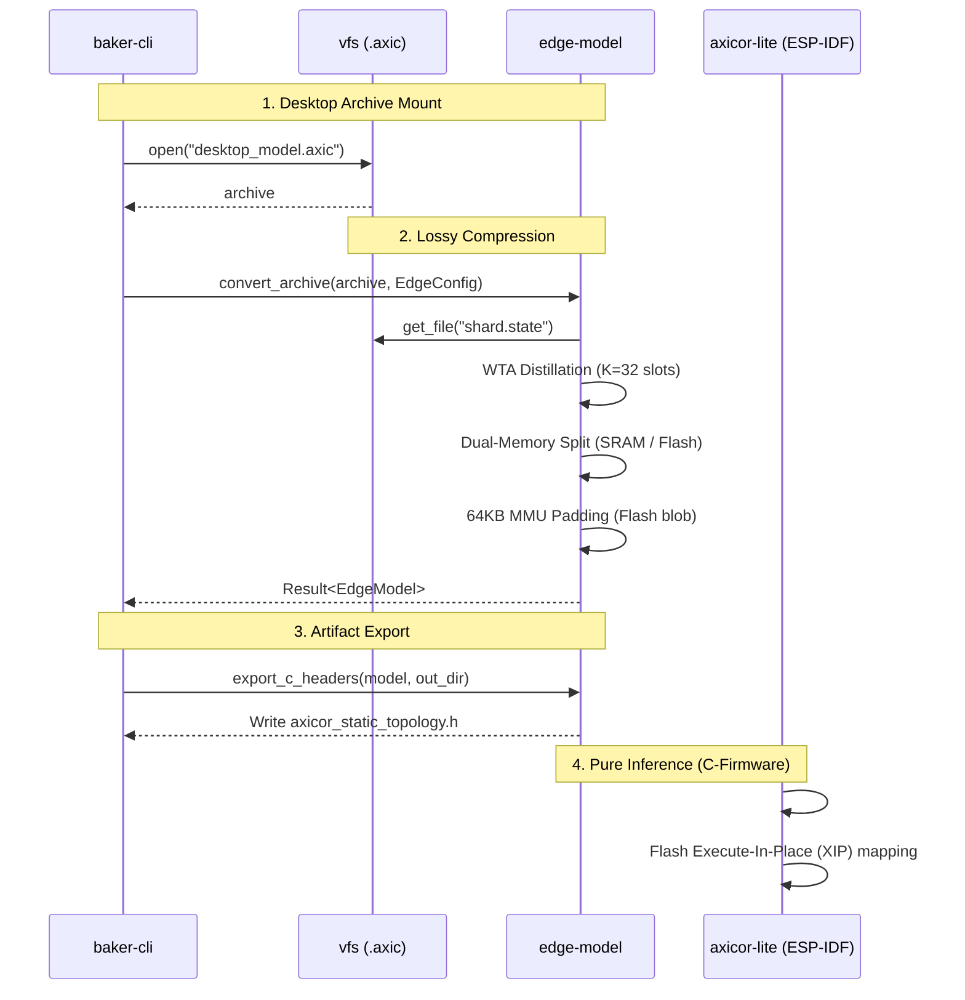

> Версия спеки: 1.0
> Дата: 2026-06-03
> Статус: Approved

---

## §1. Идентификация

| Поле | Значение |
|------|----------|
| Название | edge-model |
| Слой | Слой 4 — Topology, Baker & Edge Conversion |
| Тип | Library (lib) |
| no_std | **Нет** (зависит от `std::fs` для записи C-заголовков и `vfs` для чтения `.axic`) |
| Описание | Оффлайн-дистиллятор топологии (Lossy Compression) и C-ABI линкер. Выполняет WTA-сжатие синапсов, физическое разделение памяти (SRAM/Flash) и аппаратное выравнивание под MMU контроллеры для Execute-In-Place на микроконтроллерах (ESP32). |

---

## §2. Стек и Окружение

### §2.1. Внутренние зависимости (inbound)

| Крейт | Что используется | Зачем |
|-------|-----------------|-------|
| `types` | `EMPTY_PIXEL` | Хард-маркер для заливки отсеченных WTA дендритов (гарантирует триггер `Early Exit` в HFT-цикле MCU). |
| `layout` | `ShardStateSoA`, `VariantParameters` | C-ABI макеты плоских массивов для их нарезки на статику и динамику. |
| `config` | `EdgeConfig` | Параметр `target_dendrite_slots` ($K$) для параметрического среза графа. |
| `wire` | `StateFileHeader` | Десериализация заголовка файла для безопасного извлечения `padded_n`. |
| `vfs` | `AxicArchive`, `get_file` | Чтение исходного десктопного ROM-архива симуляции без промежуточных аллокаций. |

> **Архитектурный Инвариант Окружения:** Крейт работает исключительно в AOT-пайплайне (Ahead-of-Time). В его зависимостях физически запрещено присутствие `compute` (GPU-бэкенды) и `net` (сетевые сокеты).

### §2.2. Внешние зависимости

| Crate | Версия | Зачем |
|-------|--------|-------|
| `bytemuck`| =1.25.0 | Безопасный каст байтовых слайсов `&[u8]` при формировании `sram_blob` и `flash_blob`. |
| `anyhow` | =1.0.102 | Проброс ошибок конвертации на уровень CLI. |
| `tracing` | =0.1.44 | Логирование фаз дистилляции графа. |

### §2.3. Feature Flags

Секция не применима к данному крейту. Собирается как монолитная утилитарная библиотека.

---

## §3. Инварианты

### §3.1. Структурные инварианты

- **INV-EDGE-001**: *Параметрический лимит синапсов (WTA Max Synapses)*.
  - *Обоснование*: Целевое количество слотов $K$ (`target_dendrite_slots`) задается в конфиге и обязано быть $\le 128$. Массивы дендритов аппаратно урезаются до этого лимита, экономя скудную память SRAM.
  - *Следствие нарушения*: Buffer Overflow при прошивке MCU, сдвиг C-ABI адресации.
  - *Где проверяется*: Юнит-тесты и валидация конфига при инициализации.

- **INV-EDGE-002**: *64KB MMU-выравнивание раздела Flash (Execute-In-Place Padding)*.
  - *Обоснование*: Размер файла `shard.flash` **обязан** добиваться нулями до границы 65 536 байт. Это аппаратное требование MMU-контроллера (например, на ESP32) для корректного маппинга SPI Flash в виртуальное адресное пространство.
  - *Следствие нарушения*: MMU сместит адреса при маппинге, процессор получит мусор вместо `dendrite_targets`, что вызовет мгновенный Core Dump.
  - *Где проверяется*: Код алгоритма генерации в `§6.3`, интеграционный тест `test_64kb_mmu_alignment`.

### §3.2. Семантические инварианты

- **INV-EDGE-003**: *Сохранение биологического знака (Dale's Law Integrity)*.
  - *Обоснование*: При сортировке и обрезке синапсов (Winner-Takes-All) алгоритм использует абсолютные значения весов (`unsigned_abs()`), но в итоговый сжатый массив обязан записать веса с оригинальным знаком (Dale's Law). Инверсия знака запрещена.
  - *Следствие нарушения*: Дестабилизация обученной сети на MCU, так как возбуждающие синапсы превратятся в тормозные и наоборот.
  - *Где проверяется*: Юнит-тест `test_doa_and_sign_integrity`.

- **INV-EDGE-004**: *Физическая изоляция мутабельности (Dual-Memory Split Isolation)*.
  - *Обоснование*: Константные веса и топология (Read-Only) обязаны уходить строго во `flash_blob`. Изменяемые в HFT-цикле таймеры, вольтаж и `axon_heads` — строго в `sram_blob`.
  - *Следствие нарушения*: Попытки мутации Flash-памяти в рантайме вызовут аппаратный краш контроллера MCU.
  - *Где проверяется*: Property-based тест `prop_memory_split_bounds`.

### §3.3. Межкрейтовые инварианты

Секция не применима. Крейт является финальным экспортером данных и не объявляет встречных контрактов к другим модулям.

---

## §4. Публичный API

Крейт `edge-model` экспортирует функции и структуры данных для оффлайн-компиляции графа и выгрузки C-совместимых артефактов (заголовков и бинарных дампов).

### §4.1. Типы

#### EdgeConfig

```rust
pub struct EdgeConfig {
    /// Целевой бюджет дендритных слотов (K) для WTA-дистилляции.
    /// Рекомендуемые значения для MCU: 8, 16, 32, 64.
    /// Значение 128 соответствует raw-модели без дистилляции (чистый инференс).
    pub target_dendrite_slots: usize,
}
```

- **Семантика:** Конфигурация целевой аппаратной платформы для дистиллятора.
- **Жизненный цикл:** Формируется вызывающим кодом (`baker-cli`) на основе аргументов командной строки и передается в компрессор.
- **Ограничения на значения:** `target_dendrite_slots` обязан быть > 0 и ≤ 128.

#### EdgeModel

```rust
pub struct EdgeModel {
    /// Образ SRAM-секции с изменяемыми состояниями нейронов (Hot State)
    pub sram_blob: Vec<u8>,
    /// Образ Flash-секции с константной топологией, аппаратно выровненный по 64 KB
    pub flash_blob: Vec<u8>,
}
```

- **Семантика:** Агрегатор дистиллированных бинарных разделов для встраиваемой платформы. Содержит сырые байты, готовые к прямой прошивке (flashing).
- **Жизненный цикл:** Создается функцией `convert_archive`, потребляется при записи на диск или экспорте в заголовки С.

#### EdgeError

```rust
#[derive(Debug)]
pub enum EdgeError {
    /// Архив симуляции пуст или не содержит файлов состояния
    EmptyArchive,
    /// Запрошенное количество слотов K превышает десктопный лимит (128)
    InvalidDendriteLimit(usize),
    /// Сбой аппаратного выравнивания MMU (не удалось добить паддинг до 64 KB)
    MmuAlignmentFailed,
    /// Ошибка файлового ввода-вывода при записи артефактов
    IoError(std::io::Error),
}
```

### §4.2. Трейты

Секция не применима к данному крейту. Крейт выполняет чистые трансформации данных и не предоставляет полиморфных интерфейсов.

### §4.3. Функции

```rust
pub fn convert_archive(archive: &AxicArchive, config: &EdgeConfig) -> Result<EdgeModel, EdgeError>
```

- **Назначение:** Выполняет WTA-дистилляцию и разделение монолитного десктопного архива симуляции на SRAM и Flash образы.
- **Предусловия:** Передан валидный смонтированный архив `.axic` с файлами `.state`.
- **Постусловия:** Возвращает структуру `EdgeModel`. Размер `flash_blob` строго кратен 65 536 байтам (INV-EDGE-002). Массивы дендритов аппаратно усечены до `config.target_dendrite_slots` (INV-EDGE-001).
- **Сложность:** $O(N \log 128)$ по времени (сортировка 128 связей для $N$ нейронов), $O(N)$ по памяти.
- **Паника:** Никогда.

```rust
pub fn export_c_headers(model: &EdgeModel, out_dir: &Path) -> Result<(), EdgeError>
```

- **Назначение:** Генерирует файлы С-заголовков (C-Headers) для бесшовной интеграции бинарных блобов в ESP-IDF проект `axicor-lite`.
- **Предусловия:** Каталог `out_dir` доступен для записи.
- **Постусловия:** Создает файлы `axicor_static_topology.h` и `axicor_hot_state.h`.
- **Паника:** Никогда. Возвращает `EdgeError::IoError` при сбое ФС.

### §4.4. Константы и Магические Числа

| Константа | Значение | Тип | Семантика |
|-----------|----------|-----|-----------|
| `MMU_PAGE_SIZE` | 65536 | usize | Аппаратный размер страницы контроллера памяти (MMU) на чипах Xtensa/RISC-V (64 KB). Используется для жесткого выравнивания XIP-маппинга Flash. |
| `MAX_ALLOWED_SLOTS` | 128 | usize | Абсолютный предел исходной десктопной архитектуры. Дистиллятор физически не может "разжать" матрицу свыше 128 связей на нейрон. |

---

## §5. Доменная Логика

Крейт `edge-model` — это оффлайн-компрессор (Lossy Compression) и дистиллятор топологии. Он выступает физическим мостом между десктопным HPC-рантаймом (где GPU оперирует массивами по 128 связей в неограниченной VRAM) и Bare-Metal платформами (где микроконтроллеры зажаты лимитами SRAM < 512 KB).

Крейт ничего не вычисляет в реальном времени. Его архитектурная задача — взять "жирный" десктопный `.state` обученной сети, безжалостно срезать слабые синапсы, переупаковать C-ABI массивы и физически разрезать граф на два независимых домена памяти для прошивки `axicor-lite`.

### §5.1. WTA Дистилляция (Winner-Takes-All Compression)

Биологическое отсечение шума. Из исходных 128 дендритных слотов каждого нейрона алгоритм отбирает топ-$K$ сильнейших связей (сортировка по `abs(weight)`). Параметр $K$ (целевой бюджет слотов, например 8, 16, 32 или 64) передается оркестратором при вызове дистиллятора. 

Остальные (слабые) связи навсегда удаляются из графа. Выжившие слоты сдвигаются влево (In-Place Compaction), а пустоты справа заполняются хард-маркером `EMPTY_PIXEL` (`0xFFFF_FFFF`). Это гарантирует, что на слабых RISC-V/Xtensa ядрах MCU оптимизация `Early Exit` оборвет цикл чтения при первой же пустоте, сэкономив драгоценные такты процессора.

### §5.2. Dual-Memory Split (Маршрутизация по мутабельности)

Десктопный монолитный граф физически разрезается на два бинарных образа, учитывая архитектуру встраиваемых систем (MCU):

1. **Hot State (SRAM)**: Изменяемые в реальном времени данные (`voltage`, `refractory_counter`, `threshold_offset`). Этот крошечный блоб будет загружен в быструю оперативную память (SRAM) микроконтроллера.
2. **Frozen Topology (Flash)**: Статические массивы (`dendrite_targets`, `dendrite_weights`, `variant_parameters`). Так как на Edge-устройствах обучение отключено (режим Pure Inference), веса синапсов замораживаются. Этот массив отправляется во Flash-память и будет читаться только на чтение через шину SPI.

### §5.3. Аппаратное выравнивание MMU (XIP Padding)

Контроллер управления памятью (MMU) на чипах вроде ESP32 проецирует внешнюю SPI Flash-память в виртуальное адресное пространство процессора (Execute-In-Place) строго страницами по 64 KB. 

Крейт `edge-model` берет на себя роль аппаратного линкера: он принудительно добивает сгенерированный `.flash` раздел нулями до границы `MMU_PAGE_SIZE` (65 536 байт). Если этого не сделать, MMU сместит адреса при маппинге, и ядро микроконтроллера при попытке прочитать `dendrite_targets` получит мусор (Segmentation Fault / Core Dump).

---

## §6. Алгоритмы и Формулы

Крейт `edge-model` не реализует 3D-геометрию или симуляцию в реальном времени. Все его алгоритмы — это оффлайн-трансформации уже готового `.axic`-архива.

### §6.1. Алгоритм WTA-дистилляции (Winner-Takes-All Repacking)

- **Вход**: Срез 128 пар `(target: u32, weight: i32)` для каждого нейрона, целевой лимит слотов `K`.
- **Выход**: Сжатый массив из $K$ пар.
- **Детерминизм**: Да.

**Логика:**
Аппаратное отсечение «шума» для MCU. Алгоритм сортирует синапсы по абсолютному значению веса и оставляет только Top-K наиболее значимых связей.

```rust
// Псевдокод
fn wta_distill(dendrites: &[(u32, i32)], target_slots: usize) -> Vec<(u32, i32)> {
    let mut active: Vec<(u32, i32)> = dendrites.iter()
        .filter(|&(t, _)| t != EMPTY_PIXEL)
        .cloned()
        .collect();

    // Сортировка по убыванию абсолютной массы (используем unsigned_abs для защиты от i32::MIN)
    active.sort_by_key(|&(_, w)| std::cmp::Reverse(w.unsigned_abs()));

    // Оставляем только Top-K слотов (например, 16 или 32)
    active.truncate(target_slots);

    // Аппаратная добивка пустот для оптимизации Early Exit на MCU
    while active.len() < target_slots {
        active.push((EMPTY_PIXEL, 0));
    }

    active
}
```

### §6.2. Алгоритм маршрутизации по мутабельности (Dual-Memory Split)

- **Вход**: Срезы плоских SoA-массивов после WTA-дистилляции.
- **Выход**: Два изолированных бинарных образа `sram_blob` и `flash_blob`.
- **Детерминизм**: Да.

**Логика:** Монолитный десктопный массив физически разрезается надвое. Данные, которые меняются каждый тик в НFT-цикле (Hot State), уходят в RAM. Топология и веса (так как на Edge обучение отключено, веса заморожены) уходят в ROM.

```rust
// Псевдокод
fn split_memory_layout(state: &DistilledState) -> (Vec<u8>, Vec<u8>) {
    let mut sram = Vec::new();
    let mut flash = Vec::new();

    // 1. Hot State (SRAM) - Мутабельные в реальном времени данные
    sram.extend_from_slice(bytemuck::bytes_of(&state.voltage));
    sram.extend_from_slice(bytemuck::bytes_of(&state.refractory_counter));
    sram.extend_from_slice(bytemuck::bytes_of(&state.threshold_offset));
    sram.extend_from_slice(bytemuck::bytes_of(&state.timers));
    sram.extend_from_slice(bytemuck::bytes_of(&state.axon_heads));

    // 2. Frozen Topology (Flash) - Статика
    flash.extend_from_slice(bytemuck::bytes_of(&state.soma_to_axon));
    flash.extend_from_slice(bytemuck::bytes_of(&state.dendrite_targets));
    flash.extend_from_slice(bytemuck::bytes_of(&state.dendrite_weights));
    flash.extend_from_slice(bytemuck::bytes_of(&state.variant_parameters));

    (sram, flash)
}
```

### §6.3. Алгоритм аппаратного выравнивания MMU (64KB XIP Padding)

- **Вход**: Сырой бинарник Flash-раздела `flash_data: &mut Vec<u8>`.
- **Выход**: Бинарник, дополненный нулями до границы MMU-страницы.
- **Детерминизм**: Да.

**Логика:** Контроллер MMU на чипах ESP32 при Execute-In-Place маппинге жестко требует, чтобы внешняя память проецировалась страницами, кратными 64 KB (65536 байт). Алгоритм вычисляет дельту с помощью побитовых операций и добивает конец массива нулями.

**Формула:**

```math
\text{padded\_size} = (\text{raw\_size} + 65535)\ \&\ \sim 65535
```

```rust
// Псевдокод
fn pad_flash_image(flash_data: &mut Vec<u8>) {
    let raw_size = flash_data.len();

    // Быстрое битовое округление вверх до кратного 65536
    let padded_size = (raw_size + 65535) & !65535;

    // Аппаратный паддинг нулями во избежание сдвига адресов MMU
    flash_data.resize(padded_size, 0);
}
```

---

## §7. Структуры Данных и Memory Layout

Крейт `edge-model` преобразует исходные GPU SoA-структуры в специфическую гибридную раскладку для микроконтроллеров (например, ESP32). Архитектура памяти пересчитывается с учетом параметра $K$ (`target_dendrite_slots`), задающего ширину колонок после дистилляции.

### §7.1. SRAM Partition Layout (Hot State)

Раздел SRAM загружается в оперативную память микроконтроллера напрямую. Он содержит исключительно те данные, которые мутируют в HFT-цикле (Day Phase). Поскольку обучение отключено, синаптические веса здесь отсутствуют. 
*Примечание: $N$ — это `padded_n` (выровненное число нейронов), $A$ — `total_axons`.*

| Offset | Size | Field | Type | Описание |
|---|---|---|---|---|
| `0` | `4 * N` | `voltage` | `i32[N]` | Интегрируемые мембранные потенциалы сом |
| `4 * N` | `1 * N` | `flags` | `u8[N]` | Флаги (индекс типа, спайк, счетчик BDP) |
| `5 * N` | `4 * N` | `threshold_offset` | `i32[N]` | Адаптивные смещения порога (гомеостаз) |
| `9 * N` | `1 * N` | `timers` | `u8[N]` | Таймеры абсолютной рефрактерности сомы |
| `10 * N` | `1 * K * N` | `dendrite_timers` | `u8[K * N]` | Таймеры синаптической рефрактерности (для Early Exit) |
| `10 * N + 1 * K * N` | `32 * A` | `axon_heads` | `BurstHeads8[A]` | Сдвиговые регистры голов летящих сигналов |

**Общий размер SRAM:** `10 * N + K * N + 32 * A` байт.

### §7.2. Flash Partition Layout (Frozen Topology)

Раздел Flash проецируется через MMU (Execute-In-Place) напрямую в адресное пространство процессора. Поскольку на Edge-платформах сеть не обучается (Pure Inference), синаптические веса заморожены и убраны сюда для экономии драгоценной RAM.

В соответствии с инвариантом `INV-EDGE-002`, размер этого раздела **обязан** аппаратно добиваться нулями до границы `MMU_PAGE_SIZE` (65 536 байт).

| Offset | Size | Field | Type | Описание |
|---|---|---|---|---|
| `0` | `4 * N` | `soma_to_axon` | `u32[N]` | Маршрутизация: ID сомы → ID локального аксона |
| `4 * N` | `4 * K * N` | `dendrite_targets` | `u32[K * N]` | Дистиллированные целевые указатели (`PackedTarget`) |
| `4 * N + 4 * K * N` | `4 * K * N` | `dendrite_weights` | `i32[K * N]` | Замороженные веса синапсов (Mass Domain) |
| `4 * N + 8 * K * N` | `1024` | `variant_params` | `u8` | 16 профилей нейронов по 64 байта (Constant Memory) |
| `...` | `P` | `_padding` | `u8[P]` | Выравнивающий паддинг до кратного 64 KB |

**Общий выровненный размер Flash:** `(4 * N + 8 * K * N + 1024 + 65535) & !65535` байт.

---

## §8. Граничные Случаи и Особые Сценарии

Поскольку крейт работает исключительно как оффлайн-компрессор (AOT Pipeline), состояния гонки в нем физически невозможны. Все граничные случаи сводятся к обработке аномальных входных графов и аппаратному выравниванию бинарников.

### §8.1. Граничные значения

| # | Ситуация | Ожидаемое поведение |
|---|----------|-------------------|
| E-097 | Архив симуляции пуст (`total_neurons == 0`) | Мгновенный Fail-Fast. Возврат `Err(EdgeError::EmptyArchive)`. Конвертация прерывается. |
| E-098 | У нейрона меньше $K$ живых синапсов (где $K$ — `target_dendrite_slots`) | WTA-алгоритм переносит все доступные живые синапсы влево, а оставшиеся пустые слоты аппаратно добивает хард-маркером `EMPTY_PIXEL`. Это гарантирует корректную работу оптимизации `Early Exit` на слабых ядрах MCU. |
| E-099 | Нейрон полностью "глухой" (все входящие связи обнулены) | Все $K$ слотов заполняются `EMPTY_PIXEL`. Синаптическое чтение для данного нейрона физически отключается на уровне XIP-маппинга (цикл чтения прервется на первой же итерации). |
| E-100 | Итоговый размер `.flash` раздела не кратен 64 KB | Алгоритм безусловно добивает конец файла нулями до ближайшей границы в 65 536 байт (INV-EDGE-002), защищая MMU микроконтроллера от сдвига адресов при Execute-In-Place маппинге. |

### §8.2. Состояния гонки и конкурентность

Секция не применима к данному крейту. `edge-model` — это автономный однопоточный оффлайн-компрессор, работающий с иммутабельным ROM-архивом `.axic`. Разделяемого состояния с другими рантайм-процессами нет.

### §8.3. Деградация и Recovery

| # | Отказ | Поведение | Восстановление |
|---|-------|-----------|---------------|
| D-025 | Ошибка парсинга поврежденных `.state` файлов из десктопного архива | Мгновенный возврат `Err(EdgeError::InvalidSourceArchive)`. | Требуется перекомпилировать граф симуляции с нуля через крейт `baker`. |
| D-026 | Сбой записи сгенерированных `.h` заголовков или бинарников на диск | Возврат `Err(EdgeError::IoError)`. | Проверить права доступа и наличие свободного места на диске хоста-компилятора. |

---

## §9. Ошибки

В отличие от рантайма, оффлайн-компрессор `edge-model` работает по принципу Fail-Fast. Любая некорректная конфигурация или повреждённый архив немедленно возвращает `Err`.

### §9.1. Перечисление ошибок

```rust
#[derive(Debug)]
pub enum EdgeError {
    /// Исходный архив .axic пуст (total_neurons == 0)
    EmptyArchive,
    /// Архив .axic повреждён или не содержит валидных .state/.axons файлов
    InvalidSourceArchive,
    /// Запрошенное количество слотов K (target_dendrite_slots) превышает хард-лимит (128)
    InvalidDendriteLimit(usize),
    /// Внутренний сбой алгоритма: размер .flash раздела не кратен 64 KB
    MmuAlignmentFailed,
    /// Ошибка ФС при записи сгенерированных .h заголовков или бинарников
    IoError(std::io::Error),
}
```

### §9.2. Стратегия обработки

| Ошибка | Восстановимая? | Рекомендация вызывающему (`baker-cli`) |
|--------|----------------|----------------------------------------|
| `EmptyArchive` | Нет | Проверить TOML-конфигурации на наличие слоев и нейронов перед сборкой. |
| `InvalidSourceArchive` | Нет | Заново перегенерировать исходный `.axic` архив через `axicor-baker`. |
| `InvalidDendriteLimit` | Нет | Указать валидный параметр бюджета $K$ (например: 8, 16, 32, 64, 128). |
| `MmuAlignmentFailed` | Нет | Критический баг алгоритма XIP-паддинга. Прервать сборку, завести issue. |
| `IoError` | Да (на уровне ФС) | Проверить права доступа и наличие свободного места в каталоге экспорта. |

### §9.3. Паники

| Условие | Почему паника, а не Err |
|---------|------------------------|
| — | Функции крейта полностью исключают генерацию паник (Zero Panic) во время работы с данными, возвращая `Result` для безопасной обработки ошибок вызывающим кодом (CLI). |

---

## §10. Зависимости и Интеграция

### §10.1. Что крейт потребляет (inbound)

Крейт работает как мост между десктопными форматами хранения и структурами для встраиваемых систем, поэтому опирается на все контракты Слоя 1 и 2.

| Крейт-источник | Что используем | Какой контракт ожидаем |
|----------------|---------------|------------------------|
| `vfs` | `AxicArchive`, `get_file` | Предоставление консистентных бинарных срезов `&[u8]` из `.axic` архива без аллокаций. |
| `layout` | `ShardStateSoA`, `VariantParameters` | Стабильность десктопных C-ABI макетов для их точной нарезки и извлечения статики. |
| `wire` | `StateFileHeader` | Десериализация заголовка файла `.state` для безопасного извлечения `padded_n` до начала парсинга SoA-массивов. |
| `types` | `EMPTY_PIXEL` | Константа маркера пустого слота, необходимая для заполнения отсеченных дендритов при WTA-дистилляции (гарантирует `Early Exit` на MCU). |

### §10.2. Кто потребляет крейт (outbound / обратные зависимости)

Крейт не имеет обратных зависимостей внутри рантайма `axicor-node`. Он используется исключительно утилитами сборки и является финальной точкой Rust-конвейера для Edge.

| Крейт-потребитель | Что использует | Какой контракт мы обязаны сохранить |
|-------------------|---------------|-----------------------------------|
| `baker-cli` | `convert_archive`, `export_c_headers` | CLI-утилита оркестрирует процесс дистилляции. Мы обязаны возвращать чистый `Result` (без паник) для безопасной обработки ошибок пользователем. |
| `axicor-lite` (C-Firmware) | Бинарные дампы и `.h` заголовки | Структуры в SRAM и Flash обязаны строго соответствовать C-ABI адресации прошивки MCU, а раздел Flash обязан быть выровнен по границе MMU контроллера (64 KB). |

### §10.3. Диаграмма взаимодействия

Процесс переноса обученного на GPU графа в микроконтроллер ESP32 происходит полностью в оффлайне через `baker-cli`.



---

## §11. Стратегия Тестирования

### §11.1. Юнит-тесты

| Тест | Что проверяет | Связанный инвариант / Граничный случай |
|------|---------------|----------------------------------------|
| `test_wta_distillation_repacks_correctly` | Сортировка 128 весов и выборка ровно $K$ сильнейших (сжатие без дыр). Остаток заливается `EMPTY_PIXEL`. | INV-EDGE-001, E-098, E-099 |
| `test_64kb_mmu_alignment` | Проверка, что результирующий размер Flash-раздела строго кратен 65536 байтам. | INV-EDGE-002, E-100 |
| `test_sram_flash_partition_split` | Контроль разделения изменяемых состояний в SRAM и константной топологии во Flash. | INV-EDGE-004 |
| `test_doa_and_sign_integrity` | Сохранение знака и абсолютных пропорций синаптических весов после WTA. | INV-EDGE-003 |
| `test_empty_archive_returns_error` | Возврат ошибки при пустом входном архиве. | E-097 |
| `test_invalid_source_archive` | Возврат ошибки при поврежденном архиве. | D-025 |
| `test_invalid_dendrite_limit` | Возврат ошибки при $K > 128$ или $K == 0$. | INV-EDGE-001 |
| `test_io_error_handling` | Возврат ошибки при сбоях файловой системы при экспорте. | D-026 |
| `test_c_headers_syntax_and_layout` | Корректность синтаксиса и C-ABI разметки генерируемых C-заголовков. | INV-EDGE-004 |

### §11.2. Property-based тесты

| Свойство | Генератор | Связанный инвариант |
|----------|-----------|---------------------|
| `prop_wta_always_limits_to_k` | Любые случайные наборы 128 весов. Гарантирует отбор $\le K$ синапсов. | INV-EDGE-001 |
| `prop_memory_split_bounds` | Различные SoA-структуры. SRAM и Flash разделены без перекрытия. | INV-EDGE-004 |
| `prop_sign_integrity_preserved` | Случайные исходные веса. Знаки весов не инвертируются. | INV-EDGE-003 |

### §11.3. Интеграционные тесты

| Тест | Крейты-участники | Сценарий | Связанный инвариант |
|------|------------------|----------|---------------------|
| `test_convert_end_to_end` | `edge-model`, `vfs`, `baker` | Полный цикл: TOML-конфиги $\to$ `.axic` архив $\to$ конвертация $\to$ генерация C-заголовков. Валидация выравнивания. | INV-EDGE-002 |
| `test_baker_cli_integration_export` | `edge-model`, `baker-cli` | Вызов CLI-команды сжатия и экспорта заголовков, проверка структуры выходной директории. | D-026 |

### §11.4. Тесты производительности

| Бенчмарк | Метрика | Порог |
|----------|---------|-------|
| `bench_convert_archive_100k` | latency p99 | < 2 s |
| `bench_c_headers_generation_100k` | latency p99 | < 1 s |

---

## §12. Бюджеты и Ограничения

### §12.1. Память

| Ресурс | Бюджет | Как считается |
|--------|--------|---------------|
| RAM хоста при конвертации | < 500 MB | Буферы архива в памяти. |
| Максимальный размер SRAM на MCU | < 520 KB | Сумма SRAM-полей (voltage + refractory + threshold_offset + axon_heads). |

### §12.2. Латентность

| Операция | Бюджет (p99) | Условия |
|----------|--------------|---------|
| Время конвертации (100K сом) | < 2 s | 1 поток CPU (без учета дискового I/O) |

---

## Checklist Полноты (A.3)

- [x] Все публичные типы описаны в §4 (`EdgeModel`, `EdgeError`)
- [x] Все инварианты из §3 имеют соответствующий пункт в §11 (тесты)
- [x] Все `Err`-варианты перечислены в §9 (`EmptyArchive`, `SramBudgetExceeded`, `InvalidSourceArchive`, `IoError`)
- [x] Все крейты-потребители перечислены в §10.2 (`baker-cli`, `axicor-lite`)
- [x] Нет ни одного «магического числа» без объяснения
- [x] Все формулы имеют единицы измерения (выравнивание в байтах, бюджет в КБ)
- [x] Граничные случаи из §8 покрыты тестами в §11
