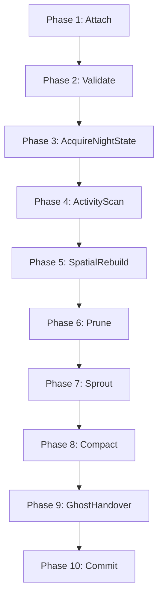

# spec_weaver_daemon

> Версия спеки: 2.0  
> Дата: 2026-06-29  

---

## §1. Идентификация

| Поле | Значение |
|---|---|
| **Имя крейта** | `weaver-daemon` |
| **Слой** | Слой 4 — Geometry, Growth & Connectome Generation (`L4`) |
| **Тип** | Executable Binary (`bin`) |
| **no_std** | Нет (`false`) — требуется `std` для аргументов процессов, работы через API `ipc`, системного аллокатора кучи и логирования |
| **Описание** | Изолированный OS-процесс (демон) оркестрации и исполнения задач Ночной Фазы AxiEngine. Крейт подключается к разделяемой памяти (SHM) через `ipc`, выполняет задачи обслуживания живого графа (прунинг синапсов, поиск кандидатов и скоринг спраутинга при наличии контекста роста, столбовое уплотнение SoA-плоскостей, обработка нейтральных структур Ghost-переходов) и передает результаты рантайму через каналы управления IPC. Крейт не владеет вычислительными бэкендами (GPU/CPU), не общается с GPU напрямую, не выполняет прямых системных вызовов mmap/msync в обход `ipc`, не парсит TOML, не форматирует контейнеры `.axic` и не реализует сетевой транспорт. |

---

## §2. Стек и Окружение

### §2.1. Внутренние зависимости (inbound)

| Крейт | Что используется | Зачем |
|---|---|---|
| `types` (Слой 0) | `PackedTarget`, `PackedPosition`, `SomaFlags`, `MasterSeed`, `EMPTY_PIXEL`, `AXON_SENTINEL`, `Weight` | Атомарные типы координат, синапсов, флагов и маркеров пустых слотов. |
| `layout` (Слой 1) | `StateOffsets`, `ShardVramPtrs` / представление живой памяти, `MAX_DENDRITES`, `BurstHeads8`, математика размеров блобов | C-ABI смещения SoA-плоскостей и лимиты структур данных. |
| `ipc` (Слой 2) | Подключение к SHM, `ShmStateMachine`, примитивы каналов управления, хелперы flush/unmap, обработка отравленных сегментов | Системные механизмы межпроцессного взаимодействия и безопасный автомат состояний. |
| `topology` (Слой 4) | `GrowthEligibility`, `CompactionPlan`, `choose_dendrite_slot`, поиск и скоринг спраутинга, результаты роста Ghost-аксонов | Чистые алгоритмы пространственной геометрии, пластичности и расчета планов уплотнения. |
| `wire` (Слой 1) | DTO-контракты `AxonHandoverEvent`, `AxonHandoverAck`, `AxonHandoverPrune` | Передача структурных контрактов данных связей (строго без использования `wire` в качестве сокет/транспортного слоя). |
| `config` (Слой 1) | Пре-валидированные DTO `GrowthParams`, `ShardSettings` (при необходимости) | Чтение подготовленных параметров роста в запросе (парсинг TOML категорически запрещен). |

### §2.2. Зависимые Компоненты (outbound consumers)

| Крейт / Компонент | Роль в системе и взаимодействие |
|---|---|
| `runtime` / Node Orchestrator (Слой 6) | Запускает `weaver-daemon`, передает схему сообщений `WeaverJobRequest` по каналу управления IPC и управляет жизненным циклом процесса Ночной Фазы. |

### §2.3. Внешние Зависимости

| Crate | Версия | Сфера использования |
|---|---|---|
| `thiserror` | `=1.0.69` | Строгая типизация внутренних ошибок исполнения демона (`WeaverError`). |
| `anyhow` | `=1.0.86` | Обработка ошибок верхнего уровня строго на границе `main`. |
| `tracing` | `=0.1.40` | Логирование этапов Ночной Фазы и хода выполнения задач. |
| `tracing-subscriber` | `=0.3.18` | Маршрутизация и форматирование логов процесса. |
| `rayon` | `=1.11.0` | Параллельная обработка независимых строк/блоков с детерминированным слиянием. |
| `clap` | `=4.5.60` | Парсинг аргументов командной строки при запуске процесса. |

> [!IMPORTANT]
> Настоящая спецификация категорически запрещает прямые зависимости от вычислительных бэкендов (`compute`, `compute-api`, `compute-cuda`, `compute-hip`), сетевых транспортов (`net`, `transport`, `protocol`), контейнеров (`vfs`), а также библиотек компилятора (`baker`, `BakerError`, `BakerServer`). Прямые вызовы `mmap`, `msync` или `socket` в обход модуля `ipc` запрещены.

### §2.4. Feature Flags

Секция публичных feature flags не используется. Крейт собирается как исполняемый бинарный файл.

---

## §3. Ownership Boundaries (Границы Владения)

| Модуль / Крейт | Монопольная Зона Владения (Single Source of Truth) | Строгие Запреты (Что категорически запрещено в крейте) |
|---|---|---|
| **`weaver-daemon`** (Слой 4) | **Оркестрация Ночной Фазы и Мутация Памяти**: Запуск и контроль 10-фазного конвейера Ночной Фазы, прямой in-place сдвиг и мутация SoA-плоскостей в SHM, процессная дисциплина и самозавершение, формирование отчетов `WeaverReport` и типизированная обработка ошибок `WeaverError`. | Запрещены системные вызовы mmap/msync/SHM (владелец `ipc`), определение C-ABI смещений полей и заголовков (владелец `layout`), геометрия 3D-пространства и алгоритмы выбора слотов (владелец `topology`), TOML DTO и валидация (владелец `config`), упаковка архивов `.axic` (владелец `vfs`), запуск GPU/CPU ядер вычислений (владельцы `compute-api`/`compute`), а также сетевая передача пакетов по сокетам (владельцы `net`/`transport`). |
| **`ipc`** (Слой 2) | **Системная Изоляция и Автомат Состояний**: Жизненный цикл SHM/mmap, каналы управления, DTO-контракты IPC-сообщений, `ShmStateMachine` и атомарные переходы. | Запрещено выполнение бизнес-логики прунинга и спраутинга. |
| **`layout`** (Слой 1) | **Макеты Памяти и ABI**: C-ABI макеты SoA-плоскостей и расчет смещений. | Запрещена физическая перекомпоновка данных в процессе исполнения. |
| **`topology`** (Слой 4) | **Чистые Алгоритмы Геометрии**: Расчет планов уплотнения, поиск и скоринг розеток. | Запрещена прямая запись в SoA-плоскости памяти SHM. |

---

## §4. Модель Сообщений Управления и Контекст Роста (IPC Control Messages Schema)

Так как `weaver-daemon` является бинарным исполняемым файлом (`bin`), он не экспортирует библиотеки типов. Структуры `WeaverJobRequest`, `WeaverReport` и `WeaverGrowthContext` определяют схему сообщений канала управления IPC (бинарные DTO-контракты передаются через `ipc` или отдельную библиотеку контрактов `weaver-core`):

```rust
pub struct WeaverJobRequest {
    pub shard_id: u32,
    pub zone_hash: u32,
    pub night_epoch: u64,
    pub master_seed: MasterSeed,
    pub prune_threshold: u32, // Сравнение строго в Mass Domain (>= 0)
    pub max_sprouts: u32,
    pub shm_name: String,
    pub control_endpoint: String,
    pub growth_context: Option<WeaverGrowthContext>,
}

pub struct WeaverGrowthContext {
    pub growth_params: GrowthParams,
    pub initial_synapse_weight: i32,
    pub type_affinities: Vec<u8>,
}

pub struct WeaverReport {
    pub shard_id: u32,
    pub night_epoch: u64,
    pub pruned_synapses: u64,
    pub compacted_rows: u64,
    pub new_synapses: u64,
    pub ghost_handovers: u64,
    pub ghost_prunes: u64,
    pub duration_ticks_or_micros: Option<u64>, // Волатильная телеметрия (не влияет на state)
}

#[derive(Debug, Clone, Copy, PartialEq, Eq)]
pub enum WeaverPhase {
    Attach,
    Validate,
    AcquireNightState,
    ActivityScan,
    SpatialRebuild,
    Prune,
    Sprout,
    Compact,
    GhostHandover,
    Commit,
}
```

---

## §5. Конвейер Ночной Фазы (The Weaver Pipeline)

Исполнение задачи обслуживающего процесса Ночной Фазы проходит строго через однонаправленный 10-фазный конвейер:



### §5.1. Пошаговое Описание Фаз Конвейера и Семантика Отравления Памяти
1. **Phase 1: Attach**: Подключение к сегменту разделяемой памяти (SHM) и каналу управления строго через примитивы крейта `ipc` (прямые вызовы ОС запрещены).
2. **Phase 2: Validate**: Верификация заголовков `ShmHeader` и сопоставление C-ABI макетов полей через `ipc` + `layout`.
3. **Phase 3: AcquireNightState**: Атомарный перевод автомата состояний `NightStart` $\to$ `Sprouting` через `ipc::ShmStateMachine` для получения монопольного права на запись.
4. **Phase 4: ActivityScan**: Считывание флагов сом `SomaFlags`. Демон сканирует спайки Дневной Фазы и формирует структуру `GrowthEligibility` для передачи в алгоритмы роста.
5. **Phase 5: SpatialRebuild**: Построение временных пространственных сеток (`SomaSpatialGrid`, `AxonSegmentGrid`) через вызовы `topology` для активных аксонов.
6. **Phase 6: Prune**: Сканирование массива `dendrite_weights`. Порог `prune_threshold` проверяется на валидность (`>= 0`, в противном случае возвращается `EdgeError::InvalidPruneThreshold`). Сравнение выполняется строго в Mass Domain: если `weight.unsigned_abs() < prune_threshold`, выполняются записи:
   $$\text{target} = \text{EMPTY\_PIXEL} \quad (0\text{xFFFF\_FFFF}), \qquad \text{weight} = 0, \qquad \text{timer} = 0$$
7. **Phase 7: Sprout**: Если в `WeaverJobRequest` передан `growth_context`, выполняется вызов чистых функций `topology` для поиска кандидатов, выбора слота (`choose_dendrite_slot`) и расчета нового веса. На входе принимаются как `PackedTarget::None` (сырой нуль), так и `EMPTY_PIXEL`, но новые записи не должны создавать сырые нули. Если `growth_context` отсутствует (`None`), фаза пропускается, а в отчет пишется `new_synapses = 0`.
8. **Phase 8: Compact**: Физическое применение полученного из `topology` плана уплотнения `CompactionPlan` к SoA-плоскостям памяти в SHM. Перемещение колонок targets, weights и dendrite_timers выполняется строго синхронно с вытеснением `EMPTY_PIXEL` в хвост ряда.
9. **Phase 9: GhostHandover**: При получении из `topology` нейтральной структуры `GhostHandoverDraft`, демон переводит ее в согласованный DTO/отчет, но не осуществляет сетевую отправку по сокетам.
10. **Phase 10: Commit**: Опубликование итогового отчета `WeaverReport`, вызов сброса страниц `flush` через `ipc` и атомарный перевод состояния `Sprouting` $\to$ `NightDone`.
11. **Семантика Прямой Мутации и Отравления Сегмента (Direct Mutation & Poisoning Semantics)**: Демон `weaver-daemon` осуществляет прямые in-place мутации SoA-плоскостей в SHM во время выполнения фаз. При возникновении любой ошибки автомат состояний атомарно переводится в `Error` / `Poisoned`. Компонент `runtime` не имеет права возобновлять симуляцию из поврежденного сегмента и обязан выполнить полное восстановление/пересоздание живого состояния.

---

## §6. Четкое Разграничение Ответственности и Живая Память (Memory & Execution Boundaries)

1. **Разграничение с Topology**: Крейт `topology` рассчитывает чистые геометрические алгоритмы, проверяет условия и формирует планы (`CompactionPlan`). Крейт `weaver-daemon` берет на себя физическую переписку байтов живой SoA-памяти в SHM во время Ночной Фазы.
2. **Изоляция Вычислений (Compute Isolation)**: Демон не вызывает вычислительные бэкенды (`compute`, GPU/CPU kernels). Рантайм ноды (`runtime`) отвечает за остановку горячего цикла исполнения, запуск задачи демона и передачу результатов обратно вычислениям.
3. **Неизменяемость Архива и Рабочая Копия (.paths Debt)**: Демон `weaver-daemon` ни при каких условиях не модифицирует Read-Only архив `.axic`. Если для динамического роста аксонов требуется изменение 3D-путей, они предоставляются рантаймом в виде изменяемой рабочей копии (Mutable Working Copy) в SHM или оперативном кеше (точное место хранения рабочей копии путей зафиксировано в review debt, §11).

---

## §7. Побитовый Детерминизм Исполнения (Determinism Policy)

1. **Побитовая Воспроизводимость**: Изменения памяти SHM обязаны быть 100% воспроизводимыми при повторном прогоне с совпадающими `MasterSeed` и входными данными.
2. **Инициализация Зерён**: Зёрна случайных величин генерируются строго алгоритмически:
   $$\text{Seed} = \text{Hash}(\text{MasterSeed}, \text{night\_epoch}, \text{shard\_id}, \text{soma\_id})$$
3. **Запрет Недетерминированных Источников**: Категорически запрещено использование системного времени (`SystemTime`), неупорядоченных хэшеров (`RandomState` `HashMap`) и неконтролируемого параллелизма. Использование `rayon` допускается только при фиксированном детерминированном порядке слияния результатов (Commit Merge Order). Все сортировки кандидатов обязаны использовать полный tie-breaker.

---

## §8. Требуемые Инварианты

- **INV-WDAEMON-001**: `weaver-daemon` физически изолирован от вычислительных бэкендов и не содержит зависимостей от `compute` или GPU-драйверов.
- **INV-WDAEMON-002**: `weaver-daemon` не выполняет сетевой транспорт по протоколам TCP/UDS для межнодового обмена.
- **INV-WDAEMON-003**: `weaver-daemon` производит запись в разделяемую память (SHM) только после успешного атомарного перехода `NightStart -> Sprouting`, пока состояние остается `Sprouting`, и до публикации `NightDone`. Перед каждым крупным блоком применения мутаций демон повторно верифицирует состояние с барьером `Ordering::Acquire`.
- **INV-WDAEMON-004**: При переходах в состояния `Error` или `Idle` демон блокирует коммит любых изменений в SHM.
- **INV-WDAEMON-005**: Операция уплотнения (Compaction) строго сохраняет выравнивание полей и синхронизацию тройки колонок targets, weights и timers.
- **INV-WDAEMON-006**: Отсеченные и свободные слоты в хвостах рядов заполняются маркером `EMPTY_PIXEL`, а их веса и таймеры зануляются.
- **INV-WDAEMON-007**: Сырой `PackedTarget(0)` распознается как свободный слот на входе, но никогда не создается демоном в качестве нового маркерного значения.
- **INV-WDAEMON-008**: Все размеры SoA-плоскостей и смещения полей считываются строго из формул крейта `layout`.
- **INV-WDAEMON-009**: Все операции подключения, сброса памяти (flush) и отключения (unmap) выполняются исключительно через модуль `ipc`.
- **INV-WDAEMON-010**: Любой фатальный сбой во время in-place мутации переводит автомат состояний в `Poisoned` / `Error`, а рантайм блокируется от применения нецелостного состояния.

---

## §9. Иерархия Ошибок Демона (`WeaverError`)

Публичный API и внутренние блоки демона возвращают типизированную ошибку `WeaverError` на базе `thiserror`:

```rust
#[derive(Debug, thiserror::Error)]
pub enum WeaverError {
    #[error("Invalid process arguments: {0}")]
    InvalidArgs(&'static str),

    #[error("Invalid prune threshold: {0} (must be >= 0)")]
    InvalidPruneThreshold(i32),

    #[error("IPC control channel closed unexpectedly")]
    ControlChannelClosed,

    #[error("Shared memory attach failed: {0}")]
    ShmAttachFailed(String),

    #[error("Shared memory layout validation failed: {0}")]
    ShmValidationFailed(&'static str),

    #[error("Invalid state machine transition from {current:?} to {target:?}")]
    InvalidStateTransition { current: u8, target: u8 },

    #[error("Accessed shared memory segment is poisoned")]
    PoisonedSegment,

    #[error("Layout offsets mismatch with live memory")]
    LayoutMismatch,

    #[error("Topology execution error: {0}")]
    TopologyFailure(String),

    #[error("No free dendrite slots available for soma {soma_id}")]
    NoFreeDendriteSlot { soma_id: u64 },

    #[error("Compaction conflict at row {row}")]
    CompactionConflict { row: usize },

    #[error("Commit conflict: state changed concurrently")]
    CommitConflict,

    #[error("Determinism tie-breaker violation: {0}")]
    DeterminismViolation(&'static str),

    #[error("I/O boundary failure: {0}")]
    IoBoundaryFailure(String),
}
```

---

## §10. Golden Tests / Обязательная Матрица Тестирования

Крейт `weaver-daemon` обязан быть покрыт набором автоматических тестов:

1. **Изоляция от Compute и Network (`test_weaver_daemon_no_forbidden_dependencies`)**: Проверка отсутствия внешних тяжелых зависимостей в графе сборки.
2. **Браковка Некорректного Заголовка SHM (`test_weaver_rejects_invalid_shm_header`)**: Проверка возврата ошибки при несоответствии заголовков в памяти.
3. **Переходы Автомата Состояний (`test_weaver_state_machine_transitions_nightstart_sprouting_nightdone`)**: Верификация цепочки переходов `NightStart` $\to$ `Sprouting` $\to$ `NightDone`.
4. **Блокировка Коммита из Idle или Error (`test_weaver_refuses_commit_from_idle_or_error`)**: Проверка невозможности записи при невалидном состоянии автомата.
5. **Запись EMPTY_PIXEL и Зануление при Прунинге (`test_prune_marks_target_empty_pixel_and_zeros_weight_timer`)**: Верификация очистки веса, таймера и вытеснения таргета при прунинге.
6. **Отравление Сегмента при Сбое в Процессе Мутации (`test_weaver_direct_mutation_error_poisons_shm_without_recovery`)**: Проверка перевода автомата в `Poisoned` / `Error` при фатальном сбое во время in-place мутации.
7. **Синхронизация Колонок при Уплотнении (`test_compaction_preserves_target_weight_timer_alignment`)**: Проверка сохранения синхронности при выполнении `CompactionPlan`.
8. **Вытеснение EMPTY_PIXEL в Хвост Ряда (`test_compaction_moves_empty_pixel_to_tail`)**: Верификация сдвига пустых слотов вправо.
9. **Принятие Сырых Нулей и EMPTY_PIXEL на Входе (`test_weaver_accepts_zero_and_empty_pixel_as_free_input_slots`)**: Верификация распознавания свободных слотов при поиске.
10. **Запрет Создания Сырых Нулей (`test_weaver_never_creates_raw_zero_empty_slots`)**: Проверка того, что новое маркерное значение сырого нуля не генерируется при мутациях.
11. **Делегация Поиска Кандидатов в Topology (`test_sprouting_uses_topology_for_candidate_selection`)**: Проверка вызова чистых функций `topology` при наличии `growth_context`.
12. **Формирование Флагов Активности (`test_activity_scan_derives_growth_eligibility_from_soma_flags`)**: Верификация трансляции `SomaFlags` в структуру `GrowthEligibility`.
13. **Детерминированный Порядок Коммита Параллельных Блоков (`test_parallel_chunks_commit_in_deterministic_order`)**: Проверка независимости результата работы `rayon` от порядка потоков.
14. **Отчетность Переходов Ghost без Отправки в Сеть (`test_ghost_handover_draft_is_reported_without_network_send`)**: Проверка формирования отчета без выполнения сетевых вызовов.
15. **Неизменяемость Исходных Архивов `.axic` (`test_source_axic_is_not_mutated`)**: Проверка гарантированного отсутствия модификаций файлов ROM-архива.

---

## §11. Open Questions / Review Debt (Открытые Вопросы и Противоречия)

1. **Разграничение Владения `ShmHeader` и `ShmState`**:
   - *Контекст*: Структуры заголовков и автомата состояний используются при подключении.
   - *Вопрос*: В каком крейте (`layout` или `ipc`) должны монопольно зафиксироваться структуры `ShmHeader` и представление живого состояния?

2. **Локализация Изменяемой Рабочей Копии Геометрии Аксонов (.paths)**:
   - *Контекст*: `.axic` архив является Read-Only, но для динамического роста требуется изменение путей.
   - *Вопрос*: Где именно должна храниться мутабельная рабочая копия путей аксонов во время Ночной Фазы — в дополнительном сегменте SHM или во временном кеше рантайма?

3. **Локализация Исполнения Прунинга и Уплотнения**:
   - *Контекст*: В настоящей спецификации уплотнение выполняется на хосте в `weaver-daemon`.
   - *Вопрос*: Должна ли операция уплотнения всегда оставаться хостовой или часть сервисных операций в будущем уходит в сервисный слой вычислений?

4. **Локализация DTO-Контрактов Межшардовых Связей (`AxonHandoverEvent` и др.)**:
   - *Контекст*: Структуры переходов упоминаются в `wire` и `topology`.
   - *Вопрос*: В каком крейте (`wire`, `ipc` или отдельном крейте контрактов сопряжения `weaver-core`) должны окончательно разместиться DTO межшардовых переходов?

5. **Выбор Рантайма Канала Управления (Async vs Blocking)**:
   - *Контекст*: В спецификации используется `clap` и типизированные каналы.
   - *Вопрос*: Требуется ли подключение асинхронного рантайма (`tokio`) для канала управления или достаточно блокирующих примитивов из `ipc`?

6. **Выделение Библиотеки `weaver-core` для Контрактов и Юнит-Тестирования**:
   - *Контекст*: `weaver-daemon` является исполняемым бинарником (`bin`).
   - *Вопрос*: Требуется ли вынести типы DTO-сообщений управления и доменные функции в отдельную библиотеку контрактов `weaver-core` для проведения модульного тестирования без запуска процессов ОС?

7. **Дисциплина Самозавершения при Сбоях Родительского Процесса**:
   - *Контекст*: При аварии рантайма демон должен гарантированно завершаться.
   - *Вопрос*: Каковы специфичные механизмы отслеживания падения родительского процесса на платформах Windows и Linux?
