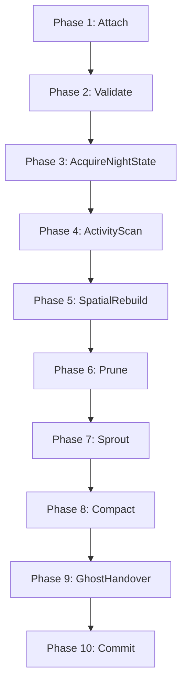

# spec_weaver_daemon

> Версия спеки: 2.1  
> Дата: 2026-07-10  

---

## §1. Идентификация

| Поле | Значение |
|---|---|
| **Имя крейта** | `weaver-daemon` |
| **Слой** | Слой 4 — Geometry, Growth & Connectome Generation (`L4`) |
| **Тип** | Library (`lib`) + Executable Binary (`bin`) |
| **no_std** | Нет (`false`) — сама библиотека `weaver-daemon` пишется максимально переносимо с поддержкой no_std-тестирования, но бинарный хост требует `std` для аргументов CLI, работы через Named Pipes / UDS, аллокатора кучи и логирования |
| **Описание** | Оркестратор и исполнитель задач Ночной Фазы AxiEngine. Крейт поставляется в виде библиотеки (`lib`) для встраивания и тестирования, а также исполняемого бинарного файла (`bin`). Он подключается к живой памяти (SHM) или принимает мутабельные срезы памяти (`NightWorkingViewMut`), вызывает чистые алгоритмы `topology` для расчета синаптогенеза и осуществляет физическую запись изменений (прунинг синапсов, уплотнение SoA-плоскостей, обработку переходов Ghost-аксонов) обратно в память. Крейт не имеет зависимостей от GPU-ускорителей, сетевого транспорта и AOT компилятора. |

---

## §2. Стек и Окружение

### §2.1. Внутренние зависимости (inbound)

| Крейт | Что используется | Зачем |
|---|---|---|
| `types` (Слой 0) | `PackedTarget`, `PackedPosition`, `SomaFlags`, `MasterSeed`, `EMPTY_PIXEL`, `AXON_SENTINEL`, `Weight` | Атомарные типы координат, синапсов, флагов и маркеров пустых слотов. |
| `layout` (Слой 1) | `StateOffsets`, `NightWorkingViewMut`, `NightWorkingViewRef`, `MAX_DENDRITES`, `BurstHeads8`, математика размеров блобов | C-ABI смещения SoA-плоскостей, структуры представлений обслуживания Ночной Фазы и лимиты. |
| `ipc` (Слой 2) | `WeaverJobRequest`, `WeaverReport`, `WeaverGrowthContext`, подключение к SHM, примитивы Named Pipes / UDS, обработка отравленных сегментов | Weaver DTO-структуры (реэкспортируются демоном), системные механизмы межпроцессного взаимодействия и переход в Error(4). |
| `topology` (Слой 4) | `SproutRankKey`, `CompactionPlan`, выбор слота, поиск и скоринг спраутинга, результаты планирования Ghost-аксонов | Чистые алгоритмы пространственной геометрии, пластичности и расчета планов уплотнения/прунинга. |
| `wire` (Слой 1) | DTO-контракты `AxonHandoverEvent` (для сборки драфта переходов) | Ссылки на типы событий передачи связей для межшардовой интеграции. |
| `config` (Слой 1) | Пре-валидированные параметры конфигурации в составе DTO | Чтение подготовленных параметров роста в запросе (парсинг TOML категорически запрещен). |

### §2.2. Зависимые Компоненты (outbound consumers)

| Крейт / Компонент | Роль в системе и взаимодействие |
|---|---|
| `runtime` / Node Orchestrator (Слой 6) | Запускает `weaver-daemon` или напрямую вызывает функции библиотеки `weaver-daemon`, передает `WeaverJobRequest` по Named Pipes / UDS и считывает отчет `WeaverReport`. |

### §2.3. Внешние Зависимости

| Crate | Версия | Сфера использования |
|---|---|---|
| `thiserror` | `=1.0.69` | Строгая типизация внутренних ошибок исполнения демона (`WeaverError`). |
| `anyhow` | `=1.0.86` | Обработка ошибок верхнего уровня строго на границе `main` бинарного файла. |
| `tracing` | `=0.1.40` | Логирование этапов Ночной Фазы и хода выполнения задач. |
| `tracing-subscriber` | `=0.3.18` | Маршрутизация и форматирование логов процесса. |
| `rayon` | `=1.11.0` | Параллельная обработка независимых строк/блоков с детерминированным слиянием. |
| `clap` | `=4.5.60` | Парсинг аргументов командной строки при запуске бинарного процесса. |

> [!IMPORTANT]
> Настоящая спецификация категорически запрещает прямые зависимости от вычислительных бэкендов (`compute`, `compute-api`, `compute-cuda`, `compute-hip`), сетевых транспортов (`net`, `transport`, `protocol`), контейнеров (`vfs`), а также библиотек компилятора (`baker`, `BakerError`). Прямые вызовы `mmap` или `socket` в обход модуля `ipc` запрещены.

### §2.4. Feature Flags

| Feature | Default | Описание |
|---|---|---|
| `std` | `true` | Включает поддержку операционной системы (CLI аргументы, Named Pipes/UDS, системное логирование). |

---

## §3. Ownership Boundaries (Границы Владения)

| Модуль / Крейт | Монопольная Зона Владения (Single Source of Truth) | Строгие Запреты (Что категорически запрещено в крейте) |
|---|---|---|
| **`weaver-daemon`** (Слой 4) | **Оркестрация Ночной Фазы и Применение Мутаций**: Запуск и контроль 10-фазного конвейера Ночной Фазы, сборка мутабельных представлений `NightBufferSource`, физическая in-place мутация SoA-плоскостей на основе планов `topology`, формирование отчетов `WeaverReport` и реэкспорт DTO управления. | Запрещены системные вызовы mmap/ Named Pipes/SHM (владелец `ipc`), определение C-ABI смещений полей и заголовков (владелец `layout`), геометрия 3D-пространства и алгоритмы выбора слотов (владелец `topology`), TOML DTO и валидация (владелец `config`), упаковка архивов `.axic` (владелец `vfs`), запуск GPU/CPU ядер вычислений (владельцы `compute-api`/`compute`), а также сетевая передача пакетов по сокетам (владельцы `net`/`transport`). |
| **`ipc`** (Слой 2) | **Системная Изоляция и DTO Управления**: Жизненный цикл SHM/mmap, Named Pipes / UDS каналы, атомарные переходы SM, определение структур `WeaverJobRequest` и `WeaverReport`. | Запрещено выполнение бизнес-логики прунинга, уплотнения и спраутинга. |
| **`layout`** (Слой 1) | **Макеты Памяти и ABI**: C-ABI макеты SoA-плоскостей, структура `ShmHeader` и расчет смещений. | Запрещена физическая перекомпоновка данных в процессе исполнения. |
| **`topology`** (Слой 4) | **Чистые Алгоритмы Геометрии**: Расчет планов уплотнения, поиск и скоринг розеток, ранжирование спраутов. | Запрещена прямая запись в SoA-плоскости памяти SHM или `NightWorkingViewMut`. |

---

## §4. Модель Сообщений Управления и Контекст Роста (IPC Control Messages Schema)

Библиотека и бинарный файл `weaver-daemon` **не владеют** структурами сообщений управления. Они реэкспортируют типы `WeaverJobRequest`, `WeaverReport` и `WeaverGrowthContext` напрямую из крейта `ipc`.

Поля реэкспортируемых DTO соответствуют структуре, определенной в `ipc_spec.md` §8.3:
- **`WeaverJobRequest`**: содержит `shard_id`, `zone_hash`, `night_epoch`, `master_seed`, `prune_threshold` (уже переведенный в u32 на стороне рантайма), `max_sprouts`, `w_distance`, `w_power`, `w_explore`, `initial_synapse_weight`, а также признак присутствия контекста роста `has_growth_context`.
- **`WeaverGrowthContext`**: содержит биологический контекст роста путей аксонов.
- **`WeaverReport`**: содержит результирующие счетчики синапсов (`pruned_count`, `compacted_count`, `sprouted_count`, `ghost_handovers_count`) и время выполнения `duration_us`.

### §4.1. Двойной Источник Буферов (`NightBufferSource`)

Для обеспечения работы как в мультипроцессорном режиме (производственный запуск через SHM), так и в изолированном внутрипроцессном режиме (тесты T8 в одном процессе) демон оперирует абстракцией `NightBufferSource`:

```rust
/// Двойной источник буферов обслуживания Ночной Фазы
pub enum NightBufferSource<'a> {
    /// Режим разделяемой памяти ОС (процессная модель)
    ShmAttachment {
        shm_name: String,
    },
    /// Режим in-proc slices (для тестов T8 в рамках одного процесса)
    HostSlices(NightWorkingViewMut<'a>),
}
```

В режиме `HostSlices` системные фазы конвейера (подключение, верификация заголовков ОС, атомарные переходы SM) пропускаются или работают как мягкие заглушки (soft no-op), предоставляя прямой доступ к переданному представлению `NightWorkingViewMut`.

---

## §5. Конвейер Ночной Фазы (The Weaver Pipeline)

Исполнение задачи обслуживающего процесса Ночной Фазы проходит строго через однонаправленный 10-фазный конвейер:



### §5.1. Пошаговое Описание Фаз Конвейера и Семантика Отравления Памяти
1. **Phase 1: Attach**: Подключение к разделяемой памяти (SHM) или извлечение мутабельного вида из `NightBufferSource` (в режиме `HostSlices` – soft no-op).
2. **Phase 2: Validate**: Верификация заголовков через `layout::validate_night_working_view` (в режиме `HostSlices` – мягкая проверка размеров переданных слайсов).
3. **Phase 3: AcquireNightState**: Атомарный перевод автомата состояний `NightStart` $\to$ `Sprouting` (в режиме `HostSlices` – no-op).
4. **Phase 4: ActivityScan**: Сканирование флагов сом `SomaFlags` из представления `state_blob`. Сборка структуры `GrowthEligibility` для передачи в `topology`.
5. **Phase 5: SpatialRebuild**: Построение временных пространственных сеток в `topology` для активных аксонов (на основе `NightWorkingViewRef` / `state_blob` / `paths_blob`).
6. **Phase 6: Prune**: Вызов чистой функции планирования прунинга из `topology`. Полученный план (какие дендритные слоты подлежат удалению) физически применяется к SoA-плоскостям `state_blob` по формулам смещений `StateOffsets`. Для удаляемых синапсов записывается:
   $$\text{target} = \text{EMPTY\_PIXEL} \quad (0\text{xFFFF\_FFFF}), \qquad \text{weight} = 0, \qquad \text{timer} = 0$$
7. **Phase 7: Sprout**: Вызов чистых функций планирования спраутинга из `topology`. На основе вычисленных геометрических рангов и скоринга новые синапсы записываются в свободные слоты (содержащие `EMPTY_PIXEL` или `PackedTarget::None`).
8. **Phase 8: Compact**: Вызов чистой функции `topology::build_compaction_plan` для получения плана уплотнения `CompactionPlan`. Демон физически переносит колонки `targets`, `weights` и `dendrite_timers` внутри `state_blob`, вытесняя маркеры `EMPTY_PIXEL` в хвост каждого ряда.
9. **Phase 9: GhostHandover**: Сборка нейтральной структуры `GhostHandoverDraft`, полученной из планировщика `topology`, перевод её в отчет `WeaverReport` без выполнения сетевой отправки.
10. **Phase 10: Commit**: Опубликование отчета `WeaverReport` и атомарный перевод состояния `Sprouting` $\to$ `NightDone`.
11. **Семантика Ошибок и Отравления (Poisoning Semantics)**: При возникновении любой ошибки во время in-place мутаций, автомат состояний переводится в `Error(4)` через `ipc`. Сегмент признается "отравленным" (poisoned) и не подлежит повторному использованию (Day Phase resume блокируется, требуется холодное пересоздание сегмента рантаймом).

---

## §6. Четкое Разграничение Ответственности и Живая Память (Memory & Execution Boundaries)

1. **Разграничение с Topology**: Крейт `topology` рассчитывает чистые геометрические алгоритмы, проверяет условия и формирует планы (`CompactionPlan`). Крейт `weaver-daemon` берет на себя физическую переписку байтов живой SoA-памяти в SHM / `NightWorkingViewMut`.
2. **Изоляция Вычислений (Compute Isolation)**: Демон не зависит от `compute-api` и не вызывает вычислительные ядра (GPU/CPU kernels).
3. **Неизменяемость Архива и Рабочая Копия (.paths Debt)**: Демон `weaver-daemon` ни при каких условиях не модифицирует Read-Only архив `.axic`. Все изменения выполняются во временной рабочей копии путей аксонов в SHM / `paths_blob`.

---

## §7. Побитовый Детерминизм Исполнения (Determinism Policy)

1. **Побитовая Воспроизводимость**: Изменения памяти обязаны быть 100% воспроизводимыми при повторном прогоне с совпадающими `MasterSeed` и входными данными.
2. **Инициализация Зерён**: Зёрна случайных величин генерируются строго алгоритмически:
   $$\text{Seed} = \text{Hash}(\text{MasterSeed}, \text{night\_epoch}, \text{shard\_id}, \text{soma\_id})$$
3. **Запрет Недетерминированных Источников**: Категорически запрещено использование системного времени (`SystemTime`), неупорядоченных хэшеров (`RandomState` `HashMap`) и неконтролируемого параллелизма. Использование `rayon` допускается только при фиксированном детерминированном порядке слияния результатов (Commit Merge Order). Все сортировки кандидатов обязаны использовать полный tie-breaker.

---

## §8. Требуемые Инварианты

- **INV-WDAEMON-001**: `weaver-daemon` физически изолирован от вычислительных бэкендов и не содержит зависимостей от `compute-api` или GPU-ускорителей.
- **INV-WDAEMON-002**: `weaver-daemon` не выполняет сетевой транспорт по протоколам TCP/UDS для межнодового обмена.
- **INV-WDAEMON-003**: `weaver-daemon` производит запись в разделяемую память (SHM) только после успешного атомарного перехода `NightStart -> Sprouting` и до публикации `NightDone`.
- **INV-WDAEMON-004**: При переходах в состояние `Error(4)` демон блокирует коммит любых изменений в SHM.
- **INV-WDAEMON-005**: Операция уплотнения (Compaction) строго сохраняет выравнивание полей и синхронизацию тройки колонок targets, weights и timers.
- **INV-WDAEMON-006**: Отсеченные и свободные слоты в хвостах рядов заполняются маркером `EMPTY_PIXEL`, а их веса и таймеры зануляются.
- **INV-WDAEMON-007**: Сырой `PackedTarget(0)` распознается как свободный слот на входе, но никогда не создается демоном в качестве нового маркерного значения.
- **INV-WDAEMON-008**: Все размеры SoA-плоскостей и смещения полей считываются строго из формул крейта `layout`.
- **INV-WDAEMON-009**: Все операции подключения, сброса памяти (flush) и отключения (unmap) выполняются исключительно через модуль `ipc`.
- **INV-WDAEMON-010**: Любой фатальный сбой во время in-place мутации переводит автомат состояний в `Error(4)`, а рантайм блокируется от применения нецелостного состояния.

---

## §9. Иерархия Ошибок Демона (`WeaverError`)

Публичный API и внутренние блоки демона возвращают типизированную ошибку `WeaverError` на базе `thiserror`:

```rust
#[derive(Debug, thiserror::Error)]
pub enum WeaverError {
    #[error("Invalid process arguments: {0}")]
    InvalidArgs(&'static str),

    #[error("Invalid prune threshold: {0}")]
    InvalidPruneThreshold(u32),

    #[error("IPC control channel closed unexpectedly")]
    ControlChannelClosed,

    #[error("Shared memory attach failed: {0}")]
    ShmAttachFailed(String),

    #[error("Shared memory layout validation failed: {0}")]
    ShmValidationFailed(&'static str),

    #[error("Invalid state machine transition from {current:?} to {target:?}")]
    InvalidStateTransition { current: u8, target: u8 },

    #[error("Accessed shared memory segment is poisoned")]
    PoisonedSegment,

    #[error("Layout offsets mismatch with live memory")]
    LayoutMismatch,

    #[error("Topology execution error: {0}")]
    TopologyFailure(String),

    #[error("No free dendrite slots available for soma {soma_id}")]
    NoFreeDendriteSlot { soma_id: u64 },

    #[error("Compaction conflict at row {row}")]
    CompactionConflict { row: usize },

    #[error("Commit conflict: state changed concurrently")]
    CommitConflict,

    #[error("Determinism tie-breaker violation: {0}")]
    DeterminismViolation(&'static str),

    #[error("I/O boundary failure: {0}")]
    IoBoundaryFailure(String),
}
```

---

## §10. Golden Tests / Обязательная Матрица Тестирования

Крейт `weaver-daemon` обязан быть покрыт набором автоматических тестов:

1. **Изоляция от Compute и Network (`test_weaver_daemon_no_forbidden_dependencies`)**: Проверка отсутствия внешних тяжелых зависимостей в графе сборки.
2. **Браковка Некорректного Заголовка SHM (`test_weaver_rejects_invalid_shm_header`)**: Проверка возврата ошибки при несоответствии заголовков в памяти.
3. **Переходы Автомата Состояний (`test_weaver_state_machine_transitions_nightstart_sprouting_nightdone`)**: Верификация цепочки переходов `NightStart` $\to$ `Sprouting` $\to$ `NightDone`.
4. **Блокировка Коммита из Idle или Error (`test_weaver_refuses_commit_from_idle_or_error`)**: Проверка невозможности записи при невалидном состоянии автомата.
5. **Запись EMPTY_PIXEL и Зануление при Прунинге (`test_prune_marks_target_empty_pixel_and_zeros_weight_timer`)**: Верификация очистки веса, таймера и вытеснения таргета при прунинге.
6. **Отравление Сегмента при Сбое в Процессе Мутации (`test_weaver_direct_mutation_error_poisons_shm_without_recovery`)**: Проверка перевода автомата в `Error(4)` при фатальном сбое во время in-place мутации.
7. **Синхронизация Колонок при Уплотнении (`test_compaction_preserves_target_weight_timer_alignment`)**: Проверка сохранения синхронности при выполнении `CompactionPlan`.
8. **Вытеснение EMPTY_PIXEL в Хвост Ряда (`test_compaction_moves_empty_pixel_to_tail`)**: Верификация сдвига пустых слотов вправо.
9. **Принятие Сырых Нулей и EMPTY_PIXEL на Входе (`test_weaver_accepts_zero_and_empty_pixel_as_free_input_slots`)**: Верификация распознавания свободных слотов при поиске.
10. **Запрет Создания Сырых Нулей (`test_weaver_never_creates_raw_zero_empty_slots`)**: Проверка того, что новое маркерное значение сырого нуля не генерируется при мутациях.
11. **Делегация Поиска Кандидатов в Topology (`test_sprouting_uses_topology_for_candidate_selection`)**: Проверка вызова чистых функций `topology` при наличии `growth_context`.
12. **Формирование Флагов Активности (`test_activity_scan_derives_growth_eligibility_from_soma_flags`)**: Верификация трансляции `SomaFlags` в структуру `GrowthEligibility`.
13. **Детерминированный Порядок Коммита Параллельных Блоков (`test_parallel_chunks_commit_in_deterministic_order`)**: Проверка независимости результата работы `rayon` от порядка потоков.
14. **Отчетность Переходов Ghost без Отправки в Сеть (`test_ghost_handover_draft_is_reported_without_network_send`)**: Проверка формирования отчета без выполнения сетевых вызовов.
15. **Неизменяемость Исходных Архивов `.axic` (`test_source_axic_is_not_mutated`)**: Проверка гарантированного отсутствия модификаций файлов ROM-архива.
16. **Поддержка Двойного Источника Буферов (`test_dual_buffer_mode_slices_vs_shm`)**: Проверка прохождения конвейера в режиме `HostSlices` без системных вызовов SHM.

---

## §11. Resolved Architectural Decisions (Принятые Решения Pass 2)

1. **[RESOLVED] Разграничение Владения `ShmHeader` и `ShmState` (REV-IPC-001 / Pass 2.3)**:
   - *Решение*: Владение бинарными контрактами и `ShmHeader` перенесено в `layout`.
2. **[RESOLVED] Локализация DTO-Контрактов Межшардовых Связей (Pass 2.3)**:
   - *Решение*: DTO сообщений управления `WeaverJobRequest`, `WeaverReport` и `WeaverGrowthContext` определены в `ipc` и реэкспортируются демоном, что полностью исключает дублирование и избыточные зависимости.
3. **[RESOLVED] Слой пакета weaver-daemon (REV-WEAVER-001 / Pass 2.3)**:
   - *Решение*: Крейт поставляется как библиотека (`lib`) и бинарный хост (`bin`), что позволяет проводить полное модульное тестирование логики без спавна ОС-процессов.
4. **[RESOLVED] Локализация Изменяемой Рабочей Копии Геометрии Аксонов (.paths)**:
   - *Решение*: Временная рабочая копия путей хранится в SHM-сегменте или in-proc слайсах (`paths_blob` в составе `NightWorkingViewMut/Ref`), а архивы `.axic` остаются строго для чтения.
5. **[RESOLVED] Локализация Исполнения Прунинга и Уплотнения**:
   - *Решение*: `weaver-daemon` осуществляет физическую запись в память на хосте, используя планы от чистых функций `topology`.
6. **[RESOLVED] Выбор Рантайма Канала Управления (Async vs Blocking)**:
   - *Решение*: Библиотечная часть демона не зависит от асинхронности. В бинарном хосте допускается блокирующий опрос или легковесный tokio-рантайм (решается на этапе реализации).
7. **[RESOLVED] Дисциплина Самозавершения при Сбоях Родительского Процесса**:
   - *Решение*: Отслеживание падения родительского процесса реализуется системными средствами в бинарном хосте `main` (например, через prctl `PDEATHSIG` на Linux и Job Objects на Windows).
