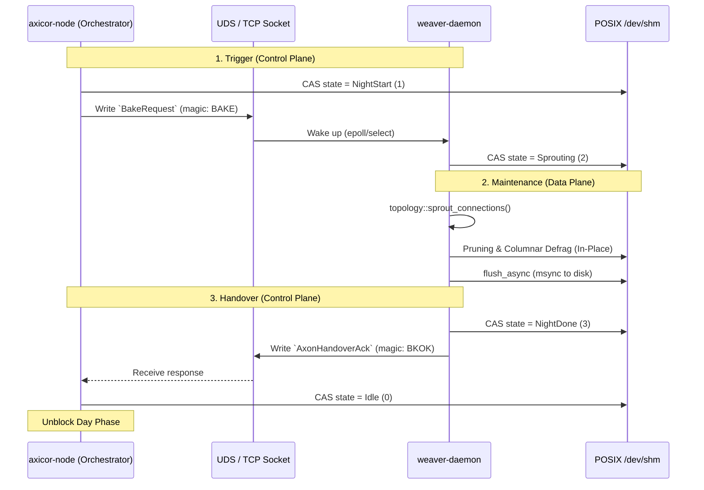

spec_weaver_daemon

> Версия спеки: 1.0  
> Дата: 2026-06-02  
> Статус: Approved  

---

## §1. Идентификация

| Поле | Значение |
|------|----------|
| Название | `weaver-daemon` |
| Слой | Слой 4 — Topology, Baker & Edge Conversion |
| Тип | Executable Binary (bin) |
| no_std | **Нет** (требует `tokio` для сокетов, `std::fs` для SHM-маппинга ОС) |
| Описание | Изолированный OS-процесс (демон) Ночной Фазы. Принимает триггеры от оркестратора по UDS/TCP, выполняет $O(N)$ мутации C-ABI массивов в разделяемой памяти (SHM) и координирует вызовы тяжелой 3D-геометрии (sprouting/pruning), аппаратно разгружая HFT-цикл GPU. |

---

## §2. Стек и Окружение

### §2.1. Внутренние зависимости (inbound)

| Крейт | Что используется | Зачем |
|-------|-----------------|-------|
| `types` | `PackedPosition`, `MasterSeed` | Базовые упакованные типы координат, физические кванты и сиды. |
| `layout` | `ShmHeader`, `ShardStateSoA` | POD-структуры и C-ABI макеты для Zero-Copy парсинга разделяемой памяти. |
| `wire` | `BakeRequest`, `AxonHandoverEvent`, `AxonHandoverAck` | Бинарные IPC DTO-контракты для сообщений UDS/TCP сокетов. |
| `ipc` | `ShmManager`, `ShmStateMachine`, `BakerServer`, `MockShmAllocator` | Низкоуровневые кроссплатформенные системные механизмы POSIX SHM и сокет-протоколов. |
| `topology` | `sprout_connections`, `nudge_living_axons` | Делегация тяжелых пространственных алгоритмов поиска и 3D-роста аксонов. |
| `baker` | `BakerError` | Единые типы ошибок валидации графа. |

### §2.2. Внешние зависимости

| Crate | Версия | Зачем |
|-------|--------|-------|
| `tokio` | `=1.50.0` | Асинхронный I/O и многопоточный рантайм для обработки UDS/TCP соединений с оркестратором. |
| `tracing` | `=0.1.44` | Логирование этапов Ночной Фазы и хода выполнения алгоритмов. |
| `anyhow` | `=1.0.102` | Упрощенный проброс и обработка ошибок на этапе выполнения бинарника. |
| `rayon` | `=1.11.0` | Распараллеливание независимых вычислительных блоков внутри фаз демона. |

### §2.3. Feature Flags

Секция не применима к данному крейту: крейт собирается как исполняемый бинарный файл без собственных условных флагов компиляции.

---

## §3. Инварианты

### §3.1. Структурные инварианты

- **INV-WDAEMON-001**: *Zero GPU Knowledge (Абсолютная аппаратная изоляция)*.
  - *Обоснование*: `weaver-daemon` является независимым процессом ОС (Out-of-Process). Ему **строго запрещено** линковаться с `compute-api`, `CUDA` или `HIP`. Его представление о мире ограничено исключительно плоскими C-ABI массивами в POSIX `MappedShm`.
  - *Следствие нарушения*: Утечка контекстов драйвера GPU между процессами, раздувание бинарника демона, краш CUDA-драйвера при попытке двойной инициализации на одном устройстве.
  - *Где проверяется*: Архитектурный линтер (cargo tree) — отсутствие зависимостей от крейтов Слоя 3.

- **INV-WDAEMON-002**: *Изолированность процесса (Process Isolation and Cleanup)*.
  - *Обоснование*: В случае аварийного завершения ноды (оркестратора), демон обязан гарантированно завершить работу (self-termination), чтобы не оставлять сиротливых процессов, блокирующих UDS-сокеты и сегменты разделяемой памяти. На Windows это реализуется через Windows Job Objects, на Linux — через мониторинг pipe/UDS сокета.
  - *Следствие нарушения*: Зависание демонов в фоне, невозможность рестарта симуляции из-за занятых портов и SHM.
  - *Где проверяется*: Run-time проверка закрытия сокета управления в основном цикле.

- **INV-WDAEMON-003**: *Сохранение выравнивания памяти (Align Integrity during Compaction)*.
  - *Обоснование*: При проведении дефрагментации (compaction) SoA массивов дендритов в `SHM`, демон обязан сохранить исходные смещения и 64-байтовое выравнивание всех блоков. Неиспользованные слоты дендритов сдвигаются вправо и заполняются маркерами `EMPTY_PIXEL`.
  - *Следствие нарушения*: `Unaligned Access` крах на GPU при старте Day Phase (срабатывает паника `FATAL C-ABI BOUNDARY` из `layout`), Silent Data Corruption.
  - *Где проверяется*: Юнит-тесты алгоритма дефрагментации.

- **INV-WDAEMON-004**: *Детерминированность адресации сокетов (Socket Path Uniqueness)*.
  - *Обоснование*: Путь к UDS-сокету (`/tmp/axicor_baker_{zone_hash}.sock`) или порт TCP вычисляются строго на базе хэша обслуживаемой зоны (`zone_hash`) через вызовы к крейту `ipc`.
  - *Следствие нарушения*: Перехват управления чужой зоной в кластере.
  - *Где проверяется*: Run-time проверка при `BakerServer::bind`.

### §3.2. Семантические инварианты

- **INV-WDAEMON-005**: *Защита от отравления автомата (State Safety Lock)*.
  - *Обоснование*: Демон не имеет права коммитить изменения в разделяемую память, если состояние автомата `ShmStateMachine` переведено оркестратором в `Error (4)` или досрочно возвращено в `Idle (0)`. Все записи предваряются проверкой состояния с барьером `Ordering::Acquire`.
  - *Следствие нарушения*: Data Race с GPU-ядром, запись недовычисленных связей в `SHM`, крах симуляции.
  - *Где проверяется*: Run-time проверки `ShmStateMachine` перед коммитом изменений.

- **INV-WDAEMON-006**: *Делегирование математики (Zero-Duplication)*.
  - *Обоснование*: Демон **не реализует** проверку Закона Дейла, Dead on Arrival (DoA) или Sprouting Density. Вся структурная пластичность делегируется вызовам чистых функций из `topology`.
  - *Следствие нарушения*: Рассинхронизация алгоритмов, дублирование кода.
  - *Где проверяется*: Code-review (запрет на реализацию 3D-поиска внутри крейта).

### §3.3. Межкрейтовые инварианты

Секция не применима к данному крейту: `weaver-daemon` является потребителем системных инвариантов из нижележащих слоев (таких как `INV-CROSS-008` из `ipc`) и не объявляет собственных межкрейтовых контрактов.

---

## §4. Публичный API

Крейт `weaver-daemon` является изолированным исполняемым файлом (binary) и не экспортирует публичный Rust-интерфейс (`lib.rs`). Его "публичным API" выступают интерфейс командной строки (CLI), коды возврата операционной системы и IPC-протокол обмена.

### §4.1. CLI Аргументы (Command Line Interface)

Демон не имеет интерактивного режима и жестко конфигурируется при запуске оркестратором (`axicor-node`):

| Аргумент | Тип | Обязательный | Семантика |
|---|---|---|---|
| `--config-dir` | `PathBuf` | Да | Путь к каталогу с конфигурациями (где лежат `simulation.toml` и `brain.toml`). |
| `--zone-hash` | `u32` | Да | FNV-1a хэш обслуживаемой зоны. Критичен для детерминированной генерации путей к SHM-файлам и UDS-сокетам (через крейт `ipc`). |
| `--mock` | `flag` | Нет | Запуск в режиме автономного тестирования. Демон поднимает `MockShmAllocator` (Слой 2), игнорирует сокет оркестратора и сразу выполняет Sprouting для проверки алгоритмов в изоляции. |

### §4.2. Переменные окружения (Environment)

| Переменная | Семантика |
|---|---|
| `RUST_LOG` | Управление уровнем логирования крейта `tracing` (например, `info`, `weaver_daemon=debug`). Влияет на stdout демона, который перехватывается оркестратором. |

### §4.3. Коды возврата ОС (Exit Codes)

Оркестратор опирается на коды возврата демона для управления его жизненным циклом (Restart Policy).

| Код | Статус | Триггер |
|---|---|---|
| `0` | Success | Штатное завершение работы (получен SIGTERM/SIGINT, либо оркестратор корректно закрыл сокет управления). |
| `1` | Fatal Error | Нарушение C-ABI контрактов (невыровненные указатели `mmap`), отсутствие необходимых файлов в SHM, нехватка RAM или сбой `bind` на UDS/TCP сокете. |

### §4.4. Константы и Магические Числа

Секция не применима. 
В соответствии с правилом Zero-Duplication, демон не объявляет собственных системных констант. Все таймауты, префиксы файлов, магические числа сокетов (`BAKE_MAGIC`, `BAKE_READY_MAGIC`) и маркеры (`EMPTY_PIXEL`) жестко импортируются из профильных контрактных крейтов `ipc`, `wire` и `types`.

---

## §5. Доменная Логика

Крейт `weaver-daemon` — это изолированный фоновый сервис (OS Process) Ночной Фазы. Его архитектурная роль (Out-of-Process CPU Offloading) заключается в том, чтобы взять на себя тяжелую $O(K)$ 3D-геометрию и структурную пластичность графа, освободив рантайм ноды (GPU) от работы с динамической памятью, деревьями и аллокациями.

Взаимодействие с нодой происходит исключительно через `Lock-Free` автомат состояний в разделяемой памяти (SHM) и триггеры по UDS/TCP сокету. Демон полностью "слеп" к сети кластера и железу видеокарт — он оперирует исключительно математикой и C-ABI массивами байт.

### §5.1. Жесткий конвейер Ночной Фазы (The Weaver Pipeline)

Получив сигнал `BakeRequest` по сокету, демон убеждается, что автомат SHM находится в состоянии `Sprouting` (что дает ему эксклюзивное право на запись), и выполняет строгий синхронный конвейер:

1. **Zero-Copy Map & Activity Gate**: Демон кастует `MappedShm` в типизированные Rust-срезы. Считывает `soma_flags`. Если бит активности сомы (`& 0x01`) равен нулю, её дендриты и локальные аксоны пропускаются за $O(1)$ (Activity-Based Nudging).
2. **Spatial Rebuild**: На базе активных аксонов (и Ghost-аксонов, переданных через `AxonHandoverEvent`) выполняется шаг роста. Обновленные сегменты упаковываются в локальную 3D-хэш сетку (`SpatialGrid`). 
3. **Sprouting (Почкование)**: Выполняется распараллеленный через `rayon` поиск новых розеток в обновленном `SpatialGrid` с соблюдением квоты `max_sprouts`. Новые синапсы получают спасательный капитал (`DoA Protection`) и записываются в первые доступные слоты.
4. **Synaptic Pruning**: Демон сканирует массив весов `dendrite_weights`. Любой вес, чье абсолютное значение упало ниже `prune_threshold`, обнуляется. Целевой указатель `dendrite_targets` аппаратно перезаписывается маркером `EMPTY_PIXEL` (`0xFFFF_FFFF`).
5. **Columnar Defragmentation**: Разреженные массивы дендритов сжимаются (O(N) in-place shift). Все `EMPTY_PIXEL` вытесняются в конец (вправо) 128-слотового блока каждого нейрона. Это критически важно для работы GPU-оптимизации `Early Exit` в Дневной Фазе.
6. **Commit & Flush**: Демон вызывает системный `msync` / `flush_async` для принудительного сброса грязных страниц ОС (Crash Tolerance), переводит состояние автомата в `NightDone` и отвечает ноде `AxonHandoverAck` по сокету.

---

## §6. Алгоритмы и Формулы

В соответствии с принципом разделения ответственности, `weaver-daemon` не реализует 3D-математику (генерацию путей, конусную трассировку и Spatial Hash Grid). Эти вызовы делегируются крейту `topology`. Собственные алгоритмы демона — это исключительно $O(N)$ конвейеры мутации плоских C-ABI массивов в разделяемой памяти (SHM).

### §6.1. Алгоритм Прунинга (Synaptic Pruning)

- **Вход**: Срезы `weights: &mut [i32]`, `targets: &mut [u32]`, `prune_threshold: i16`.
- **Выход**: Обнуление слабых связей In-Place.
- **Детерминизм**: Да.

**Логика:**
Линейное сканирование массива весов. Демон выполняет роль "биологической амнезии", удаляя синапсы, чья абсолютная масса упала ниже предела выживаемости. В отличие от GPU, здесь разрешены условные ветвления.

```rust
// Псевдокод
fn prune_synapses(weights: &mut [i32], targets: &mut [u32], threshold: i16) {
    let prune_limit = (threshold as i32) << 16; // Сдвиг в Mass Domain
    for i in 0..weights.len() {
        if weights[i].abs() < prune_limit {
            weights[i] = 0;
            targets[i] = EMPTY_PIXEL; // 0xFFFF_FFFF
        }
    }
}
```

### §6.2. Алгоритм Дефрагментации Дендритов (Dendrite Array Compaction)

- **Вход**: `targets: &mut [u32]`, `weights: &mut [i32]`, `padded_n: usize`, `slots: usize` (128).
- **Выход**: Сжатые SoA массивы.
- **Детерминизм**: Да.

**Логика:** Критически важная $O(N \times 128)$ операция сжатия колонок после Прунинга. Если мёртвые синапсы (`EMPTY_PIXEL`) останутся в начале массива, GPU-ядро в Дневную Фазу споткнётся об них из-за оптимизации `Early Exit` (`if target == 0 { break }`) и проигнорирует все живые связи, идущие следом. Алгоритм сжимает живые связи влево, вытесняя пустоты вправо.

```rust
// Псевдокод (выполняется для каждого нейрона n в [0..padded_n])
fn compact_dendrites(
    weights: &mut [i32],
    targets: &mut [u32],
    padded_n: usize,
    slots: usize, // 128
) {
    for n in 0..padded_n {
        let mut write_idx = 0;
        for read_idx in 0..slots {
            let target = targets[read_idx * padded_n + n];
            if target != EMPTY_PIXEL {
                if write_idx != read_idx {
                    targets[write_idx * padded_n + n] = target;
                    weights[write_idx * padded_n + n] = weights[read_idx * padded_n + n];
                    targets[read_idx * padded_n + n] = EMPTY_PIXEL;
                    weights[read_idx * padded_n + n] = 0;
                }
                write_idx += 1;
            }
        }
    }
}
```

---

## §7. Структуры Данных и Memory Layout

Секция не применима к данному крейту: крейт `weaver-daemon` является чисто функциональным исполняемым процессом и не определяет собственных бинарных структур данных. Все форматы импортируются из контрактных крейтов `layout` и `wire`.

---

## §8. Граничные Случаи и Особые Сценарии

Поскольку демон работает как изолированный процесс (Out-of-Process хирург), его граничные случаи делятся на исчерпание квот, гонки с оркестратором за SHM и системные сбои ОС.

### §8.1. Граничные значения
| # | Ситуация | Ожидаемое поведение |
|---|----------|-------------------|
| E-092 | Превышение квоты `max_sprouts` | Демон тихо прерывает цикл Sprouting. Оставшиеся отростки игнорируются (это не ошибка, а лимит Ночной Фазы, защищающий от пробития SLA по времени). |
| E-093 | Нет ни одной подходящей сомы в конусе роста аксона | Аппаратная запись маркера `EMPTY_PIXEL` в качестве таргета. Аксон помечается как мертвый и подлежит зачистке (Pruned). |
| E-094 | Агрессивный прунинг (все дендриты нейрона обнулены) | Нейрон остается без входящих связей (silent). Сбоя выполнения нет, оптимизация `Early Exit` на GPU просто пропустит его интеграцию в Дневную Фазу. |
| E-095 | Аварийное отсутствие файлов SHM при старте | Fail-Fast. Демон логирует ошибку и завершается с кодом `1`. |
| E-096 | Переполнение очередей SHM (`Handovers` или `Prunes` >= 10000) | Демон аппаратно прекращает добавление событий в очереди. Оставшиеся `OutOfBounds` отростки остаются стоять на границе шарда до следующей Ночи. Защищает разделяемую память от Out-of-Bounds записи. |

### §8.2. Состояния гонки и конкурентность

| # | Сценарий | Защита |
|---|----------|--------|
| R-030 | **Гонка с Оркестратором (SHM State Race)** | Если оркестратор по таймауту решает, что демон завис, и переводит автомат в `Error (4)`, демон обязан перед каждым коммитом в SHM сверять `state == Sprouting` через `Acquire`-барьер. При несовпадении — немедленный Abort коммита (INV-WDAEMON-005). |
| R-031 | **Потеря сокет-соединения с оркестратором** | Демон закрывает серверную сессию, переводит SHM в `Error (4)`, освобождает дескриптор сокета и переходит в ожидание нового подключения, не ломая разделяемую память. |

### §8.3. Деградация и Recovery

| # | Отказ | Поведение | Восстановление |
|---|-------|-----------|---------------|
| D-023 | Превышение RAM хоста при сборке 3D `SpatialGrid` | Аварийное завершение процесса (OOM Kill от ОС). | Оркестратор `axicor-node` фиксирует разрыв сокета и перезапускает процесс демона с нуля (Self-Healing). |
| D-024 | Отказ дисковой ФС при поиске путей TOML | Fail-Fast инициализации. | Логирование критической ошибки, процесс умирает с кодом `1`. Требуется вмешательство администратора или внешнего ИИ куратора системы. |

---

## §9. Ошибки

Поскольку `weaver-daemon` является исполняемым бинарным файлом, он не экспортирует публичный `enum` ошибок для других крейтов. Стратегия обработки ошибок — это стратегия выживания OS-процесса и его взаимодействия с оркестратором через системные примитивы.

### §9.1. Фатальные ошибки (Exit Code 1)

Вызывают немедленную смерть процесса (Self-Termination). Оркестратор перехватывает код `1` и инициирует политику рестарта демона с нуля.
- **Сбой маппинга SHM**: Разделяемая память не найдена, имеет некорректный размер или недоступна для mmap.
- **Нарушение выравнивания ОС**: Указатель `mmap` от операционной системы не выровнен по границе 64 байт (критично для C-ABI).
- **Сбой сокетов (Bind Error)**: Невозможно выполнить `bind` на UDS/TCP сокете (например, порт или файл сокета занят зависшим процессом-зомби).

### §9.2. Ошибки сессии (Drop Connection)

Демон **не умирает**, но немедленно прерывает текущую Ночную Фазу (Abort).
- **Триггеры**: Получен `BakeRequest` с неверным `magic`-числом (`BAKE_MAGIC`), либо зафиксировано нарушение Lock-Free автомата (оркестратор перехватил управление, выставив `Error (4)` или `Idle (0)` во время работы демона).
- **Действие**: Демон аппаратно прерывает мутацию памяти, переводит SHM-автомат в состояние `Error (4)` (если он еще не там), закрывает текущее сокет-соединение (Drop), полностью очищает свой внутренний 3D-стейт и уходит в режим ожидания следующего подключения оркестратора.

### §9.3. Доменные ошибки (Skip & Warn)

Ошибки, возникающие в процессе 3D-математики, которые не угрожают целостности SHM.
- **Триггеры**: Ошибка 3D-трассировки (выход за границы без возможности генерации Ghost-пакета) или невозможность разрезолвить локальную воксельную сетку для конкретного аксона.
- **Действие**: Демон просто пропускает (Skip) проблемный отросток, логирует `WARN` в `stderr` (перехватывается оркестратором) и продолжает работу конвейера Sprouting/Pruning. Никаких прерываний или сбросов сессии.

### §9.4. Паники

Паники в демоне сведены к абсолютному аппаратному минимуму:

| Условие | Почему паника |
|---------|---------------|
| `ptr as usize % 64 != 0` при кастинге слайсов | Нарушение контракта выравнивания C-ABI (INV-WDAEMON-003) при маппинге `MappedShm`. Продолжение работы приведет к смещению структур при сжатии колонок, что неизбежно вызовет аппаратный краш (`FATAL C-ABI BOUNDARY`) на GPU на следующее утро. Мгновенный `panic!`. |

---

## §10. Зависимости и Интеграция

### §10.1. Что крейт потребляет (inbound)

Так как `weaver-daemon` является исполняемым бинарником, он агрегирует базовые слои для работы с операционной системой и делегирования математики.

| Крейт-источник | Что используем | Какой контракт ожидаем |
|----------------|---------------|------------------------|
| `ipc` | `ShmManager`, `BakerServer`, `MockShmAllocator` | Предоставление валидных, выровненных по 64 байта сырых указателей на SHM-сегменты ОС и управление UDS/TCP слушателями. |
| `topology` | `sprout_connections`, `nudge_living_axons` | Строгое делегирование 3D-геометрии (INV-WDAEMON-006). Демон сам не считает радиусы и коллизии вокселей. |
| `wire` | `BakeRequest`, `AxonHandoverAck` | Сохранение бинарной C-ABI структуры для парсинга сообщений UDS-сокета без аллокаций. |
| `layout` | `ShmHeader` | Сохранение смещений и констант выравнивания для `MappedShm`. |

### §10.2. Кто потребляет крейт (outbound / обратные зависимости)

Крейт не экспортирует Rust-интерфейс (`lib.rs`). Единственным потребителем демона является оркестратор (Слой 6), который взаимодействует с ним на уровне управления процессами ОС.

| Крейт-потребитель | Что использует | Какой контракт мы обязаны сохранить |
|-------------------|---------------|-----------------------------------|
| `axicor-node` (оркестратор) | Запуск дочернего OS-процесса (`std::process::Command`) | Демон обязан слушать строго детерминированный сокет (вычисленный по `zone_hash`), соблюдать коды возврата (0 = Success, 1 = Fatal Error) и корректно отмирать при разрыве связи (INV-WDAEMON-002). |

### §10.3. Диаграмма взаимодействия

Взаимодействие оркестратора и демона во время Ночной Фазы происходит параллельно по двум каналам: контрольному (UDS Сокет) и информационному (SHM).



---

## §11. Стратегия Тестирования

### §11.1. Юнит-тесты

| Тест | Что проверяет | Связанный инвариант / Граничный случай |
|------|---------------|----------------------------------------|
| `test_dendrite_compaction_logic` | Алгоритм сдвига дендритов влево, заполнение пустот `EMPTY_PIXEL` и сохранение 64-байтового выравнивания. | INV-WDAEMON-003 |
| `test_sprouting_limit_by_max_sprouts` | Прерывание цикла Sprouting при достижении лимита `max_sprouts`. | E-092 |
| `test_pruning_by_threshold` | Обнуление синапсов при падении веса ниже `prune_threshold` и аппаратная запись `EMPTY_PIXEL`. | E-093, E-094 |
| `test_sprouting_delegation` | Делегация вызовов (DoA-защита, закон Дейла, уникальность) в чистые функции `topology` без дублирования логики в демоне. | INV-WDAEMON-006 |
| `test_queue_overflow_hardware_limit` | Аппаратная остановка добавления событий в очереди `Handovers` и `Prunes` при достижении лимита `MAX_HANDOVERS_PER_NIGHT` (10000). | E-096 |

### §11.2. Property-based тесты

| Свойство | Генератор | Связанный инвариант / Граничный случай |
|----------|-----------|----------------------------------------|
| `prop_dendrite_compaction_invariants` | Случайные массивы весов и мишеней. Гарантирует in-place сжатие без потерь живых связей, отсутствие "дыр" и сохранение C-ABI смещений. | INV-WDAEMON-003 |

### §11.3. Интеграционные тесты

| Тест | Крейты-участники | Сценарий | Связанный инвариант / Граничный случай |
|------|------------------|----------|----------------------------------------|
| `test_daemon_mock_shm_cycle` | `weaver-daemon`, `ipc` | Запуск демона в изоляции с `MockShmAllocator` (без оркестратора). Проверка CAS-переходов автомата и защиты от записи при состоянии `Error`. | INV-WDAEMON-005, R-030 |
| `test_daemon_self_termination_on_socket_close` | `weaver-daemon` | Автоматический exit (Self-Termination) процесса демона при закрытии/обрыве управляющего сокета со стороны ноды. | INV-WDAEMON-002, R-031 |
| `test_daemon_socket_binding_by_zone_hash` | `weaver-daemon`, `ipc` | Привязка слушателя демона строго к пути/порту, сгенерированному на базе `zone_hash`. | INV-WDAEMON-004 |
| `test_architectural_gpu_isolation` | `weaver-daemon` | Статический `cargo tree` тест, подтверждающий абсолютное отсутствие линковки бинарника демона с крейтами `CUDA/HIP/compute-api`. | INV-WDAEMON-001 |
| `test_fail_fast_on_missing_shm` | `weaver-daemon` | Запуск демона с несуществующим SHM-файлом. Проверка мгновенного падения (Fail-Fast) с кодом ОС `1`. | E-095 |

### §11.4. Тесты производительности

| Бенчмарк | Метрика | Порог |
|----------|---------|-------|
| `bench_compaction_phase_1m` | Latency дефрагментации массивов для 1M сом | < 100 ms |

---

## §12. Бюджеты и Ограничения

### §12.1. Память

| Ресурс | Бюджет | Как считается |
|--------|--------|---------------|
| RAM хоста при работе | < 1 GB для 1M сом | Использование `SpatialGrid` и буферов UDS. |

### §12.2. Латентность

| Операция | Бюджет (p99) | Условия |
|----------|--------------|---------|
| Полный цикл Ночной Фазы (1M сом) | < 2 s | 16-ядерный CPU (без учета дискового I/O) |

### §12.3. Compile-time

| Ограничение | Значение |
|-------------|----------|
| Максимальное время сборки крейта | < 10s (release) |

---

## Checklist Полноты (A.3)

- [x] Все публичные типы описаны в §4
- [x] Все инварианты из §3 имеют соответствующий пункт в §11 (тесты)
- [x] Все `Err`-варианты перечислены в §9 (`ShmAccessFailed`, `SocketBindFailed`, `InvalidBakeRequest`, `StateLockViolation`, `TopologyResolutionError`)
- [x] Все крейты-потребители перечислены в §10.2
- [x] Нет ни одного «магического числа» без объяснения
- [x] Все формулы имеют единицы измерения
- [x] Граничные случаи из §8 покрыты тестами в §11
