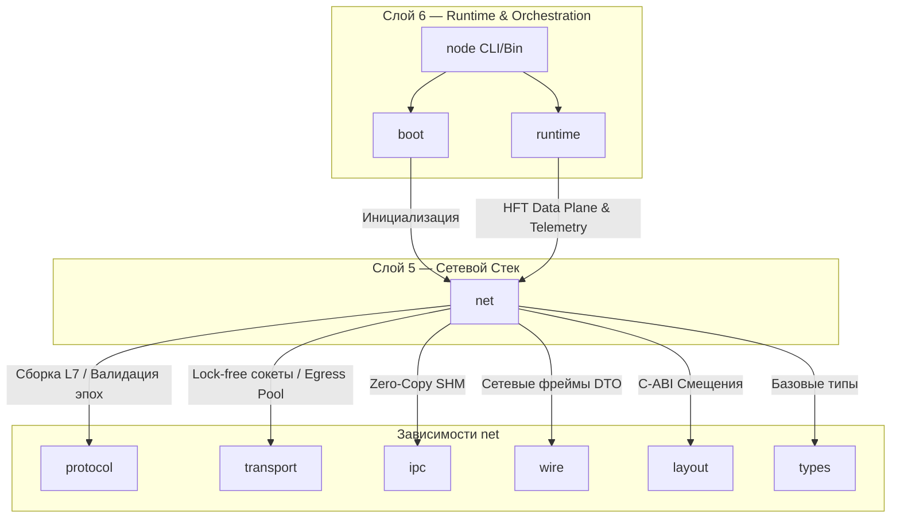

spec_net

> Версия спеки: 1.0  
> Дата: 2026-06-23  
> Статус: Verified  

---

## §1. Идентификация

| Поле | Значение |
|---|---|
| Название | `net` |
| Слой | Слой 5 — Сетевой Стек |
| Тип | Library (`lib`) |
| `no_std` | **Нет** (требует сетевого рантайма Tokio, веб-сервера Axum и системного ввода-вывода) |
| Описание | Высокоуровневый сетевой оркестратор ноды, управляющий таблицей маршрутизации (RCU), BSP-барьерами, сервером внешнего ввода-вывода (IO Server) и WebSocket-телеметрией. |

---

## §2. Стек и Окружение

### §2.1. Внутренние зависимости (inbound)

| Крейт | Что используется | Зачем |
|---|---|---|
| `types` | `Tick`, `PackedPosition` | Синхронизация времени и пространственные координаты. |
| `layout` | C-ABI константы | Расчет смещений при выгрузке телеметрии и моторных команд. |
| `wire` | `SpikeBatchHeaderV2`, `ExternalIoHeader`, `TelemetryFrameHeader`, `AxonHandoverEvent` | Форматирование пакетов перед передачей в транспортный слой. |
| `protocol` | `decode_spike_batch`, `ReassemblyBuffer`, `validate_epoch_math` | Использование stateless-парсера и сборщика L7-чанков для Data Plane. |
| `transport` | `EgressPool`, `WaitStrategy`, `RingBuffer`, сокеты | Инъекция готовых пакетов в lock-free очереди системного ввода-вывода. |
| `ipc` | `InputSwapchain`, `OutputSwapchain`, `ShmStateMachine` | Атомарный Zero-Copy обмен данными с GPU-оркестратором (Слой 6) и демоном. |

### §2.2. Внешние зависимости

| Crate | Версия | Зачем |
|---|---|---|
| `tokio` | `=1.50.0` | Асинхронный рантайм для серверов Control Plane, Slow Path (TCP) и WebSocket телеметрии. Не блокирует Data Plane. |
| `axum` | `=0.7.9` | Высокопроизводительный HTTP/WebSocket сервер для стриминга телеметрии в Axicor Lab. |
| `crossbeam` | `=0.8.4` | Lock-free очереди для передачи сообщений между асинхронными задачами `tokio` и синхронным HFT-циклом. |

### §2.3. Feature Flags

Секция не применима к данному крейту: Feature flags не используются.

---

## §3. Инварианты

Крейт `net` является высшим сетевым оркестратором (Слой 5) и обязан строго разделять асинхронный Control Plane и синхронный Data Plane.

### §3.1. Структурные инварианты

- **INV-NET-001**: *Изоляция RCU в Data Plane (Lock-Free Routing)*.
  - *Обоснование*: HFT-цикл (Data Plane) не имеет права блокироваться при маршрутизации каждого спайка. Чтение таблицы маршрутизации обязано происходить за $O(1)$ через `AtomicPtr::load(Ordering::Acquire)`. Модификация таблицы (добавление новых нод, миграции) выполняется исключительно фоновым `tokio`-потоком через создание копии и атомарную подмену указателя (паттерн Read-Copy-Update). Использование `RwLock` или `Mutex` в горячем пути строжайше запрещено.
  - *Следствие нарушения*: Захват мьютексов приведет к остановке конвейера вычислений при обновлении топологии, скачкам p99 латентности и срыву синхронизации всего кластера.
  - *Где проверяется*: Статический анализ кода (запрет импорта мьютексов в модуль маршрутизатора Data Plane), стресс-тесты параллельного чтения и записи.

- **INV-NET-002**: *Zero-Alloc Hot Path (Проброс транспортного инварианта)*.
  - *Обоснование*: Парсинг входящих UDP-пакетов, сборка фрагментов через `ReassemblyBuffer` и инъекция исходящих спайков в `EgressPool` не должны вызывать аллокатор кучи. Память выделяется один раз при старте.
  - *Следствие нарушения*: Фрагментация RAM, просадка TPS при интенсивном обмене спайками.
  - *Где проверяется*: Юнит-тесты HFT-цикла с кастомным трекером аллокаций.

### §3.2. Семантические инварианты

- **INV-NET-003**: *L1 Transpose Invariant (Кэш-оптимизированное транспонирование)*.
  - *Обоснование*: GPU-бэкенд выгружает моторные команды и сенсорную активность в формате Structure of Arrays (SoA): `[Tick 0: All Pixels], [Tick 1: All Pixels]`. Внешние Python-клиенты требуют формат Array of Structures (AoS): `[Pixel 0: All Ticks]`. Эта операция выполняется на CPU в крейте `net`. Алгорим транспонирования обязан выполняться блоками, умещающимися в L1-кэш процессора, чтобы избежать cache thrashing при работе с матрицами 1000x1000 пикселей.
  - *Следствие нарушения*: Падение пропускной способности памяти CPU в 10–20 раз при выгрузке телеметрии, блокировка HFT-цикла.
  - *Где проверяется*: Бенчмарки пропускной способности выгрузки I/O.

- **INV-NET-004**: *Детерминизм BSP-барьера (Causality Timeout)*.
  - *Обоснование*: Нода не может перейти к расчету следующей эпохи, пока не соберет пакеты спайков (или пустые ACK) от всех зарегистрированных соседей. Однако ожидание не может быть бесконечным. Строгий таймаут барьера (например, 500 мс) гарантирует, что при краше соседа нода не зависнет в Deadlock, а объявит соседа мертвым и инициирует протокол воскрешения (Resurrection).
  - *Следствие нарушения*: Каскадное зависание всего кластера (Distributed Deadlock) при падении одной ноды.
  - *Где проверяется*: Интеграционные тесты симуляции отказа соседа (Network Partition).

- **INV-NET-005**: *Slow/Fast Path Asymmetry (Изоляция TCP от UDP)*.
  - *Обоснование*: TCP-сервер обмена геометрией (`GeometryServer`) и WebSocket-сервер телеметрии (Control Plane) обязаны работать в выделенном пуле потоков `tokio`. Они не имеют права делить системный OS-поток с HFT-циклом UDP (Data Plane).
  - *Следствие нарушения*: Head-of-Line блокировка HFT-цикла из-за TCP-ретрансмиссий или медленного чтения со стороны Python-клиента.
  - *Где проверяется*: Интеграционные стресс-тесты I/O с искусственным сетевым лагом на TCP-клиенте.

### §3.3. Межкрейтовые инварианты

- **INV-CROSS-012**: *Исполнение вердиктов времени (Protocol Epoch Compliance)*.
  - *Участники*: `net`, `protocol`.
  - *Кто владелец проверки*: `net`.
  - *Обоснование*: Крейт `protocol` производит математическую оценку кольцевого времени эпох пакетов. Крейт `net` (маршрутизатор) обязан строго подчиняться этим вердиктам: при получении `EpochAction::AmnesiaDrop` пакет отбрасывается за $O(1)$ без обработки, а при `SelfHealingFastForward` нода обязана сбросить текущий стейт эпохи и догнать кластер.
  - *Следствие нарушения*: Внедрение устаревших спайков в текущий батч (нарушение биологической причинности), расхождение симуляции.
  - *Где проверяется*: Интеграционные тесты `test_amnesia_drop` и `test_self_healing_trigger`.

---

## §4. Публичный API

### §4.1. Типы

#### RoutingTable

```rust
/// RCU-маршрутизатор Data Plane. Lock-Free чтение за O(1).
pub struct RoutingTable {
    /// Атомарный указатель на иммутабельную хэш-таблицу маршрутов.
    /// Чтение использует Ordering::Acquire, запись (подмена) — Ordering::Release.
    routes: std::sync::atomic::AtomicPtr<std::collections::HashMap<u32, std::net::SocketAddr>>,
}
```

- **Семантика:** Высокоскоростной диспетчер адресов для HFT-цикла. Реализует паттерн Read-Copy-Update.
- **Жизненный цикл:** Инициализируется оркестратором при старте. Читается Data Plane потоком миллионы раз в секунду. Подменяется целиком фоновым `tokio`-потоком при миграциях.
- **Ограничения на значения:** Указатель никогда не может быть `null` после инициализации.

#### BspBarrier

```rust
/// Координатор биологического времени кластера.
pub struct BspBarrier {
    /// Текущая математически подтверждённая эпоха кластера
    pub global_epoch: std::sync::atomic::AtomicU32,
    /// Флаг аварийного сброса барьера при таймауте (Deadlock Protection)
    pub is_poisoned: std::sync::atomic::AtomicBool,
}
```

- **Семантика:** Механизм защиты причинности (Causality). Блокирует переход ноды на следующий тик, пока не получены спайки от всех зарегистрированных соседей.
- **Жизненный цикл:** Разделяется между HFT-циклом и фоновым демоном мониторинга сети.
- **Ограничения на значения:** `global_epoch` монотонно возрастает.

#### IoServer

```rust
/// Менеджер внешнего мира и гарант L1 Transpose Invariant.
pub struct IoServer {
    /// Карта маппинга UV-координат внешних матриц в плоские DenseIndex VRAM
    pub matrix_offsets: std::collections::HashMap<u32, usize>,
    /// Pre-allocated буфер для транспонирования AoS -> SoA (Input) и SoA -> AoS (Output)
    pub transpose_buffer: Vec<u8>,
}
```

- **Семантика:** Буферная зона между Python SDK и GPU. Выполняет кэш-оптимизированное перекладывание матриц.
- **Жизненный цикл:** Владеется оркестратором. `transpose_buffer` выделяется один раз при старте размером, достаточным для максимального I/O батча.
- **Ограничения на значения:** Динамические реаллокации `transpose_buffer` в процессе работы запрещены.

#### GeometryServer

```rust
/// Медленный TCP-путь для макро-геометрии (Control Plane).
pub struct GeometryServer {
    /// Асинхронный слушатель TCP-соединений от соседних нод
    pub listener: tokio::net::TcpListener,
}
```

- **Семантика:** Изолированный от UDP-пути сервер для обмена массивными пакетами `AxonHandoverEvent` и `AxonHandoverPrune` в Ночную Фазу.
- **Жизненный цикл:** Работает в асинхронном пуле `tokio`. Активен только во время обработки Night Phase.
- **Ограничения на значения:** Не имеет права использовать треды, привязанные к HFT-циклу.

#### TelemetryServer

```rust
/// Стример Warp-Aggregated метрик в IDE.
pub struct TelemetryServer {
    /// Канал передачи фреймов телеметрии клиентам
    pub broadcast_tx: tokio::sync::broadcast::Sender<wire::TelemetryFrameHeader>,
}
```

- **Семантика:** WebSocket-фасад на базе `axum`. Забирает сжатые маски спайка и стримит их в Axicor Lab.
- **Жизненный цикл:** Поднимается параллельно с нодой, живёт в `tokio` рантайме.
- **Ограничения на значения:** Если клиенты не успевают читать (Lagging Receiver), старые фреймы молча отбрасываются (Drop), не блокируя Data Plane.


### §4.2. Трейты

В данном крейте публичные полиморфные трейты **отсутствуют**. Крейт `net` является жёстким маршрутизатором пакетов и координатором состояний. Абстракции на этом уровне убивают инлайнинг и не несут архитектурной ценности для Слоя 6.

### §4.3. Функции

#### impl RoutingTable

```rust
impl RoutingTable {
    /// O(1) чтение IP-адреса целевого шарда без блокировок.
    pub fn get_address(&self, zone_hash: u32) -> Option<std::net::SocketAddr>;
    /// RCU-подмена таблицы маршрутов фоновым потоком.
    pub fn update_routes(&self, new_routes: std::collections::HashMap<u32, std::net::SocketAddr>);
}
```

- **Назначение:** Безопасный интерфейс к таблице маршрутизации.
- **Предусловия:** При вызове `get_address` HFT-цикл не должен владеть никакими ОС-мьютексами.
- **Постусловия:** `update_routes` атомарно освобождает старую память после успешного swap (или делегирует Drop эпохальному сборщику).
- **Сложность:** `get_address` — O(1) по времени (чтение атомика и хэшмапы), `update_routes` — O(N) по времени и памяти (аллокация новой мапы).
- **Паника:** Никогда.

#### impl BspBarrier

```rust
impl BspBarrier {
    /// Синхронизация текущей эпохи с проверкой таймаутов отстающих пиров.
    pub fn sync_and_swap(&self, current_epoch: u32) -> Result<u32, NetError>;
}
```

- **Назначение:** Барьерный переход (Tick Advancement) между эпохами симуляции.
- **Предусловия:** Вызывается в конце расчёта текущего батча.
- **Постусловия:** Возвращает `Ok(next_epoch)` или `Err(NetError::Timeout)`, если сосед мёртв.
- **Сложность:** O(P), где P — количество пиров (соседей).
- **Паника:** Никогда.

#### impl IoServer

```rust
impl IoServer {
    /// Выполняет L1-кэш оптимизированное транспонирование SoA -> AoS и отправку.
    pub fn send_output_batch(
        &mut self,
        soa_history: &[u8],
        batch_size: u32,
        pixels: u32,
    ) -> Result<(), NetError>;
}
```

- **Назначение:** Выгрузка моторных команд Python-клиентам.
- **Предусловия:** `soa_history` должен иметь размер строго `batch_size * pixels`.
- **Постусловия:** Матрица In-Place переупакована в `transpose_buffer` и отправлена в сеть.
- **Сложность:** O(N) по времени с учётом локальности кэша, O(1) динамических аллокаций.
- **Паника:** Если размер `soa_history` не совпадает с заявленными параметрами.

### §4.4. Константы и Магические Числа

| Константа | Значение | Тип | Семантика |
|-----------|----------|-----|-----------|
| `BSP_TIMEOUT_MS` | `500` | `u64` | Жёсткий лимит времени (в миллисекундах) ожидания пакетов или ACK от соседних шард-нод. Превышение означает смерть соседа (Deadlock Protection) и триггерит алгоритм Resurrection. |
| `IO_TRANSPOSE_BLOCK_SIZE` | `64` | `usize` | Размер блока (в байтах) для Tiled Transpose алгоритма выгрузки моторики. Гарантирует, что рабочий набор умещается в кэш-линию L1-кэша. |

---

## §5. Доменная Логика

Крейт `net` — это высокоуровневый сетевой оркестратор (Слой 5). Его доменная задача — связать примитивные lock-free очереди `transport` и stateless-математику `protocol` в надёжную распределённую систему, обеспечивающую маршрутизацию, каузальную синхронизацию и внешний ввод-вывод.

Выделение `net` в отдельный крейт изолирует логику управления кластером (Control Plane) от байтового парсинга и системных вызовов ОС. Это позволяет интегрировать асинхронный рантайм (`tokio`, `axum`) для обслуживания медленных клиентов без риска заблокировать синхронный HFT-цикл (Data Plane), оперирующий спайками.

Крейт реализует 4 независимых доменных механизма:

### §5.1. RCU Таблица Маршрутизации (Read-Copy-Update)

В распределённой среде адреса нод могут динамически меняться (например, при миграции или воскрешении шарда). Блокировка читающего потока на мьютексе при разрешении маршрута для каждого спайка катастрофически снизит TPS. `net` реализует маршрутизацию через паттерн RCU (`AtomicPtr` swap): HFT-цикл читает адреса за O(1) без блокировок, а фоновый асинхронный поток создаёт копию таблицы при получении пакета `RouteUpdate`, мутирует её и атомарно подменяет оригинал.

### §5.2. BSP-барьер (Bulk Synchronous Parallel)

Кластер обязан сохранять математический детерминизм. `net` координирует переход эпох симуляции через BSP-барьер. Нода не может начать расчёт следующего батча, пока не получит подтверждения (ACK) или спайки от всех ожидаемых соседей. Барьер включает жёсткий таймаут (500 мс), защищающий систему от зависания (Deadlock): если сосед не ответил, он объявляется мёртвым, и инициируется протокол восстановления (Resurrection).

### §5.3. IO Server и L1 Transpose Invariant

`net` принимает сенсорные матрицы от внешних скриптов (Python SDK) и выгружает моторные реакции (Output History). GPU отдаёт моторные спайки в формате Structure of Arrays (SoA): `[Tick 0: All Pixels]`, `[Tick 1: All Pixels]`. Внешние потребители ожидают естественный формат: `[Pixel 0: All Ticks]`, `[Pixel 1: All Ticks]`. `net` выполняет кэш-оптимизированное транспонирование матриц (L1 Transpose Invariant) на лету перед отправкой по UDP, снимая эту нагрузку с Python-клиентов и ядер GPU.

### §5.4. Slow Path и Телеметрия (Control Plane)

Дневной спайковый трафик использует исключительно UDP (Data Plane). Для критически важных, но редких операций (передача 3D-геометрии растущих аксонов `AxonHandover` в Ночную Фазу) `net` поднимает выделенный TCP-сервер `GeometryServer`. Параллельно запускается HTTP/WebSocket сервер для стриминга Warp-Aggregated телеметрии в IDE, полностью изолированный от симуляционных потоков.

---

## §6. Алгоритмы и Формулы

### §6.1. RCU-подмена маршрутов (Control Plane → Data Plane)

- **Вход**: `new_routes: HashMap<u32, SocketAddr>` (получено от асинхронного Control Plane).
- **Выход**: Атомарное обновление для горячего цикла Data Plane.
- **Детерминизм**: Да.

**Логика:** Вместо захвата мьютекса (даже `RwLock::read` слишком дорог для HFT-цикла), фоновый асинхронный поток `tokio` создаёт новую копию хэш-таблицы в куче, переводит её в сырой указатель и атомарно подменяет оригинал. Освобождение (Drop) старой памяти критически опасно: GPU-потоки могут читать её прямо в момент подмены. Поэтому используется паттерн EBR (Epoch-Based Reclamation) из `crossbeam` — старый указатель уходит в очередь отложенного удаления и очищается только тогда, когда все читающие потоки покинут критическую секцию.

```rust
fn update_routes(
    atomic_ptr: &AtomicPtr<HashMap<u32, std::net::SocketAddr>>,
    new_routes: HashMap<u32, std::net::SocketAddr>,
) {
    let new_ptr = Box::into_raw(Box::new(new_routes));
    let old_ptr = atomic_ptr.swap(new_ptr, std::sync::atomic::Ordering::Release);

    if !old_ptr.is_null() {
        // Гарантирует, что старая таблица не будет удалена, пока Data Plane её читает
        unsafe {
            crossbeam::epoch::pin().defer(move || {
                drop(Box::from_raw(old_ptr));
            });
        }
    }
}
```

### §6.2. L1 Transpose Invariant (SoA → AoS)

- **Вход**: `soa_buffer: &[u8]` размером `T×P`, `batch_size: u32` (T), `pixels: u32` (P).
- **Выход**: Транспонированная матрица `aos_buffer: &mut [u8]`.
- **Детерминизм**: Да.

**Логика:** Аппаратный кэш L1 (обычно 32 КБ) не выдержит наивного построчного чтения огромной SoA матрицы (например, 1000 тиков на 1000 пикселей), так как шаг выборки равен T. Это вызывает кэш-промахи (cache misses) на каждом байте. Алгоритм `send_output_batch` обязан использовать блочное транспонирование (Tiled Transpose) квадратами размера `IO_TRANSPOSE_BLOCK_SIZE`, чтобы максимизировать утилизацию загруженных 64-байтовых кэш-линий до того, как они будут вытеснены из L1.

```rust
fn tiled_transpose(soa: &[u8], aos: &mut [u8], t: usize, p: usize) {
    let block = 64; // IO_TRANSPOSE_BLOCK_SIZE
    for i in (0..t).step_by(block) {
        for j in (0..p).step_by(block) {
            // Внутренний цикл работает строго внутри L1 кэша
            for ii in i..std::cmp::min(i + block, t) {
                for jj in j..std::cmp::min(j + block, p) {
                    aos[jj * t + ii] = soa[ii * p + jj];
                }
            }
        }
    }
}
```


---

## §7. Структуры Данных и Memory Layout

Секция не применима к данному крейту: Крейт не описывает фиксированных макетов в памяти.

---

## §8. Граничные Случаи и Особые Сценарии

### §8.1. Граничные значения

| # | Ситуация | Ожидаемое поведение |
|---|----------|---------------------|
| E-122 | Таймаут соседа в BSP-барьере | Если пакеты спайков или пустой ACK не пришли за `BSP_TIMEOUT_MS` (500 мс), барьер прерывает ожидание, возвращает `NetError::Timeout` и инициирует протокол воскрешения (Resurrection) упавшей ноды. |
| E-123 | Несовпадение размерностей в L1 Transpose | Если размер `soa_history` не совпадает с заявленными параметрами `batch_size * pixels`, метод `send_output_batch` вызывает панику. Это жёсткая защита от Out-of-Bounds при перепаковке кэш-линий. |
| E-124 | Получение пакета из прошлого (Biological Amnesia) | Парсер `protocol` возвращает `EpochAction::AmnesiaDrop`. Маршрутизатор обязан строго подчиняться этому вердикту: происходит $O(1)$ Drop пакета, система не пытается интегрировать устаревшие спайки в текущий батч (защита каузальности). |
| E-125 | Получение пакета из будущего (Self-Healing) | Парсер `protocol` возвращает `EpochAction::SelfHealingFastForward`. Нода признаёт себя отставшей, сбрасывает текущий стейт эпохи и перематывает `global_epoch` вперёд для синхронизации с кластером. |
| E-126 | Клиент телеметрии не успевает читать WebSocket (Lagging Receiver) | Канал `broadcast_tx` в `TelemetryServer` переполняется. Старые фреймы аппаратно отбрасываются (Drop), чтобы ни в коем случае не заблокировать Data Plane. |

### §8.2. Состояния гонки и конкурентность

| # | Сценарий | Защита |
|---|----------|--------|
| R-039 | Обновление таблицы маршрутизации (Control Plane) во время чтения адреса (Data Plane) | Использование RCU с `AtomicPtr::swap`. Читатель использует `Ordering::Acquire` и работает со старой копией памяти. Сборщик мусора (EBR из `crossbeam::epoch`) удаляет старую таблицу только когда все читающие потоки покинут критическую секцию. |
| R-040 | Конкурентный приём I/O матриц от сенсоров во время расчёта батча | Атомарный Zero-Copy обмен данными через `InputSwapchain`. HFT-поток делает атомарный `swap` указателей строго между батчами (с барьером `Ordering::AcqRel`), исключая Data Race с внешним миром. |

### §8.3. Деградация и Recovery

| # | Отказ | Поведение | Восстановление |
|---|-------|-----------|----------------|
| D-033 | Обрыв TCP-соединения во время передачи макро-геометрии (Night Phase) | `GeometryServer` работает в выделенном асинхронном пуле `tokio`. Разрыв сокета и таймауты TCP не имеют права делить системный OS-поток с HFT-циклом UDP (Data Plane) и блокировать его. | Фоновый асинхронный поток ставит задачу на переподключение. Data Plane (UDP) продолжает обрабатывать спайки без остановок. |
| D-034 | Переполнение кольцевого буфера `ReassemblyBuffer` "висячими" сессиями | Функция вставки в `protocol` возвращает `ProtocolError::ReassemblyBufferFull`. | Оркестратор обязан инициировать $O(1)$ In-Place эвикцию самого старого `ReassemblySlot`, отбросив недособранный сетевой мусор без реаллокаций памяти. |

---

## §9. Ошибки

Крейт `net` агрегирует низкоуровневые сбои из `transport` и `protocol`, оборачивая их в доменные ошибки кластерной маршрутизации и координации времени.

### §9.1. Перечисление ошибок

```rust
#[derive(Debug, Clone, PartialEq, Eq)]
pub enum NetError {
    /// Сосед не ответил на синхронизацию эпохи в рамках `BSP_TIMEOUT_MS`
    Timeout { zone_hash: u32 },
    /// Попытка отправить пакет в зону, отсутствующую в RCU-таблице
    RouteNotFound { zone_hash: u32 },
    /// Ошибка на уровне UDP/TCP сокетов и lock-free очередей
    Transport(transport::TransportError),
    /// Ошибка парсинга байтов, L7-фрагментации или валидации эпох
    Protocol(protocol::ProtocolError),
}
```

### §9.2. Стратегия обработки

| Ошибка | Восстановимая? | Рекомендация вызывающему (Слой 6 — runtime) |
|--------|----------------|----------------------------------------------|
| `Timeout` | Да | Инициировать протокол воскрешения (Resurrection) для отставшей ноды. Принудительно продвинуть локальную эпоху вперёд. |
| `RouteNotFound` | Да | Молча отбросить исходящий батч спайков (O(1) Drop). Ожидать получения `RouteUpdate` от Control Plane. |
| `Transport` | Да | Транслировать стратегию из Слоя 5 (например, пропустить отправку при `QueueFull` или `SocketWouldBlock`). |
| `Protocol` | Да | Залогировать инцидент в телеметрию. Отбросить некорректный батч (Biological Amnesia или защита от мусора). |

### §9.3. Паники

| Условие | Почему паника, а не Err |
|---------|------------------------|
| `soa_history.len() != batch_size * pixels` в методе `send_output_batch` (E-123) | Нарушение контракта памяти между Слоем 6 (Runtime) и Слоем 5 (Net). Это не сетевая ошибка, а баг интеграции движка. Жёсткая защита от Out-of-Bounds при перепаковке кэш-линий L1. |
| Использование блокирующих примитивов (Mutex/RwLock) в методах Data Plane | Нарушение архитектурного инварианта (INV-NET-001). Маршрутизатор Data Plane обязан работать исключительно через RCU (`AtomicPtr`). Отлавливается статическим анализом или архитектурными ассертами. |

---

## §10. Зависимости и Интеграция

### §10.1. Что крейт потребляет (inbound)

Крейт `net` агрегирует нижележащие слои сетевого стека, протоколов, разделяемой памяти и базовых POD-типов для обеспечения сквозной оркестрации ноды.

| Крейт-источник | Что используем | Какой контракт ожидаем |
|---|---|---|
| `types` | `Tick`, `PackedPosition` | Времена и координаты представлены в C-ABI совместимых форматах и помещаются в регистры ([spec_types.md §4.1]). |
| `layout` | C-ABI смещения и константы | Статический расчет смещений и выравниваний для перепаковки L1-транспонированных буферов ([spec_layout.md §4.4]). |
| `wire` | `SpikeBatchHeaderV2`, `ExternalIoHeader`, `TelemetryFrameHeader`, `AxonHandoverEvent` | Готовые DTO-структуры для сериализации/десериализации сетевых фреймов ([spec_wire.md §4.1]). |
| `protocol` | `decode_spike_batch`, `ReassemblyBuffer`, `validate_epoch_math`, `EpochAction` | Stateless парсинг пакетов, сборка сетевых чанков и возврат вердиктов по рассинхронизации эпох ([spec_protocol.md §4.3]). |
| `transport` | `EgressPool`, `WaitStrategy`, `RingBuffer`, сокеты | Неблокирующий и zero-alloc транспортный слой (UDP/TCP) для горячего и холодного путей ([spec_transport.md §4.1]). |
| `ipc` | `InputSwapchain`, `OutputSwapchain`, `ShmStateMachine` | Атомарный Zero-Copy обмен данными с GPU-вычислениями и фоновым демоном ([spec_ipc.md §4.1]). |

### §10.2. Кто потребляет крейт (outbound / обратные зависимости)

Крейт `net` является вершиной сетевого стека (Слой 5) и напрямую потребляется оркестратором и рантаймом движка.

| Крейт-потребитель | Что использует | Какой контракт мы обязаны сохранить |
|---|---|---|
| `boot` | Инициализацию `RoutingTable` и `BspBarrier` | Возможность детерминированной подготовки барьеров и статической конфигурации сетей перед пуском HFT-цикла. |
| `runtime` | Маршрутизацию спайков, синхронизацию эпох (`BspBarrier`), перепаковку `IoServer` | Гарантия lock-free Data Plane: `get_address` за $O(1)$, zero heap allocs в горячих методах. Изоляция TCP от горячего UDP ([spec_net.md §3]). |
| `node` | Конфигурацию портов и запуск серверов телеметрии/геометрии | Корректный старт серверов (`axum`/`tokio`) в фоновом асинхронном пуле потоков без блокировки Data Plane ([spec_net.md §4.1]). |

### §10.3. Диаграмма взаимодействия

### §7. Зависимости

Взаимодействие компонентов Слоя 5 с внешними слоями и зависимостями:



---

## §11. Стратегия Тестирования

### §11.1. Юнит-тесты

| Тест | Что проверяет | Связанный инвариант / Граничный случай |
|---|---|---|
| test_rcu_routing_o1_read | Метод `RoutingTable::get_address` извлекает адрес через атомарный `load` без захвата блокировок ОС. | INV-NET-001 |
| test_zero_alloc_hot_path | Проверка HFT-цикла с кастомным трекером аллокаций на отсутствие динамических выделений памяти в куче. | INV-NET-002 |
| test_bsp_barrier_timeout | Если подтверждения от соседей не приходят за `BSP_TIMEOUT_MS`, метод `sync_and_swap` возвращает `NetError::Timeout`. | INV-NET-004, E-122 |
| test_l1_transpose_math | Функция `send_output_batch` корректно перепаковывает SoA в AoS. Проверяется In-Place логика и соответствие размеров. | INV-NET-003 |
| test_l1_transpose_out_of_bounds | Передача `soa_history` некорректного размера в `send_output_batch` немедленно вызывает панику (защита памяти). | E-123 |
| test_epoch_amnesia_drop | Вызов `validate_epoch` с устаревшим `packet_epoch` возвращает `EpochAction::AmnesiaDrop`. | INV-CROSS-012, E-124 |
| test_epoch_self_healing | Вызов `validate_epoch` с эпохой из далекого будущего возвращает `EpochAction::SelfHealingFastForward`. | INV-CROSS-012, E-125 |
| test_telemetry_lagging_receiver | Эмуляция медленного клиента `axum`. Канал `broadcast_tx` переполняется, старые фреймы молча отбрасываются (Drop), Data Plane не блокируется. | E-126 |
| test_sensor_io_swapchain | Параллельный приём сенсорных кадров во время вычислений с атомарным swap. | R-040 |
| test_reassembly_buffer_eviction | Проверка эвикции старых сессий без аллокаций при переполнении буфера сборщика чанков. | D-034 |

### §11.2. Property-based тесты

| Свойство | Генератор | Связанный инвариант |
|---|---|---|
| RCU Pointer Integrity (EBR Safety) | Множественные потоки читают `RoutingTable` в бесконечном цикле (Data Plane), пока один поток (Control Plane) непрерывно делает `update_routes`. Проверяется отсутствие Segfault / Use-After-Free и утечек памяти. Сборщик `crossbeam::epoch` должен удалять старые мапы только после выхода всех читателей. | INV-NET-001, R-039 |

### §11.3. Интеграционные тесты

| Тест | Крейты-участники | Сценарий | Связанный инвариант / Граничный случай |
|---|---|---|---|
| test_control_data_plane_isolation | net, transport | Запуск HFT-молотилки UDP и медленного `GeometryServer` TCP. Искусственный шторм мусорных TCP-подключений и `EAGAIN` не должен вызывать ни микросекунды задержки или потери TPS в параллельном UDP-цикле. | INV-NET-005, D-033 |
| test_distributed_deadlock_prevention | net | Эмуляция кластера из 3 нод. Одна нода "умирает" (перестает слать ACK). Две другие ноды обязаны упереться в `BSP_TIMEOUT_MS`, выбросить ошибку и разорвать барьер, не зависнув в Deadlock. | INV-NET-004 |

### §11.4. Тесты производительности

| Бенчмарк | Метрика | Порог |
|---|---|---|
| bench_rcu_route_lookup | Latency p99 атомарного чтения маршрута | < 2 ns (сопоставимо с доступом к L1 кэшу) |
| bench_l1_transpose_efficiency | Пропускная способность (GB/s) конвертации SoA -> AoS матрицы 1000x1000 | Должна превосходить наивный двойной цикл (без Tiled Transpose) минимум в 3-5 раз за счет утилизации кэш-линий. |

---

## §12. Бюджеты и Ограничения

### §12.1. Память

| Ресурс | Бюджет | Как считается |
|---|---|---|
| Аллокации Data Plane (HFT-цикл) | 0 байт | Горячий путь UDP-маршрутизации и парсинга работает исключительно in-place (INV-NET-002). |
| Буфер L1 Transpose (`IoServer`) | < 10 MB | Выделяется один раз при старте. Размер равен `max_pixels * sync_batch_ticks` байт. |
| RCU Аллокации (Control Plane) | O(N) | При `RouteUpdate` фоновый `tokio`-поток выделяет новую `HashMap` в куче. Очистка старой таблицы делегируется EBR. |

### §12.2. Латентность

| Операция | Бюджет (p99) | Условия |
|---|---|---|
| RCU `RoutingTable::get_address` | < 2 ns | Одно чтение атомика (Acquire) + хэшмапа в L1/L2 кэше. |
| Оценка эпохи `validate_epoch` | < 1 ns | Исключительно регистровая wrap-around арифметика. |
| Проверка барьера `BspBarrier::sync` | < 5 ns | Атомарные счетчики без захвата мьютексов. |

### §12.3. Compile-time

| Ограничение | Значение |
|---|---|
| Время сборки крейта | < 5s (release) |

---

Checklist Полноты (A.3)

- ✅ Все публичные типы описаны в §4
- ✅ Все инварианты из §3 имеют соответствующий пункт в §11 (тесты)
- ✅ Все `Err`-варианты перечислены в §9 (`Timeout`, `RouteNotFound`, `Transport`, `Protocol`)
- ✅ Все крейты-потребители перечислены в §10.2
- ✅ Нет ни одного «магического числа» без объяснения
- ✅ Все формулы имеют единицы измерения
- ✅ Граничные случаи из §8 покрыты тестами в §11
