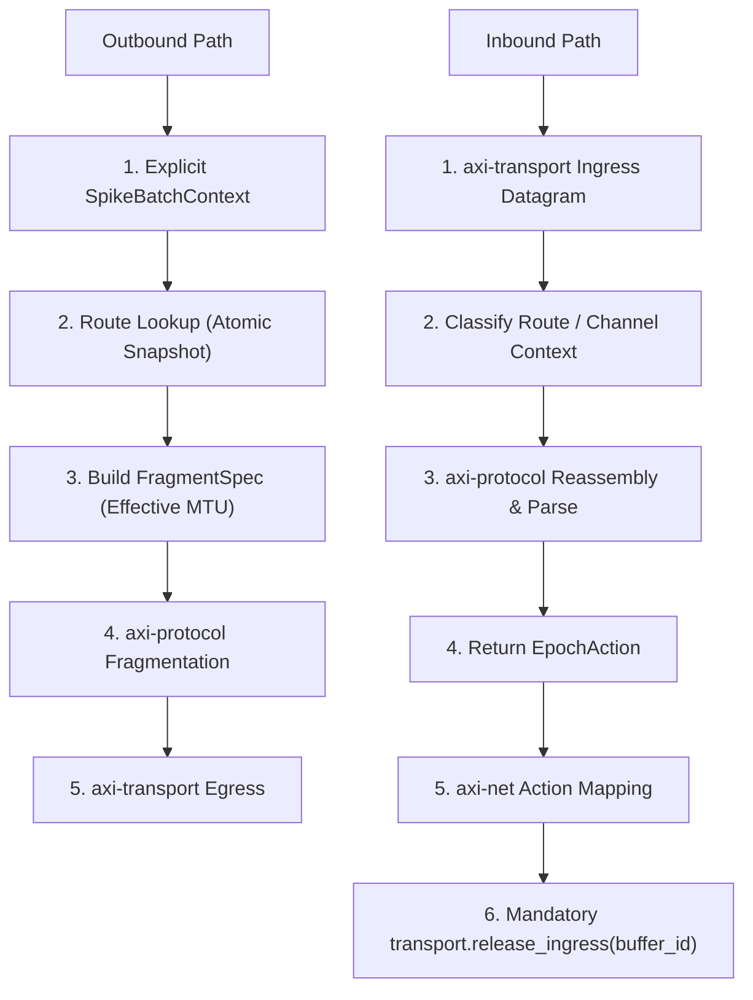

# spec_net

> Версия спеки: 2.0  
> Дата: 2026-06-29  
> Статус: Draft (Architecture Pass 1)

---

## §1. Идентификация

| Поле | Значение |
|---|---|
| **Имя крейта** | `axi-net` |
| **Слой** | Слой 5 — Network Stack (`L5` / Network Orchestration) |
| **Тип** | Library (`lib`) |
| **no_std** | Нет (`false`) — требуется доступ к системным потокам, каналу управления, асинхронному рантайму и аллокациям кучи |
| **Описание** | Сетевой оркестратор уровня L5 для кластерной синхронизации и маршрутизации пакетов AxiEngine. Крейт соединяет нижнеуровневый физический транспорт (`axi-transport`) и L7-семантику пакетов (`axi-protocol`) с высшими слоями системы. Крейт отвечает за неблокирующее разрешение и атомарную подмену таблицы маршрутизации (`RouteTable`), владение буферами сборки `ReassemblyPool`, координацию биологических эпох и BSP-барьеров, политики бэкпрешера, сервисный интерфейс внешнего ввода-вывода (External IO), стриминг телеметрии, а также оркестрацию служебных процессов передачи структурных связей (Slow-Path Handover). Крейт не выполняет сокетных вызовов физического уровня I/O, не парсит L7-структуру пакетов, не выполняет фрагментацию/сборку чанков и не модифицирует память вычислений или SHM напрямую. |

---

## §2. Стек и Окружение

### §2.1. Внутренние зависимости (inbound)

| Крейт | Что используется | Зачем |
|---|---|---|
| `axi-types` (Слой 0) | `Tick`, атомарные идентификаторы нод/зон | Монотонные временные отсечки и целочисленные идентификаторы компонентов кластера. |
| `axi-wire` (Слой 1) | `SpikeBatchHeaderV2`, `SpikeEventV2`, `ExternalIoHeader`, `RouteUpdate`, `ControlPacket`, `TelemetryFrameHeader`, `AxonHandoverEvent` / `Ack` / `Prune` | DTO-структуры заголовков и событий (крейт `axi-net` не объявляет бинарные макеты заново). |
| `axi-protocol` (Слой 5) | `PacketKind`, `FragmentSpec`, `ReassemblyBuffer`, `OutgoingSpikeFragment`, `ParsedSpikeFragment`, `EpochAction`, `ProtocolError` | Делегация нарезки/сборки L7-чанков, классификация пакетов и получение типизированного вердикта времени. |
| `axi-transport` (Слой 5) | `TransportHandle` API, `TransportEvent`, `EgressDatagram`, `IngressDatagram`, `EgressStreamChunk`, `IngressStreamChunk`, `ConnectionId`, `BufferId`, `TransportError`, `TransportStats` | Отправка сырых датограмм и стримовых чанков в физическую сеть, прием входящих данных, освобождение буферов и мониторинг событий сокетов. |
| `axi-ipc` (Слой 2) | `InputSwapchain`, `OutputSwapchain`, `ShmStateMachine` | Граница обмена данными с GPU-оркестратором и демоном (используется строго как границы обмена, без владения памятью SHM). |
| `axi-layout` (Слой 1) | Разности размеров и константы измерений SoA-плоскостей | Использование готовых размерностей при L1-транспонировании и валидации внешнего ввода-вывода (дублирование смещений запрещено). |

### §2.2. Зависимые Компоненты (outbound consumers)

| Крейт / Компонент | Роль в системе и взаимодействие |
|---|---|
| `runtime` / Node Orchestrator (Слой 6) | Инициализирует `axi-net`, обрабатывает события координации нод и запускает передачу внешних данных. |
| `test-harness` (Слой 3) | Использует `axi-net` в интеграционных тестах кластерного взаимодействия и сетевых барьеров. |

### §2.3. Внешние Зависимости

| Crate | Версия | Сфера использования |
|---|---|---|
| `tokio` | `=1.50.0` | Асинхронный рантайм строго для служебных задач управления HTTP/WebSocket телеметрии и вспомогательных сервисов (не используется для Data Plane и не владеет сокетами спайкового трафика). |
| `axum` | `=0.7.9` | HTTP/WebSocket сервер для выгрузки телеметрии и интерфейса управления. |
| `crossbeam` | `=0.8.4` | Ограниченные каналы для связи асинхронных задач с неблокирующим Data Plane. |
| `thiserror` | `=1.0.69` | Строгая типизация сетевых ошибок оркестрации (`NetError`). |
| `tracing` | `=0.1.40` | Логирование сетевых событий, таймаутов соседей и изменений маршрутизации. |
| `serde` | `=1.0.228` | Сериализация структур телеметрии и конфигураций управления. |
| `serde_json` | `=1.0.117` | Форматирование JSON-сообщений для WebSocket и контрольных интерфейсов. |

> [!IMPORTANT]
> Настоящая спецификация категорически запрещает прямые зависимости от вычислительных бэкендов (`compute-api`, `compute`, `compute-cuda`, `compute-hip`), компиляторов (`baker`), контейнеров (`vfs`) и геометрии (`topology`). Прямое открытие сокетов для спайкового трафика в обход `axi-transport`, сырая мутация памяти SHM и дублирование L7-логики фрагментации категорически запрещены. Использование `anyhow` в публичном API библиотеки запрещено.

### §2.4. Feature Flags

Секция публичных feature flags не используется. Крейт собирается монолитно.

---

## §3. Ownership Boundaries (Границы Владения)

| Модуль / Крейт | Монопольная Зона Владения (Single Source of Truth) | Строгие Запреты (Что категорически запрещено в крейте) |
|---|---|---|
| **`axi-net`** (Слой 5) | **Оркестрация Сети и Кластера**: Конфигурация `NetConfig`, управление рантаймом `NetRuntime`, таблицы маршрутизации `RouteTable` и снимки `RouteTableSnapshot`, владение буферами сборки `ReassemblyPool` и состоянием сборки `RouteReassemblyState`, реестр соседей `NeighborRegistry` и их статусы (`NeighborStatus`), координация эпох и BSP-барьеров (`EpochCoordinator`), реакция на вердикт `EpochAction`, политики бэкпрешера (`BackpressurePolicy`), статистика `NetStats`, границы внешнего ввода-вывода (External IO) и оркестрация передачи структурных связей (Slow-Path Handover). | Запрещены открытие и системные вызовы сокетов физической сети (владелец `axi-transport`), определение C-ABI DTO и magic-констант (владелец `axi-wire`), алгоритмы L7-фрагментации и сборки чанков (владелец `axi-protocol`), выделение и жизненный цикл SHM (владелец `axi-ipc`), исполнение шагов вычислений (владелец `runtime`/`compute`), 3D-алгоритмы роста (владелец `topology`) и дисковые файлы (владелец `vfs`). |
| **`axi-transport`** (Слой 5) | **Системный I/O и Сокеты**: Неблокирующая отправка/прием датограмм и стримов, пулы буферов и события сокетов. | Запрещен анализ биологической семантики и оркестрация маршрутов кластера. |
| **`axi-protocol`** (Слой 5) | **L7 Семантика и Фрагментация**: Нарезка спайков на чанки, сборка датограмм, проверка валидности эпох и L7 ACK/Heartbeat. | Запрещена оркестрация барьеров BSP и управление таблицами маршрутизации. |
| **`axi-wire`** (Слой 1) | **Бинарные Контракты**: C-ABI макеты пакетов, magic-константы и выравнивание полей. | Запрещено хранение состояния маршрутов и отслеживание статусов соседей. |

---

## §4. Публичная API-Модель (Public API Model)

Публичный интерфейс крейта предоставляет высокоуровневые управляющие типы и методы для оркестрации сетевого стека:

```rust
pub struct NetConfig {
    pub node_id: u32,
    pub zone_hash: u32,
    pub bsp_timeout_ms: u64,
    pub future_epoch_capacity: usize,
    pub max_reassembly_fragments: usize,
    pub max_reassembly_payload_bytes: usize,
    pub backpressure_policy: BackpressurePolicy,
    pub telemetry_buffer_capacity: usize,
}

#[derive(Debug, Clone, Copy, PartialEq, Eq)]
pub enum BackpressurePolicy {
    DropSpike,
    BufferOrError,
}

#[derive(Debug, Clone, Copy, PartialEq, Eq)]
pub enum NeighborStatus {
    Alive,
    Suspect,
    Dead,
    Resurrecting,
}

#[derive(Debug, Clone, PartialEq, Eq)]
pub enum TransportTarget {
    Datagram(SocketAddr),
    Stream(ConnectionId),
}

pub struct RouteProfile {
    pub destination_zone: u32,
    pub target: TransportTarget,
    pub priority: u8,
    pub max_packet_bytes: usize,
    pub backpressure: BackpressurePolicy,
}

#[derive(Debug, Clone, PartialEq, Eq)]
pub enum RouteUpdateOp {
    Upsert(RouteProfile),
    Remove { destination_zone: u32 },
    ReplaceSnapshot(Vec<RouteProfile>),
}

pub struct RouteTableSnapshot {
    pub snapshot_version: u64,
    // Неизменяемый снимок таблицы маршрутизации для неблокирующего чтения
}

pub struct RouteTable {
    // Управление атомарной подменой снимков (Read-Copy-Update)
}

pub struct SpikeBatchContext {
    pub src_zone: u32,
    pub dst_zone: u32,
    pub epoch: u32,
}

pub struct NeighborState {
    pub neighbor_id: u32,
    pub status: NeighborStatus,
    pub last_seen_epoch: u32,
    pub pending_acks: u16,
}

#[derive(Debug, Clone)]
pub enum NetEvent {
    RouteMiss { destination_zone: u32 },
    RouteUpdated { snapshot_version: u64, total_routes: usize },
    NeighborStatusChanged { neighbor_id: u32, new_status: NeighborStatus },
    NeighborTimeout { neighbor_id: u32, epoch: u32 },
    FastForwardRequested { target_epoch: u32 },
    ProtocolError { error: ProtocolError },
    HandoverCompleted { session_id: u64 },
}

#[derive(Debug, Default, Clone)]
pub struct NetStats {
    pub route_lookup_misses: u64,
    pub packets_accepted: u64,
    pub packets_dropped_past: u64,
    pub packets_held_future: u64,
    pub fast_forward_events: u64,
    pub bsp_timeouts: u64,
    pub telemetry_drops: u64,
    pub backpressure_drops: u64,
    pub protocol_errors: u64,
    pub transport_errors: u64,
    pub queue_full_events: u64,
    pub connection_closed_events: u64,
    pub future_epoch_overflows: u64,
    pub route_updates: u64,
    pub handover_timeouts: u64,
    pub reassembly_overflows: u64,
}

#[derive(Debug, thiserror::Error)]
pub enum NetError {
    #[error("Route to zone {destination_zone} not found")]
    RouteNotFound { destination_zone: u32 },

    #[error("Transport layer failure: {0}")]
    Transport(#[from] TransportError),

    #[error("Protocol processing failure: {0}")]
    Protocol(#[from] ProtocolError),

    #[error("Future epoch buffer overflow")]
    FutureEpochOverflow,

    #[error("Reassembly buffer capacity exceeded for route")]
    ReassemblyCapacityExceeded,

    #[error("External IO dimension validation failed: {0}")]
    ExternalIoValidationFailed(&'static str),

    #[error("Orchestrator operation failed: {0}")]
    Internal(&'static str),
}

pub struct NetRuntime;

impl NetRuntime {
    pub fn new(
        config: NetConfig,
        transport: TransportHandle,
        ipc_handles: (InputSwapchain, OutputSwapchain),
    ) -> Result<Self, NetError>;

    pub fn apply_route_update(&self, op: RouteUpdateOp) -> Result<(), NetError>;
    pub fn send_spike_batch(&self, ctx: SpikeBatchContext, events: &[SpikeEventV2]) -> Result<(), NetError>;
    pub fn poll_transport_events(&self) -> usize;
    pub fn handle_ingress_datagram(&self, datagram: IngressDatagram) -> Result<(), NetError>;
    pub fn tick_epoch(&self, current_epoch: u32) -> Result<(), NetError>;
    pub fn snapshot_stats(&self) -> NetStats;
}
```

---

## §5. Доменные Механизмы и Конвейеры (Domain Mechanisms & Pipelines)



### §5.1. Неблокирующая Таблица Маршрутизации и Паттерн RCU
1. **Неблокирующее Чтение**: Поток горячего пути чтения маршрутов (Data Plane) запрашивает текущий неизменяемый снимок `RouteTableSnapshot` за $O(1)$ без захвата мьютексов. Снимок имеет монотонную версию `snapshot_version`.
2. **Атомарные Операции Обновления (RouteUpdateOp)**: При вызове `apply_route_update` операция `Upsert` добавляет/обновляет профиль, `Remove` удаляет маршрут (гарантируя отсутствие устаревших записей), а `ReplaceSnapshot` полностью подменяет таблицу. Создается новый снимок `RouteTableSnapshot` с инкрементированной версией и атомарно подменяется указатель оригинала. Инкрементируется счетчик `route_updates`.
3. **Отсутствие Маршрута**: При отсутствии маршрута метод возвращает `NetError::RouteNotFound`, инкрементирует счетчик `route_lookup_misses` и генерирует событие `NetEvent::RouteMiss`. Неявный проброс к дефолтному маршруту категорически запрещен.
4. **Эффективный Размер Пакета**: Физический размер кадра рассчитывается как минимум из конфигурации маршрута и возможностей транспорта:
   $$\text{effective\_max\_packet\_bytes} = \min(\text{route\_profile.max\_packet\_bytes}, \text{transport\_reported\_limit})$$

### §5.2. Интеграция с Протоколом и Владение Памятью Сборки (Reassembly Storage & Release)
- **Владение Хранилищем Сборки (`ReassemblyPool`)**: Крейт `axi-net` монопольно владеет пулом буферов сборки `ReassemblyPool` и состоянием `RouteReassemblyState`. Ключ сборки определяется триплетом `(src_zone_hash, dst_zone_hash, epoch)`. Размеры буферов зафиксированы в `NetConfig` (`max_reassembly_fragments`, `max_reassembly_payload_bytes`). При превышении лимитов возвращается `NetError::ReassemblyCapacityExceeded`, инкрементируется счетчик `reassembly_overflows`, а состояние сборки очищается.
- **Исходящий Конвейер (Outbound)**:
  1. `axi-net` принимает явный контекст `SpikeBatchContext` (`src_zone`, `dst_zone`, `epoch`) и полезную нагрузку.
  2. Выполняет неблокирующий поиск профиля `RouteProfile`.
  3. Формирует структуру `FragmentSpec`, устанавливая `max_packet_bytes = effective_max_packet_bytes`.
  4. Вызывает функции фрагментации библиотеки `axi-protocol`.
  5. Передает сгенерированные датограммы (`EgressDatagram`) или стримовые чанки (`EgressStreamChunk`) в `axi-transport`.
- **Входящий Конвейер и Обязательное Освобождение Слотов (Inbound Workflow & Ingress Release Rule)**:
  1. `axi-transport` передает полученную датограмму `IngressDatagram`.
  2. `axi-net` определяет контекст канала и маршрута.
  3. Передает байты в парсер/сборщик `axi-protocol` с использованием собственного хранилища из `ReassemblyPool`.
  4. Получает разобранную полезную нагрузку и вердикт `EpochAction`.
  5. Применяет правила оркестрации согласно вердикту.
  6. **Обязательный шаг освобождения**: На **всех** ветках выполнения (включая успешную доставку `Accept`, отброс `DropPast`, удержание `HoldFuture`, возникновение ошибок `ProtocolError`, `RouteMiss` или переполнение буферов) `axi-net` **обязан безусловно вызывать** `transport.release_ingress(datagram.buffer_id)` для возврата слота в физический транспортный пул.

### §5.3. Отображение Вердиктов Времени (EpochAction Mapping)
- **`EpochAction::Accept`**: Полезная нагрузка передается на физическую границу исполнения (в `InputSwapchain` или IPC-очередь рантайма). Инкрементируется `packets_accepted`.
- **`EpochAction::DropPast`**: Пакет отбрасывается, инкрементируется счетчик `packets_dropped_past`, логируется событие уровня `trace`.
- **`EpochAction::HoldFuture`**: Пакет сохраняется в ограниченный буфер будущих эпох до наступления соответствующего шага. Инкрементируется `packets_held_future`. При переполнении буфера применяется `BackpressurePolicy::DropSpike` (с инкрементом `future_epoch_overflows` и `backpressure_drops`).
- **`EpochAction::FastForwardRequired { target_epoch }`**: Генерируется управляющее событие `NetEvent::FastForwardRequested` и инкрементируется `fast_forward_events`. Крейт `axi-net` **не мутирует** состояние вычислений напрямую.
- **Ошибки Парсинга**: При возврате ошибки из `axi-protocol` пакет отвергается, инкрементируется счетчик `protocol_errors` и генерируется `NetEvent::ProtocolError`.

### §5.4. Координация Эпох и BSP-Барьер (BSP / Epoch Coordination)
1. **Список Ожидаемых Соседей**: На каждом шаге эпохи `EpochCoordinator` отслеживает получение спайковых батчей или ACK-пакетов от всех соседей со статусом `Alive`.
2. **Обработка Таймаутов**: Если в течение `bsp_timeout_ms` ответ от соседа не получен, статус соседа переводится в `Suspect` или `Dead`, инкрементируется счетчик `bsp_timeouts` и эмитируется событие `NetEvent::NeighborTimeout`.
3. **Воскрешение Соседей**: Восстановление статуса соседа (`Resurrecting` $\to$ `Alive`) осуществляется строго по событию после прохождения управляющей проверки.

### §5.5. Интеграция с Транспортом и Запрет Блокирующего Бэкпрешера (Transport & Non-Blocking Backpressure)
1. **Разделение Разъемов**: UDP-датограммы отправляются через `EgressDatagram` (целевой адрес `SocketAddr`). TCP-стримы служебного канала отправляются через `EgressStreamChunk` (целевой `ConnectionId`).
2. **Исключение Блокирующего Бэкпрешера в Data Plane**: Для спайкового трафика Data Plane блокирующий режим категорически запрещен. Переполнение очередей обрабатывается строго через неблокирующие политики `DropSpike` или `BufferOrError` (с инкрементом `queue_full_events` и `backpressure_drops`).
3. **Асинхронные События**: Крейт `axi-net` опрашивает очередь `TransportEvent` и транслирует события `ConnectionClosed` (с инкрементом `connection_closed_events`) или `WorkerError` (с инкрементом `transport_errors`) в статус соседей или системные метрики.

### §5.6. Внешний Ввод-Вывод (External IO Boundary)
1. **Проверка Размерностей**: Входные матричные данные валидируются по формату заголовка `ExternalIoHeader` и константам из `axi-layout`/`axi-wire`. При несоответствии возвращается `NetError::ExternalIoValidationFailed`.
2. **Запись через Границу**: Запись входных данных выполняется строго через `InputSwapchain`, исключая прямую запись в память вычислений.
3. **L1-Транспонирование (AoS $\leftrightarrow$ SoA)**: При выгрузке данных в формат клиентов AoS из SoA транспонирование матриц выполняется целочисленными алгоритмами блоками, помещающимися в L1-кеш процессора.

### §5.7. Стриминг Телеметрии (Control Plane)
Сервер телеметрии на базе `axum` (HTTP/WebSocket) работает в отдельном пуле асинхронных задач `tokio`. Сериализация кадров `TelemetryFrameHeader` выполняется в JSON или бинарный формат. Буферы телеметрии имеют ограниченную емкость (`telemetry_buffer_capacity`). При переполнении телеметрические кадры отбрасываются с инкрементом счетчика `telemetry_drops`. Телеметрия категорически не имеет права блокировать спайковый Data Plane.

### §5.8. Оркестрация Передачи Структурных Связей (Slow-Path Handover)
Передача сообщений динамического роста (`AxonHandoverEvent` / `Ack` / `Prune`) осуществляется строго через примитивы `axi-transport` (`EgressStreamChunk` или `EgressDatagram`), а не через прямые сокеты из `axi-net`. Крейт `axi-net` ведет учет сессий переходов, обрабатывает таймауты (инкрементируя `handover_timeouts`) и генерирует `NetEvent::HandoverCompleted`. Очереди сообщений slow-path полностью изолированы от очередей спайков.

---

## §6. Точечные Телеметрические Снимки Статистики (Stats Snapshots)

1. **Точечные Read-Only Снимки**: Метод `snapshot_stats() -> NetStats` возвращает точечный read-only телеметрический снимок текущих статистических показателей.
2. **Волатильность Метрик**: Счетчики статистики представляют собой волатильную телеметрию и не влияют на детерминированный математический результат симуляции.

---

## §7. Требуемые Инварианты

- **INV-NET-001**: Поток чтения маршрутов запрашивает ровно один атомарный неизменяемый снимок `RouteTableSnapshot` за $O(1)$ без блокировок.
- **INV-NET-002**: Крейт `axi-net` категорически не владеет бинарным макетом C-структур пакетов (используются DTO из `axi-wire`).
- **INV-NET-003**: Крейт `axi-net` не выполняет прямых системных сокетных вызовов физической сети для спайкового трафика.
- **INV-NET-004**: Крейт `axi-net` никогда не модифицирует память вычислений или сегменты SHM напрямую.
- **INV-NET-005**: Переполнение очередей телеметрии или каналов управления категорически не может заблокировать спайковый Data Plane.
- **INV-NET-006**: Задержки и повторы на служебных каналах Slow-Path Handover не могут заблокировать спайковый Data Plane.
- **INV-NET-007**: Операция обновления таблицы маршрутизации является атомарной с точки зрения читающих потоков.
- **INV-NET-008**: Отсутствие маршрута в таблице всегда фиксируется в виде ошибки `RouteNotFound`, счетчика `route_lookup_misses` и события `RouteMiss`.
- **INV-NET-009**: Буфер будущего времени ограничен по объему; обработка переполнения подчиняется выверенной политике `BackpressurePolicy`.
- **INV-NET-010**: Любые изменения статуса жизнеспособности соседей (`NeighborStatus`) сопровождаются эмиссией события `NetEvent`.
- **INV-NET-011**: Все отбросы пакетов фиксируются в соответствующих счетчиках статистики с указанием причины.
- **INV-NET-012**: Крейт `axi-net` гарантирует безусловный вызов `transport.release_ingress(datagram.buffer_id)` после завершения обработки входящей датограммы на абсолютно всех ветках исполнения (включая ошибки и отбросы).
- **INV-NET-013**: Горячий путь спайкового трафика Data Plane никогда не использует блокирующие политики бэкпрешера.

---

## §8. Golden Tests / Обязательная Матрица Тестирования

Крейт `axi-net` обязан быть покрыт набором автоматических тестов:

1. **Атомарный Своп Снимка Маршрутов (`test_route_snapshot_atomic_swap`)**: Читатели никогда не видят частичного состояния таблицы маршрутизации.
2. **Удаление Маршрута и Атомарный Инкремент Версии (`test_route_removal_and_atomic_generation_swap`)**: Проверка полного удаления маршрута при `RouteUpdateOp::Remove` с инкрементом `snapshot_version`.
3. **Отсутствие Маршрута (`test_missing_route_returns_error_and_emits_event`)**: Возврат `RouteNotFound` и генерация события `RouteMiss` при отсутствии записи.
4. **Явный Контекст Эпохи при Отправке (`test_send_spike_batch_uses_explicit_epoch_context`)**: Верификация формирования пакета строго с использованием `SpikeBatchContext`.
5. **Делегация Фрагментации в Protocol (`test_outbound_spike_batch_uses_protocol_fragmentation`)**: Верификация вызова функций `axi-protocol` вместо локальной нарезки байтов.
6. **Применение Вердиктов EpochAction (`test_inbound_packet_applies_epoch_action`)**: Корректное выполнение всех вариантов вердикта (`Accept`, `DropPast`, `HoldFuture`, `FastForwardRequired`).
7. **Безусловное Освобождение Входящих Буферов (`test_ingress_buffer_released_on_accept_drop_and_protocol_error`)**: Верификация обязательного вызова `release_ingress` при `Accept`, `DropPast` и `ProtocolError`.
8. **Освобождение Буфера Будущего Времени (`test_hold_future_buffer_releases_on_epoch_tick`)**: Передача отложенных пакетов при наступлении соответствующей эпохи.
9. **Контроль Переполнения Буфера Будущего Времени (`test_hold_future_buffer_overflow_policy`)**: Соблюдение политики бэкпрешера при превышении емкости.
10. **Контроль Емкости Буферов Сборки (`test_reassembly_capacity_exceeded_clears_state`)**: Возврат `ReassemblyCapacityExceeded` и очистка состояния при превышении лимита памяти сборки.
11. **Ожидание Соседей в BSP-Барьере (`test_bsp_waits_for_all_expected_neighbors`)**: Проверка приостановки шага до получения подтверждений от всех соседей.
12. **Таймаут BSP-Барьера (`test_bsp_timeout_marks_neighbor_dead_and_emits_event`)**: Перевод соседа в статус `Dead` и генерация события при превышении таймаута.
13. **Отображение Переполнения Транспорта в Бэкпрешер (`test_transport_queue_full_maps_to_backpressure_policy`)**: Обработка ошибки `QueueFull` согласно `BackpressurePolicy` с инкрементом счетчика `queue_full_events`.
14. **Изоляция Трафика Телеметрии (`test_telemetry_overflow_does_not_block_data_plane`)**: Проверка того, что переполнение телеметрии не тормозит спайковый трафик.
15. **Изоляция Slow-Path Handover через Transport (`test_slow_path_handover_retry_does_not_block_data_plane`)**: Проверка независимости Data Plane от задержек передачи геометрии через `axi-transport`.
16. **Валидация Размерностей Внешнего I/O (`test_external_io_validates_dimensions_before_swapchain`)**: Проверка размеров входных матриц до записи в swapchain.
17. **Архитектурная Изоляция (`test_no_direct_dependency_on_compute_baker_vfs_topology`)**: Проверка отсутствия запрещенных тяжелых крейтов в графе компиляции.
18. **Запрет Прямых Сокетов (`test_no_direct_socket_bypass_of_transport`)**: Проверка того, что весь сетевой обмен идет через `axi-transport`.
19. **Безопасная Обработка Ошибок Протокола (`test_protocol_parse_errors_are_counted_without_panic`)**: Учет ошибок `ProtocolError` в `protocol_errors` без паник процесса.
20. **Передача Эффективного MTU в FragmentSpec (`test_route_effective_mtu_passed_to_fragment_spec`)**: Проверка расчета минимального MTU и его передачи в `axi-protocol`.
21. **Обработка Потери Соединения (`test_connection_loss_emits_transport_event`)**: Генерация событий сети и инкремент `connection_closed_events` при получении `ConnectionClosed` от транспорта.
22. **Консистентность Снимка Статистики (`test_stats_snapshot_is_consistent_and_read_only`)**: Проверка получения чистых снимков `NetStats`.

---

## §9. Open Questions / Review Debt (Открытые Вопросы и Противоречия)

1. **Монопольное Владение Идентификаторами Нод и Зон**:
   - *Контекст*: Идентификаторы нод и зон используются во всех слоях сети.
   - *Вопрос*: В каком именно крейте (`axi-types` или отдельном легком крейте контрактов) должны окончательно зафиксироваться типы `NodeId` и `ZoneId`?

2. **Первичный Источник Конфигурации MTU**:
   - *Контекст*: Размер MTU фигурирует в профилях маршрутов и настройках адаптера.
   - *Вопрос*: Кто является главным источником эффективного размера пакета при разногласиях между настройкой сокета и маршрутом?

3. **Локализация Модуля Телеметрии (Axum/WebSocket)**:
   - *Контекст*: В v2 сервер телеметрии включен в `axi-net`.
   - *Вопрос*: Следует ли в будущем вынести HTTP/WebSocket сервер телеметрии в отдельный крайний крейт `axi-telemetry-server`?

4. **Детализация Семантики ACK для Протокола v3**:
   - *Контекст*: В v2 используется упрощенный ACK-пакет.
   - *Вопрос*: Какова будет точная семантика подтверждений при появлении `batch_id` и счетчиков в `wire` v3?

5. **Шифрование и Аутентификация Межнодового Трафика**:
   - *Контекст*: Пакеты передаются в открытом виде.
   - *Вопрос*: В каком слое (модуль `axi-net` или надстройка над `axi-transport`) должны выполняться шифрование (TLS/Noise) и аутентификация нод?

6. **Протокол Автоматического Обнаружения Нод (Discovery / Bootstrap)**:
   - *Контекст*: Маршруты задаются через `apply_route_update`.
   - *Вопрос*: Каким образом будет реализован протокол автообнаружения соседних нод при старте кластера?

7. **Политика Порядка Байт (Big-Endian vs Little-Endian)**:
   - *Контекст*: Все заголовки зафиксированы в Little-Endian.
   - *Вопрос*: Требуется ли поддержка авто-конверсии байт при межсетевом обмене с Big-Endian устройствами?

8. **Целесообразность Размещения L1-Транспонирования в Net**:
   - *Контекст*: Транспонирование матриц для Python SDK сейчас описано в `axi-net`.
   - *Вопрос*: Должна ли эта операция оставаться в `axi-net` или ее место в адаптере ввода-вывода внешней платформы?
