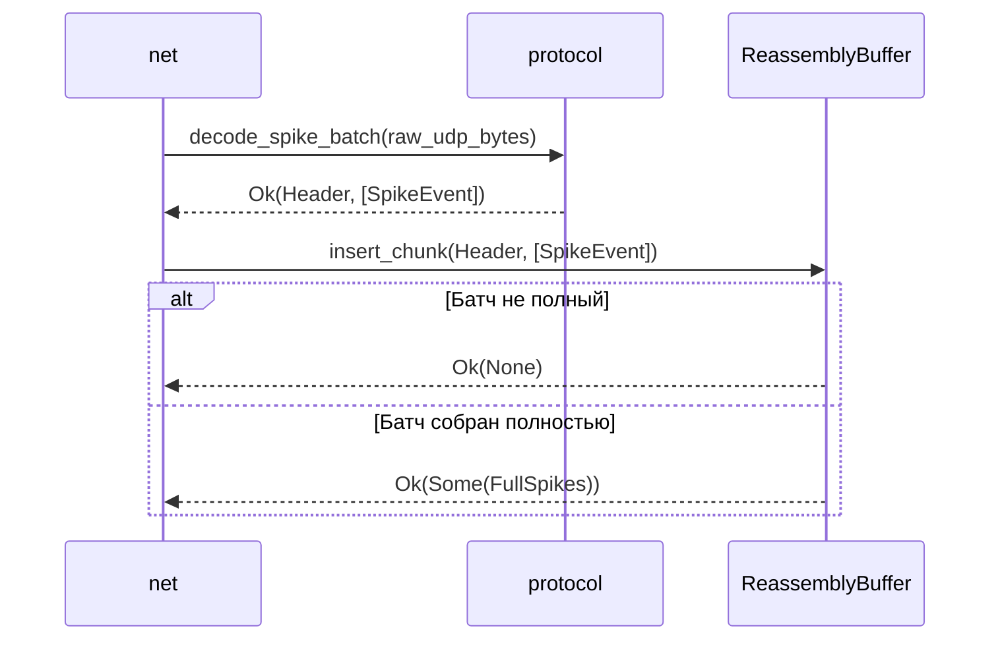

spec_protocol

> Версия спеки: 1.0  
> Дата: 2026-06-23  
> Статус: Verified  

---

## §1. Идентификация

| Поле | Значение |
|---|---|
| Название | `protocol` |
| Слой | Слой 5 — Сетевой Стек |
| Тип | Library (`lib`) |
| `no_std` | **Да** (обязательно для интеграции во встроенные системы, такие как ESP32) |
| Описание | Stateless-парсер, движок L7-фрагментации и математический фильтр валидации биологического времени (эпох) в zero-allocation режиме. |

---

## §2. Стек и Окружение

### §2.1. Внутренние зависимости (inbound)

| Крейт | Что используется | Зачем |
|---|---|---|
| `types` | Базовые типы времени (`Tick`) | Валидация временных отсечек и математика эпох. |
| `wire` | C-ABI структуры и заголовки | Использование бинарных макетов (`SpikeBatchHeaderV2`, `SpikeEventV2`, `ExternalIoHeader`) для Zero-Copy кастинга. |

### §2.2. Внешние зависимости

| Crate | Версия | Зачем |
|---|---|---|
| `bytemuck` | `=1.25.0` | Безопасный zero-copy кастинг `&[u8]` в строго типизированные C-ABI структуры (трейты `Pod` и `Zeroable`). |

### §2.3. Feature Flags

Секция не применима к данному крейту: Feature flags не используются.

---

## §3. Инварианты
Здесь мы фиксируем жесткие правила. Если пакет или данные нарушают эти инварианты, пакет умирает (Drop), но рантайм продолжает жить.

### §3.1. Структурные инварианты

- **INV-PROTO-001**: *Нулевая аллокация кучи в горячем сетевом пути (Zero-Alloc Hot Path)*.
  - *Обоснование*: Выделение памяти на куче (`Vec::new`, `Box`) во время сериализации, L7-нарезки и сборки чанков приводит к фрагментации RAM и непредсказуемо увеличивает p99 латентность симуляции. Сборка фрагментов должна идти In-Place в предварительно выделенные плоские буферы (Pre-allocated Ring Buffers).
  - *Следствие нарушения*: Просадки производительности сетевого обмена (Jitter), пробитие SLA в 10 мс на тик, OOM на микроконтроллерах (ESP32).
  - *Где проверяется*: Юнит-тесты с кастомным аллокатором (отлов аллокаций в рантайме), статический анализ кода.

- **INV-PROTO-002**: *Принудительный Little-Endian порядок байт*.
  - *Обоснование*: Все поля заголовков и событий должны кодироваться и декодироваться строго в Little-Endian для прямого zero-copy кастинга (`bytemuck`) на гетерогенных кластерах без рантайм-переупорядочивания байт.
  - *Следствие нарушения*: Искажение числовых значений на машинах с Big-Endian архитектурой, крах C-ABI контрактов.
  - *Где проверяется*: Юнит-тесты кодеков, `compile-time` конфигурация крейта `wire`.

### §3.2. Семантические инварианты

- **INV-PROTO-003**: *Монотонность биологического времени (Epoch Monotonicity)*.
  - *Обоснование*: Шаг эпохи в обрабатываемых пакетах не может произвольно прыгать назад. Пакеты из прошлого безусловно отбрасываются (Biological Amnesia), пакеты из слишком далекого будущего вызывают форсированный сдвиг времени ноды (Self-Healing).
  - *Следствие нарушения*: Обработка устаревших пакетов-призраков, нарушение каузальности (STDP-пластичность сломается от спайков из прошлого).
  - *Где проверяется*: В функции `validate_epoch_math`.

- **INV-PROTO-004**: *Соблюдение L7 MTU Boundary*.
  - *Обоснование*: Итератор фрагментации (`SpikeFragmentIterator`) не имеет права генерировать слайсы байтов, превышающие переданный лимит MTU (например, 1400 байт для ESP32 или 65507 для десктопа).
  - *Следствие нарушения*: Пакет уходит в стек ОС, где IP-уровень фрагментирует его вслепую, что приводит к дропам UDP-фрагментов и потере всего батча спайков.
  - *Где проверяется*: Математика фрагментации (§6.1), юнит-тесты итератора.

### §3.3. Межкрейтовые инварианты

Секция не применима к данному крейту: Крейт является чистым транслятором сетевого протокола и не управляет глобальными распределенными стейтами.

---

## §4. Публичный API

### §4.1. Типы

Крейт не объявляет C-ABI структур сетевых пакетов (они импортируются из [spec_wire.md §4.1]), но предоставляет DOD-инфраструктуру для их сборки и математического анализа без динамических аллокаций.

#### `ReassemblySlot`

```rust
/// Плоский слот сессии сборки фрагментированного пакета.
pub struct ReassemblySlot {
    pub src_zone_hash: u32,
    pub epoch: u32,
    pub total_chunks: u16,
    pub received_chunks: u16,
    /// Битовая маска полученных чанков (16 * 64 = 1024 чанка максимум). Zero-alloc!
    pub chunk_mask: [u64; 16],
    /// Плоский пре-аллоцированный буфер для спайков текущего батча
    pub payload_buffer: Vec<wire::SpikeEventV2>, 
}
```

- **Семантика**: Изолированная сессия сборки одного L7-фрагментированного батча. Маска `chunk_mask` позволяет за O(1) без ветвлений проверять дубликаты пакетов (защита от фантомных спайков) и отслеживать полноту сборки.
- **Жизненный цикл**: Владеется кольцевым буфером `ReassemblyBuffer`. Очищается (in-place) при старте новой эпохи или смене отправителя, переиспользуя выделенную память `payload_buffer`.
- **Ограничения на значения**: `total_chunks` не может превышать 1024 (аппаратный лимит битовой маски 16 * 64).

#### `ReassemblyBuffer`

```rust
/// Pre-allocated кольцевой буфер для lock-free сборки L7-чанков.
pub struct ReassemblyBuffer {
    /// Фиксированный пул слотов (например, 32 слота для 32 пиров)
    pub slots: Vec<ReassemblySlot>,
}
```

- **Семантика**: DOD-контейнер для управления фрагментированным трафиком. Полностью избавляет сетевой слой от использования HashMap и malloc при агрегации пакетов из сети.
- **Жизненный цикл**: Инициализируется один раз при старте сетевого обработчика ноды. Размер `slots` жестко фиксирован.
- **Ограничения на значения**: Динамическая реаллокация `slots` в HFT-цикле (Day Phase) строжайше запрещена ([spec_protocol.md §3.1] INV-PROTO-001). Поиск слота для `src_zone_hash` выполняется линейным сканированием (O(N), где N мало, обычно <= 32), что для кэша процессора в сотни раз быстрее вычисления хэшей и прыжков по памяти в HashMap.

#### `SpikeFragmentIterator`

```rust
/// Zero-alloc итератор для нарезки огромных батчей под лимит MTU.
pub struct SpikeFragmentIterator<'a> {
    base_header: wire::SpikeBatchHeaderV2,
    spikes: &'a [wire::SpikeEventV2],
    max_spikes_per_chunk: usize,
    current_chunk: u16,
    total_chunks: u16,
}
```

- **Семантика**: Итератор, который берёт плоский `&[SpikeEventV2]` (исходящий трафик) и "нарезает" его на слайсы, строго вписывающиеся в переданный лимит MTU (например, 1400 байт для ESP32 или 65507 для десктопа).
- **Жизненный цикл**: Создается на стеке в момент отправки батча. Не владеет данными (связан лайфтаймом `'a` с буфером маршрутизатора).
- **Ограничения на значения**: Возвращаемый на каждой итерации размер байт гарантированно $\le$ MTU.

#### `EpochAction`

```rust
/// Математический вердикт валидатора времени.
#[derive(Debug, Clone, Copy, PartialEq, Eq)]
pub enum EpochAction {
    /// Пакет валиден, эпоха совпадает
    Accept,
    /// Пакет из прошлого (Biological Amnesia). Отбросить.
    AmnesiaDrop,
    /// Пакет из будущего (Self-Healing). Форсировать сдвиг локальной эпохи.
    SelfHealingFastForward(u32),
}
```

- **Семантика**: DTO результата валидации временных меток. Заменяет собой скрытую ООП-логику. Сетевой маршрутизатор вызывает чистую функцию, получает этот enum и принимает решение через `match`, сохраняя абсолютную прозрачность control flow.
- **Жизненный цикл**: Создается на стеке и уничтожается сразу после принятия решения (O(1)).
- **Ограничения на значения**: Ограничений нет.


### §4.2. Трейты

Секция не применима к данному крейту: Крейт не экспортирует абстрактные трейты.

### §4.3. Функции

Все функции крейта `protocol` являются чистыми (stateless) и реализуют парадигму Zero-Copy сериализации/десериализации.

#### `fn encode_spike_batch`

```rust
/// Кодирует заголовок и спайки в выходной буфер без аллокаций.
pub fn encode_spike_batch(
    header: &wire::SpikeBatchHeaderV2,
    spikes: &[wire::SpikeEventV2],
    buf: &mut [u8],
) -> Result<usize, ProtocolError>;
```

- **Назначение**: Сериализует батч спайков в предварительно выделенный байтовый буфер.
- **Предусловия**: `buf` должен иметь размер не менее `size_of::<SpikeBatchHeaderV2>() + spikes.len() * size_of::<SpikeEventV2>()`.
- **Постусловия**: Возвращает количество записанных байт. Гарантирует принудительный Little-Endian порядок (INV-PROTO-002).
- **Сложность**: O(1) по времени (memory copy/cast), O(1) по памяти.
- **Паника**: Никогда. Возвращает `ProtocolError::BufferTooSmall` при нехватке места.

#### `fn decode_spike_batch`

```rust
/// Декодирует заголовок и спайки из входного буфера (Zero-Copy).
pub fn decode_spike_batch(
    buf: &[u8],
) -> Result<(wire::SpikeBatchHeaderV2, &[wire::SpikeEventV2]), ProtocolError>;
```

- **Назначение**: Десериализует сетевой пакет "на лету" без копирования в кучу, используя `bytemuck` для безопасного кастинга `&[u8]` в типизированные структуры.
- **Предусловия**: `buf` должен быть выровнен (align) аппаратно и иметь размер, достаточный хотя бы для заголовка.
- **Постусловия**: Возвращает кортеж с копией заголовка и ссылкой на срез спайков внутри исходного сетевого буфера.
- **Сложность**: O(1) по времени и памяти.
- **Паника**: Никогда.

#### `fn fragment_spikes`

```rust
/// Создает O(1) итератор для нарезки спайков под MTU.
pub fn fragment_spikes<'a>(
    header: wire::SpikeBatchHeaderV2,
    spikes: &'a [wire::SpikeEventV2],
    mtu: usize,
) -> Result<SpikeFragmentIterator<'a>, ProtocolError>;
```

- **Назначение**: Подготавливает батч к L7-фрагментации.
- **Предусловия**: `mtu` должно быть достаточным для вмещения заголовка и минимум одного спайка.
- **Постусловия**: Возвращает итератор `SpikeFragmentIterator`, который не владеет данными, а лишь двигает окно по массиву `spikes`.
- **Сложность**: O(1) по памяти.
- **Паника**: Никогда.

#### `fn validate_epoch`

```rust
/// Биологическая валидация времени.
pub fn validate_epoch(packet_epoch: u32, node_epoch: u32) -> EpochAction;
```

- **Назначение**: Чистая математическая функция для принятия решения о судьбе пакета. Заменяет ветвления в маршрутизаторе.
- **Правила**:
  - Если `packet_epoch < node_epoch` (с учетом допуска): возвращает `EpochAction::AmnesiaDrop`.
  - Если `packet_epoch > node_epoch` (с учетом допуска): возвращает `EpochAction::SelfHealingFastForward(packet_epoch)`.
  - Иначе: `EpochAction::Accept`.
- **Сложность**: O(1).
- **Паника**: Никогда.

#### `fn validate_cluster_secret`

```rust
/// O(1) проверка подписи кластера.
pub fn validate_cluster_secret(
    packet_secret: u64,
    expected_secret: u64,
) -> Result<(), ProtocolError>;
```

- **Назначение**: Защита от мусорного трафика и перехвата маршрутов (`ROUT_MAGIC`).
- **Предусловия**: Нет.
- **Постусловия**: Возвращает `Ok(())` при совпадении или `Err(ProtocolError::AuthFailure)`.
- **Сложность**: O(1).
- **Паника**: Никогда.

#### `impl ReassemblyBuffer`

```rust
impl ReassemblyBuffer {
    /// Вставка L7-чанка в кольцевой буфер и проверка полноты сборки.
    pub fn insert_chunk(
        &mut self,
        header: &wire::SpikeBatchHeaderV2,
        payload: &[u8],
    ) -> Result<Option<&[wire::SpikeEventV2]>, ProtocolError>;
}
```

- **Назначение**: Принимает сырой фрагмент, валидирует его и вставляет в `payload_buffer` нужного `ReassemblySlot`.
- **Предусловия**: `payload` должен содержать корректный массив `SpikeEventV2`, длина которого кратна `size_of::<SpikeEventV2>()`.
- **Постусловия**: Если после наложения битовой маски `chunk_mask` батч собран целиком — возвращает `Some` со ссылкой на весь плоский массив спайков. Если батч еще не полон — `None`.
- **Сложность**: O(1) поиск слота, O(1) битовая маска, O(1) копирование слайса памяти.
- **Паника**: Никогда. Возвращает `ProtocolError::DuplicateFragment` или `ProtocolError::ReassemblyBufferFull`.

#### `fn decode_io_packet`

```rust
/// Декодирование пакета External I/O (сенсоры, моторы, дофамин).
pub fn decode_io_packet(
    buf: &[u8],
) -> Result<(wire::ExternalIoHeader, &[u8]), ProtocolError>;
```

- **Назначение**: Безопасный `bytemuck`-каст для внешних агентов и Python SDK.
- **Предусловия**: `buf` должен быть выровнен аппаратно.
- **Постусловия**: Возвращает типизированный заголовок и ссылку на оставшийся `payload` (битовую маску сенсоров или дамп моторных команд).
- **Ограничения**: Строгая проверка `payload_size` из заголовка с реальным размером буфера.
- **Сложность**: O(1) по времени и памяти.
- **Паника**: Никогда.


### §4.4. Константы и Магические Числа

| Константа | Значение | Тип | Семантика |
|---|---|---|---|
| `MIN_MTU_LIMIT` | 512 | `usize` | Минимальный допустимый размер MTU для корректного разбиения пакетов. |

---

## §5. Доменная Логика

Крейт protocol — это stateless-парсер, движок L7-фрагментации и математический фильтр биологического времени. Он отвечает за кодирование и декодирование C-ABI структур (из wire) в плоские байтовые буферы без единой динамической аллокации на куче.

Выделение протокола в отдельный крейт (Слой 5) строго изолирует логику работы с данными от транспортного уровня (управление UDP/TCP сокетами в transport) и оркестрации кластера (BSP барьеры и маршрутизация в net). Протокол не имеет понятия о потоках, epoll, рантайме ОС или мьютексах. Это чистая математическая "мясорубка" для байтов. Такая изоляция позволяет покрыть 100% сетевых инвариантов и мутаций юнит-тестами, прогоняя миллионы пакетов в памяти за миллисекунды без поднятия реальных сетевых интерфейсов.

Доменная проблема, которую решает крейт — преодоление аппаратного предела UDP MTU (65 507 байт) при сохранении HFT-скоростей. В моменты плотной активности сети (эпилептические штормы) размер батча спайков неминуемо пробивает MTU. Использование TCP для этих целей неприемлемо из-за HOL-блокировок (Head-of-Line) и срыва latency-бюджета. protocol решает это через lock-free нарезку плоских массивов спайков на безопасные L7-чанки и их детерминированную сборку на принимающей стороне.

Вторая фундаментальная проблема — сетевой джиттер и асинхронность. Пакеты приходят не по порядку, задерживаются или дублируются. Крейт реализует биологическую валидацию времени на границе сети: "Биологическая амнезия" (безусловный отброс пакетов из прошлого) и "Самовосстановление" (форсированный сдвиг локальной эпохи вперед при выявлении сильного отставания ноды). Протокол выступает огневолом — ни один мусорный или просроченный байт не имеет права просочиться выше и нарушить память VRAM.

---

## §6. Алгоритмы и Формулы

### §6.1. Математика L7-фрагментации (Fragmentation Math)

**Вход**: `mtu: usize` (лимит канала), `total_spikes: usize` (размер плоского массива спайков).  
**Выход**: `max_spikes: usize` (максимум спайков в чанке), `total_chunks: u16` (всего чанков для батча).  
**Детерминизм**: Да.

**Логика**: Сетевой стек не имеет права пробивать MTU. Из лимита вычитается размер заголовка `SpikeBatchHeaderV2` (16 байт), остаток делится на размер одного события `SpikeEventV2` (8 байт). Общее число чанков вычисляется с округлением вверх через быструю целочисленную математику. Никаких `f32` и `ceil()`.

**Формулы / Псевдокод**:

```rust
// Псевдокод
fn calculate_fragmentation(mtu: usize, total_spikes: usize) -> (usize, u16) {
    let header_size = 16;
    let event_size = 8;

    // Предохранитель. Меньше 24 байт (заголовок + 1 спайк) = мертвый MTU.
    // Вызывающий код (net) обязан отбросить это или выдать ошибку маршрутизации.
    debug_assert!(mtu >= header_size + event_size);

    // Сколько спайков физически влезет в один UDP-пакет
    let max_spikes = (mtu - header_size) / event_size;

    // Быстрое целочисленное округление вверх
    let total_chunks = (total_spikes + max_spikes - 1) / max_spikes;

    (max_spikes, total_chunks as u16)
}
```

### §6.2. O(1) Битовая сборка (Reassembly Bitmasking)

**Вход**: `chunk_idx: u16`, состояние слота `slot: &mut ReassemblySlot`.  
**Выход**: Успешная фиксация приема или отбрасывание дубликата.  
**Детерминизм**: Да.

**Логика**: Из сети может прилететь дубликат UDP-фрагмента. Использование `HashSet` для проверки убьет кэш-линию и нарушит Zero-alloc инвариант. Мы используем плоский массив `[u64; 16]` (1024 бита). Индекс `u64`-бакета вычисляется битовым сдвигом, а позиция бита — через побитовое "И". Проверка и установка бита занимает 2-3 такта процессора без медленных ветвлений на поиск.

**Формулы / Псевдокод**:

```rust
// Псевдокод
fn process_chunk(slot: &mut ReassemblySlot, chunk_idx: u16) -> Result<(), ProtocolError> {
    if chunk_idx >= slot.total_chunks {
        return Err(ProtocolError::InvalidFragmentIndex { index: chunk_idx, total: slot.total_chunks });
    }

    // Вычисляем бакет (деление на 64) и позицию бита (остаток от 64)
    let mask_idx = (chunk_idx >> 6) as usize;
    let bit_idx = chunk_idx & 63;

    // Проверка дубликата за O(1)
    if (slot.chunk_mask[mask_idx] & (1u64 << bit_idx)) != 0 {
        return Err(ProtocolError::DuplicateFragment { 
            batch_id: slot.src_zone_hash, 
            chunk_idx 
        }); // Сетевой поток молча отбрасывает пакет
    }

    // Фиксируем прием
    slot.chunk_mask[mask_idx] |= 1u64 << bit_idx;
    slot.received_chunks += 1;

    Ok(())
}

// Псевдокод
fn is_batch_complete(slot: &ReassemblySlot) -> bool {
    slot.total_chunks > 0 && slot.received_chunks == slot.total_chunks
}
```

### §6.3. Защита Zero-Copy кастинга (Safe Cast Guards)

**Вход**: Плоский сетевой буфер `buf: &[u8]`, целевой тип структуры `T`.  
**Выход**: Успех или `ProtocolError::AlignmentMismatch` / `ProtocolError::BufferTooSmall`.  
**Детерминизм**: Да.

**Логика**: Парсер не имеет права слепо доверять сетевым данным. Перед вызовом `bytemuck::cast_slice` мы обязаны аппаратно проверить два инварианта памяти. Первый — кратность буфера размеру структуры (отсекаем "оборванные" байты в хвосте). Второй (критический для ARM/MCU) — стартовый адрес среза в памяти обязан быть кратен выравниванию типа (alignment). Без этой проверки `bytemuck` сделает `panic!`, а на C-уровне это привело бы к аппаратному исключению (Unaligned Access).

**Формулы / Псевдокод**:

```rust
// Псевдокод
fn verify_cast_guards<T>(buf: &[u8]) -> Result<(), ProtocolError> {
    let align = std::mem::align_of::<T>();
    let size = std::mem::size_of::<T>();

    // 1. Аппаратное выравнивание указателя (быстрая проверка через битовое И)
    // align всегда степень двойки, поэтому (align - 1) дает идеальную маску
    if (buf.as_ptr() as usize) & (align - 1) != 0 {
        return Err(ProtocolError::AlignmentMismatch);
    }

    // 2. Кратность полезной нагрузки
    if buf.len() % size != 0 {
        return Err(ProtocolError::BufferTooSmall { 
            expected: size, 
            actual: buf.len() 
        });
    }

    Ok(())
}
```

### §6.4. Окна валидации эпох (Epoch Drift Math)

**Вход**: `packet_epoch: u32` (из сети), `node_epoch: u32` (локальное время), `tolerance: u32` (окно отставания), `self_healing_threshold: u32` (окно опережения).  
**Выход**: Решение `EpochAction`.  
**Детерминизм**: Да.

**Логика**: Кластер живет в бесконечном цикле времени. Мы используем семантику переполнения (wrap-around) для беззнакового вычитания. Если при вычитании локальной эпохи из эпохи пакета старший бит результата (31-й) равен 1, значит математически пакет находится "в прошлом" (отстает). Мы допускаем отставание в пределах `tolerance` для компенсации джиттера. Если бит равен 0 — пакет "из будущего". Если опережение превышает `self_healing_threshold`, нода считается отставшей и инициирует процедуру `SelfHealing`.

**Формулы / Псевдокод**:

```rust
// Псевдокод
fn validate_epoch_math(
    packet_epoch: u32,
    node_epoch: u32,
    tolerance: u32,
    self_healing_threshold: u32,
) -> EpochAction {
    if packet_epoch == node_epoch {
        return EpochAction::Accept;
    }

    // Wrap-around вычитание корректно обрабатывает переполнение через 0
    let delta = packet_epoch.wrapping_sub(node_epoch);

    // Если 31-й бит равен 1 -> packet_epoch < node_epoch (с учетом кольца)
    if (delta & 0x8000_0000) != 0 {
        let past_diff = node_epoch.wrapping_sub(packet_epoch);
        if past_diff <= tolerance {
            EpochAction::Accept // Небольшое отставание пакета в рамках джиттера сети
        } else {
            EpochAction::AmnesiaDrop // Слишком старый пакет, отбрасываем
        }
    } else {
        // Иначе пакет из будущего.
        if delta > self_healing_threshold {
            EpochAction::SelfHealingFastForward(packet_epoch) // Нода отстала, перематываем
        } else {
            EpochAction::Accept // Пакет слегка опережает время ноды, принимаем к буферизации
        }
    }
}
```

---


## §7. Структуры Данных и Memory Layout

Секция не применима к данному крейту: Крейт использует C-ABI структуры данных, объявленные в крейте [spec_wire.md §4.1], и не определяет собственных бинарных раскладок.

---

### §8.1. Граничные значения

| # | Ситуация | Ожидаемое поведение |
|---|----------|---------------------|
| E-106 | `chunk_idx >= total_chunks` в заголовке пакета | Мгновенный возврат `ProtocolError::InvalidFragmentIndex`. |
| E-107 | Заявленное число чанков `total_chunks` в заголовке превышает 1024 | Мгновенный возврат `ProtocolError::InvalidChunkCount`. Предотвращает DoS-атаки с переполнением маски слота сборщика. |
| E-108 | Недопустимо маленький лимит MTU (`mtu < 24`) | Возвращается `ProtocolError::InvalidMtu` для исключения деления на ноль при расчетах фрагментов. |
| E-109 | Сырой буфер меньше размера заголовка пакета (`buf.len() < sizeof(Header)`) | Возвращается `ProtocolError::BufferTooSmall` для предотвращения чтения за границами памяти при кастинге. |
| E-110 | Аппаратное невыравнивание стартового адреса слайса в памяти | Возвращается `ProtocolError::AlignmentMismatch`. Защищает `bytemuck` от паники, а ARM/ESP32 CPU от Unaligned Access. |
| E-111 | Получен дубликат фрагмента `chunk_idx` | Битовая маска `chunk_mask` ловит коллизию за O(1). Возвращается `ProtocolError::DuplicateFragment`. Состояние сборщика (счётчики) не мутирует. |
| E-112 | Суммарный объем спайков в батче превышает `MAX_BATCH_SPIKES` | Возвращается `ProtocolError::BatchCapacityExceeded`. Предотвращает OOM и переполнение преаллоцированного буфера слота. |
| E-113 | Микро-джиттер сети (пакет из недавнего "прошлого") | Если отставание `packet_epoch` укладывается в `tolerance`, пакет легализуется и функция валидации возвращает `EpochAction::Accept`. |
| E-114 | Получен фрагмент для эпохи, которая уже собрана или безнадёжно устарела | Возвращается `ProtocolError::EpochTooOld`. Маршрутизатор (Слой 6) обязан сделать O(1) Drop пакета без дальнейшего парсинга (Biological Amnesia). |
| E-115 | Аномальный скачок в будущее (`delta > self_healing_threshold`) | Возвращается `EpochAction::SelfHealingFastForward`. Сигнализирует оркестратору, что локальная нода безнадёжно отстала и обязана "перепрыгнуть" к новой эпохе с обнулением локального стейта. |
| E-116 | Несовпадение `cluster_secret` при авторизации управляющего пакета | Мгновенный возврат `ProtocolError::AuthFailure`. Предотвращает инъекцию фейковых маршрутов (ROUT_MAGIC) или мусорного дофамина извне. |

### §8.2. Состояния гонки и конкурентность

| # | Сценарий | Защита |
|---|----------|--------|
| R-036 | Конкурентная сборка UDP-чанков (Data Race на `ReassemblyBuffer`) | **Исключено By Design.** Крейт `protocol` является stateless-библиотекой и не владеет потоками. `insert_chunk` требует `&mut self`. Компилятор Rust гарантирует, что вызывающий код (Слой 6) физически не сможет получить конкурентный доступ без явной синхронизации на своей стороне. |

### §8.3. Деградация и Recovery

| # | Отказ | Поведение | Восстановление |
|---|-------|-----------|----------------|
| D-029 | Исчерпание `ReassemblyBuffer` (лимит слотов забит "висячими" батчами) | Функция вставки возвращает `ProtocolError::ReassemblyBufferFull`. | Оркестратор обязан выполнить принудительную эвикцию (сброс) самого старого слота `ReassemblySlot` (in-place очистка масок), отбросив недособранный мусор. Аллокаций при этом не происходит. |

---

# §9. Ошибки

## §9.1. Перечисление ошибок

```rust
#[derive(Debug, Clone, PartialEq, Eq)]
pub enum ProtocolError {
    /// Неверный бинарный идентификатор (magic number)
    InvalidMagic { expected: [u8; 4], actual: [u8; 4] },
    /// Сетевой буфер меньше ожидаемого размера C-ABI структуры (оборванный пакет)
    BufferTooSmall { expected: usize, actual: usize },
    /// Стартовый адрес слайса памяти не кратен аппаратному align_of (риск Unaligned Access)
    AlignmentMismatch,
    /// Недопустимый размер MTU (вызывает деление на 0 в расчетах фрагментации)
    InvalidMtu { mtu: usize, min_required: usize },
    /// Заявленное число чанков превышает аппаратный лимит битовой маски в 1024
    InvalidChunkCount { total_chunks: u16, max_allowed: u16 },
    /// Индекс фрагмента в пакете больше либо равен total_chunks
    InvalidFragmentIndex { index: u16, total: u16 },
    /// Фрагмент с таким индексом уже зафиксирован в битовой маске (O(1) коллизия)
    DuplicateFragment { batch_id: u32, chunk_idx: u16 },
    /// Суммарный объем спайков в фрагменте превышает максимальную емкость батча
    BatchCapacityExceeded { max_spikes: usize, actual_spikes: usize },
    /// Эпоха пакета безнадежно устарела (Biological Amnesia)
    EpochTooOld { packet_epoch: u32, current_epoch: u32 },
    /// Несовпадение кластерного секрета в управляющем пакете
    AuthFailure,
    /// Кольцевой буфер переполнен "висячими" сессиями сборок (сетевой мусор)
    ReassemblyBufferFull,
}
```

## §9.2. Стратегия обработки

| Ошибка | Восстановимая? | Рекомендация вызывающему (Слой 6 — net) |
|---|---|---|
| InvalidMagic | Нет | Молча отбросить пакет (Drop). Несовпадение сигнатуры сетевого протокола. |
| BufferTooSmall | Нет | Молча отбросить пакет (Drop). Сетевой мусор или битый пакет. |
| AlignmentMismatch | Да | Скопировать данные в локальный стек/буфер с правильным выравниванием и повторить попытку каста. |
| InvalidMtu | Нет | Прервать операцию отправки, выдать ошибку конфигурации. |
| InvalidChunkCount | Нет | Отбросить пакет как некорректный/злонамеренный (Drop). |
| InvalidFragmentIndex | Нет | Отбросить фрагмент, инкрементировать метрику битых пакетов в телеметрии. |
| DuplicateFragment | Да | Молча игнорировать. Это нормальное поведение UDP при ретрансмиссиях и дублировании маршрутов. |
| BatchCapacityExceeded | Нет | Сбросить сборку текущего слота, отбросить пакет. Предотвращает переполнение RAM. |
| EpochTooOld | Да | Молча отбросить пакет (Biological Amnesia). |
| AuthFailure | Нет | Отбросить пакет, логировать попытку взлома или инъекции фейковых маршрутов. |
| ReassemblyBufferFull | Да | Инициировать O(1) эвикцию самого старого/зависшего `ReassemblySlot` в кольцевом буфере (очистить маски In-Place) и переиспользовать его для новой сборки. |

## §9.3. Паники

| Условие | Почему паника, а не Err |
|---|---|
| — | Паники физически исключены By Design. Функция `bytemuck::cast_slice` вызывается только после успешного прохождения проверки кратности размера и выравнивания адреса. Любое нарушение контрактов в рантайме возвращает `Err`. |


---

## §10. Зависимости и Интеграция

### §10.1. Что крейт потребляет (inbound)

| Крейт-источник | Что используем | Какой контракт ожидаем |
|---|---|---|
| `types` | `Tick` | Стабильный монотонный счетчик времени для валидации эпох [spec_types.md §1.1]. |
| `wire` | `SpikeBatchHeaderV2`, `SpikeEventV2`, `ExternalIoHeader` | Абсолютная C-ABI совместимость и поддержка трейтов `bytemuck::Pod` без скрытых паддингов для Zero-Copy кастинга [spec_wire.md §4.1]. |

### §10.2. Кто потребляет крейт (outbound / обратные зависимости)

| Крейт-потребитель | Что использует | Какой контракт мы обязаны сохранить |
|---|---|---|
| `net` | `decode_spike_batch`, `ReassemblyBuffer`, `fragment_spikes`, `validate_epoch` | Стабильность сигнатур парсинга, сборщика, L7-нарезки и валидатора времени без блокировок и аллокаций. |

### §10.3. Диаграмма взаимодействия



---

## §11. Стратегия Тестирования

### §11.1. Юнит-тесты

#### §11.1.1. Гарантии памяти (Memory Guards & Zero-Alloc)

| Тест | Что проверяет | Связанный инвариант / Граничный случай |
|---|---|---|
| `test_zero_alloc_hot_path` | Проверка, что кодирование, L7-нарезка и сборка батчей не вызывают системный аллокатор кучи. | INV-PROTO-001 |
| `test_verify_cast_alignment` | Передача байтовых срезов со смещенным стартовым адресом (`addr % align != 0`) обязана возвращать ошибку `AlignmentMismatch`. | E-110 |
| `test_buffer_too_small` | Передача буфера, размер которого не кратен ожидаемой структуре (оборванный хвост UDP пакета), возвращает `BufferTooSmall`. | E-109 |
| `test_little_endian_enforcement` | Сериализованные байты жестко соответствуют Little-Endian раскладке независимо от архитектуры хоста. | INV-PROTO-002 |

#### §11.1.2. Математика MTU (L7 Fragmentation)

| Тест | Что проверяет | Связанный инвариант / Граничный случай |
|---|---|---|
| `test_invalid_mtu_limits` | Итератор `SpikeFragmentIterator` не имеет права выдавать чанки, превышающие заданный лимит MTU. | INV-PROTO-004 |
| `test_fragmentation_calculation` | Корректность вычисления `total_chunks` и `max_spikes` с округлением вверх (без потери последнего спайка). | §6.1 |
| `test_zero_mtu_protection` | Поведение парсера и возврат ошибки `InvalidMtu`, если передан MTU, в который не влезает даже базовый заголовок. | E-108 |

#### §11.1.3. Сборка и Битовые Маски (Reassembly)

| Тест | Что проверяет | Связанный инвариант / Граничный случай |
|---|---|---|
| `test_reassembly_duplicates` | Повторный приход чанка с тем же `chunk_idx` ловится маской и отдает `DuplicateFragment`, не сбивая счетчик собранных пакетов. | E-111 |
| `test_reassembly_oob` | Чанк с `chunk_idx >= total_chunks` отбивается ошибкой `InvalidFragmentIndex`. | E-106 |
| `test_reassembly_buffer_full` | При переполнении пула слотов старый слот затирается без реаллокации (обнуление масок). | D-029 |
| `test_is_batch_complete` | Батч считается собранным только тогда, когда получены все фрагменты (received == total). | §6.2 |
| `test_batch_capacity_bounds` | Предотвращение переполнения преаллоцированного буфера при превышении `MAX_BATCH_SPIKES`. | E-112 |

#### §11.1.4. Биологическое время (Epoch Drift Math)

| Тест | Что проверяет | Связанный инвариант / Граничный случай |
|---|---|---|
| `test_epoch_validator_drops_old` | Пакеты из прошлого (с учетом кольцевого переполнения u32) отбрасываются с `EpochTooOld`. | E-114 |
| `test_epoch_tolerance_accept` | Пакеты из недавнего прошлого (в пределах `tolerance`) легализуются и принимаются. | E-113 |
| `test_epoch_validator_self_healing` | Пакеты, улетевшие в будущее за пределы `self_healing_threshold`, триггерят `SelfHealingFastForward`. | E-115 |

#### §11.1.5. Безопасность и Авторизация

| Тест | Что проверяет | Связанный инвариант / Граничный случай |
|---|---|---|
| `test_auth_check` | Несоответствие `cluster_secret` возвращает ошибку `AuthFailure`. | E-116 |
| `test_zero_panic_policy` | Скармливание парсеру 100% случайного мусора (/dev/urandom) возвращает `Result::Err`, не приводя к паникам. | INV-PROTO-001 |

### §11.2. Property-based тесты

| Свойство | Генератор | Связанный инвариант |
|---|---|---|
| `∀ batch: decode(encode(batch)) == batch` | Случайные валидные батчи спайков | INV-PROTO-002 |

### §11.3. Интеграционные тесты

| Тест | Крейты-участники | Сценарий |
|---|---|---|
| `test_network_reassembly_pipeline` | `protocol` + `net` | Эмуляция фрагментации на стороне отправки, передача по сети и сборка на стороне приема. |

### §11.4. Тесты производительности

| Бенчмарк | Метрика | Порог |
|---|---|---|
| `bench_decode_spike_batch` | latency | < 50 ns |

---


## §12. Бюджеты и Ограничения

### §12.1. Память

| Ресурс | Бюджет | Как считается |
|---|---|---|
| Динамическая аллокация в рантайме (Куча) | 0 байт | Все операции (нарезка L7, кастинг, валидация) выполняются in-place / zero-alloc [spec_protocol.md §3.1, §9.3]. |
| Статическая память `ReassemblyBuffer` | < 1 MB | Размер выделенных массивов фиксируется при старте ноды (например, 32 слота по 65 КБ payload + O(1) маски) [spec_protocol.md §4.1]. |

### §12.2. Латентность

| Операция | Бюджет (p99) | Условия |
|---|---|---|
| Декодирование пакета (Zero-Copy Cast) | < 50 ns | Батч из 1000 спайков. Включает аппаратную проверку выравнивания и размера буфера [spec_protocol.md §6.3]. |
| Кодирование пакета | < 100 ns | Батч из 1000 спайков. Линейное копирование в pre-allocated буфер [spec_protocol.md §4.3]. |
| Фиксация чанка в битовой маске `ReassemblySlot` | < 15 ns | Вычисление O(1) позиции в O(1) массиве `[u64; 16]` через битовые сдвиги и побитовое ИЛИ [spec_protocol.md §6.2]. |
| Валидация эпохи | < 5 ns | Только математические сдвиги и `wrap-around` арифметика [spec_protocol.md §6.4]. |

### §12.3. Compile-time

| Ограничение | Значение |
|---|---|
| Время сборки крейта | < 2s (release) |

---

## Приложение A — Глоссарий

| Термин | Определение |
|--------|-----------|
| L7 Фрагментация | Нарезка прикладного пакета спайков на более мелкие фрагменты для обеспечения прохождения через сетевые каналы без превышения MTU. |
| Biological Amnesia | Механизм отбрасывания пакетов, чьи временные метки (эпохи) слишком сильно отстают от текущего состояния симуляции. |
| Self-Healing | Механизм принудительной синхронизации текущей эпохи ноды с эпохой большинства входящих пакетов при обнаружении сильного дрейфа вперед. |

Checklist Полноты (A.3)

- ✅ Все публичные типы описаны в §4 — Описаны `ReassemblySlot`, `ReassemblyBuffer`, `SpikeFragmentIterator`, `EpochAction` и основные FFI-совместимые функции кодирования/декодирования.
- ✅ Все инварианты из §3 имеют соответствующий пункт в §11 (тесты) — Инварианты PROTO-001..PROTO-004 покрыты юнит-тестами.
- ✅ Все `Err`-варианты перечислены в §9 — Полный список вариантов `ProtocolError` задокументирован с рекомендациями по обработке.
- ✅ Все крейты-потребители перечислены в §10.2 — Указан сетевой оркестратор `net`.
- ✅ Нет ни одного «магического числа» без объяснения — Константы и граничные лимиты задокументированы.
- ✅ Все формулы имеют единицы измерения — Формулы для фрагментации и MTU приведены в байтах и штуках спайков.
- ✅ Граничные случаи из §8 покрыты тестами в §11 — E-106..E-116 соотносятся с конкретными тестовыми кейсами в таблице стратегии тестирования.

