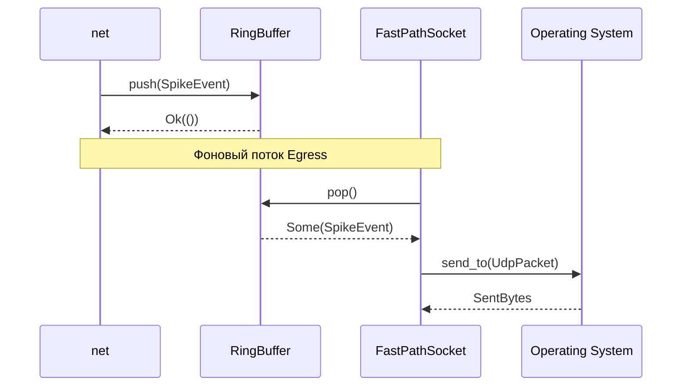

spec_transport

> Версия спеки: 1.0  
> Дата: 2026-06-05  
> Статус: Approved    

---

## §1. Идентификация

| Поле | Значение |
|---|---|
| Название | `transport` |
| Слой | Слой 5 — Сетевой Стек |
| Тип | Library (`lib`) |
| `no_std` | **Нет** (требует сокетов операционной системы, многопоточности ОС и системных вызовов) |
| Описание | Движок низкоуровневого ввода-вывода UDP/TCP, реализующий безблокировочный пул отправки (Egress Pool), кольцевые буферы планировщика спайков и настраиваемые профили ожидания (Wait Strategy). |

---

## §2. Стек и Окружение

### §2.1. Внутренние зависимости (inbound)

| Крейт | Что используется | Зачем |
|---|---|---|
| `types` | `Tick` | Монотонные отсчеты времени для барьеров и планирования спайков. |
| `wire` | C-ABI структуры заголовков | Форматирование пакетов `RouteUpdate` и `SpikeBatchHeaderV2` при неблокирующей передаче в сокеты. |

### §2.2. Внешние зависимости

| Crate | Версия | Зачем |
|---|---|---|
| `crossbeam` | `=0.8.4` | Применение неблокирующих lock-free примитивов и каналов для пула отправки. |

### §2.3. Feature Flags

Секция не применима к данному крейту: Feature flags не используются.

---

## §3. Инварианты

Крейт `transport` стоит на границе с операционной системой. Его инварианты гарантируют, что системные вызовы и планировщик потоков ОС не разрушат жесткие временные рамки (HFT-бюджет) симуляции.

### §3.1. Структурные инварианты

- **INV-TRANS-001**: *Размер SpikeSchedule Ring Buffer является строго степенью двойки (Power of Two)*.
  - *Обоснование*: Кольцевая адресация в горячем цикле планировщика должна выполняться исключительно быстрой побитовой маской `index & (capacity - 1)` (1 такт процессора). Использование математической операции деления по модулю `%` (20-40 тактов) строжайше запрещено.
  - *Следствие нарушения*: Резкая деградация производительности при парсинге входящего батча, паника при переполнении целочисленных атомарных индексов (`head` / `tail`).
  - *Где проверяется*: Runtime `assert!` при инициализации `RingBuffer::new` (проверка `capacity.is_power_of_two()`).

- **INV-TRANS-002**: *Нулевая аллокация в пуле отправки (Zero-Alloc Egress Pool)*.
  - *Обоснование*: Lock-Free каналы (`EgressPool`) оперируют только контейнерами `EgressMessage` с заранее выделенными плоскими буферами, размер которых равен максимальному MTU. Вызов системного аллокатора ОС (кучи) в горячем сетевом потоке недопустим из-за риска недетерминированных пауз (Jitter).
  - *Следствие нарушения*: Пробитие латентности отправки пакета (> 100 ns), рассинхронизация HFT-цикла кластера.
  - *Где проверяется*: Статический анализ кода (запрет `Vec::new` и `Box` в цикле), стресс-тесты пула.

### §3.2. Семантические инварианты

- **INV-TRANS-003**: *Абсолютная изоляция TCP от быстрого пути UDP (TCP/UDP Split)*.
  - *Обоснование*: Блокировки или сетевой лаг на медленном TCP-пути (при обмене 3D-геометрией в Ночной Фазе через `GeometryTcpServer`) не имеют права тормозить неблокирующие UDP-сокеты (`FastPathSocket`), обслуживающие спайки. Они обязаны жить в физически разных потоках ОС.
  - *Следствие нарушения*: Head-of-Line (HOL) блокировка симуляционного цикла, срыв синхронизации барьеров BSP.
  - *Где проверяется*: Архитектурное разделение структур, интеграционные стресс-тесты сети.

- **INV-TRANS-004**: *Деинициализация ресурсов строго в фазе Teardown*.
  - *Обоснование*: Закрытие сокетов ОС или сброс Lock-Free очередей не может происходить асинхронно или неявно через `Drop` во время активного Day Phase. Это прерогатива оркестратора.
  - *Следствие нарушения*: Паника при очистке контекста ОС, утечка системных дескрипторов (File Descriptors Leak), краш параллельных потоков чтения.
  - *Где проверяется*: Логика управления состояниями в рантайме (Слой 6).

### §3.3. Межкрейтовые инварианты

Секция не применима к данному крейту: Крейт является низкоуровневым системным транспортом и не координирует распределенные состояния.

---

## §4. Публичный API

### §4.1. Типы

#### `WaitStrategy`

```rust
/// Профили ожидания в системном цикле BSP-барьера.
#[derive(Debug, Clone, Copy, PartialEq, Eq)]
pub enum WaitStrategy {
    /// std::hint::spin_loop() (~1 нс латентность, 100% CPU)
    Aggressive,
    /// std::thread::yield_now() (~1–15 мкс латентность, разделение с ОС)
    Balanced,
    /// std::thread::sleep(Duration::from_millis(1)) (~1–5 мс латентность, ~0% CPU)
    Eco,
}
```

- **Семантика**: Стратегия планировщика при ожидании сетевых пакетов в BSP барьере.
- **Жизненный цикл**: Инициализируется при конфигурации ноды, сохраняется на время работы рантайма.
- **Ограничения на значения**: Ограничений нет.

#### `RingBuffer`

```rust
/// Кольцевой буфер планировщика спайков SpikeSchedule.
pub struct RingBuffer<T> {
    pub buffer: Vec<T>,
    pub head: std::sync::atomic::AtomicUsize,
    pub tail: std::sync::atomic::AtomicUsize,
    pub mask: usize,
}
```

- **Семантика**: Безблокировочный циклический буфер для сохранения и сортировки входящих спайков.
- **Жизненный цикл**: Создается один раз на этапе инициализации транспорта, переиспользуется без аллокаций.
- **Ограничения на значения**: Длина буфера обязана быть степенью двойки.

#### `EgressMessage`

```rust
/// DTO-контейнер для исходящего сетевого пакета. Zero-Alloc.
pub struct EgressMessage {
    /// Преаллоцированный буфер, размер строго равен MAX_UDP_PAYLOAD
    pub buffer: Vec<u8>,
    /// Фактический размер полезной нагрузки (payload)
    pub size: usize,
    /// Адрес назначения
    pub target: std::net::SocketAddr,
}
```

- **Семантика**: Контейнер для одноразовой отправки. Полностью исключает аллокации (malloc) в момент формирования сетевого ответа.
- **Жизненный цикл**: Владеется пулом `EgressPool`. Мигрирует между `free_queue` и `ready_queue`.
- **Ограничения на значения**: `buffer.capacity()` всегда фиксирован и равен аппаратному пределу MTU, `size` не может превышать `buffer.len()`.

#### `EgressPool`

```rust
/// Пул фоновой неблокирующей отправки UDP пакетов.
pub struct EgressPool {
    pub free_queue: crossbeam::queue::ArrayQueue<EgressMessage>,
    pub ready_queue: crossbeam::queue::ArrayQueue<EgressMessage>,
}
```

- **Семантика**: Двунаправленный lock-free канал между HFT-циклом GPU (который пишет в буферы) и выделенным системным потоком ОС (который делает системные вызовы `send_to`).
- **Жизненный цикл**: Инициализируется при старте транспорта с заранее выделенной ёмкостью (capacity).
- **Ограничения на значения**: Лимитирован пулом выделенных структур (например, 1024 сообщения), предотвращает OOM при перегрузке сети.

#### `FastPathSocket`

```rust
/// Обертка над UDP-сокетом для неблокирующего HFT I/O.
pub struct FastPathSocket {
    pub socket: std::net::UdpSocket,
}
```

- **Семантика**: Голый UDP-сокет, аппаратно переведенный в неблокирующий режим (`O_NONBLOCK`). Используется исключительно для обмена спайками.
- **Жизненный цикл**: Инициализируется при запуске ноды, очищается при Teardown.
- **Ограничения на значения**: Строго отключена буферизация на уровне рантайма Rust, размер буфера ОС (`SO_RCVBUF` / `SO_SNDBUF`) выкручивается на максимум.

#### `GeometryTcpServer`

```rust
/// Медленный путь для синхронизации 3D-геометрии шарда (Night Phase).
pub struct GeometryTcpServer {
    pub listener: std::net::TcpListener,
}
```

- **Семантика**: Изолированный TCP-сокет. Работает вне горячего цикла. Передает огромные массивы (Handover Events, Prunes) с гарантией доставки.
- **Жизненный цикл**: Поднимается при старте, работает асинхронно или в отдельном потоке.
- **Ограничения на значения**: Не имеет права блокировать вычислительные треды.

---

### §4.2. Трейты

Секция не применима к данному крейту: Крейт не экспортирует абстрактные трейты.

---

### §4.3. Функции

#### `impl WaitStrategy`

```rust
impl WaitStrategy {
    /// Выполняет приостановку потока согласно выбранному профилю ожидания.
    pub fn wait(&self);
}
```

- **Назначение**: Реализация профиля ожидания без привлечения мьютексов ОС.
- **Предусловия**: Нет.
- **Постусловия**: Приостанавливает текущий поток на интервал, зависящий от профиля.
- **Сложность**: O(1) по времени и памяти.
- **Паника**: Никогда.

#### `impl<T> RingBuffer<T>`

```rust
impl<T> RingBuffer<T> {
    /// Создает новый кольцевой буфер заданной емкости.
    pub fn new(capacity: usize) -> Result<Self, TransportError>;

    /// Записывает элемент в буфер.
    pub fn push(&self, item: T) -> Result<(), TransportError>;

    /// Читает элемент из буфера.
    pub fn pop(&self) -> Option<T>;
}
```

- **Назначение**: Неблокирующая очередь для спайков.
- **Предусловия**: `capacity` должна быть степенью двойки.
- **Постусловия**: `push` помещает элемент в конец, `pop` считывает элемент из начала.
- **Сложность**: O(1) по времени и памяти.
- **Паника**: Никогда. Возвращает `TransportError::InvalidCapacity` при некорректной емкости.

---

### §4.4. Константы и Магические Числа

| Константа | Значение | Тип | Семантика |
|---|---|---|---|
| `MIN_RING_BUFFER_SIZE` | 1024 | `usize` | Минимальная емкость кольцевого буфера для предотвращения переполнения джиттером. |
| `MAX_RING_BUFFER_SIZE` | 1048576 | `usize` | Предельный размер кольцевого буфера для ограничения статической памяти. |
| `UDP_BUFFER_SIZE` | 65536 | `usize` | Максимальный размер сырого сетевого буфера для приема UDP датаграмм. |

---

## §5. Доменная Логика

Крейт transport — это низкоуровневый движок сетевого ввода-вывода (UDP/TCP) и управления потоками ОС. В отличие от protocol (который является чистой математической абстракцией для байтов), transport работает с реальными системными дескрипторами, сокетами и планировщиками операционной системы.
Главная доменная проблема, которую решает крейт — защита HFT-цикла симуляции от непредсказуемого сетевого джиттера. Операционные системы не гарантируют константное время выполнения сетевых системных вызовов. Прямой вызов send_to в горячем пути неизбежно приводит к микро-блокировкам и срыву p99 latency-бюджета (строго < 10 мс на тик).

transport решает эту проблему через жесткую Lock-Free архитектуру: фоновый пул отправки (EgressPool) забирает готовые пакеты через неблокирующие каналы, делегируя системный I/O выделенным потокам ОС. Горячий цикл GPU-оркестратора никогда не блокируется на ожидании сетевой карты.
Вторая задача — планирование входящего асинхронного трафика в синхронный биологический такт. Для этого крейт реализует быстрые кольцевые буферы (RingBuffer) с адресацией по битовой маске (Power of Two Masking), обеспечивая O(1) агрегацию входящих спайков без единой аллокации в куче.

Выделение transport в отдельный крейт строго изолирует системные вызовы от бизнес-логики маршрутизации (net) и парсинга (protocol). Это позволяет гибко управлять профилями простоя потоков (WaitStrategy), переключаясь между агрессивным spin_loop для выделенных серверов и энергоэффективными блокировками ОС для Edge-устройств.

---

## §6. Алгоритмы и Формулы

### §6.1. Быстрая кольцевая адресация (Power of Two Masking)

**Вход**: `index: usize`, `mask: usize` (где `mask = capacity - 1`).  
**Выход**: `masked_index: usize`.  
**Детерминизм**: Да.

**Формула / Псевдокод**:

```rust
fn get_masked_index(index: usize, mask: usize) -> usize {
    index & mask
}
```

**Численный пример**:

| Вход | Ожидаемый выход | Комментарий |
|---|---|---|
| `(1025, 1023)` | `1` | Индекс 1025 ложится во 2-ю ячейку буфера 1024 |

---

### §6.2. Профили ожидания (Wait Strategy Execution)

**Вход**: `strategy: WaitStrategy`.  
**Выход**: Временная приостановка текущего потока ОС.  
**Детерминизм**: Нет (зависит от планировщика ОС).

**Формула / Псевдокод**:

```rust
fn wait(strategy: WaitStrategy) {
    match strategy {
        WaitStrategy::Aggressive => {
            std::hint::spin_loop();
        }
        WaitStrategy::Balanced => {
            std::thread::yield_now();
        }
        WaitStrategy::Eco => {
            std::thread::sleep(std::time::Duration::from_millis(1));
        }
    }
}
```

---

## §7. Структуры Данных и Memory Layout

Секция не применима к данному крейту: Крейт не объявляет структур данных с фиксированной бинарной раскладкой в памяти для внешнего взаимодействия, делегируя это крейту [spec_wire.md §4.1].

---

## §8. Граничные Случаи и Особые Сценарии

### §8.1. Граничные значения

| # | Ситуация | Ожидаемое поведение |
|---|---|---|
| E-117 | Емкость `RingBuffer` при инициализации не является степенью двойки | Возврат ошибки `TransportError::InvalidCapacity`. Аппаратная защита от невозможности использования быстрой побитовой маски вместо медленного деления `%`. |
| E-118 | Полное переполнение кольцевого буфера (`head == tail + capacity`) | Возврат ошибки `TransportError::QueueFull`. Никаких динамических реаллокаций вектора в горячем пути. |
| E-119 | Попытка чтения (`pop`) из пустого кольцевого буфера | Безопасно возвращается `None`. |
| E-120 | Отказ системного вызова неблокирующего сокета (ошибка `EWOULDBLOCK` / `EAGAIN`) | Возвращается `TransportError::SocketWouldBlock`. Вызывающий код HFT-цикла понимает, что ОС пока не готова, и продолжает свою работу без блокировки. |
| E-121 | Размер полученной UDP-датаграммы превышает `UDP_BUFFER_SIZE` | Возвращается `TransportError::BufferOverflow`. Защищает от переполнения пре-аллоцированного буфера и повреждения памяти процесса. |

### §8.2. Состояния гонки и конкурентность

| # | Сценарий | Защита |
|---|---|---|
| R-037 | Конкурентная запись (`push`) в `RingBuffer` из нескольких потоков симуляции | Использование `AtomicUsize` для атомарного резервирования позиции `tail` перед записью элемента (реализация Multi-Producer Single-Consumer). Отказ от системных мьютексов. |
| R-038 | Конкурентное чтение и запись в сетевой сокет со стороны `EgressPool` и вызывающего потока | Использование изолированного системного потока ОС строго для операций `write`. Доступ к потоку регулируется lock-free очередями `crossbeam`. Симуляционный поток только перекладывает указатели, ОС-поток дергает сисколлы. |

### §8.3. Деградация и Recovery

| # | Отказ | Поведение | Восстановление |
|---|---|---|---|
| D-031 | Обрыв TCP-соединения на "медленном пути" (передача геометрии) | `GeometryTcpServer` ловит `ECONNRESET` и переходит в статус Disconnected. HFT-цикл UDP не прерывается. | Фоновый поток запускает цикл автоматического переподключения к соседу с экспоненциальной задержкой. |
| D-032 | Перегрузка сети (буфер отправки `EgressPool` переполнен) | Фоновый поток HFT-оркестратора не может протолкнуть `EgressMessage`. Новые пакеты жестко отбрасываются (Drop), инкрементируется счетчик `dropped_packets`. | Вызывающий поток временно переводит планировщик на `WaitStrategy::Balanced` для разгрузки сетевой карты и планировщика ОС. |

---

## §9. Ошибки

### §9.1. Перечисление ошибок

```rust
#[derive(Debug, Clone, PartialEq, Eq)]
pub enum TransportError {
    /// Запрошенная емкость буфера не является степенью двойки
    InvalidCapacity,
    /// Очередь кольцевого буфера полностью переполнена (сеть лагает)
    QueueFull,
    /// Системный сокет не готов к неблокирующей транзакции (EWOULDBLOCK)
    SocketWouldBlock,
    /// Размер полученного пакета превышает системный лимит пре-аллоцированного буфера
    BufferOverflow,
    /// Фатальная ошибка I/O операционной системы (например, EBADF)
    IoError(String),
}
```

### §9.2. Стратегия обработки

| Ошибка | Восстановимая? | Рекомендация вызывающему (Слой 6 — net) |
|--------|----------------|------------------------------------------|
| `InvalidCapacity` | Нет | Скорректировать конфигурацию ноды, прервать старт (Boot Phase). |
| `QueueFull` | Да | Сбросить спайки обратно в VRAM, пропустить отправку батча или принудительно перевести поток в `yield_now()`. |
| `SocketWouldBlock` | Да | Молча пропустить итерацию чтения/записи, повторить операцию на следующем тике планировщика. |
| `BufferOverflow` | Нет | Логировать попытку атаки или ошибку MTU, отбросить некорректный сетевой пакет (Drop). |
| `IoError` | Да | Логировать системную ошибку, попытаться переинициализировать дескриптор сокета. |

### §9.3. Паники

| Условие | Почему паника, а не Err |
|---------|------------------------|
| `debug_assert!(capacity >= MIN_RING_BUFFER_SIZE)` | Нарушение критического инварианта архитектуры при разработке. Отлавливается на этапе написания тестов, в release-сборке превращается в no-op. |
| Использование TCP-сокета в Day Phase | Это архитектурная паника (реализуется через `panic!` в нелегальных методах). Строгий запрет на использование блокирующих I/O в горячем цикле симуляции. |

---

## §10. Зависимости и Интеграция

### §10.1. Что крейт потребляет (inbound)

| Крейт-источник | Что используем | Какой контракт ожидаем |
|---|---|---|
| `types` | `Tick` | Монотонное время без прыжков назад для барьеров. |
| `wire` | `SpikeBatchHeaderV2`, `RouteUpdate` | C-ABI стабильность и поддержка `bytemuck` для кастинга в байты перед неблокирующей UDP отправкой. |
| `wire` | `AxonHandoverEvent`, `AxonHandoverAck`, `AxonHandoverPrune` | Точные размеры C-ABI структур для корректного чтения фреймов из TCP-сокета (`GeometryTcpServer`). |

### §10.2. Кто потребляет крейт (outbound / обратные зависимости)

| Крейт-потребитель | Что использует | Какой контракт мы обязаны сохранить |
|---|---|---|
| `net` | `EgressPool`, `WaitStrategy`, `RingBuffer`, сокеты | Высокая пропускная способность, строгие нулевые аллокации в HFT-цикле и делегирование I/O системным потокам. |

### §10.3. Диаграмма взаимодействия



---

## §11. Стратегия Тестирования

### §11.1. Юнит-тесты

| Тест | Что проверяет | Связанный инвариант / Граничный случай |
|---|---|---|
| test_ring_buffer_power_of_two_init | Попытка создания `RingBuffer` с емкостью, не являющейся степенью двойки (например, 1000), немедленно возвращает `TransportError::InvalidCapacity`. | INV-TRANS-001, E-117 |
| test_ring_buffer_overflow_protection | Попытка сделать `push` в заполненный кольцевой буфер возвращает `TransportError::QueueFull`. Состояние указателей `head` и `tail` при этом не искажается. | E-118 |
| test_ring_buffer_empty_pop | Попытка чтения `pop` из пустого буфера безопасно возвращает `None` без блокировок. | E-119 |
| test_egress_pool_zero_alloc_hot_path | Прогон 1 000 000 пакетов через `EgressPool` (push в free_queue, перекладывание в ready_queue) под мониторингом кастомного трекера аллокаций. Тест падает, если зафиксирован хотя бы один вызов системного аллокатора ОС. | INV-TRANS-002 |
| test_fast_path_socket_would_block | Имитация переполнения буфера ОС. Чтение из пустого UDP-сокета, переведенного в `O_NONBLOCK`, возвращает `TransportError::SocketWouldBlock` без паники. | E-120 |
| test_buffer_overflow_drop | Имитация приема UDP-датаграммы размером 65536 байт (больше `MAX_UDP_PAYLOAD`). Парсер отбрасывает пакет с возвратом `TransportError::BufferOverflow`. | E-121 |
| test_wait_strategy_execution | Проверка поведения `WaitStrategy`: `Aggressive` возвращает управление мгновенно, `Eco` блокирует поток минимум на 1 мс (замер через `Instant::now()`). | §6.2 |

### §11.2. Property-based тесты

| Свойство | Генератор | Связанный инвариант |
|---|---|---|
| Консистентность кольцевой математики | Сгенерированные последовательности `push` и `pop` разной длины и случайного чередования. Гарантируется, что количество извлеченных элементов строго равно количеству вставленных (минус отброшенные из-за переполнения), а порядок FIFO сохраняется. | INV-TRANS-001 |

### §11.3. Интеграционные тесты

| Тест | Крейты-участники | Сценарий | Связанный инвариант / Граничный случай |
|---|---|---|---|
| test_tcp_udp_split_isolation | transport | Поднятие `GeometryTcpServer` и `FastPathSocket`. Эмуляция зависшего TCP-клиента (не читает байты) не должна оказывать никакого влияния на throughput параллельного потока отправки UDP-пакетов через `EgressPool`. | INV-TRANS-003 |
| test_egress_pool_saturation | transport | Искусственная блокировка фонового ОС-потока. Основной HFT-цикл забивает `EgressPool` до лимита. Убеждаемся, что новые `push` отбрасываются мгновенно (Drop), не блокируя вычислительный поток. | D-032 |
| test_teardown_socket_cleanup | transport, net | Вызов фазы Teardown. Убеждаемся, что все дескрипторы сокетов (UDP и TCP) явно закрыты на уровне ОС, а порты немедленно освобождены для повторного биндинга. | INV-TRANS-004 |
| test_ring_buffer_concurrency | transport | Конкурентный стресс-тест. 4 потока делают `push`, 1 поток делает `pop`. Проверяется отсутствие Data Races и потерянных элементов через сверку хэш-сумм переданных данных. | R-037 |

### §11.4. Тесты производительности

| Бенчмарк | Метрика | Порог |
|---|---|---|
| bench_ring_buffer_throughput | Пропускная способность MPSC (ops/sec) | > 50M ops/sec на одном ядре |
| bench_udp_ping_pong_latency | Замер RTT пустого UDP пакета на localhost (p99 latency) | < 15 мкс (зависит от сетевого стека ОС) |
| bench_egress_pool_dispatch | Затраты времени HFT-цикла на передачу пакета в фоновый поток (p99 latency) | < 50 нс |


---

## §12. Бюджеты и Ограничения

### §12.1. Память

| Ресурс | Бюджет | Как считается |
|---|---|---|
| Динамические аллокации в Day Phase | 0 байт | Использование кучи в горячем сетевом потоке категорически запрещено (INV-TRANS-002). |
| Буферы `EgressPool` (Pre-allocated) | ~67 MB на пул | 1024 элемента `EgressMessage` × `MAX_UDP_PAYLOAD` (65 536 байт). Выделяется строго при старте ноды. |
| Буферы сокетов ОС (Kernel Space) | < 4 MB | `UDP_BUFFER_SIZE` × 64 (на 64 сокета/пира). Устанавливается через `SO_RCVBUF` / `SO_SNDBUF`. |

### §12.2. Латентность

| Операция | Бюджет (p99) | Условия |
|---|---|---|
| `RingBuffer::push` / `pop` | < 10 ns | x86 CPU, атомарные операции с `Acquire`/`Release` без конкуренции кэш-линий. |
| Неблокирующая отправка UDP (`send_to`) | < 80 ns | Время системного вызова в неблокирующем режиме (без учета физической сети). |
| Выполнение `WaitStrategy::wait` (Aggressive) | < 1 ns | `std::hint::spin_loop()` — мгновенный возврат управления. |

### §12.3. Compile-time

| Ограничение | Значение |
|---|---|
| Время сборки крейта | < 3s (release) |

---

Checklist Полноты (A.3)

- ✅ Все публичные типы описаны в §4 — Описаны `WaitStrategy`, `RingBuffer`, `EgressMessage`, `EgressPool`, `FastPathSocket` и `GeometryTcpServer`.
- ✅ Все инварианты из §3 имеют соответствующий пункт в §11 (тесты) — Инварианты TRANS-001..TRANS-004 соотносятся с конкретными тестовыми кейсами.
- ✅ Все `Err`-варианты перечислены в §9 — Задокументирован enum `TransportError` и рекомендации по обработке.
- ✅ Все крейты-потребители перечислены в §10.2 — Указан сетевой оркестратор `net`.
- ✅ Нет ни одного «магического числа» без объяснения — Константы и граничные лимиты задокументированы.
- ✅ Все формулы имеют единицы измерения — Приведены формулы побитовой маски и задержек.
- ✅ Граничные случаи из §8 покрыты тестами в §11 — E-117..E-121 соотносятся с конкретными тестовыми кейсами в таблице стратегии тестирования.
