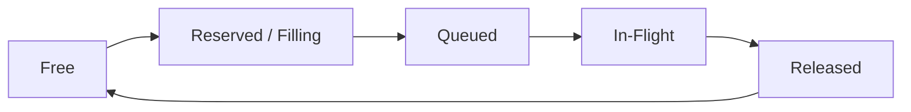

# spec_transport

> Версия спеки: 2.0  
> Дата: 2026-06-29  

---

## §1. Идентификация

| Поле | Значение |
|---|---|
| **Имя крейта** | `transport` |
| **Слой** | Слой 5 — Network Stack (`L5`) |
| **Тип** | Library (`lib`) |
| **no_std** | Нет (`false`) — требуется `std::net`, сокеты ОС, управление воркер-тредами и аллокатор кучи при инициализации |
| **Описание** | Движок системного сетевого ввода-вывода (I/O) и физическая граница ОС. Крейт отвечает за неблокирующую байтовую передачу UDP/TCP, управление жизненным циклом системных сокетов, предвыделенные буферные пулы, ограниченные очереди ввода-вывода, стратегии ожидания потоков (`WaitStrategy`) и счетчики телеметрии. Крейт не парсит L7-семантику пакетов, не выполняет фрагментацию или сборку чанков, не валидирует время симуляции, не держит таблицы маршрутизации, барьеры BSP или политики повторов. |

---

## §2. Стек и Окружение

### §2.1. Внутренние зависимости (inbound)

| Крейт | Что используется | Зачем |
|---|---|---|
| — | — | Ядро сетевого транспорта не содержит внутренних зависимостей от других крейтов системного стека (учет телеметрии выполняется на базе атомарных типов `u64`). |

### §2.2. Зависимые Компоненты (outbound consumers)

| Крейт / Компонент | Роль в системе и взаимодействие |
|---|---|
| `net` (Слой 5) | Главный оркстратор сетевого стека: передает сырые байты на отправку, принимает входящие датограммы и сообщения воркеров, реагирует на бэкпрешер очередей и ошибки `TransportError`. |
| `runtime` / `test-harness` | Инициализируют и запускают жизненный цикл транспорта при тестировании и старте процесса ноды. |

### §2.3. Внешние Зависимости

| Crate | Версия | Сфера использования |
|---|---|---|
| `crossbeam` | `=0.8.4` | Применение ограниченных неблокирующих очередей `ArrayQueue` для очередей приема и отправки. |
| `thiserror` | `=1.0.69` | Строгая типизация ошибок системного транспорта (`TransportError`). |
| `tracing` | `=0.1.40` | Логирование жизненного цикла сетевых воркер-тредов и системных сокетов. |

> [!IMPORTANT]
> Настоящая спецификация категорически запрещает использование асинхронных и высокоуровневых фреймворков (`tokio`, `axum`, `mio`, `serde`, `anyhow`) в ядре сетевого транспорта без отдельного архитектурного решения. Использование библиотеки `socket2` вынесено в review debt (§11).

### §2.4. Feature Flags

Секция публичных feature flags не используется. Крейт собирается как единая библиотека.

---

## §3. Ownership Boundaries (Границы Владения)

| Модуль / Крейт | Монопольная Зона Владения (Single Source of Truth) | Строгие Запреты (Что категорически запрещено в крейте) |
|---|---|---|
| **`transport`** (Слой 5) | **Системный Сетевой I/O и Сокеты**: Жизненный цикл сокетов ОС (bind/connect/listen), неблокирующая передача сырых байтов UDP/TCP, предвыделенные буферные пулы, жизненный цикл `BufferId`, воркер-треды, ограниченные очереди, стратегии ожидания (`WaitStrategy`) и трансляция ошибок ОС в `TransportError`. | Запрещены L7-фрагментация и сборка чанков (владелец `protocol`), классификация пакетов и математика эпох (владелец `protocol`), определение C-ABI DTO и magic-константы (владелец `wire`), таблицы маршрутизации, барьеры BSP и политики повторов/отброса пакетов (владелец `net`), а также управление состояниями ноды (владелец `runtime`). |
| **`protocol`** (Слой 5) | **L7 Семантика и Фрагментация**: Нарезка спайков на чанки, сборка датограмм, проверка валидности эпох и L7 ACK/Heartbeat. | Запрещены прямые системные вызовы сокетов и управление потоками ОС. |
| **`wire`** (Слой 1) | **Бинарные Контракты**: C-ABI макеты полей пакетов и физические размеры структур. | Запрещено хранение сетевых буферов и управление сокетами. |
| **`net`** (Слой 5) | **Оркестрация Кластера**: Разрешение маршрутов, состояние соседних нод, политика бэкпрешера и повторных отправок. | Запрещена самостоятельная работа с системными сокетами ОС в обход `transport`. |

---

## §4. Публичная API-Модель (Public API Model)

Публичный интерфейс транспорта оперирует сырыми байтовыми слайсами, типизированными идентификаторами соединений `ConnectionId` и предвыделенными буферами:

```rust
pub struct TransportConfig {
    pub max_packet_bytes: usize,
    pub ingress_capacity: usize,
    pub egress_capacity: usize,
    pub wait_strategy: WaitStrategy,
    pub socket_mode: SocketMode,
}

#[derive(Debug, Clone, Copy, PartialEq, Eq, Hash)]
pub struct ConnectionId(pub u64);

#[derive(Debug, Clone, Copy, PartialEq, Eq)]
pub enum SocketMode {
    UdpDatagram,
    TcpStream,
    TcpListener,
}

#[derive(Debug, Clone, Copy, PartialEq, Eq)]
pub enum WaitStrategy {
    Spin { spins: u32 },
    Yield,
    Park { timeout_micros: u64 },
    Balanced,
}

/// Исходящая UDP-датограмма с явным адресом назначения
pub struct EgressDatagram {
    pub dst: SocketAddr,
    pub len: usize,
    pub buffer_id: BufferId,
}

/// Исходящий чанк TCP-стрима по идентификатору установленного соединения
pub struct EgressStreamChunk {
    pub connection_id: ConnectionId,
    pub len: usize,
    pub buffer_id: BufferId,
}

/// Входящая UDP-датограмма
pub struct IngressDatagram {
    pub src: SocketAddr,
    pub len: usize,
    pub buffer_id: BufferId,
}

/// Входящий чанк TCP-стрима
pub struct IngressStreamChunk {
    pub connection_id: ConnectionId,
    pub len: usize,
    pub buffer_id: BufferId,
}

/// Асинхронное событие воркер-тредов для верхнего слоя net
#[derive(Debug, Clone)]
pub enum TransportEvent {
    ConnectionOpened { connection_id: ConnectionId, remote_addr: SocketAddr },
    ConnectionClosed { connection_id: ConnectionId, reason: TransportError },
    WorkerError { socket_mode: SocketMode, error: TransportError },
    QueueOverflow { direction: &'static str },
}

#[derive(Debug, Default, Clone)]
pub struct TransportStats {
    pub sent_packets: u64,
    pub received_packets: u64,
    pub dropped_packets: u64,
    pub queue_full: u64,
    pub socket_would_block: u64,
    pub bytes_sent: u64,
    pub bytes_received: u64,
}

#[derive(Debug, Clone, Copy, PartialEq, Eq, Hash)]
pub struct BufferId(pub usize);

pub struct EgressPool;
pub struct IngressPool;
pub struct BufferPool;
pub struct TransportHandle;
```

---

## §5. Жизненный Цикл Буферов, Очереди и Безопасный Доступ (Buffers, Queues & Safety)



### §5.1. Жизненный Цикл и Безопасный Доступ к Буферам
1. **Состояния Слот-Буфера (`BufferId`)**: `Free` $\to$ `Reserved/Filling` $\to$ `Queued` $\to$ `InFlight` $\to$ `Released` $\to$ `Free`.
2. **Безопасный Доступ по Идентификатору**: Доступ к байтам предвыделенного слота выполняется через концептуальные методы `get_buffer(buffer_id) -> Result<&[u8], TransportError>` и `get_buffer_mut(buffer_id) -> Result<&mut [u8], TransportError>`. Доступ за пределами валидного состояния владения или после вызова `release` запрещен и возвращает ошибку `TransportError::BufferOverflow`.
3. **Отправка (Egress Path)**: Метод `try_send(dst, bytes)` / `try_send_stream(conn_id, bytes)` копирует входящие байты в свободный слот пула отправки. После успешной копировки слот переходит в состояние `Queued` и принадлежит сообщению `EgressDatagram` / `EgressStreamChunk` до завершения отправки воркер-тредом.
4. **Прием и Освобождение (Ingress Release Rule)**: После считывания входящего пакета из `IngressDatagram` / `IngressStreamChunk` вызывающий модуль (`net`) **обязан** явно вызвать `release_ingress(buffer_id)` для возврата слота в состояние `Free`.

### §5.2. Единая Политика Ограниченных Очередей (Queue Capacity Policy)
1. **Единое Требование Степени Двойки**: Для сохранения производительности и единообразия адресации во всех очередях транспорта (`ArrayQueue` и кастомных ринг-буферах) емкость очередей `ingress_capacity` и `egress_capacity` обязана быть строго степенью двойки (`capacity.is_power_of_two()`). Передача любого другого значения приводит к возврату `TransportError::InvalidCapacity`.
2. **Адресация Маской**: Индексация слотов выполняется побитовой маской `idx & (capacity - 1)`. Деление по модулю `%` в горячем пути категорически запрещено.
3. **Семантика Очереди**: Операция `push` на полной очереди возвращает `TransportError::QueueFull`. Операция `pop` на пустой очереди возвращает `None` (без ошибок и паник).

---

## §6. Жизненный Цикл Сокетов, Изоляция и События Воркеров (Lifecycle & Async Events)

1. **Состояния Сокета**: `Created` $\to$ `Bound/Connected` $\to$ `Running` $\to$ `Draining` $\to$ `Stopped`.
2. **Запуск и Останов**: Вызов `start()` спавнит фоновые воркер-треды. Вызов `shutdown()` выполняет очистку очередей и корректно делает `join()` для всех воркер-тредов. Трейт `Drop` выполняет защитную очистку ресурсов системных дескрипторов без паник (`panic!`).
3. **Изоляция Потоков UDP/TCP**: Воркер-треды быстрых UDP-датограмм Data Plane и медленных TCP-байтовых потоков Control Plane функционируют на физически изолированных потоках ОС.
4. **Асинхронное Оповещение об Ошибках Воркеров**: Транспорт не выполняет самостоятельных повторов отправок при сетевых сбоях. Однако при возникновении асинхронных ошибок на сокетах (`SocketWouldBlock`, `SocketClosed`, `Io`) или изменении состояния соединений воркер-тред генерирует событие `TransportEvent` и помещает его в очередь событий, доступную верхнему слою `net` через `pop_event()`.

---

## §7. Снимки Статистики и Иерархия Ошибок (Stats Snapshots & TransportError)

1. **Атомарные Снимки Статистики**: Воркер-треды обновляют внутренние счетчики через атомарные переменные (`AtomicU64`). Метод `stats_snapshot() -> TransportStats` возвращает точечный снимок статистических показателей без блокировки горячего пути.
2. **Типизированные Ошибки**: Ошибки системного уровня I/O выражаются через тип `TransportError` на базе `thiserror`:

```rust
#[derive(Debug, thiserror::Error)]
pub enum TransportError {
    #[error("Invalid capacity configuration: must be power of two")]
    InvalidCapacity,

    #[error("Invalid packet size configuration")]
    InvalidPacketSize,

    #[error("Packet size {len} exceeds maximum payload limit {max}")]
    PacketTooLarge { len: usize, max: usize },

    #[error("Queue capacity reached")]
    QueueFull,

    #[error("Socket operation would block")]
    SocketWouldBlock,

    #[error("Socket closed unexpectedly")]
    SocketClosed,

    #[error("Address already in use")]
    AddrInUse,

    #[error("Permission denied")]
    PermissionDenied,

    #[error("Buffer pool overflow or invalid access")]
    BufferOverflow,

    #[error("Worker thread stopped")]
    WorkerStopped,

    #[error("Unsupported platform operation")]
    UnsupportedPlatform,

    #[error("OS I/O error: {0}")]
    Io(#[from] std::io::Error),
}
```

---

## §8. Требуемые Инварианты

- **INV-TRANS-001**: Полное отсутствие семантического парсинга содержимого пакетов в крейте `transport`.
- **INV-TRANS-002**: Полное отсутствие L7-фрагментации и сборки чанков в крейте `transport`.
- **INV-TRANS-003**: Отсутствие таблиц маршрутизации, кластерных барьеров BSP и политик повторных отправок пакетов.
- **INV-TRANS-004**: Полное отсутствие аллокаций в куче на горячем пути приема и отправки после вызова `start()`.
- **INV-TRANS-005**: Ограниченные очереди гарантируют фиксированный размер, равный степени двойки, и никогда не растут динамически.
- **INV-TRANS-006**: Полное отсутствие паник (`panic!`) при возникновении системных ошибок ввода-вывода ОС.
- **INV-TRANS-007**: Потоки обработки UDP и TCP изолированы на разных воркер-тредах ОС и не блокируют друг друга.
- **INV-TRANS-008**: Все системные ошибки ОС транслируются в типизированную ошибку `TransportError`.
- **INV-TRANS-009**: Счетчики `TransportStats` представляют собой волатильную телеметрию и не влияют на детерминированное состояние симуляции.
- **INV-TRANS-010**: Один идентификатор буфера `BufferId` не может одновременно находиться в нескольких очередях или быть выдан нескольким потребителям; чтение буфера после вызова `release` строго запрещено.

---

## §9. Golden Tests / Обязательная Матрица Тестирования

Крейт `transport` обязан быть покрыт набором автоматических тестов:

1. **Изоляция от L7 Семантики (`test_transport_no_protocol_semantic_parsing`)**: Проверка отсутствия логики парсинга полей пакетов в транспорте.
2. **Изоляция Зависимостей (`test_transport_no_forbidden_dependencies`)**: Проверка отсутствия внешних тяжелых и L7-крейтов в графе сборки.
3. **Проверка Емкости Кольцевого Буфера (`test_ring_capacity_must_be_power_of_two`)**: Проверка возврата `InvalidCapacity` при емкости, не являющейся степенью двойки.
4. **Возврат QueueFull при Переполнении Очереди (`test_ring_push_full_returns_queue_full`)**: Верификация отказа в приеме при полной очереди.
5. **Возврат None при Чтении Пустой Очереди (`test_ring_pop_empty_returns_none`)**: Проверка безопасности чтения пустой очереди без паник.
6. **Браковка Пакетов Превышающих MTU (`test_egress_rejects_packet_larger_than_max_packet_bytes`)**: Возврат `PacketTooLarge` при `len > max_packet_bytes`.
7. **Отказ в Приеме Без Аллокаций Памяти (`test_egress_queue_full_returns_error_without_allocation`)**: Проверка сохранения zero-alloc при переполнении исходящей очереди.
8. **Повторное Использование Слотов Входящего Пула (`test_ingress_buffer_pool_reuses_slots`)**: Верификация возврата слотов в пул после вызова `release_ingress`.
9. **Трансляция WouldBlock в TransportError (`test_socket_would_block_maps_to_transport_error`)**: Проверка корректного маппинга ошибок ОС.
10. **Изоляция Воркер-Тредов UDP и TCP (`test_udp_tcp_workers_are_isolated`)**: Проверка работы UDP и TCP на независимых потоках ОС.
11. **Корректный Join Воркер-Тредов при Shutdown (`test_shutdown_joins_worker_threads`)**: Верификация завершения всех фоновых потоков при остановке.
12. **Безопасность Реализации Drop (`test_drop_never_panics`)**: Проверка отсутствия паник при защитном уничтожении структур.
13. **Инкремент Счетчиков Статистики (`test_stats_increment_on_send_receive_drop`)**: Верификация корректности работы снимка `TransportStats`.
14. **Отсутствие Аллокаций После Вызова Start (`test_no_heap_allocation_after_start`)**: Проверка отсутствия вызовов аллокатора кучи в Data Plane.
15. **Отсутствие Самостоятельных Повторов Отправки (`test_transport_does_not_retry_packets_itself`)**: Проверка того, что транспорт не выполняет повторных попыток отправки при ошибках.

---

## §10. Open Questions / Review Debt (Открытые Вопросы и Противоречия)

1. **Целесообразность Подключения Крейта `socket2` и Ошибка `DatagramTruncated`**:
   - *Контекст*: Стандартный `std::net` не предоставляет низкоуровневых флагов детектирования усечения датограмм.
   - *Вопрос*: Требуется ли подключение `socket2` для надёжного детектирования усечения датограмм (`DatagramTruncated`) и низкоуровневых опций сокетов (`SO_BUSY_POLL`, `SO_REUSEPORT`)?

2. **Первичный Источник Настроек MTU**:
   - *Контекст*: MTU используется как в `protocol`, так и в `transport`.
   - *Вопрос*: Кто является первичным источником конфигурации MTU — профиль маршрута в `net` или конфигурация сетевого адаптера в `transport`?

3. **Локализация Политики Бэкпрешера**:
   - *Контекст*: При переполнении очередей транспорт возвращает `QueueFull`.
   - *Вопрос*: Каким образом `net` реагирует на бэкпрешер и где проходит грань между ошибкой сокета и давлением очереди?

4. **Политика Переподключения TCP-Стримов**:
   - *Контекст*: При разрыве TCP-соединения сокет переходит в состояние `Stopped` или `SocketClosed`.
   - *Вопрос*: Должна ли повторная установка соединения выполняться сервисами `net` или транспорту требуется автоматический реконнект?

5. **Перспективы Перехода на Event-Loop (mio / epoll)**:
   - *Контекст*: В v2 используется модель воркер-тредов ОС.
   - *Вопрос*: Требуется ли в будущем перевод транспортов на event-loop модель (`mio`) для поддержки тысяч соединений?

6. **Платформозависимые Опции Сокетов (Windows vs Linux)**:
   - *Контекст*: Поведение сокетов разнится между ОС.
   - *Вопрос*: Каковы специфичные платформенные флаги для оптимизации задержек на Linux и Windows?

7. **Безопасность Zero-Copy Буферов Между Потоками**:
   - *Контекст*: Буферы передаются между воркерами через `BufferId`.
   - *Вопрос*: Каким образом обеспечить строгую проверку единственности владения буфером без накладных расходов RCU/Arc?

8. **Владение Слотом Буфера в `EgressDatagram` / `EgressStreamChunk`**:
   - *Контекст*: При постановке в очередь передается `BufferId`.
   - *Вопрос*: Владеет ли сообщение слотом буфера напрямую или копирует байты в отдельный пул при постановке в очередь?
