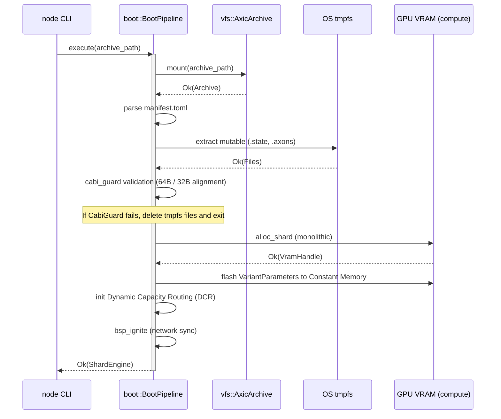

spec_boot

> Версия спеки: 1.0  
> Дата: 2026-06-23  
> Статус: Verified  

---

## §1. Идентификация

| Поле | Значение |
|---|---|
| Название | `boot` |
| Слой | Слой 6 — Runtime |
| Тип | Library (`lib`) |
| `no_std` | **Нет** (требует файловой системы ОС, временных директорий, а также вызовов API видеокарты и сетевых сокетов) |
| Описание | Инициализирует окружение ноды, монтирует виртуальные архивы, проверяет выравнивание бинарных данных и переносит параметры симуляции в видеопамять графического ускорителя. |

---

## §2. Стек и Окружение

### §2.1. Внутренние зависимости (inbound)

| Крейт | Что используется | Зачем |
|---|---|---|
| `types` | `MasterSeed`, `Tick` | Базовые типы времени и генератора псевдослучайных чисел. |
| `layout` | `VariantParameters`, `ShardStateSoA`, `StateFileHeader` | Разметка C-ABI структур, заголовки файлов и выравнивание для передачи в GPU. |
| `config` | `SimulationConfig`, `ZoneManifest` | Структуры конфигурации симуляции и AOT-метаданные манифеста. |
| `wire` | Сетевые C-ABI структуры | Подготовка сетевых DTO для стартовой конфигурации маршрутизатора. |
| `vfs` | `AxicArchive` | Интерфейс Zero-Copy доступа к виртуальной файловой системе `.axic` архива. |
| `ipc` | `ShmManager`, `ShmStateMachine` | Инициализация сегментов разделяемой памяти ОС и Lock-Free автомата для `weaver-daemon`. |
| `compute` | `ShardEngine` | Инициализация бэкенда вычислений и монолитное выделение VRAM. |
| `net` | `BspBarrier`, `RoutingTable` | Подготовка сетевых барьеров и запуск серверов маршрутизации. |

### §2.2. Внешние зависимости

| Crate | Версия | Зачем |
|---|---|---|
| `serde` | `=1.0.197` | Десериализация метаданных манифеста `manifest.toml`. |
| `toml` | `=0.8.23` | Парсинг TOML файлов из архива. |
| `tempfile` | `=3.10.1` | Безопасное управление временными директориями в ОС (`tmpfs`). |

### §2.3. Feature Flags

Секция не применима к данному крейту: Крейт не содержит собственных условных флагов компиляции.

---

## §3. Инварианты

Крейт `boot` реализует паттерн Stateful Pipeline для строгой изоляции фаз загрузки и предотвращения утечек системных ресурсов ОС.

### §3.1. Структурные инварианты

- **INV-BOOT-001**: *Строгая очередность фаз пайплайна*.
  - *Обоснование*: Инициализационный конвейер состоит из 8 фаз (`VfsMount` -> `Manifest` -> `RomExtract` -> `CabiGuard` -> `VramAlloc` -> `HwFlash` -> `DcrInit` -> `BspIgnite`). Фазы физически не могут выполняться вне очереди (например, аллокация VRAM невозможна без выровненных байт из `CabiGuard` и метаданных `Manifest`).
  - *Следствие нарушения*: Паника ОС, обращение по невалидным указателям, неопределенное поведение (UB) GPU-драйвера.
  - *Где проверяется*: Runtime `assert!` переходов внутренней стейт-машины.

- **INV-BOOT-002**: *RAII Fail-Fast (Изоляция ресурсов при сбоях)*.
  - *Обоснование*: Если любая фаза до `vram_alloc` возвращает `Err`, выделение видеопамяти не выполняется. Очистка временных файлов ОС обязана происходить неявно и гарантированно через реализацию трейта `Drop` для `BootPipeline` (RAII), чтобы не оставить мусор на диске даже при панике внутри фаз.
  - *Следствие нарушения*: Утечка VRAM, дескрипторов сокетов и "осиротевшие" временные файлы, блокирующие рестарт ноды.
  - *Где проверяется*: Интеграционный тест `test_fail_fast_rollback` с проверкой состояния ФС после сбоя.

- **INV-BOOT-005**: *RAM-Disk Mutability (Защита от износа SSD)*.
  - *Обоснование*: Мутабельные файлы (`.state` и `.axons`), извлекаемые из архива для работы рантайма, обязаны распаковываться строго в директорию, смонтированную в оперативной памяти ОС (например, `/dev/shm` на Linux). Интенсивная запись гигабайтов состояния симуляции на физический SSD-накопитель приведет к его быстрому аппаратному износу (Wear Leveling exhaustion).
  - *Следствие нарушения*: Деградация и физическая смерть NVMe/SSD накопителей на серверах кластера.
  - *Где проверяется*: Runtime проверка пути `tmpfs_dir` при инициализации пайплайна.

### §3.2. Семантические инварианты

- **INV-BOOT-003**: *C-ABI Guard (Аппаратный барьер выравнивания)*.
  - *Обоснование*: Перед отправкой в драйвер GPU (через `alloc_shard` / DMA), байты мутабельного состояния в распакованных файлах `.state` обязаны быть проверены на выравнивание по границе 64 байт, а в `.axons` — по границе 32 байт [spec_layout.md §3.1].
  - *Следствие нарушения*: Падение пропускной способности PCIe шины или аппаратный крах драйвера GPU (SIGBUS/Unaligned Access).
  - *Где проверяется*: Runtime `assert!` в фазе `cabi_guard` перед обращением к бэкенду вычислений.

- **INV-BOOT-004**: *Монолитная аллокация шарда (Flat Allocation)*.
  - *Обоснование*: Вся видеопамять VRAM под состояние шарда запрашивается у драйвера за один единственный атомарный вызов `alloc_shard`. Дробные вызовы системных аллокаторов (`cudaMalloc` / `hipMalloc`) запрещены.
  - *Следствие нарушения*: Фрагментация видеопамяти, OOM при долгой работе рантайма.
  - *Где проверяется*: Код-ревью фазы `vram_alloc` (ровно 1 вызов к API бэкенда).

### §3.3. Межкрейтовые инварианты

- **INV-CROSS-009**: *Изоляция мутабельных артефактов в tmpfs (TMPFS Extraction)*.
  - *Участники*: `vfs`, `boot`.
  - *Кто владелец проверки*: `vfs` (API экспорта).
  - *Обоснование*: Крейт `boot` обязан монтировать исходный `.axic` архив исключительно в режиме Read-Only (`INV-VFS-003`). Для работы мутабельных массивов `boot` вызывает метод `extract_file` из крейта `vfs`, чтобы безопасно скопировать `.state` и `.axons` во временную песочницу `tmpfs`, прежде чем отдать их рантайму. Это исключает Data Race на уровне файловой системы ОС при параллельном чтении архива разными процессами.
  - *Следствие нарушения*: Коллизии POSIX-блокировок, повреждение эталонного ROM-архива на диске.
  - *Где проверяется*: Загрузочный пайплайн в фазе `rom_extract`.

---

## §4. Публичный API

Крейт не предоставляет абстракций. Это жесткая однонаправленная стейт-машина загрузки, оперирующая путями ОС и вызовами к GPU-бэкенду.

### §4.1. Типы

#### BootPipeline

```rust
/// Контекст инициализации шарда. Гарантирует RAII-очистку tmpfs при сбоях (Fail-Fast).
pub struct BootPipeline {
    /// Путь к исходному Read-Only архиву `.axic`.
    pub archive_path: std::path::PathBuf,
    /// Временная директория ОС для мутабельных файлов (`.state`, `.axons`). 
    /// Семантика `Drop` этого типа гарантирует физическое удаление файлов при `Err`.
    pub tmpfs_dir: tempfile::TempDir,
}
```

- **Семантика**: Системный оркестратор загрузки шарда. Изолирует мутабельные бинарники от Read-Only ROM-архива.
- **Жизненный цикл**: Создается в точке входа `node` при запуске, живет строго до успешного завершения всех 8 фаз или первого `Err`, после чего уничтожается (чистя за собой ФС).
- **Ограничения на значения**: Директория `tmpfs_dir` обязана указывать на физический RAM-диск ОС (например, `/dev/shm` на Linux), чтобы избежать износа SSD при горячих записях.

#### BootPhase

```rust
/// Перечисление всех 8 изолированных фаз загрузки для телеметрии и отладки.
#[derive(Debug, Clone, Copy, PartialEq, Eq)]
pub enum BootPhase {
    /// Монтирование Read-Only .axic архива в виртуальную память через vfs
    VfsMount,
    /// Извлечение и парсинг manifest.toml
    Manifest,
    /// Эвакуация мутабельных бинарников во временную tmpfs
    RomExtract,
    /// Проверка выравнивания байт по границам 64 и 32 байт
    CabiGuard,
    /// Монолитная аппаратная аллокация шарда в видеопамяти
    VramAlloc,
    /// Заливка VariantParameters в Constant Memory GPU
    HwFlash,
    /// Инициализация Dynamic Capacity Routing
    DcrInit,
    /// Сборка сетевых BspBarrier
    BspIgnite,
}
```

- **Семантика**: Этапы последовательной стейт-машины загрузчика. Используется для логирования (`Tracing`) и точной локализации сбоев.
- **Ограничения на значения**: Выполняются строго последовательно от `VfsMount` до `BspIgnite`. Пропуск фаз аппаратно невозможен.

---

## §4.2. Трейты

В данном крейте публичные полиморфные трейты отсутствуют. Пайплайн загрузки представляет собой императивную, строго детерминированную процедуру.

---

## §4.3. Функции

#### impl BootPipeline

```rust
impl BootPipeline {
    /// Точка входа. Создает контекст, разворачивает tmpfs и прогоняет 8 фаз загрузки.
    pub fn execute(
        archive_path: &std::path::Path,
    ) -> Result<compute::ShardEngine, BootError>;
}
```

- **Назначение**: Полная инициализация ресурсов ноды и подготовка горячего рантайма.
- **Предусловия**: Файл `.axic` должен существовать, а у процесса должны быть права на создание директорий в системной `tmpfs`.
- **Постусловия**: Возвращает готовый и прогретый объект `ShardEngine`. Все мутабельные файлы успешно эвакуированы в память, константы залиты в L1-кэш GPU.
- **Сложность**: O(N) по времени (копирование `.state` и `.axons` из архива в `tmpfs`), O(N) по оперативной памяти.
- **Паника**: Никогда. Любой сбой (OOM VRAM, битый манифест, сбой I/O) перехватывается, возвращается `Err(BootError)`, а `Drop` структуры `BootPipeline` молча подчищает следы в ОС.

---

## §4.4. Константы и Магические Числа

| Константа | Значение | Тип | Семантика |
|---|---|---|---|
| — | Нет на текущем этапе | — | — |

---

## §5. Доменная Логика

Крейт `boot` представляет собой критический шлюз инициализации ноды (Слой 6). Его роль — преобразовать статическое описание биологической сети (хранящееся в архивах `.axic`) в готовые к исполнению структуры данных в физической видеопамяти графического процессора.

Выделение `boot` в отдельный крейт решает проблему сильного связывания и утечки абстракций, существовавшую в легаси-коде. Новая архитектура Stateful Pipeline гарантирует строгую изоляцию фаз загрузки, что предотвращает утечки системных ресурсов (сетевых сокетов, VRAM и файловых дескрипторов) при сбоях в процессе инициализации (принцип Fail-Fast).

Доменная задача крейта — обеспечить безопасный переход от "мертвого" архивного представления данных к "живому" состоянию симуляции, полностью освободив горячий рантайм (`runtime`) от знаний об особенностях дисковых архивов, TOML-манифестов и проверках выравнивания памяти.

---

## §6. Алгоритмы и Формулы

### §6.1. Пайплайн Stateful Pipeline

**Вход**: Путь к файлу архива `.axic` и профиль запуска.
**Выход**: Инициализированный объект `ShardEngine` и готовые сетевые барьеры `BspBarrier`.
**Детерминизм**: Да.

**Логика:**
Конвейер строго последователен. Если любая фаза возвращает `Err` до этапа выделения видеопамяти, объект `tmpfs` очищает временные файлы, предотвращая утечку дискового пространства и дескрипторов ОС.

**Псевдокод:**
```rust
fn run_boot_pipeline(archive_path: Path, _profile: Profile) -> Result<ShardEngine, BootError> {
    // 1. vfs_mount — монтирует Read-Only .axic архив в виртуальную память через крейт vfs
    let archive = vfs::mount(archive_path)?;

    // 2. manifest — извлекает и парсит manifest.toml (AOT-метаданные от baker)
    let manifest = parse_manifest(&archive)?;

    // 3. rom_extract — физически эвакуирует мутабельные бинарники (.state, .axons) в tmpfs
    let tmpfs = rom_extract(&archive, &manifest)?;

    // 4. cabi_guard — проверяет выравнивание байт (64B для состояния, 32B для аксонов)
    cabi_guard::validate_alignment(&tmpfs)?;

    // 5. vram_alloc — единая монолитная аппаратная аллокация шарда в видеопамяти через compute-api
    let shard_engine = compute::alloc_shard(&manifest)?;

    // 6. hw_flash — заливка VariantParameters прямо в Constant Memory GPU
    shard_engine.upload_variant_params(&tmpfs.variants)?;

    // 7. dcr_init — инициализация Dynamic Capacity Routing (резервирование VRAM под Ghost-аксоны)
    shard_engine.init_dynamic_capacity_routing()?;

    // 8. bsp_ignite — сборка сетевых BspBarrier и передача готового контекста в горячий runtime
    net::ignite_bsp_barrier(&manifest)?;

    Ok(shard_engine)
}
```

**Численный пример:**

| Вход | Ожидаемый выход | Комментарий |
|---|---|---|
| Валидный архив `.axic` и профиль | `Ok(ShardEngine)` | Успешная полная инициализация |
| Невыровненный файл `.state` (59 байт) | `Err(BootError::CabiGuard)` | Отклонение на фазе 4, очистка `tmpfs` без выделения VRAM |

---

## §7. Структуры Данных и Memory Layout

Секция не применима к данному крейту: Крейт не определяет собственных бинарных структур данных в памяти и оперирует типами из крейтов `layout` и `wire`.

---

## §8. Граничные Случаи и Особые Сценарии

### §8.1. Граничные значения

| # | Ситуация | Ожидаемое поведение |
|---|---|---|
| E-127 | Невыровненные байты в файле `.state` или `.axons` | Фаза `cabi_guard` обнаруживает некорректное выравнивание (не кратное 64 байтам для `.state` или 32 байтам для `.axons`) и возвращает ошибку `BootError::CabiGuard`. |
| E-128 | Недостаточно свободного места в `tmpfs` при распаковке | Фаза `rom_extract` падает с ошибкой `BootError::RomExtract` и инициирует удаление всех созданных временных файлов. |
| E-129 | Отсутствие `manifest.toml` в `.axic` архиве | Фаза `manifest` возвращает ошибку `BootError::Manifest` с описанием отсутствия файла. |
| E-130 | Невалидный TOML в `manifest.toml` | Возвращается ошибка десериализации, пайплайн прерывается. |

### §8.2. Состояния гонки и конкурентность

| # | Сценарий | Защита |
|---|---|---|
| R-041 | Параллельный запуск двух инстансов ноды с использованием одного пути `tmpfs` | Использование уникальных PID или UUID в названиях временных директорий, создаваемых `rom_extract`. |
| R-042 | Конкурентный доступ к исходному `.axic` архиву при параллельной загрузке | Крейт `boot` монтирует архивы исключительно в режиме Read-Only, исключая конфликты записи. |

### §8.3. Деградация и Recovery

| # | Отказ | Поведение | Восстановление |
|---|---|---|---|
| D-035 | Ошибка Out-Of-Memory (OOM) при аллокации VRAM на фазе `vram_alloc` | `compute-api` возвращает ошибку OOM. Пайплайн `boot` перехватывает её, освобождает все временные файлы `tmpfs`, закрывает дескрипторы и возвращает `BootError::VramExhausted`. GPU не остается в зависшем состоянии. | Вызывающий процесс (оркестратор `node`) может принять решение о переключении на CPU-бэкенд (`compute-cpu`) или завершить работу. |

---

## §9. Ошибки

Крейт `boot` агрегирует ошибки из нижележащих слоев VFS, конфигурации и вычислений, превращая их в единую таксономию ошибок загрузки.

### §9.1. Перечисление ошибок

```rust
#[derive(Debug)]
pub enum BootError {
    /// Ошибка монтирования архива VFS
    VfsMount(vfs::VfsError),
    /// Ошибка манифеста (отсутствует или поврежден)
    Manifest(String),
    /// Ошибка при извлечении файлов в tmpfs
    RomExtract(std::io::Error),
    /// Нарушение выравнивания байт
    CabiGuard { expected: usize, actual: usize },
    /// Недостаточно VRAM для аллокации
    VramExhausted,
    /// Ошибка при инициализации барьера или сети
    NetworkInit(String),
}
```

### §9.2. Стратегия обработки

| Ошибка | Восстановимая? | Рекомендация вызывающему |
|---|---|---|
| `VfsMount` | Нет | Проверить целостность файла архива `.axic` и перезапустить процесс. |
| `Manifest` | Нет | Перегенерировать архив с помощью `baker`. |
| `RomExtract` | Да | Освободить место на диске во временной файловой системе и попробовать снова. |
| `CabiGuard` | Нет | Ошибка сборки модели. Перезапустить фазу baking в `baker`. |
| `VramExhausted` | Да | Переключить бэкенд на CPU (`compute-cpu`) или уменьшить размер модели. |
| `NetworkInit` | Да | Проверить доступность портов и настройки сети, повторить попытку. |

### §9.3. Паники

| Условие | Почему паника, а не `Err` |
|---|---|
| Нарушение порядка вызова фаз пайплайна (INV-BOOT-001) | Невосстановимая ошибка логики управления процессом, сигнализирующая о баге в самом коде загрузчика. |

---

## §10. Зависимости и Интеграция

### §10.1. Что крейт потребляет (inbound)

| Крейт-источник | Что используем | Какой контракт ожидаем |
|---|---|---|
| `vfs` | `AxicArchive` | Доступ к файлам внутри архива за $O(1)$ без избыточных аллокаций памяти ([spec_vfs.md §4.1]). |
| `config` | `SimulationConfig` | Полностью валидные и прошедшие проверку параметры симуляции ([spec_config.md §4.1]). |
| `compute` | `ShardEngine` | Поддержка создания экземпляра движка и единый вызов аллокации VRAM ([spec_compute.md §4.1]). |
| `net` | `BspBarrier` | Возможность инициализации сетевых барьеров на этапе загрузки ([spec_net.md §4.1]). |

### §10.2. Кто потребляет крейт (outbound / обратные зависимости)

| Крейт-потребитель | Что использует | Какой контракт мы обязаны сохранить |
|---|---|---|
| `node` | Точку входа запуска симуляции `BootPipeline` | Возврат полностью готового к работе рантайма `ShardEngine` или детальной ошибки инициализации при сбое. |

### §10.3. Диаграмма взаимодействия

Взаимодействие компонентов при инициализации с откатом при сбое:



---

## §11. Стратегия Тестирования

Стратегия тестирования крейта `boot` сфокусирована на гарантиях аппаратной изоляции ОС-ресурсов (tmpfs), защите от утечек при прерывании пайплайна (Fail-Fast) и проверках C-ABI выравнивания до обращения к драйверу видеокарты.

### §11.1. Юнит-тесты

| Тест | Что проверяет | Связанный инвариант |
|---|---|---|
| test_boot_pipeline_sequence_validation | Вызов фаз пайплайна в неправильном порядке вызывает панику (внутренняя стейт-машина прерывает работу). | INV-BOOT-001 |
| test_cabi_guard_alignment_check | Проверка `cabi_guard`. Передача файла `.state`, размер которого не кратен 64 байтам (или `.axons` не кратного 32), немедленно возвращает `BootError::CabiGuard`. | INV-BOOT-003, E-127 |
| test_tmpfs_ramdisk_location_enforcement | Проверка `tmpfs_dir`. Если путь директории монтирования не указывает на RAM-диск ОС (например, `/dev/shm`), пайплайн возвращает ошибку (защита ресурса SSD). | INV-BOOT-005 |
| test_flat_allocation_single_call | Проверка фазы `vram_alloc`. Мок-объект `compute-api` верифицирует, что метод `alloc_shard` вызывается строго один раз для всего монолитного массива памяти. | INV-BOOT-004 |
| test_fail_fast_on_missing_manifest | Отсутствие `manifest.toml` в `.axic` архиве прерывает загрузку с ошибкой `BootError::Manifest` до создания `tmpfs`. | E-129 |

### §11.2. Property-based тесты

Секция не применима к данному крейту: `boot` не производит сложной математики или трансформаций данных, требующих Fuzz-генерации пространств значений.

### §11.3. Интеграционные тесты

| Тест | Крейты-участники | Сценарий | Связанный инвариант / Граничный случай |
|---|---|---|---|
| test_fail_fast_rollback | boot, vfs, compute | Искусственный сбой на фазе `cabi_guard` (фаза 4). Проверяется, что метод `alloc_shard` не был вызван, а `Drop` контекста `BootPipeline` физически удалил все созданные файлы из `tmpfs`. | INV-BOOT-002 |
| test_full_boot_flow | boot, vfs, compute, net | Успешный полный цикл: монтирование `vfs`, экстракция в `tmpfs`, C-ABI проверка, аллокация VRAM и запуск сетевых барьеров. | INV-CROSS-009 |
| test_vram_exhaustion_recovery | boot, compute-api | Мок `alloc_shard` возвращает `OutOfMemory`. `boot` перехватывает его, откатывает `tmpfs` и возвращает `BootError::VramExhausted` без зависания GPU-контекста. | D-035 |

### §11.4. Тесты производительности

| Бенчмарк | Метрика | Порог |
|---|---|---|
| bench_cabi_guard_validation | Latency проверки C-ABI выравнивания | < 50 ms для файлов объемом 100 MB |
| bench_hw_flash | Latency заливки `VariantParameters` в Constant Memory GPU | < 10 ms |


---

## §12. Бюджеты и Ограничения

### §12.1. Память

| Ресурс | Бюджет | Как считается |
|---|---|---|
| Временные файлы в `tmpfs` (RAM ОС) | 2x размер мутабельных артефактов | Объем файлов `.state` и `.axons`, эвакуируемых из архива. |
| Оверхед VRAM | 0 байт | Крейт `boot` не удерживает собственного состояния в видеопамяти после завершения фазы инициализации. |

### §12.2. Латентность

| Операция | Бюджет (p99) | Условия |
|---|---|---|
| Полный цикл инициализации (до `BspIgnite`) | < 1 сек | Модель 1M нейронов, чтение NVMe диска. |

### §12.3. Compile-time

| Ограничение | Значение |
|---|---|
| Максимальное время сборки крейта | < 5s (release) |


---

## Приложение A — Глоссарий

| Термин | Определение |
|---|---|
| `tmpfs` | Временная файловая система в оперативной памяти ОС для быстрого доступа к мутабельным состояниям без износа SSD. |
| `cabi_guard` | Процедура валидации выравнивания байтовых данных перед передачей в C-ABI драйвера видеокарты. |
| `Dynamic Capacity Routing` | Механизм резервирования адресов и памяти GPU под будущие связи аксонов. |

---

Checklist Полноты (A.3)

- ✅ Все публичные типы описаны в §4
- ✅ Все инварианты из §3 имеют соответствующий пункт в §11 (тесты)
- ✅ Все `Err`-варианты перечислены в §9
- ✅ Все крейты-потребители перечислены в §10.2
- ✅ Нет ни одного «магического числа» без объяснения
- ✅ Все формулы имеют единицы измерения
- ✅ Граничные случаи из §8 покрыты тестами в §11
