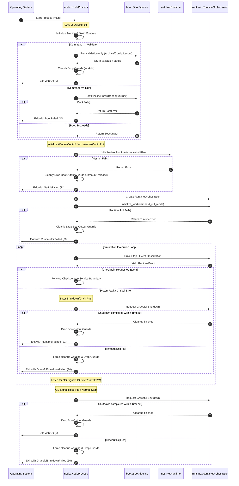

# spec_node

> Версия спеки: 2.0  
> Дата: 2026-06-29  
> Статус: Draft  

---

## §1. Идентификация

| Поле | Значение |
|---|---|
| **Имя крейта** | `node` |
| **Слой** | Слой 6 — Node Process (`L6` / Процесс Ноды) |
| **Тип** | Binary (`bin`) |
| **no_std** | Нет (`false`) — требуется `std` для интеграции с OS, парсинга CLI, логирования и управления асинхронным рантаймом Tokio. |
| **Описание** | Тонкий системный/процессный слой композиции (Thin OS/Process Composition Layer), выступающий единой точкой входа (entrypoint) исполняемого файла ноды. Отвечает за парсинг CLI-аргументов, инициализацию подсистемы логирования и трассировки, создание Tokio-окружения для служебных задач, запуск [BootPipeline](./boot_spec.md), инициализацию сетевого рантайма и оркестратора, обработку системных сигналов, управление жизненным циклом процесса, корректное удержание RAII-гардов ресурсов и маппинг ошибок выполнения в стабильные коды выхода OS. |

---

## §2. Стек и Окружение

### §2.1. Внутренние зависимости (inbound)

| Крейт | Что используется | Зачем |
|---|---|---|
| `boot` (Слой 6) | [BootPipeline](./boot_spec.md), [BootInput](./boot_spec.md), [BootOutput](./boot_spec.md), [BootError](./boot_spec.md), [ShardInitPolicy](./boot_spec.md) | Инициализация и подготовка ресурсов движка через загрузочный конвейер. |
| `runtime` (Слой 6) | [RuntimeOrchestrator](./runtime_spec.md), [RuntimeError](./runtime_spec.md), [RuntimeEvent](./runtime_spec.md), [RuntimeCommand](./runtime_spec.md), [WeaverControl](./runtime_spec.md) | Создание, запуск и управление жизненным циклом симуляционных воркеров. |
| `net` (Слой 5) | `NetRuntime` (или фабрика создания сетевого рантайма), `NetError` | Инициализация активного сетевого стека из декларативного плана инициализации. |

> [!NOTE]
> Крейт `node` должен минимизировать прямые зависимости от инфраструктурных слоев движка. Прямой импорт `vfs`, `config`, `layout`, `ipc`, `compute`, `transport`, `protocol`, `wire` запрещен.
> Если совместное использование типов (например, перечислений предпочтений бэкенда вычислителя) неизбежно, они должны реэкспортироваться через `boot`. Иное квалифицируется как технический долг.

### §2.2. Запрещенные зависимости (Forbidden Dependencies)

Крейту `node` категорически запрещено импортировать напрямую следующие компоненты:
1. Крейты физических бэкендов вычислений: `compute-cuda`, `compute-hip`, `compute-cpu`.
2. Библиотеки транспортного и сетевого протоколов: `transport`, `protocol`, `wire`.
3. Модули топологии и компиляции: `baker`, `topology`, `weaver-daemon` (как Rust-библиотека).
4. Низкоуровневые системные FFI API (`libc` / `windows-sys` для прямой работы с shared memory, сокетами или контекстом видеокарт).
5. API разбора и валидации форматов TOML/JSON/архивов (`config`, `layout`, `vfs`).

### §2.3. Внешние зависимости

| Crate | Версия | Сфера использования |
|---|---|---|
| `clap` | `=4.5.60` | Высокопроизводительный парсинг CLI аргументов и декларативная CLI-схема. |
| `tokio` | `=1.50.0` | Асинхронный рантайм, строго ограниченный служебными задачами (телеметрия, управляющий HTTP/RPC, перехват OS-сигналов). |
| `tracing` | `=0.1.40` | Системный фасад логирования (версия должна быть синхронизирована с workspace-level). |
| `tracing-subscriber` | `=0.3.22` | Настройка формата и направлений вывода логов/трассировки. |
| `thiserror` | `=1.0.69` | Типизация системных сбоев запуска процесса ([NodeError](./node_spec.md)). |

> [!IMPORTANT]
> Использование `anyhow` в качестве основного механизма обработки ошибок запрещено. Все ошибки на верхнем уровне процесса должны мапиться в типизированную структуру [NodeError](./node_spec.md) для однозначной классификации.

---

## §3. Границы Владения (Ownership Boundaries)

| Модуль / Крейт | Монопольная Зона Владения (Single Source of Truth) | Строгие Запреты (Что категорически запрещено в крейте) |
|---|---|---|
| **`node`** | Определение CLI-схемы, параметров bootstrap-окружения, настройка `tracing`/`logging`, OS signal handling, высокоуровневый процессный цикл ноды, ограничение потоков Tokio, инициализация `WeaverControl` из [WeaverControlInit](./boot_spec.md), логика checkpoint-форвардинга, маппинг ошибок в коды возврата [NodeExitCode](./node_spec.md). | Запрещен парсинг `.axic` архивов, TOML файлов конфигурации, вычисление смещений и валидация разметки памяти, прямое управление SHM/mmap, продвижение симуляционных тиков, логика Day/Night циклов воркеров, обработка пакетов сетевого уровня, прямые вызовы CUDA/HIP API, управление сокетными буферами. |
| **`boot`** | Загрузочный пайплайнинг, инициализация аппаратных и виртуальных ресурсов, CLI-facing DTOs. | Запрещен перехват OS-сигналов, запуск Tokio-рантайма, владение CLI-парсером процесса. |
| **`runtime`** | Воркер-треды симуляции, продвижение тика шарда, оркестрация вычислений, логика сбоев воркеров. | Запрещена работа с Tokio-потоками для вычислительных задач, прямые вызовы OS-kill для демонов. |
| **`net`** | Инициализация и запуск сетевого рантайма, управление таблицами маршрутизации (route tables), информацией о соседях (neighbor state), оркестрация сети, создание через публичный Net API. | Запрещен запуск системных процессов, парсинг CLI, прямое владение буферными пулами сокетов (зона `transport`). |

---

## §4. Концептуальная API-Модель

Публичный интерфейс крейта `node` определяет схему аргументов командной строки, структуру кодов завершения процесса и механизм запуска:

```rust
use std::path::PathBuf;
use boot::BootError;
use runtime::RuntimeError;
use net::NetError;

/// Доступные команды процесса
#[derive(Debug, Clone, PartialEq, Eq)]
pub enum NodeCommand {
    /// Запустить симуляцию в боевом режиме (полный boot + net + runtime)
    Run,
    /// Только валидация: проверка архива, конфигов и разметки памяти (без compute/ipc/net/runtime)
    Validate,
    /// Сформировать и вывести в stdout нормализованный план запуска без старта рантайма
    PrintPlan,
}

/// Аргументы командной строки
pub struct NodeCli {
    /// Путь к входящему архиву симуляции (.axic)
    pub archive_path: PathBuf,
    /// Корневая директория для временного рабочего пространства (tmpfs)
    pub workdir_root: Option<PathBuf>,
    /// Директория для размещения runtime-сокетов и файлов управления
    pub runtime_dir: Option<PathBuf>,
    /// Переопределение бэкенда вычислений (CPU, CUDA, HIP)
    pub backend: Option<String>,
    /// Переопределение политики инициализации воркеров
    pub shard_init_policy: Option<String>,
    /// Уровень логирования процесса
    pub log_level: String,
    /// Выбираемая команда (субкоманда в CLI)
    pub command: NodeCommand,
    /// Таймаут на выполнение безопасного останова процесса (мс)
    pub shutdown_timeout_ms: u64,
    /// Лимит рабочих потоков в асинхронном рантайме Tokio
    pub tokio_worker_threads: usize,
}

/// Стабильные коды завершения процесса на уровне операционной системы
#[repr(i32)]
pub enum NodeExitCode {
    /// Успешное выполнение, валидация или штатный graceful shutdown
    Ok = 0,
    /// Ошибка разбора или валидации параметров CLI/окружения
    CliError = 2,
    /// Сбой на этапе выполнения BootPipeline
    BootFailed = 10,
    /// Ошибка инициализации/запуска сетевого рантайма
    NetInitFailed = 11,
    /// Ошибка запуска/инициализации воркеров оркестратора
    RuntimeInitFailed = 20,
    /// Фатальный сбой симуляции в процессе работы (Runtime Fault)
    RuntimeFaulted = 21,
    /// Превышен таймаут штатного завершения при получении сигнала или разгрузке аварии
    GracefulShutdownFailed = 30,
    /// Нарушение внутренних инвариантов процесса или необработанный сбой
    InternalError = 70,
}

/// Типизированные ошибки процесса
#[derive(Debug, thiserror::Error)]
pub enum NodeError {
    #[error("CLI validation failed: {0}")]
    Cli(String),
    #[error("Boot pipeline failed: {0}")]
    Boot(#[from] BootError),
    #[error("Network initialization failed: {0}")]
    Net(#[from] NetError),
    #[error("Runtime engine error: {0}")]
    Runtime(#[from] RuntimeError),
    #[error("Graceful shutdown timed out")]
    ShutdownTimeout,
    #[error("Logging subsystem initialization failed: {0}")]
    LoggingInitFailed(String),
}

/// Представитель процесса ноды
pub struct NodeProcess;

impl NodeProcess {
    /// Точка входа для запуска процесса, преобразующая результат выполнения в exit code
    pub fn run(cli: NodeCli) -> NodeExitCode;
}
```

---

## §5. Поведение и Системная Интеграция (Behavior & System Integration)

### §5.1. Процесс Запуска и Жизненный Цикл



#### Детальные шаги жизненного цикла:

1. **Парсинг CLI:** Разбор аргументов с помощью `clap`. Любая синтаксическая ошибка приводит к немедленному завершению с `CliError`.
2. **Предварительная валидация:** Проверка путей и совместимости аргументов до аллокации тяжелых ресурсов.
3. **Инициализация Tracing:** Запуск `tracing-subscriber` строго один раз. Ошибки инициализации приводят к `CliError` или `InternalError`.
4. **Запуск Tokio:** Создание изолированного асинхронного рантайма Tokio с жестким лимитом рабочих потоков (`tokio_worker_threads`).
5. **Подготовка BootInput:** Трансляция параметров CLI во внутреннюю структуру [BootInput](./boot_spec.md).
6. **Выбор Ветки Выполнения:**
   * **Команда `Validate`:** Запуск пайплайна загрузки строго в режиме проверки (архив, парсинг конфигурации, лимиты, выравнивание layout). Компиляция сетевых планов, аллокация VRAM (compute engine) и создание IPC-сегментов **не производятся**. После валидации временные гарды очищаются (drop), процесс завершается с `Ok`.
   * **Команда `PrintPlan`:** Загрузка метаданных, построение и вывод плана маршрутизации/запуска в stdout без аллокации вычислителей и запуска рантайма.
   * **Команда `Run`:** Полноценное выполнение `BootPipeline::run()`. В случае сбоя — выход с кодом `BootFailed`.
7. **Создание WeaverControl:** Создание объекта управления демоном координации из [WeaverControlInit](./boot_spec.md).
8. **Инициализация Сети:** Передача `NetInitPlan` в API крейта `net` для инициализации сетевого рантайма (`NetRuntime`).
   * В случае сбоя инициализации — нода производит безопасный сброс (drop) всех ресурсов из `BootOutput` (включая работу с временными директориями и IPC-гардами) и выходит с кодом `NetInitFailed`.
9. **Создание Оркестратора:** Конструирование [RuntimeOrchestrator](./runtime_spec.md) и запуск рабочих потоков через `initialize_workers`.
   * В случае сбоя инициализации воркеров — нода выполняет сброс (drop) ресурсов `BootOutput` и выходит с кодом `RuntimeInitFailed`.
10. **Процессный цикл:** `node` запускает основной цикл ожидания событий рантайма, пересылает запросы на чекпоинты во внешние сервисы и отслеживает сигналы завершения.
11. **Обработка Аварийных Ситуаций (Runtime Fault Path):**
    * При получении событий критического сбоя (`SystemFault`) или возврате `RuntimeError` из цикла выполнения, нода незамедлительно переводит рантайм в режим штатного останова (shutdown/drain path).
    * `node` отправляет запрос `runtime.shutdown()` и дожидается остановки потоков.
    * По завершении останова нода сбрасывает гарды `BootOutput` и возвращает OS код `RuntimeFaulted` (21).
    * Если во время разгрузки аварийного состояния превышен таймаут `shutdown_timeout_ms`, нода логирует предупреждение, форсированно освобождает доступные системные гарды и завершает работу с кодом `GracefulShutdownFailed` (30).
12. **Штатное завершение:** При получении внешнего OS-сигнала нода посылает команду на Graceful Shutdown, ожидает завершения, освобождает гарды `BootOutput` и выходит с кодом `Ok` (0) (или `GracefulShutdownFailed` при таймауте).

---

### §5.2. Обработка сигналов OS (OS Signal Handling)
* `node` настраивает обработчики сигналов `SIGINT` (Ctrl+C) и `SIGTERM`.
* **Первый сигнал:** Инициирует команду graceful shutdown для [RuntimeOrchestrator](./runtime_spec.md). Нода блокирует выход и ждет завершения воркеров в течение `shutdown_timeout_ms`.
* Если рантайм успел завершить очистку, процесс выходит с кодом `Ok` (0).
* Если таймаут истек, а рантайм не завершился, процесс выходит с кодом `GracefulShutdownFailed` (30).
* **Второй сигнал:** При повторном получении сигнала прерывания до истечения таймаута нода может переключиться на ускоренный аварийный выход, при этом стараяся сохранить целостность структур данных (не допуская повреждения файлов симуляции).
* Прямое принудительное уничтожение дочерних процессов/демонов является зоной ответственности внешнего супервизора, а не логики внутри ноды.

---

### §5.3. Управление процессом Weaver (Weaver Process & Control)
* Рантайм оперирует абстрактным интерфейсом `Box<dyn WeaverControl>`.
* Нода инициализирует конкретную реализацию этого трейта на основе данных из [WeaverControlInit](./boot_spec.md).
* Крейт `node` не должен импортировать `weaver-daemon` как зависимость сборки Rust.
* Если запуск демона `weaver` контролируется внешней системой (оркестратором контейнеров или супервизором OS), `node` создает прокси-реализацию `WeaverControl`, транслирующую команды по сети или через IPC-сокет управления.
* Внутренний рантайм симуляции никогда не вызывает системные API принудительного завершения процессов (`kill`) напрямую.

---

### §5.4. Ограничение асинхронного контекста (Tokio Containment)
* Использование асинхронного рантайма Tokio **категорически запрещено** для:
  * Вычислений в основных воркерах симуляции.
  * Продвижения шагов основного цикла симуляции.
  * Вызовов блокирующих API вычислительных бэкендов (CUDA/HIP).
* Tokio допускается и изолируется исключительно для:
  * Обработки OS-сигналов прерывания.
  * Хостинга HTTP/RPC эндпоинтов управления (если делегировано сетевым слоем `net`).
  * Сбора и отправки системной телеметрии.
* Число рабочих потоков Tokio жестко ограничивается параметром конфигурации `tokio_worker_threads` (по умолчанию 2-4 потока), чтобы исключить кражу процессорного времени у основных вычислительных ядер симуляции.
* Сбои во внутренних асинхронных задачах Tokio транслируются во внутренние события или ошибки ноды (`NodeError`/`NodeEvent`). Если сбой Tokio-задачи критичен для симуляции, нода отправляет команду `RuntimeCommand::RequestShutdown` в оркестратор для инициирования стандартного конвейера останова. События `RuntimeEvent` зарезервированы строго для обратной связи от ядра симуляции.

---

### §5.5. Размещение на ядрах CPU и приоритеты (CPU Affinity & Priority)
* Настройка привязки потоков к физическим ядрам процессора (CPU Affinity) и установка приоритетов реального времени процесса определяются политиками OS, переданными через CLI или переменные окружения.
* `node` транслирует эти политики в виде хинтов/структур конфигурации в рантайм или специализированный платформенный адаптер.
* После передачи конфигурации и старта воркеров, `node` не вмешивается во внутреннее распределение потоков рантайма.
* Конкретная библиотека привязки ядер для платформ Linux и Windows выносится в разряд открытого технического долга.

---

### §5.6. Служба Чекпоинтов (Checkpoint Service)
* При возникновении события `CheckpointRequested` от воркеров симуляции, оркестратор рантайма перенаправляет это событие в `node`.
* `node` отвечает за передачу запроса во внешнюю службу сохранения чекпоинтов. Вычислительным воркерам запрещено самостоятельно производить запись файлов на диск во время симуляции.
* Если внешняя служба недоступна или возвращает ошибку, нода действует согласно настроенной политике (остановка процесса с ошибкой, игнорирование или буферизация).
* Спецификация API внешней службы чекпоинтов является открытым техническим долгом.

---

## §6. Семантические Инварианты

- **INV-NODE-001**: *CLI validation priority*. Валидация аргументов CLI выполняется до запуска `BootPipeline` и выделения системных ресурсов.
- **INV-NODE-002**: *Boot safety lock*. Запуск рантайма симуляции невозможен, если выполнение `BootPipeline` завершилось с ошибкой.
- **INV-NODE-003**: *Tick execution isolation*. Поток `node` никогда самостоятельно не продвигает счетчик тиков и не производит вычислений симуляции.
- **INV-NODE-004**: *Engine format encapsulation*. `node` никогда напрямую не парсит `.axic` архивы, TOML конфигурации или файлы разметки памяти.
- **INV-NODE-005**: *Network stack isolation*. `node` не импортирует напрямую крейты `transport`, `protocol` или `wire`.
- **INV-NODE-006**: *Compute backend abstraction*. `node` не зависит напрямую от конкретных вычислительных бэкендов (`compute-cuda`, `compute-hip`).
- **INV-NODE-007**: *RAII guard lifetime*. Системные и файловые гарды, полученные из `BootOutput`, должны удерживаться в памяти процесса до тех пор, пока рантайм полностью не завершит свою работу и воркеры не будут уничтожены. Любой аварийный или промежуточный выход обязан производить корректный сброс (drop) гардов.
- **INV-NODE-008**: *Graceful shutdown trigger*. Первый полученный сигнал `SIGINT` или `SIGTERM` должен инициировать процедуру graceful shutdown, а не принудительный останов.
- **INV-NODE-009**: *Stable exit code mapping*. Любое аварийное или штатное завершение процесса должно возвращать стабильный, задокументированный код возврата из [NodeExitCode](./node_spec.md).
- **INV-NODE-010**: *Tokio execution boundary*. Асинхронные потоки рантайма Tokio не должны привлекаться к вычислениям шарда.
- **INV-NODE-011**: *Single-pass logging init*. Логирование инициализируется ровно один раз на самом старте процесса, до инициализации каких-либо подсистем.
- **INV-NODE-012**: *Validate-only resource exclusion*. Запуск ноды с командой `Validate` гарантирует отсутствие аллокации вычислительных движков (compute engines), создания IPC-сегментов (SHM, Swapchains) и запуска `NetRuntime` или рантайм воркеров.
- **INV-NODE-013**: *Immutable route tables*. Процесс ноды не изменяет таблицы маршрутизации сети напрямую, делегируя это сетевому рантайму.

---

## §7. Тестовые Сценарии (Golden Tests)

Крейт `node` обязан быть покрыт набором автоматических тестов:

1. **Контроль CLI при отсутствии архива (`test_cli_missing_archive_rejected_before_boot`)**: Запуск ноды без указания пути к `.axic` архиву. Процесс завершается с кодом `CliError` (2) до вызова загрузчика.
2. **Контроль CLI при неверном бэкенде (`test_cli_invalid_backend_rejected`)**: Указание несуществующего вычислительного бэкенда в CLI. Процесс завершается с кодом `CliError` (2) на этапе валидации CLI.
3. **Инициализация логирования один раз (`test_tracing_initialized_once`)**: Проверка логов запуска на дублирование инициализации подписчиков трассировки. Инициализация выполняется ровно один раз, повторные вызовы игнорируются или возвращают ошибку.
4. **Валидация без выделения ресурсов (`test_validate_runs_only_validation_without_allocation`)**: Запуск с командой `Validate`. Проверяются архивы, конфигурации и разметка памяти, при этом тяжелые ресурсы (VRAM, IPC, NetRuntime) не выделяются. Выход с кодом `Ok` (0).
5. **Маппинг ошибок Boot (`test_boot_failure_maps_to_boot_failed_exit_code`)**: Эмуляция ошибки внутри `BootPipeline::run`. Нода завершает работу с кодом `BootFailed` (10).
6. **Блокировка запуска рантайма при сбое Boot (`test_node_does_not_start_runtime_after_boot_error`)**: Попытка запуска при сбое загрузчика. Оркестратор рантайма не инициализируется и не вызывается.
7. **Время жизни гардов (`test_boot_output_guards_live_until_runtime_shutdown`)**: Проверка времени жизни гардов памяти и диска при нормальном запуске и останове. Файловые и SHM ресурсы размонтируются только после полного завершения воркеров рантайма.
8. **Инициализация сети через публичный API (`test_net_runtime_initialized_through_net_api_only`)**: Инициализация сети в ноде. Нода использует строго публичный контракт `net` для создания инстанса сети.
9. **Контроль прямых сетевых зависимостей (`test_no_direct_transport_protocol_wire_dependencies`)**: Статический анализ дерева зависимостей крейта `node`. Отсутствуют прямые зависимости от `transport`, `protocol`, `wire`.
10. **Контроль прямых вычислительных зависимостей (`test_no_direct_compute_backend_dependencies`)**: Статический анализ дерева зависимостей крейта `node`. Отсутствуют прямые зависимости от `compute-cuda`, `compute-hip`, `compute-cpu`.
11. **Реакция на SIGINT (`test_signal_sigint_requests_runtime_shutdown`)**: Отправка сигнала `SIGINT` (Ctrl+C) в работающий процесс ноды. Нода посылает команду останова оркестратору, дожидается завершения и выходит с кодом `Ok` (0).
12. **Реакция на SIGTERM (`test_signal_sigterm_requests_runtime_shutdown`)**: Отправка сигнала `SIGTERM` в работающий процесс ноды. Нода инициирует корректное завершение и выходит с кодом `Ok` (0).
13. **Превышение таймаута останова (`test_second_signal_or_timeout_returns_shutdown_failed`)**: Превышение лимита ожидания останова или повторный сигнал прерывания. Нода аварийно завершает работу с кодом `GracefulShutdownFailed` (30).
14. **Маппинг критического сбоя воркера (`test_runtime_fault_maps_to_runtime_faulted_exit_code`)**: Критический сбой воркера рантайма (`SystemFault`). Нода переходит в drain path, дожидается завершения воркеров, сбрасывает гарды и возвращает `RuntimeFaulted` (21).
15. **Перенаправление чекпоинтов (`test_checkpoint_request_forwarded_to_service`)**: Отправка события `CheckpointRequested` из рантайма. Нода перехватывает событие и вызывает внешнюю службу сохранения.
16. **Контроль лимитов Tokio воркеров (`test_tokio_worker_thread_limit_applied`)**: Проверка реального количества потоков в пуле Tokio. Количество потоков строго соответствует значению `tokio_worker_threads`.
17. **Изоляция вычислительных воркеров от Tokio (`test_compute_workers_not_spawned_on_tokio`)**: Анализ системных ID потоков вычислительных воркеров. Ни один вычислительный поток не принадлежит пулу Tokio.
18. **Интерфейс WeaverControl (`test_weaver_control_proxy_created_from_boot_output`)**: Проверка создания `WeaverControl` при внешнем управлении. Создается прокси-интерфейс связи с демоном без линковки его библиотеки.
19. **Очистка гардов Validate (`test_validate_drops_guards_cleanly`)**: Запуск `Validate` с созданием временной директории. Временное рабочее пространство удаляется до завершения процесса.
20. **Стабильность кодов завершения (`test_exit_codes_are_stable`)**: Тестирование соответствия возвращаемых кодов выхода спецификации. Все коды возврата соответствуют значениям из [NodeExitCode](./node_spec.md).

---

## §8. Открытый Технический Долг и Вопросы

1. **Спецификация команд CLI:** Требуется детализировать синтаксис дополнительных команд командной строки (например, `print-plan`, `validate`, `run` как подкоманды `clap` vs флаги).
2. **Инициализация NetRuntime:** Определить, должен ли крейт `node` напрямую вызывать фабрику инициализации сети или же логику инициализации следует вынести в отдельный промежуточный крейт композиции.
3. **Модель владения weaver-daemon:** Определить финальную схему жизненного цикла демона координации: запуск в качестве дочернего процесса самой нодой с отслеживанием PID vs управление внешним супервизором OS (systemd/kubernetes) с проксированием команд.
4. **Контракт Checkpoint Service:** Сформировать точный интерфейс взаимодействия ноды со службой записи чекпоинтов (gRPC-клиент, запись в локальный RAM-диск с последующим сбросом или выделенный thread-writer).
5. **CPU Affinity Platform Crate:** Выбрать стабильную мультиплатформенную библиотеку для управления привязкой потоков к ядрам процессора и настройки приоритетов процессов на Linux и Windows (например, `raw-cpuid`, `affinity` или платформозависимые OS-API).
6. **Версия библиотеки Tracing:** Согласовать и зафиксировать единую версию `tracing`/`tracing-subscriber` на уровне всего workspace для предотвращения конфликтов дублирования глобального диспетчера логов.
7. **Реэкспорт BackendPreference:** Подтвердить, что `BackendPreference` импортируется нодой через реэкспорт из `boot`, полностью исключая прямую зависимость от `compute`.
8. **Системные режимы OS:** Необходимость поддержки специфических режимов запуска процесса, таких как служба Windows (Windows Service) или демон systemd (уведомления через `sd_notify`).
9. **Контрольный веб-интерфейс:** В чьей зоне ответственности находится запуск HTTP/RPC сервера управления/здоровья (healthcheck): запускается ли он внутри `node` через Tokio или полностью делегирован рантайму `net`.
10. **Типизация сетевых ошибок при инициализации:** Согласовать конкретный тип ошибки инициализации сетевого рантайма (например, `net::NetError` или специализированный `net::NetInitError`) и интегрировать его в `NodeError` вместо промежуточных текстовых представлений.
