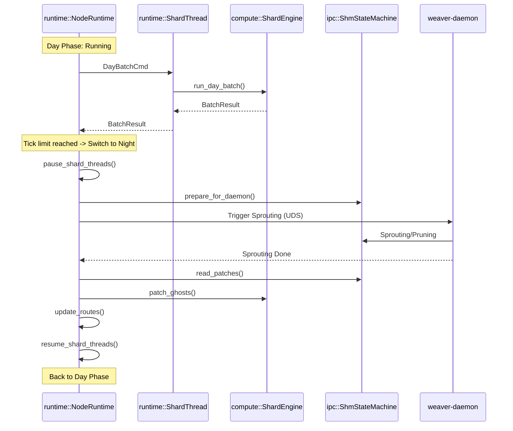

spec_runtime

> Версия спеки: 1.0  
> Дата: 2026-06-23  
> Статус: Verified  

---

## §1. Идентификация

| Поле | Значение |
|---|---|
| Название | `runtime` |
| Слой | Слой 6 — Runtime |
| Тип | Library (`lib`) |
| `no_std` | **Нет** (зависит от системных потоков ОС `std::thread`, мьютексов и каналов для управления процессами) |
| Описание | Машина состояний жизненного цикла симуляции. Координирует HFT-цикл (через `ShardEngine`), переходы между Дневной и Ночной фазами, управляет изолированными OS-потоками шардов и контролирует здоровье системы (Sentinel). |

---

## §2. Стек и Окружение

### §2.1. Внутренние зависимости (inbound)

| Крейт | Что используется | Зачем |
|---|---|---|
| `types` | `Tick`, `MasterSeed` | Управление глобальным биологическим временем ноды ([spec_types.md §4.1]). |
| `layout` | `ShardStateHeader` | Формирование бинарных заголовков для чекпоинтов VRAM на диск ([spec_layout.md §4.1]). |
| `compute` | `ShardEngine`, `DayBatchCmd`, `BatchResult`, `ComputeCommand` | Инициализация фасада вычислений и отправка DTO-команд в GPU/CPU ([spec_compute.md §4.1]). |
| `net` | `BspBarrier`, `RoutingTable`, `IoServer`, `GeometryServer` | Синхронизация эпох кластера, патчинг RCU-маршрутов на лету и стриминг данных ввода-вывода ([spec_net.md §4.1]). |
| `ipc` | `ShmStateMachine`, `BakerClient`, `InputSwapchain`, `OutputSwapchain` | Атомарная координация Ночной Фазы с `weaver-daemon` и Zero-Copy передача телеметрии ([spec_ipc.md §4.1]). |

### §2.2. Внешние зависимости

| Crate | Версия | Зачем |
|---|---|---|
| `crossbeam` | `=0.8.4` | Lock-Free каналы (`crossbeam::channel`) для передачи неблокирующих команд (`ComputeCommand`) из главного потока управления в выделенный OS-поток шарда. |
| `tracing` | `=0.1.44` | Системное логирование переходов стейт-машины и отказов. |

### §2.3. Feature Flags

Секция не применима к данному крейту. Крейт собирается монолитно и опирается на полиморфизм `dyn GpuBackend` из `compute`.

---

## §3. Инварианты

Крейт `runtime` является оркестратором времени выполнения симуляции и отвечает за безопасность жизненного цикла процессов.

### §3.1. Структурные инварианты

- **INV-RUN-001**: Изоляция потоков шардов (Thread Isolation).
  - *Обоснование*: Каждый вычислительный шард привязан строго к одному выделенному системному потоку (`std::thread`), чтобы исключить накладные расходы на переключение контекста ОС в горячем цикле HFT и предотвратить конкуренцию за контекст GPU.
  - *Следствие нарушения*: Рост латентности p99 из-за context thrashing, неявные гонки за FFI-вызовы бэкендов в `compute`.
  - *Где проверяется*: runtime assert уникальности системного потока (thread ID) при старте HFT-цикла.

- **INV-RUN-002**: Асинхронный диспетчер (Lock-Free Command Delivery).
  - *Обоснование*: Главный управляющий поток оркестратора отправляет вычислительные команды (`ComputeCommand`) в поток шарда строго через lock-free очереди `crossbeam::channel` без использования системных мьютексов.
  - *Следствие нарушения*: Блокировка управляющего потока Control Plane отстающим вычислительным потоком, потеря телеметрии.
  - *Где проверяется*: юнит-тесты на неблокирующую отправку команд.

### §3.2. Семантические инварианты

- **INV-RUN-003**: C-ABI Teardown Isolation.
  - *Обоснование*: Остановка симуляции гарантирует полный join вычислительных потоков шарда перед вызовом деаллокации GPU-контекста `teardown()` бэкенда.
  - *Следствие нарушения*: Крах драйвера видеокарты (CUDA/HIP) или SIGSEGV из-за деаллокации занятого контекста.
  - *Где проверяется*: интеграционный тест завершения работы, контролирующий порядок освобождения ресурсов.

- **INV-RUN-004**: Sentinel Mute during Resurrection.
  - *Обоснование*: Во время прогрева после восстановления из чекпоинта (`Resurrection`, warmup loop на 100 тиков) отправка сетевых пакетов спайков наружу полностью глушится.
  - *Следствие нарушения*: Засорение кластера фантомными спайками из прошлого (нарушение каузальности), рассинхронизация распределенных узлов.
  - *Где проверяется*: тест фазы Resurrection с сетевым моком.

- **INV-RUN-005**: Night Phase VRAM Lock.
  - *Обоснование*: Вызов методов модификации GPU-памяти хостом (`patch_ghosts`) и RCU-подмена таблиц маршрутизации выполняются строго в фазе `Night` при полностью приостановленном HFT-цикле.
  - *Следствие нарушения*: Race condition в VRAM между вычислительными ядрами GPU и хост-записью, краш драйвера или повреждение данных.
  - *Где проверяется*: runtime assert блокировки состояния HFT-цикла в фазе `Night`.

### §3.3. Межкрейтовые инварианты

- **INV-CROSS-010**: *Day/Night SHM State Compliance (Night Phase Sync)*.
  - *Участники*: `ipc`, `runtime`.
  - *Кто владелец проверки*: `runtime`.
  - *Обоснование*: `runtime` координирует Ночную Фазу, переключая состояние `ipc::ShmStateMachine` в режим ожидания `weaver-daemon`. `runtime` не возобновляет симуляцию, пока `ipc::ShmStateMachine` не перейдет в состояние готовности после применения патчей.
  - *Следствие нарушения*: Data Race в разделяемой памяти между HFT-потоком и демоном, симуляция на старой или недостроенной топологии.
  - *Где проверяется*: Интеграционные тесты перехода фаз с `weaver-daemon`.

---

## §4. Публичный API

### §4.1. Типы

#### NodeState

```rust
/// Состояния жизненного цикла ноды.
#[derive(Debug, Clone, Copy, PartialEq, Eq)]
pub enum NodeState {
    /// Ожидание завершения фаз загрузчика (boot)
    Booting,
    /// Активный HFT-цикл (Дневная фаза)
    Running,
    /// Пауза симуляции для перестройки топологии демоном (Ночная фаза)
    Night,
    /// Фаза прогрева (100 тиков) после поднятия из теневого дампа. Сеть аппаратно заглушена.
    Resurrection,
    /// Штатное завершение работы с ожиданием join потоков
    Shutdown,
}
```

- **Семантика:** Строгая машина состояний, определяющая доступные операции оркестратора. Исключает непредсказуемое поведение (например, попытку патчить VRAM во время Running).
- **Жизненный цикл:** Инициализируется как `Booting`, циклически сменяется между `Running` и `Night` по счетчику тиков.
- **Ограничения на значения:** Переходы выполняются строго по правилам `NodeRuntime`.

#### NodeRuntime

```rust
/// Оркестратор жизненного цикла ноды и HFT-цикла.
pub struct NodeRuntime {
    pub state: NodeState,
    pub tick_counter: u32,
    
    /// Движок вычислений (Слой 3)
    pub shard_engine: compute::ShardEngine,
    /// Мониторинг здоровья
    pub sentinel: Sentinel,
    
    /// Lock-Free канал отправки команд в изолированный OS-поток шарда
    pub shard_tx: crossbeam::channel::Sender<compute::ComputeCommand>,
    /// Lock-Free канал получения результатов из потока шарда
    pub result_rx: crossbeam::channel::Receiver<compute::BatchResult>,
    
    /// Барьер синхронизации кластера (Causality)
    pub bsp_barrier: std::sync::Arc<net::BspBarrier>,
    /// RCU-таблица для применения патчей маршрутизации
    pub routing_table: std::sync::Arc<net::RoutingTable>,
    /// Автомат состояний разделяемой памяти для координации с weaver-daemon
    pub shm_state: ipc::ShmStateMachine,
}
```

- **Семантика:** Центральный менеджер выполнения ноды. Связывает сеть, IPC и вычисления без единой блокировки ОС в горячем цикле.
- **Жизненный цикл:** Создается при старте `node`. При уничтожении обязан перевестись в `Shutdown` и дождаться остановки `shard_tx`.
- **Ограничения на значения:** Ссылки на `BspBarrier` и `RoutingTable` разделяются с асинхронным пулом `tokio` из крейта `net`.

Sentinel

```rust
/// Мониторинг здоровья ноды и кластера.
pub struct Sentinel {
    /// Счетчик тиков нахождения в режиме прогрева (Warmup Loop)
    pub warmup_ticks: u32,
    /// Количество подряд идущих таймаутов BSP барьера от соседей
    pub consecutive_timeouts: u32,
    /// Последняя математически подтвержденная эпоха до сбоя
    pub last_valid_epoch: u32,
}
```

- **Семантика:** Анализатор стабильности рантайма. Принимает решения о переводе ноды в Resurrection при падении соседа или сбое DMA-транзакции.
- **Жизненный цикл:** Владеется NodeRuntime.
- **Ограничения на значения:** warmup_ticks строго лимитирован константой WARMUP_TICKS_LIMIT (100). Сбрасывается при выходе из фазы прогрева.


---

## §4.2. Трейты

В данном крейте публичные полиморфные трейты отсутствуют. Оркестратор является монолитной машиной состояний.

---

## §4.3. Функции

#### impl NodeRuntime

```rust
impl NodeRuntime {
    /// Создает экземпляр оркестратора на основе подготовленного ShardEngine и lock-free каналов.
    pub fn new(
        shard_engine: compute::ShardEngine,
        shard_tx: crossbeam::channel::Sender<compute::ComputeCommand>,
        result_rx: crossbeam::channel::Receiver<compute::BatchResult>,
        /* ... зависимости из net и ipc ... */
    ) -> Self;

    /// Запуск бесконечного цикла оркестрации и переходов состояний (HFT-цикл).
    pub fn run(&mut self) -> Result<(), RuntimeError>;

    /// Штатный останов оркестратора. Дожидается завершения OS-потока шарда 
    /// и делает безопасный C-ABI teardown для VRAM.
    pub fn shutdown(mut self) -> Result<(), RuntimeError>;
}
```

- **Назначение**: Управление запуском, работой и штатной остановкой ноды.
- **Предусловия**: `shard_engine` должен быть успешно инициализирован, а системный поток шарда (OS Thread) — запущен.
- **Постусловия**: Метод `shutdown` безопасно выгружает VRAM и останавливает системные потоки.
- **Сложность**: Инициализация/Останов — O(1), выполнение `run` — O(T), где T — общее число тиков.
- **Паника**: При нарушении инвариантов изоляции потоков (INV-RUN-001).

---

## §4.4. Константы и Магические Числа

| Константа | Значение | Тип | Семантика |
|---|---|---|---|
| `WARMUP_TICKS_LIMIT` | `100` | `u32` | Количество холостых тиков прогрева во время фазы Resurrection для стабилизации потенциалов перед включением сети. |
| `NIGHT_INTERVAL_TICKS` | — | `u32` | Интервал смены дня и ночи в тиках симуляции. <!-- TBD: уточнить интервал смены дня и ночи у архитектора --> |

---

## §5. Доменная Логика

Крейт `runtime` — это дирижер всего движка (Слой 6). Если `compute` крутит математику, а `net` гоняет байты, то `runtime` решает **когда** и **что** именно они должны делать. 

В легаси-коде рантайм представлял собой God-Object (`NodeRuntime`), который вручную дёргал C-ABI вызовы драйверов и парсил сокеты. В новой архитектуре `runtime` физически ничего не знает про байты, FFI или TCP/UDP. Его единственная доменная задача — обеспечить детерминированное исполнение графа через строгую изоляцию состояний и потоков.

Архитектура крейта строится на 4 независимых доменных механизмах:

### §5.1. Машина состояний (Lifecycle State Machine)

Рантайм уничтожает понятие бесконечного процедурного цикла (`while true`). Вся жизнь ноды жестко подчинена переходам стейт-машины:
1. `Booting` — ожидание `boot` пайплайна.
2. `Running (Day Phase)` — активная молотилка батчей.
3. `Night` — пауза HFT-цикла, ожидание завершения работы `weaver-daemon`.
4. `Shutdown` — штатная остановка с обязательным вызовом `teardown()` у `ShardEngine` для предотвращения гонок деинициализации драйвера (C-ABI Teardown Race).

### §5.2. Диспетчеризация и изоляция потоков (Compute Dispatcher)

Вызов GPU не должен делить OS-поток с HTTP-серверами или сетевыми поллерами. `runtime` поднимает один легковесный системный поток (`std::thread`) на каждый аппаратный шард. Главный цикл оркестратора только формирует плоские DTO (`DayBatchCmd`) и отправляет их через lock-free `crossbeam` каналы. Вычислительный поток тупо получает команду, дергает `ShardEngine::run_day_batch` и возвращает `BatchResult`. 

### §5.3. Координация Ночной Фазы (Day/Night Scheduling)

Рантайм отслеживает счетчики `Tick`. Как только достигается `night_interval_ticks`, рантайм упирается в барьер, замораживает `Day Phase` и инициирует Ночную Фазу: сбрасывает данные в `ipc::ShmStateMachine`, дергает `weaver-daemon` по UDS-сокету и забирает от него патчи. Только в эту паузу (пока VRAM не используется) `runtime` применяет `patch_ghosts` к `ShardEngine` и обновляет `RCU Routing Table`.

### §5.4. Sentinel и Воскрешение (Health & Resurrection)

Модуль `sentinel.rs` следит за соседями через `BspBarrier` и за дочерним демоном. Если нода упала и была перезапущена из теневого дампа (`.shadow`), Sentinel перехватывает контроль и переводит `runtime` в фазу `Resurrection` (Warmup Loop). HFT-цикл запускается на 100 тиков "в холостую", пока мембранные потенциалы нейронов не стабилизируются. В этот период любые сетевые отправки (`SpikeBatch`) аппаратно глушатся, чтобы не травить кластер фантомными спайками из прошлого.

---

## §6. Алгоритмы и Формулы

#### §6.1. Алгоритм смены Дневной и Ночной фаз

**Вход**: Текущий Tick, `NIGHT_INTERVAL_TICKS`.
**Выход**: Перевод состояния в Night, приостановка вычислений, интеграция патчей топологии, возврат в Running.
**Детерминизм**: Да.

**Логика:**
Оркестратор блокирует HFT-цикл, передает управление `weaver-daemon` через UDS-сокет и разделяемую память, а по завершении применяет патчи маршрутизации In-Place прямо в видеопамять (VRAM Lock).

**Псевдокод:**
```rust
fn transition_to_night(&mut self) -> Result<(), RuntimeError> {
    self.state = NodeState::Night;

    // 1. Ждем пока изолированный OS-поток шарда завершит текущий батч
    // (Обеспечивается логикой каналов, батч уже отдал BatchResult)

    // 2. Переводим SHM стейт-машину в режим ожидания weaver-daemon
    self.shm_state.prepare_for_daemon()?;

    // 3. Дергаем демона по UDS сокету
    self.baker_client.trigger_night_phase()?;

    // 4. Блокируемся с таймаутом (10с) в ожидании ответа демона
    self.shm_state.wait_for_daemon(Duration::from_secs(10))?;

    // 5. Безопасно накатываем патчи VRAM (Hot-Patching) и дефрагментируем память
    self.shard_engine.patch_ghosts(&self.shm_state.get_patches())?;
    self.shard_engine.run_sort_and_prune(self.shm_state.prune_threshold)?;

    // 6. Обновляем RCU Routing Table новыми адресами мигрировавших нод
    self.routing_table.update_routes(self.shm_state.get_routes())?;

    // 7. Возвращаемся к HFT-вычислениям
    self.tick_counter = 0;
    self.state = NodeState::Running;
    Ok(())
}
```

### §6.2. Алгоритм Воскрешения (Resurrection / Warmup Loop)

**Вход**: Теневой дамп модели `shadow_state: &[u8]` из `ipc::ShadowShmManager`.
**Выход**: Готовое стабильное биологическое состояние вольтажей и весов, снятие глушения сети.
**Детерминизм**: Да.

**Логика:**
После восстановления VRAM из дампа, нода обязана проработать `WARMUP_TICKS_LIMIT` (100) тиков в изоляции. В это время сеть аппаратно заглушена: нода "переваривает" собственные спайки, чтобы мембранные потенциалы стабилизировались и не обрушили кластер фантомной активностью из прошлого.

**Псевдокод:**

```rust
fn resurrect(&mut self, shadow_state: &[u8]) -> Result<(), RuntimeError> {
    // 1. Загружаем теневой дамп напрямую в VRAM (Zero-Copy)
    self.shard_engine.upload_state(shadow_state)
        .map_err(|e| RuntimeError::ComputeError(e))?;

    self.state = NodeState::Resurrection;
    self.sentinel.start_warmup();

    // 2. Прогрев 100 тиков в изоляции
    for _ in 0..WARMUP_TICKS_LIMIT {
        // Отправляем команду Resurrect в вычислительный поток шарда
        self.shard_tx.send(ComputeCommand::Resurrect).unwrap();
        let result = self.result_rx.recv().unwrap();

        // Мониторинг стабилизации мембранных потенциалов
        self.sentinel.verify_stability(&result)?;
    }

    // 3. Выход из карантина. Сеть разблокируется.
    self.sentinel.end_warmup();
    self.state = NodeState::Running;
    Ok(())
}

```

---

## §7. Структуры Данных и Memory Layout

Секция не применима к данному крейту: Крейт не определяет низкоуровневых бинарных макетов памяти.

---

## §8. Граничные Случаи и Особые Сценарии

Крейт `runtime` отвечает за выживаемость ноды. Его главная задача — обеспечить детерминированные переходы состояний и предотвратить гонки данных (Data Races) между изолированным системным потоком вычислений (GPU) и асинхронным сетевым пулом (Tokio/Axum).

### §8.1. Граничные значения

| # | Ситуация | Ожидаемое поведение |
|---|---|---|
| E-136 | Таймаут `weaver-daemon` при перестройке связей в фазе `Night` | Если демон не отвечает за отведенные 10 секунд (Deadlock Protection), `NodeRuntime` переводит ноду в аварийное состояние, возвращает `RuntimeError::DaemonTimeout` и инициирует жесткий рестарт дочернего процесса демона. |
| E-137 | Аппаратный сбой драйвера GPU (Device Lost / TDR) в ходе HFT-цикла | Вычислительный поток шарда перехватывает ошибку C-FFI из `compute`, безопасно завершает батч (без паники) и отправляет по каналу `BatchResult` с флагом сбоя. Рантайм переходит в режим эвакуации, освобождая дескрипторы VRAM. |
| E-138 | Биологическая нестабильность в цикле прогрева (`Resurrection`) | Если мембранные потенциалы нейронов не стабилизировались за `WARMUP_TICKS_LIMIT` (100 тиков) и шард выдает сплошной эпилептический шум, `Sentinel` прерывает старт и возвращает `RuntimeError::UnstableWarmup`. Сеть остается аппаратно заглушенной. |
| E-139 | Ошибка отправки по Lock-Free каналу (Disconnected Channel) | Если системный поток шарда упал (panic в ОС), вызов `shard_tx.send` вернет ошибку. Рантайм немедленно переходит в `Shutdown`, так как потеря управления над вычислителем фатальна для ноды. |

### §8.2. Состояния гонки и конкурентность

| # | Сценарий | Защита |
|---|---|---|
| R-043 | Попытка выгрузки телеметрии или I/O матриц во время смены фаз `Day/Night` | Переход в `Night` меняет состояние `NodeState`. Методы выгрузки обязаны проверять стейт и возвращать ошибку/пропускать такт, если нода не в фазе `Running`. Доступ к VRAM во время патчинга со стороны `weaver-daemon` строго эксклюзивен. |
| R-044 | C-ABI Teardown Race (удаление контекста GPU при активных ядрах) | Метод `shutdown` **обязан дождаться полного слияния (join)** потока `std::thread` шарда с главным потоком до вызова `shard_engine.teardown()`. Это гарантирует отсутствие "висячих" асинхронных ядер, пишущих в освобождаемую видеопамять (Use-After-Free на уровне GPU). |
| R-045 | Конкурентный запуск HFT-вычислений и фонового демона | Переход из `Night` в `Running` невозможен до тех пор, пока `ShmStateMachine` в крейте `ipc` не подтвердит, что демон отпустил разделяемую память (статус `NightDone`). |

### §8.3. Деградация и Recovery

| # | Отказ | Поведение | Восстановление |
|---|---|---|---|
| D-037 | Обрыв сетевого барьера `BspBarrier` соседом | `BspBarrier` завершается по таймауту. Нода не может продолжить Дневную Фазу. | `Sentinel` логирует отвал соседа, вычищает его адреса из `RoutingTable` (RCU swap) и продолжает симуляцию с оставшимся живым кластером. |
| D-038 | Сбой записи чекпоинта на диск (переполнение SSD) | Фоновый поток записи дампа VRAM возвращает I/O ошибку. | `Sentinel` перехватывает ошибку, HFT-цикл **не останавливается**. Создание новых снапшотов приостанавливается до освобождения места на диске (логируется WARN). |

---

## §9. Ошибки

Крейт `runtime` агрегирует ошибки вычислений (Слой 3), синхронизации (Слой 2) и I/O, предоставляя высокоуровневые статусы отказов стейт-машины симуляции.

### §9.1. Перечисление ошибок

```rust
#[derive(Debug)]
pub enum RuntimeError {
    /// Превышено время ожидания сборки связей от weaver-daemon (E-136)
    DaemonTimeout,
    /// Трансляция аппаратного сбоя ускорителя из Слоя 3 (E-137)
    ComputeError(compute::ComputeApiError),
    /// Ошибка I/O при попытке загрузить теневой чекпоинт из .shadow
    CheckpointLoad(std::io::Error),
    /// Нестабильность мембранных потенциалов по окончании прогрева (E-138)
    UnstableWarmup,
    /// Разрыв lock-free канала диспетчера (системный поток шарда мертв) (E-139)
    ChannelError,
}
```

### §9.2. Стратегия обработки

| Ошибка | Восстановимая? | Рекомендация вызывающему (Слой 6 — node) |
|--------|----------------|------------------------------------------|
| `DaemonTimeout` | Нет | Требует жёсткого рестарта дочернего процесса `weaver-daemon` и повторной инициализации IPC. |
| `ComputeError(err)` | Да | Разобрать внутреннюю ошибку. При `DeviceLost` или `OutOfMemory` — переключить фасад `ShardEngine` на CPU-бэкенд (`compute-cpu`) и инициировать Resurrection. |
| `CheckpointLoad` | Нет | Проверить целостность файлов чекпоинтов на диске, аварийная остановка ноды. |
| `UnstableWarmup` | Нет | Несовместимые параметры модели (биологический коллапс). Прервать симуляцию. |
| `ChannelError` | Нет | Аварийный `shutdown` для защиты C-ABI контекста GPU от гонок деинициализации. |

### §9.3. Паники

| Условие | Почему паника, а не Err |
|---------|------------------------|
| Нарушение изоляции потоков (INV-RUN-001) | Утечка HFT-потоков в планировщик ОС приведёт к непредсказуемым гонкам в ядре GPU. Выявляется системными ассертами `std::thread::id`. |
| Попытка записи патчей хоста вне фазы Night (INV-RUN-005) | Нарушение аппаратной целостности VRAM. Вызов `patch_ghosts` во время `Running` неизбежно приведёт к крашу драйвера видеокарты. |

---

## §10. Зависимости и Интеграция

### §10.1. Что крейт потребляет (inbound)

| Крейт-источник | Что используем | Какой контракт ожидаем |
|---|---|---|
| `compute` | `ShardEngine`, `DayBatchCmd` | Изоляция расчетов шарда, отсутствие неявных аллокаций памяти в `run_day_batch` ([spec_compute.md §4.1]). |
| `net` | `BspBarrier` | Каузальная синхронизация распределенных узлов по жесткому таймауту ([spec_net.md §4.1]). |
| `ipc` | `ShmStateMachine` | Безопасная передача флагов Ночной Фазы демону ([spec_ipc.md §4.1]). |

### §10.2. Кто потребляет крейт (outbound / обратные зависимости)

| Крейт-потребитель | Что использует | Какой контракт мы обязаны сохранить |
|---|---|---|
| `node` | Контейнер выполнения `NodeRuntime` | Запуск симуляции через `run` и корректный останов через `shutdown`. |

### §10.3. Диаграмма взаимодействия

Взаимодействие компонентов в Дневную и Ночную фазы:



---

## §11. Стратегия Тестирования

### §11.1. Юнит-тесты

| Тест | Что проверяет | Связанный инвариант |
|---|---|---|
| test_lifecycle_transitions | Переходы состояний: `Booting -> Running -> Night -> Shutdown`. Недопустимые переходы возвращают ошибку. | INV-RUN-005 |
| test_crossbeam_channel_isolation | Неблокирующая доставка `DayBatchCmd` в поток шарда. Проверка `try_send` и `try_recv`. | INV-RUN-002 |
| test_warmup_loop_mute | В фазе `Resurrection` `BatchResult.is_warmup` равен `true`. Рантайм обязан глушить вызовы `net::send_output_batch`. | INV-RUN-004 |
| test_shard_thread_os_isolation | Сверка `std::thread::current().id()`. Гарантирует, что поток вычислений физически отличается от потоков `tokio` и главного оркестратора. | INV-RUN-001 |

### §11.2. Property-based тесты

Секция не применима к данному крейту: оркестратор является детерминированной машиной состояний, логика переходов покрывается исчерпывающим конечным набором юнит-тестов.

### §11.3. Интеграционные тесты

| Тест | Крейты-участники | Сценарий | Связанный инвариант / Граничный случай |
|---|---|---|---|
| test_day_night_transition_flow | runtime, ipc | Корректный переход `Day -> Night`, эмуляция работы `weaver-daemon` через `MockShmAllocator` и накат патчей в `ShardEngine`. | INV-CROSS-010, R-045 |
| test_teardown_race_protection | runtime, compute | Останов симуляции во время выполнения GPU ядра. Гарантия вызова `join()` OS-потока строго до деструктора контекста. | INV-RUN-003, R-044 |
| test_sentinel_resurrection_warmup | runtime, net | Эмуляция падения соседа по таймауту `BSP_TIMEOUT_MS`. Перехват управления `Sentinel` и пуск `Resurrection` с 100-тиковым прогревом. | D-037, E-138 |

### §11.4. Тесты производительности

| Бенчмарк | Метрика | Порог |
|---|---|---|
| bench_dispatcher_latency | Время передачи `DayBatchCmd` через Lock-Free канал | < 500 ns (оверхед диспетчера не должен влиять на HFT-цикл) |


---

## §12. Бюджеты и Ограничения

### §12.1. Память

| Ресурс | Бюджет | Как считается |
|---|---|---|
| Оверхед рантайма | < 50 MB | Размер кучи под управляющие структуры `NodeRuntime`, `Sentinel` и Lock-Free каналы `crossbeam`. |

### §12.2. Латентность

| Операция | Бюджет (p99) | Условия |
|---|---|---|
| Диспетчеризация шага | < 500 ns | Время формирования `DayBatchCmd` и вызова `channel::send`. |
| Day/Night Switch | < 1 ms | Время заморозки HFT-цикла и перевода SHM в состояние ожидания демона (без учета работы самого демона). |

### §12.3. Compile-time

| Ограничение | Значение |
|---|---|
| Максимальное время сборки | < 15s (release) |


---

## Приложение A — Глоссарий

| Термин | Определение |
|---|---|
| `HFT-цикл` | High-Frequency Tick — горячий цикл симуляции с жесткими временными лимитами шага. |
| `Resurrection` | Воскрешение — процедура восстановления ноды из теневого чекпоинта с последующим прогревом нейронной сети. |
| `Sentinel` | Дозорный — программный модуль мониторинга и валидации детерминизма/здоровья всей ноды. |

---

Checklist Полноты (A.3)

- ✅ Все публичные типы описаны в §4
- ✅ Все инварианты из §3 имеют соответствующий пункт в §11 (тесты)
- ✅ Все `Err`-варианты перечислены в §9
- ✅ Все крейты-потребители перечислены в §10.2
- ✅ Нет ни одного «магического числа» без объяснения
- ✅ Все формулы имеют единицы измерения
- ✅ Граничные случаи из §8 покрыты тестами в §11
