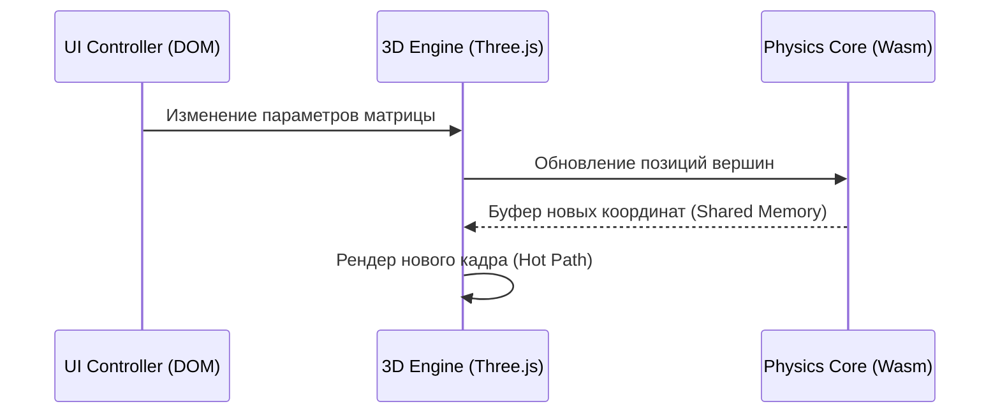

# Шаблон Спецификации JS-Модуля — AxiCAD

> Этот документ определяет структуру, правила написания и шаблон для спецификации каждого JavaScript/фронтенд-модуля (Vanilla JS, Three.js, WebAssembly).
> Спецификация — это **контракт**: если код работает, но нарушает спецификацию, это баг в коде, не в спеке.

---

## Часть A — Правила Написания

### A.1. Принципы

| # | Правило | Почему |
|---|---------|--------|
| 1 | **Одна спека = один JS-модуль** | Файл `spec_{module_name}.md` в папке `docs/engine/`. Никаких мульти-модульных документов. |
| 2 | **Спека описывает контракты и интерфейсы, не код** | Алгоритмы описываются на уровне логики, формул и псевдокода. Конкретные DOM-селекторы, внутренние переменные и вспомогательные функции — дело кода. |
| 3 | **Каждое утверждение — проверяемое** | Если написано «гарантирует очистку слушателей» — должен быть тест или явный сценарий верификации утечек памяти. |
| 4 | **DOM и WebGL Границы — явно** | Ограничение области видимости (например, «изменяет только внутри `#viewport`» или «модифицирует Three.js сцену только через методы `SceneManager`»). |
| 5 | **Управление ресурсами и Жизненный цикл** | JS подвержен утечкам памяти через неснятые слушатели событий (`addEventListener`), незавершенные интервалы (`setInterval`), ссылки на удаленные DOM-элементы и невыгруженные Three.js текстуры/геометрии. Спецификация обязана документировать правила очистки (`destroy()`). |

### A.2. Язык и Формат

- **Язык**: русский (технические термины на английском допускаются без перевода: `requestAnimationFrame`, `vertex shader`, `raycasting`, `garbage collector`, `layout thrashing`).
- **Схемы и формулы**: блоки ` ```math ` (LaTeX) или ` ```javascript ` псевдокод.
- **Ссылки**: формат `[spec_{module}.md §{номер_секции}]` для перекрёстных ссылок между спеками.

### A.3. Hot / Cold / Warm Path в JS/WebGL

Каждая функция и метод классифицируются по типу пути:

| Тип | Значение | Ограничения |
|-----|----------|-------------|
| **HOT** | Выполняется внутри цикла рендеринга (60/120 FPS, `requestAnimationFrame`) | Zero-alloc (никаких `new THREE.Vector3()`), избегать Layout Thrashing (запрещено читать DOM свойства вроде `offsetHeight`), минимизировать GC-давление |
| **COLD** | Выполняется при инициализации, загрузке сцены или выгрузке (`destroy()`) | Разрешены тяжелые аллокации, синхронное чтение DOM, загрузка файлов, компиляция шейдеров |
| **WARM** | Вызывается по событиям мыши/клавиатуры или ответам от сервера (раз в 100ms - 2s) | Допустимы контролируемые DOM манипуляции, аккуратная работа с памятью |

### A.4. Чеклист Полноты

Перед тем как считать спеку готовой, проверь:

- [ ] Все публичные методы, события и свойства описаны в §4.
- [ ] Описаны все правила очистки памяти и ресурсов в §3.3.
- [ ] Все HOT-методы соответствуют правилам оптимизации производительности (Zero-alloc, DOM-batching) из §3.1.
- [ ] Граничные сценарии (потеря контекста WebGL, отсутствие WebAssembly) описаны в §7.
- [ ] Спецификация включает в себя визуальный/мануальный сценарий тестирования в §10.

---

## Часть B — Шаблон

> Всё что ниже — копируется в `docs/engine/spec_{module_name}.md` и заполняется.
> Секции, помеченные `[если применимо]`, при неприменимости сохраняются с пометкой *«Неприменимо: {причина}»*.

---

```markdown
# spec_{module_name}

> Версия спеки: 1.0  
> Дата: YYYY-MM-DD  
> Модуль: `dev-js-api/{module_name}`  
> Тип пути: HOT / COLD / WARM  
> Статус: Draft | Review | Approved  

---

## §1. Идентификация

| Поле | Значение |
|------|----------|
| Имя в пакете | `axicad.{module_name}` |
| Физическое расположение | `dev-js-api/js/{module_name}.js` (или `js/ui/{module_name}.js`) |
| Тип пути | HOT / COLD / WARM |
| Описание | {Что делает модуль в одном предложении} |

---

## §2. Стек и Окружение

### §2.1. Внутренние зависимости (inbound)

| Модуль-источник | Что используем | Зачем |
|----------------|---------------|-------|
| `axicad.state` | `globalState` | Доступ к активным сессиям и выделенным объектам |
| ... | ... | ... |

### §2.2. Внешние зависимости

| Библиотека / API | Версия | Зачем | Hot Path? |
|-----------------|--------|-------|-----------|
| `three` | ^0.150.0 | 3D Рендеринг сцены | Да |
| `WebAssembly` | Native | Расчет физики и коннектомов на Rust/C | Да |
| ... | ... | ... | ... |

---

## §3. Инварианты

### §3.1. Performance & Rendering Инварианты (Hot Path) [если применимо]

- **INV-{MOD}-HOT-001**: {Zero-alloc в render-цикле. Объекты вектора/матрицы переиспользуются через кэш}.
  - *Следствие нарушения*: {Падение FPS из-за сборщика мусора (GC jitter)}.
  - *Где проверяется*: {Профайлер Chrome, FPS Meter}.
- **INV-{MOD}-DOM-002**: {Layout Thrashing Protection. Чтение свойств DOM-элементов выполняется до записи в одном тике рендера}.
  - *Следствие нарушения*: {Форсированная синхронизация разметки (Layout Thrashing), просадка FPS}.
  - *Где проверяется*: {Chrome DevTools Performance Panel}.

### §3.2. WebGL / Three.js Инварианты [если применимо]

- **INV-{MOD}-GL-001**: {Каждый Geometry и Material должен быть удален из GPU памяти при удалении меша}.
  - *Следствие нарушения*: {Утечка GPU памяти, падение вкладки браузера WebGL context lost}.
  - *Где проверяется*: {three.js renderer.info.memory проверки в тестах / ручной мониторинг памяти}.

### §3.3. Ресурсные инварианты и Утечки памяти (RAII)

- **INV-{MOD}-RES-001**: {При вызове метода destroy() удаляются все обработчики событий `window`, `document` и глобального DOM-дерева}.
  - *Следствие нарушения*: {Утечки памяти и некорректное поведение при переключении страниц ProjectHub без перезагрузки вкладки}.
  - *Где проверяется*: {Тест на количество слушателей / Heap Snapshot}.

---

## §4. Публичный API

### §4.1. Экспортируемые Классы / Функции

#### `class {ClassName}`

```javascript
export class ClassName {
  /**
   * @param {HTMLElement} container - DOM контейнер для монтирования компонента
   * @param {object} options
   */
  constructor(container, options = {}) {
    ...
  }

  /**
   * [HOT] Обновление состояния в кадре анимации
   * @param {number} deltaTime - Время между кадрами в миллисекундах
   */
  update(deltaTime) {
    ...
  }

  /**
   * Полное уничтожение экземпляра и освобождение памяти
   */
  destroy() {
    ...
  }
}
```

### §4.2. Пользовательские События (CustomEvents)

| Событие | Инициатор | Получатель | Передаваемые данные (detail) | Семантика |
|---------|-----------|------------|-----------------------------|-----------|
| `axicad:object-selected` | `Raycaster` | `UIController` | `{ id: "shard-56", type: "matrix" }` | Пользователь кликнул на шард в 3D сцене |
| ... | ... | ... | ... | ... |

---

## §5. Доменная Логика

> Ответы на вопросы:
> 1. **ЧТО** делает модуль?
> 2. **ЗАЧЕМ** он выделен?
> 3. **КАКУЮ** проблему решает (на уровне UX или 3D-движка)?

---

## §6. Алгоритмы, Математика и Форматы Данных [если применимо]

### §6.1. {Название математического расчета / алгоритма}

**Вход**: {параметры}.  
**Выход**: {результат}.  

**Математическое описание / Формула:**
{Формула проекции или расчета линий связей}

**Псевдокод:**
```javascript
// Алгоритм расчета кривых Безье
```

---

## §7. Граничные Случаи и Особые Сценарии

### §7.1. Браузерные граничные ситуации

| # | Ситуация | Ожидаемое поведение |
|---|----------|-------------------|
| E-001 | Потеря контекста WebGL (`webglcontextlost`) | {Приостановить рендер-цикл, вывести оверлей перезагрузки} |
| E-002 | Инициализация на мобильном устройстве (мало памяти) | {Уменьшить качество текстур, отключить тени/антиалиасинг} |
| E-003 | WebAssembly модуль не загрузился | {Отключить 3D-расчеты физики коннектомов, вывести ошибку в UI} |

---

## §8. Ошибки и Отказоустойчивость

| Ошибка | Как обрабатывается | Влияние на UI |
|--------|---------------------|---------------|
| `ShaderCompilationError` | Вывод лога в консоль разработчика | Черный экран в 3D вьюпорте |
| `NetworkConnectionError` | Фоновые попытки переподключения | Показ оверлея «Соединение потеряно» |

---

## §9. Взаимодействие Систем



---

## §10. Стратегия Верификации

### §10.1. Автоматизированные тесты (Unit / E2E)

| Тест | Инструмент | Что проверяет | Связанный инвариант |
|------|------------|---------------|-------------------|
| `test_event_listeners_cleanup` | Jest/Jest-dom | Отсутствие утечек слушателей после destroy() | INV-{MOD}-RES-001 |
| ... | ... | ... | ... |

### §10.2. Мануальная визуальная верификация

> Пошаговая инструкция для ручной проверки интерактивных 3D-сцен или UI компонентов.

1. {Запустить тестовую сцену с 1000 связей}.
2. {Проверить, что частота кадров (FPS) стабильно держится выше 60 кадров/сек}.
3. {Открыть вкладку Chrome DevTools Memory, сделать Heap Snapshot, переключить страницу ProjectHub 10 раз, сделать повторный Snapshot. Убедиться, что объем памяти не растет (Delta < 0.1 MB)}.
