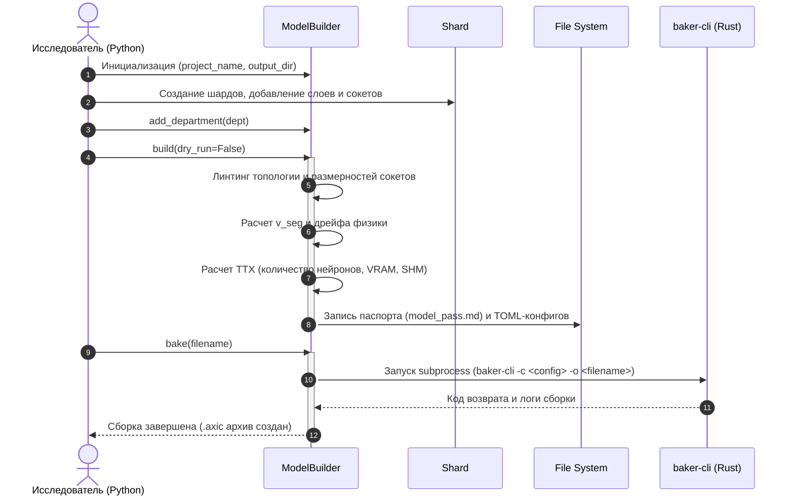

# spec_builder

> Версия спеки: 1.0  
> Дата: 2026-06-09  
> Слой: Layer 4 — API / Application  
> Тип пути: COLD  
> Статус: Approved  

---

## §1. Идентификация

| Поле | Значение |
|------|----------|
| Имя в пакете | `axipy.builder` |
| Физическое расположение | `axipy/builder/` |
| Слой | Layer 4 — API / Application |
| Тип пути | COLD |
| Описание | Предоставляет высокоуровневый Fluent API для декларативного проектирования нейросети с трансляцией в TOML-конфигурации и AOT-компиляцией в `.axic` архив через `baker-cli`. |

---

## §2. Стек и Окружение

### §2.1. Внутренние зависимости (inbound)

| Модуль-источник | Что используем | Зачем |
|----------------|---------------|-------|
| `axipy.contract.v{version}` | Размеры структур (Neuron, Axon, SHM Header) | Динамическая оценка требуемых ресурсов VRAM / SHM в `dry_run_stats` без жесткого кодирования смещений/размеров |

### §2.2. Внешние зависимости

| Пакет / stdlib | Версия | Зачем | Hot Path? |
|---------------|--------|-------|-----------|
| `toml` | >= 0.10.0 | Сериализация и десериализация конфигурационных файлов TOML | Нет (COLD) |
| `pathlib` | stdlib | Работа с путями файловой системы в ООП-стиле | Нет (COLD) |
| `subprocess` | stdlib | Запуск компилятора `baker-cli` | Нет (COLD) |
| `math` | stdlib | Округления и математические вычисления для оценки ресурсов | Нет (COLD) |
| `warnings` | stdlib | Вывод некритических замечаний валидации пользователю | Нет (COLD) |

---

## §3. Инварианты

### §3.1. Hot Path инварианты

> Неприменимо. Модуль является COLD-модулем, все его операции выполняются на этапе инициализации или компиляции до запуска основного HFT-цикла.

### §3.2. Контрактные инварианты (C-ABI)

- **INV-BLD-ABI-001**: Размеры всех нейронов и аксонов для расчёта ТТХ должны запрашиваться динамически из `axipy.contract.v{version}`. Запрещено использовать жестко закодированные значения в Python-коде.
  - *Следствие нарушения*: Расхождение расчетных параметров VRAM/SHM с физическим потреблением ресурсов в Rust-движке, потенциальный Out Of Memory во время выполнения симуляции.
  - *Где проверяется*: Юнит-тест `test_contract_sizes_match_rust`.
- **INV-BLD-ABI-002**: Физические размеры любого создаваемого шарда (воксели по X/Y/Z) не должны превышать максимальных пределов, определенных в `axipy.contract.v{version}`.
  - *Следствие нарушения*: Rust-компилятор `baker-cli` отвергнет конфигурацию как несовместимую с аппаратными лимитами GPU-платформы.
  - *Где проверяется*: Линтер шарда, юнит-тесты лимитов размеров.

### §3.3. Ресурсные инварианты (RAII)

- **INV-BLD-RES-001**: Билдер обязан гарантировать атомарность и целостность записи конфигурационных TOML-файлов в `output_dir`. Все открываемые файловые дескрипторы для записи рецепта и запуска компилятора должны освобождаться немедленно.
  - *Следствие нарушения*: Битые файлы конфигурации при сбое записи или утечка системных ресурсов/дескрипторов файлов.
  - *Где проверяется*: Контекстные менеджеры Python (инструкция `with`), юнит-тесты на очистку файловых ресурсов.

### §3.4. Межмодульные инварианты

- **INV-CROSS-TOPOLOGY-001**: Каждый входящий сокет (приемник, `entry_z is not None`) должен быть соединен строго с одним исходящим сокетом (передатчиком, `entry_z is None`).
  - *Участники*: `axipy.builder.Socket` (передающий и принимающий сокеты).
  - *Кто владелец проверки*: `ModelBuilder.build()`.
  - *Следствие нарушения*: Ошибки линтинга (одинокие сокеты без сигнала, либо коллизии памяти на GPU при попытке мульти-записи в один буфер).
  - *Где проверяется*: Валидатор связей, юнит-тест `test_socket_unique_connection`.
- **INV-CROSS-SHARD-LIMIT-001**: Общее количество уникальных чертежей нейронов (`NeuronBlueprint`), используемых популяциями одного шарда, не должно превышать аппаратный лимит `MAX_NEURON_TYPES_PER_SHARD` из `axipy.contract`.
  - *Участники*: `axipy.builder.Shard`, `axipy.contract`.
  - *Кто владелец проверки*: `ModelBuilder.build()`.
  - *Следствие нарушения*: Сбой рендеринга или симуляции на GPU из-за переполнения текстурных буферов типов.
  - *Где проверяется*: Валидатор структуры шарда, юнит-тест `test_shard_neuron_types_limit`.

---

## §4. Публичный API

### §4.1. Классы

#### `NeuronBlueprint`

```python
class NeuronBlueprint:
    """Обертка над загруженным и распарсенным TOML-файлом типа нейрона."""
    
    def __init__(self, filepath: str, data: list) -> None:
        """
        Инициализация чертежа нейрона.
        filepath: Путь к файлу описания типа.
        data: Список словарей с физическими параметрами нейронов.
        """
        ...
        
    def set_plasticity(self, pot: int, dep: int) -> 'NeuronBlueprint':
        """
        [COLD] Настройка параметров STDP пластичности: потенциации и депрессии.
        Возвращает self для поддержки Fluent API.
        """
        ...
```

- **Семантика**: Описывает биологические и физические свойства пула нейронов определенного типа.
- **Жизненный цикл**: Инстанцируется фабричным методом `ModelBuilder.gnm_lib()`. Владение передается в `Shard` при добавлении популяции.

#### `Shard`

```python
class Shard:
    """Анатомический воксельный объем (зона), содержащий слои и популяции нейронов."""
    
    def __init__(self, name: str, x: int, y: int, z: int) -> None:
        """
        Инициализация шарда с физическими размерами в вокселях.
        Имя шарда должно быть уникальным в рамках модели.
        """
        ...
        
    def add_layer(self, name: str, height_pct: float, density: float) -> 'Shard':
        """
        [COLD] Создает анатомический слой.
        name: Уникальное имя слоя в рамках шарда.
        height_pct: Доля высоты слоя от общей высоты шарда (0.0 .. 1.0).
        density: Плотность распределения нейронов (количество на воксель).
        Возвращает self.
        """
        ...
        
    def add_population(self, layer_name: str, blueprint: NeuronBlueprint, fraction: float) -> 'Shard':
        """
        [COLD] Наполняет указанный слой популяцией нейронов определенного чертежа.
        layer_name: Имя целевого слоя.
        blueprint: Ссылка на чертеж нейрона.
        fraction: Доля популяции в составе слоя (0.0 .. 1.0).
        Возвращает self.
        """
        ...
        
    def add_input_port(self, name: str, width: int, height: int, entry_z: str, 
                       target_type: str = "All", growth_steps: int = 1000) -> 'Shard':
        """
        [COLD] Объявляет входящий порт для связи с внешним миром (Python/UDP).
        entry_z: Высота входа ("top", "mid", "bottom" или числовая координата).
        Возвращает self.
        """
        ...
        
    def add_output_port(self, name: str, width: int, height: int) -> 'Shard':
        """
        [COLD] Объявляет исходящий порт во внешний мир.
        Возвращает self.
        """
        ...
        
    def add_socket(self, name: str, width: int, height: int, entry_z: str = None) -> 'Socket':
        """
        [COLD] Создает внутренний интерфейс связи (сокет).
        name: Имя сокета.
        entry_z: Если задано, сокет является входящим (приемником) и привязывается к указанному Z.
                 Если None, сокет является исходящим (передатчиком).
        Возвращает созданный объект Socket.
        """
        ...
        
    def estimate_neurons(self) -> int:
        """
        [COLD] Выполняет предварительный расчет количества нейронов во всех слоях шарда на основе воксельного объема и плотности.
        """
        ...
```

- **Семантика**: Физический и анатомический блок сети, содержащий нейроны и порты ввода-вывода.
- **Жизненный цикл**: Создается пользователем независимо. Регистрируется в `Department` с помощью метода `add_shard()`.

#### `Socket`

```python
class Socket:
    """Точка коммутации на шарде (вилка или розетка) для внутренних связей."""
    
    def __init__(self, name: str, shard: Shard, width: int, height: int, entry_z: str = None) -> None:
        ...
        
    def connect_to(self, target_path: str) -> 'Socket':
        """
        [COLD] Прокладывает аксонный тракт к входящему сокету другого шарда.
        target_path: Путь в формате "ИмяШарда.ИмяВходящегоСокета".
        Возвращает self.
        """
        ...
```

- **Семантика**: Интерфейс соединения. Исходящий сокет инициирует прорастание аксонов, входящий принимает их на определенной глубине.
- **Жизненный цикл**: Создается методом `Shard.add_socket()`. Привязан к жизненному циклу своего шарда.

#### `Department`

```python
class Department:
    """Логическая группа (отдел мозга), объединяющая связанные шарды."""
    
    def __init__(self, name: str) -> None:
        """Инициализация департамента с уникальным именем."""
        ...
        
    def add_shard(self, *shards: Shard) -> 'Department':
        """
        [COLD] Регистрирует один или несколько шардов в департаменте.
        Возвращает self.
        """
        ...
```

- **Семантика**: Макро-структура модели для разбиения графа на модули и независимые конфигурационные файлы.
- **Жизненный цикл**: Инстанцируется пользователем, регистрируется в `ModelBuilder`.

#### `ModelBuilder`

```python
class ModelBuilder:
    """Корневой конфигуратор и валидатор структуры нейросети."""
    
    def __init__(self, project_name: str, output_dir: str) -> None:
        """
        Инициализация проекта.
        project_name: Название проекта (имя сборки).
        output_dir: Директория для сохранения сгенерированных TOML файлов.
        """
        ...
        
    def add_department(self, *depts: Department) -> 'ModelBuilder':
        """
        [COLD] Регистрирует один или несколько департаментов в модели.
        Возвращает self.
        """
        ...
        
    def gnm_lib(self, path: str) -> NeuronBlueprint:
        """
        [COLD] Находит и загружает чертеж нейрона из библиотеки.
        path: Относительный путь к файлу чертежа.
        """
        ...
        
    def build(self, dry_run: bool = False, print_level: str = "all") -> 'ModelBuilder':
        """
        [COLD] Выполняет линтинг связей, расчет ТТХ, генерацию паспорта модели и TOML-конфигов.
        dry_run: Если True, выполняется только валидация без физической записи файлов на диск.
        print_level: Уровень вывода отчета в консоль ("all", "console" или None).
        Возвращает self.
        """
        ...
        
    def bake(self, filename: str) -> 'ModelBuilder':
        """
        [COLD] Запускает внешний компилятор baker-cli для сборки .axic архива.
        """
        ...
```

- **Семантика**: Корневой агрегатор модели, управляющий сборкой и интеграцией с Rust-компилятором.
- **Жизненный цикл**: Создается пользователем в начале скрипта модели, живет до окончания сборки.

### §4.2. Протоколы (typing.Protocol)

> Неприменимо.

### §4.3. Функции

> Неприменимо. Модуль предоставляет объектно-ориентированный API, все операции инкапсулированы внутри методов публичных классов.

### §4.4. Константы и Магические Числа

Все аппаратные ограничения (максимальные размеры шардов по осям X/Y/Z, лимит уникальных типов нейронов в шарде и т.д.) импортируются динамически из автосгенерированного модуля `axipy.contract.v{version}` на основе C-ABI контракта Rust-движка. Жесткое кодирование этих значений в Python-коде запрещено.

Внутри модуля `axipy.builder` жестко задаются только математические допуски для валидации:

| Константа | Значение | Тип | Семантика |
|-----------|----------|-----|-----------|
| `PHYSICS_TOLERANCE` | `1e-5` | `float` | Допуск нецелочисленности при валидации шага сигнала (v_seg) |
| `VALIDATION_TOLERANCE` | `1e-4` | `float` | Допуск погрешности при суммировании высот слоев и долей популяций |

---

## §5. Доменная Логика

Модуль `axipy.builder` предоставляет высокоуровневый декларативный интерфейс для проектирования топологии и анатомии импульсных нейросетей (SNN). Он изолирует этап проектирования сети от низкоуровневых деталей бинарной сборки, валидации C-ABI контрактов и ограничений GPU-платформ, выступая мостом между исследователем на Python и компилятором Rust `baker-cli`. 

Доменная задача модуля — позволить биологам и исследователям собирать сложные модели мозга в виде дерева независимых анатомических областей (департаментов и шардов), наполнять слои клеточными популяциями и коммутировать их через внешние порты взаимодействия и внутренние сокеты проекций аксонов. Модуль гарантирует физическую корректность структуры сети (проверяет несовпадение размерностей, отсутствие коллизий памяти и дрейф физики импульсов) до начала дорогостоящей компиляции и симуляции, а также предоставляет паспорт модели с расчетом ТТХ сети и визуализацией графа связей.

---

## §6. Алгоритмы, Формулы и Форматы Данных [если применимо]

### §6.1. Валидатор физических параметров сигнала (v_seg)

Алгоритм проверяет корректность физического шага сигнала по воксельной сетке. Он сопоставляет скорость распространения сигнала ($signal\_speed$), частоту тиков симуляции ($tick\_duration$), размер вокселя и длину шага сегмента. 

**Концептуальная логика**:
* Рассчитывается теоретическое значение шага в вокселях за один тик симуляции.
* Значение проверяется на целочисленность с учетом погрешности `PHYSICS_TOLERANCE`. 
* Если шаг дробный — генерируется ошибка дрейфа физики (`PhysicsDriftError`) с расчетом и предложением ближайшей корректной физической скорости для автофикса (подробные формулы рассчитываются на стороне Rust C-ABI).

### §6.2. Автоматическое разрешение Z-координаты слоя (entry_z)

Алгоритм преобразует имя анатомического слоя целевого шарда в конкретную числовую Z-высоту входа для компилятора Rust.

**Концептуальная логика**:
* Билдер обходит массив слоев целевого шарда снизу вверх.
* Суммируются относительные высоты (`height_pct`) всех слоев, лежащих ниже целевого.
* Физическая точка входа рассчитывается как центр целевого слоя:
  $$Z_{center} = \left(\sum_{i < target} height\_pct_i + 0.5 \cdot height\_pct_{target}\right) \cdot Z_{shard\_voxels}$$

### §6.3. Авто-маппинг связей по TOML-конфигам

Алгоритм отвечает за децентрализованную сборку графа сокетов и распределение связей по конфигурационным файлам бэкенда при вызове `build()`.

**Концептуальная логика**:
```python
# Псевдокод автоматической классификации трактов
for shard in model.shards:
    for socket in shard.sockets:
        for projection in socket.connections:
            target_shard = model.find_shard(projection.target)
            
            # Если департаменты источника и приемника совпадают:
            if shard.department_name == target_shard.department_name:
                # Связь является локальной (микро-топология)
                # Записывается в конфиг конкретного департамента: <dept_name>.toml
                write_to_department_config(shard.department_name, projection)
            else:
                # Связь связывает разные департаменты (макро-топология)
                # Записывается в глобальный корневой файл: simulation.toml
                write_to_global_config(projection)
```

### §6.4. Оценка ресурсов памяти и VRAM (ТТХ)

Алгоритм оценивает потребление памяти симуляции до начала физической сборки.

**Концептуальная логика**:
* Рассчитывается количество нейронов: перемножение объема слоев в вокселях на их плотность (`density`).
* Рассчитывается количество аксонов: сумма локальных нейронов (с учетом выравнивания по 64 потока/Warp) + емкость виртуальных портов ввода + резерв аксонов-призраков (Ghost Capacity) для межшардового обмена.
* Для подсчета байтов VRAM и SHM эти пулы умножаются на размеры структур данных, динамически импортированные из `axipy.contract`.

---

## §7. Граничные Случаи и Особые Сценарии

### §7.1. Граничные значения

| # | Ситуация | Ожидаемое поведение |
|---|----------|-------------------|
| E-001 | Физические размеры шарда по осям X/Y/Z превышают максимальные лимиты из `axipy.contract.v{version}` | Исключение `BuilderValidationError` на этапе линтинга. |
| E-002 | Сумма высот слоев (`height_pct`) шарда отличается от `1.0` более чем на `VALIDATION_TOLERANCE` | Исключение `BuilderValidationError` (сумма долей высот должна быть строго равна 1.0). |
| E-003 | Сумма долей популяций (`fraction`) в слое отличается от `1.0` более чем на `VALIDATION_TOLERANCE` | Исключение `BuilderValidationError` (сумма долей в слое должна быть строго равна 1.0). |
| E-004 | Расчетный шаг физического сегмента сигнала `v_seg` отклоняется от целочисленного шага сетки более чем на `PHYSICS_TOLERANCE` | Исключение `PhysicsDriftError` с расчетом величины дрейфа и рекомендацией по корректировке `signal_speed` или частоты тиков. |
| E-005 | Разрешение связи между сокетами с несовпадающими размерами (`width` или `height`) | Исключение `BuilderValidationError` (ошибка размерностей в цепочке сокетов). |
| E-006 | Попытка подключить исходящий сокет к несуществующему сокету или к сокету, который сам является исходящим | Исключение `BuilderValidationError` (ошибка разрешения топологии). |
| E-007 | Попытка подключить более одного исходящего сокета к одному входящему | Исключение `BuilderValidationError` (сокет уже занят входящей связью). |
| E-008 | Попытка вызвать `bake()` без предварительного успешного запуска `build()` | Исключение `BuilderValidationError` (отсутствуют сгенерированные TOML файлы). |

### §7.2. Конкурентность

> Неприменимо.

### §7.3. Деградация и Recovery

> Неприменимо.

---

## §8. Ошибки

### §8.1. Перечисление исключений

```python
class BuilderError(AxicorError):
    """Базовое исключение для всех ошибок модуля axipy.builder."""

class BuilderValidationError(BuilderError):
    """Исключение, возникающее при нарушении топологических инвариантов, несовпадении размерностей сокетов или дублировании связей."""

class PhysicsDriftError(BuilderError):
    """Исключение, возникающее при недопустимом накоплении дрейфа физических параметров распространения импульса (v_seg)."""
```

### §8.2. Стратегия обработки

| Исключение | Восстановимое? | Рекомендация вызывающему |
|-----------|---------------|------------------------|
| `BuilderValidationError` | Нет | Исправить топологическую ошибку в коде сборщика модели (проверить размеры сокетов, связи, высоты слоев). |
| `PhysicsDriftError` | Да | Скорректировать `signal_speed` шарда или частоту тика симулятора в соответствии со значениями, указанными в тексте ошибки. |
| `BuilderError` | Нет | Проверить целостность пакета, конфигурацию папок и совместимость контрактов. |

---

## §9. Зависимости и Интеграция

### §9.1. Что модуль потребляет (inbound)

| Модуль-источник | Что используем | Какой контракт ожидаем |
|----------------|---------------|----------------------|
| `axipy.contract.v{version}` | Размеры базовых структур (`Neuron`, `Axon`), лимиты шарда (макс. размеры по X/Y/Z, макс. количество типов нейронов) | Предоставляет статические числовые константы, отражающие ограничения Rust-движка и разметку памяти. O(1) доступ. |

### §9.2. Кто потребляет модуль (outbound / обратные зависимости)

| Модуль-потребитель | Что использует | Какой контракт мы обязаны сохранить |
|-------------------|---------------|-----------------------------------|
| `baker-cli` (внешний компилятор) | Сгенерированные TOML-конфигурации (`simulation.toml` и локальные `<dept_name>.toml`) | Специфицированный формат TOML, корректное сопоставление портов и сокетов, правильные пути к файлам-чертежам нейронов. |

### §9.3. Диаграмма взаимодействия



---

## §10. Стратегия Тестирования

### §10.1. Юнит-тесты

| Тест | Что проверяет | Связанный инвариант |
|------|--------------|-------------------|
| `test_layer_heights_fraction` | Валидацию суммы высот слоев (должна быть равна 1.0 с учетом VALIDATION_TOLERANCE) | E-002 |
| `test_population_fractions_sum` | Валидацию суммы долей популяций в слое (должна быть равна 1.0 с учетом VALIDATION_TOLERANCE) | E-003 |
| `test_socket_dimension_mismatch` | Линтер размерностей: выброс исключения при несовпадении width/height сокетов | E-005, INV-CROSS-TOPOLOGY-001 |
| `test_socket_double_connection` | Предотвращение подключения нескольких исходящих портов к одному входящему сокету | E-007, INV-CROSS-TOPOLOGY-001 |
| `test_physics_drift_validation` | Выброс PhysicsDriftError при дробном v_seg | E-004, INV-BLD-ABI-002 |
| `test_shard_neuron_types_limit` | Выброс исключения при превышении лимита уникальных типов в одном шарде | INV-CROSS-SHARD-LIMIT-001 |
| `test_file_descriptor_cleanup` | Закрытие всех файловых дескрипторов после работы билдера | INV-BLD-RES-001 |

### §10.2. GC Pressure тесты

> Неприменимо. Модуль является COLD-модулем, аллокации в HFT-цикле отсутствуют.

### §10.3. Интеграционные тесты

| Тест | Модули-участники | Сценарий |
|------|-----------------|---------| 
| `test_model_build_pipeline` | `axipy.builder` + `FS` | Создание тестовой модели, выполнение `build(dry_run=False)`, проверка генерации паспорта и TOML файлов в выходной директории, сравнение со структурой эталона. |
| `test_baker_compiler_integration` | `axipy.builder` + `baker-cli` | Запуск полного цикла компиляции модели, вызов `bake()` и проверка генерации результирующего `.axic` архива. |

### §10.4. Бенчмарки

> Неприменимо.

---

## §11. Бюджеты и Ограничения

### §11.1. Память

> Неприменимо.

### §11.2. Латентность

> Неприменимо. Модуль является COLD-модулем и не имеет ограничений реального времени (Day Phase).
