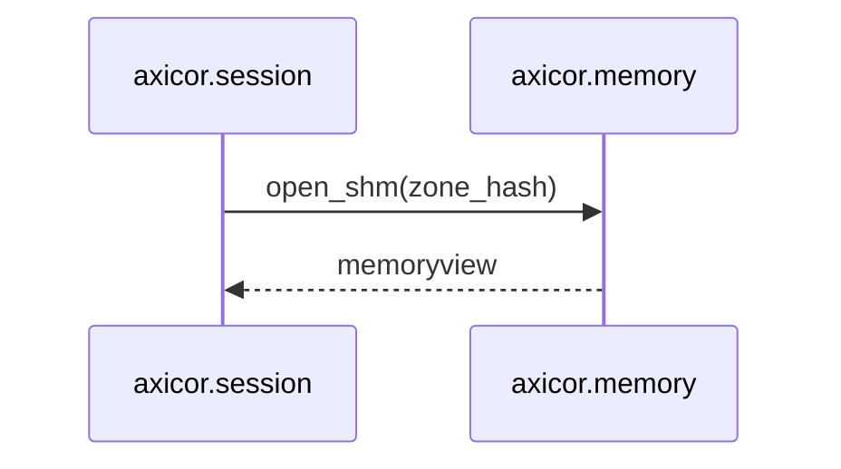

# Шаблон Спецификации Модуля — AxiPy

> Этот документ определяет структуру, правила написания и шаблон для спецификации каждого модуля Python SDK.
> Спецификация — это **контракт**: если код работает, но нарушает спецификацию, это баг в коде, не в спеке.

---

## Часть A — Правила Написания

### A.1. Принципы

| # | Правило | Почему |
|---|---------|--------|
| 1 | **Одна спека = один модуль** | Файл `spec_{module_name}.md` в папке `SDK-specs/py-sdk/L{N}/`. Никаких мульти-модульных документов. |
| 2 | **Спека описывает ЧТО и ПОЧЕМУ, не КАК** | Алгоритм описывается на уровне логики и формул. Конкретная реализация (имена переменных, внутренняя структура классов) — дело кода. Исключение: если порядок байтов или смещения являются частью C-ABI контракта. |
| 3 | **Каждое утверждение — проверяемое** | Если написано «гарантирует X» — должен существовать тест, который это проверит. Если утверждение нельзя проверить — оно не инвариант, а комментарий. |
| 4 | **Граничные случаи — явно** | Не «обрабатывает некорректный ввод», а «при `shm_size == 0` выбрасывает `MemoryMappingError`». |
| 5 | **Обратные зависимости — явно** | Если модуль X экспортирует протокол, а модуль Y его реализует — это фиксируется в обеих спеках. |
| 6 | **Contract-First** | Никаких hardcoded смещений и размеров в Python-коде. Единственный источник — `contract_generated.py`. Нарушение = баг. |
| 7 | **Версионирование семантики** | Если контракт меняется — спека обновляется первой, код вторым. |

### A.2. Язык и Формат

- **Язык**: русский (технические термины на английском допускаются без перевода: `memoryview`, `mmap`, `numpy`, `out=`).
- **Формулы**: блоки ` ```math ` (LaTeX) или ` ```python ` псевдокод. Не словами.
- **Ссылки**: формат `[spec_{module}.md §{номер_секции}]` для перекрёстных ссылок между спеками.
- **TODO/TBD**: допускаются только с тегом `<!-- TBD: причина -->`. При ревью спеки все TBD должны быть закрыты до начала имплементации.

### A.3. Hot / Cold Path

Каждый модуль классифицируется по типу пути:

| Тип | Значение | Ограничения |
|-----|----------|-------------|
| **HOT** | Работает внутри 10ms HFT-цикла (Day Phase) | Zero-alloc, zero-GC, никаких системных вызовов, `out=` mandate |
| **COLD** | Работает один раз при инициализации / завершении | Аллокации и I/O разрешены |
| **WARM** | Вызывается периодически, но не в каждом тике | Аллокации допустимы, но GC давление контролируется |

Модуль может содержать и HOT, и COLD пути. В таком случае спека обязана явно разграничить, какие методы принадлежат какому пути.

### A.4. Чеклист Полноты

Перед тем как считать спеку готовой, проверь:

- [ ] Все публичные классы, протоколы и функции описаны в §4
- [ ] Все инварианты из §3 имеют соответствующий тест в §10
- [ ] Все исключения перечислены в §8
- [ ] Все модули-потребители перечислены в §9.2
- [ ] Нет ни одного «магического числа» без объяснения
- [ ] Граничные случаи из §7 покрыты тестами в §10
- [ ] Все HOT-методы имеют параметр `out=` (если возвращают данные)
- [ ] Ни один HOT-метод не содержит запрещённых конструкций из §3.1

### A.5. Адаптация шаблона

> **Шаблон — это призма, а не копипаст.**
>
> Секции, помеченные `[если применимо]`, при неприменимости **не удаляются**.
> Вместо этого под заголовком пишется краткое объяснение, почему секция неприменима.
> Это защищает от ситуации «забыли подумать» и документирует осознанное решение.
>
> Пример: для модуля `contract` (COLD-модуль без Hot Path) секция §6 (Memory Layout)
> содержит строку: *«Неприменимо. Модуль не оперирует бинарными буферами напрямую,
> а лишь предоставляет смещения для модулей Слоя 2.»*
>
> Заглушки `{...}` в незаполненных секциях должны отражать специфику конкретного модуля,
> а не содержать дословный текст из шаблона.

---

## Часть B — Шаблон

> Всё что ниже — копируется в `SDK-specs/py-sdk/L{N}/spec_{module_name}.md` и заполняется.
> Секции помеченные `[если применимо]` при неприменимости сохраняются с пометкой *«Неприменимо: {причина}»*.

---

```markdown
# spec_{module_name}

> Версия спеки: 1.0  
> Дата: YYYY-MM-DD  
> Слой: Layer {N} — {Layer Name}  
> Тип пути: HOT / COLD / WARM  
> Статус: Draft | Review | Approved  

---

## §1. Идентификация

| Поле | Значение |
|------|----------|
| Имя в пакете | `axicor.{module_name}` |
| Физическое расположение | `axicor/{module_name}/` |
| Слой | {N} — {Layer Name} |
| Тип пути | HOT / COLD / WARM |
| Описание | {Что делает модуль в одном предложении, без "и".} |

---

## §2. Стек и Окружение

### §2.1. Внутренние зависимости (inbound)

| Модуль-источник | Что используем | Зачем |
|----------------|---------------|-------|
| `axicor.dependency_module` | `SomeContract` | {Описание использования контракта / зависимости} |
| ... | ... | ... |

### §2.2. Внешние зависимости

| Пакет / stdlib | Версия | Зачем | Hot Path? |
|---------------|--------|-------|-----------|
| `some_package` | >= 1.0 | {Зачем библиотека} | Да / Нет |
| `stdlib_module`| stdlib | {Зачем stdlib модуль} | Да / Нет |
| ... | ... | ... | ... |

> Внешние зависимости из PyPI должны быть обоснованы.
> Если зависимость используется только в Cold Path — указать это явно.

---

## §3. Инварианты

> Инвариант — это утверждение, которое **всегда истинно** в любом состоянии системы.
> Нарушение инварианта = баг. Каждый инвариант должен иметь тест (§10).

### §3.1. Hot Path инварианты [если модуль HOT/WARM]

> Ограничения на аллокации, GC, и запрещённые конструкции в горячем цикле.

- **INV-{MOD}-HOT-001**: {Описание}.
  - *Следствие нарушения*: {что пойдёт не так: GC stall, jitter, нарушение 10ms бюджета}.
  - *Где проверяется*: {gc.get_stats() тест / tracemalloc snapshot}.

### §3.2. Контрактные инварианты (C-ABI)

> Правила взаимодействия с `contract_generated.py` и бинарной разметкой.

- **INV-{MOD}-ABI-001**: {Описание}.
  - *Следствие нарушения*: {Следствие нарушения контракта, например, CAbiBoundaryError или несовместимость данных}.
  - *Где проверяется*: {Условие проверки, например, assert в коде или unit-тест}.

### §3.3. Ресурсные инварианты (RAII)

> Гарантии управления системными ресурсами (mmap, sockets, file descriptors).

- **INV-{MOD}-RES-001**: {Описание}.
  - *Следствие нарушения*: {утечка дескрипторов / зависшие mmap сегменты}.
  - *Где проверяется*: {__exit__ тест / finalizer}.

### §3.4. Межмодульные инварианты [если применимо]

> Инварианты, валидность которых зависит от нескольких модулей.

- **INV-CROSS-{ID}**: {Описание}.
  - *Участники*: `axicor.{mod_a}`, `axicor.{mod_b}`.
  - *Кто владелец проверки*: `axicor.{module_name}`.

---

## §4. Публичный API

> Полное описание всего, что экспортируется через `__init__.py`.
> Цель: читатель понимает контракт модуля, не открывая код.

### §4.1. Классы

#### `{ClassName}`

```python
class ClassName:
    """Однострочное описание."""
    
    def __init__(self, contract: ContractConfig, ...) -> None:
        """
        {Описание: что аллоцируется, какие ресурсы захватываются.}
        """
        ...
    
    def step(self, data_in: memoryview, *, out: memoryview) -> int:
        """
        [HOT] {Описание одного шага обработки.}
        """
        ...
```

- **Семантика**: {развёрнутое описание, что это за сущность в домене}.
- **Жизненный цикл**: {who creates → who owns → who consumes → when destroyed}.
- **Контекстный менеджер**: Да / Нет. {Если да — что освобождается в `__exit__`.}

> Повторить для каждого публичного класса.

### §4.2. Протоколы (typing.Protocol) [если применимо]

#### `{ProtocolName}`

```python
class ProtocolName(Protocol):
    def method(self, arg: ArgType) -> ReturnType: ...
```

- **Контракт**: {что обязана гарантировать каждая реализация}.
- **Известные реализации**: {перечислить модули}.
- **Антиконтракт**: {чего реализация НЕ должна делать}.

### §4.3. Функции

#### `fn {function_name}(...) -> ...`

- **Назначение**: {что делает}.
- **Путь**: HOT / COLD.
- **Предусловия** (caller гарантирует): {что должно быть истинно на входе}.
- **Постусловия** (callee гарантирует): {что будет истинно на выходе}.
- **Сложность**: O({...}) по времени, O({...}) по памяти.
- **Исключения**: {при каких условиях выбрасывает, или "никогда"}.

### §4.4. Константы и Магические Числа

| Константа | Значение | Тип | Семантика |
|-----------|----------|-----|-----------|
| `SOME_LIMIT` | 128 | `int` | {Семантика константы / ограничение} |
| ... | ... | ... | ... |

---

## §5. Доменная Логика

> Цель секции — объяснить человеку, впервые открывшему спеку, **что это за модуль и зачем он нужен** за 10–30 секунд чтения.
>
> §5 отвечает на три вопроса:
> 1. **ЧТО** делает модуль (роль в системе, одним-двумя предложениями)?
> 2. **ЗАЧЕМ** он выделен в отдельную единицу (какую архитектурную проблему решает его изоляция)?
> 3. **КАКУЮ** доменную проблему он закрывает (на языке предметной области, не кода)?

### Правила написания

1. **Пиши как для коллеги, а не как для конференции.** Никаких вводных конструкций («представляет собой», «является фундаментальным»). Прямо и по делу.
2. **Не пересказывай API.** Если информация уже есть в §4 (классы, функции) — в §5 ей не место. §5 — это «зачем», а не «что внутри».
3. **Не упоминай конкретные классы и функции без острой необходимости.** Детали реализации живут в §4 и §6.
4. **Литмус-тест каждого предложения:** убери его — потеряет ли читатель понимание, зачем модуль существует? Если нет — предложение лишнее, удали.

### Когда нужны подразделы (§5.N), а когда нет

> **По умолчанию §5 — монолит** (один блок текста без подзаголовков).
>
> Подразделы добавляются **только** если модуль содержит **несколько независимых доменных областей**. Признак: если убрать одну подобласть, остальные не потеряют смысл.
>
> **Примеры:**
> - `contract` — монолит. У него одна роль: быть мостом к C-ABI.
> - `codec` — подразделы оправданы: кодирование и декодирование — два независимых процесса с разной математикой.
> - `memory` — монолит. Проецирование SHM — одна задача.

### Анти-паттерны — ЗАПРЕЩЕНО

- Создавать подразделы ради структуры, если модуль делает одну вещь.
- Перечислять в §5 классы и методы (это §4).
- Описывать memory layout (это §6).
- Описывать алгоритмы и формулы (это §6).
- Писать «обеспечивает zero-copy доступ», «минимизирует GC давление» — это детали реализации, а не доменная логика.
- Раздувать текст вводными оборотами и пересказом очевидного.

---

## §6. Алгоритмы, Формулы и Форматы Данных [если применимо]

> Формальное описание вычислений, бинарных раскладок или иных форматов данных (файлов, таблиц).
> Каждый алгоритм / формат — отдельная подсекция (или описывается в ином подходящем для модуля формате).
> Критично для модулей логики, сериализации, кодеков, работы с памятью и транспортом.

### §6.1. {Название алгоритма / структуры}

**Вход**: {параметры с типами и единицами измерения}.  
**Выход**: {результат с типами и единицами измерения}.  
**Детерминизм**: Да / Нет (если нет — почему).

**Формула / Псевдокод:**

```python
# Псевдокод (не привязан к конкретной реализации)
def example_algorithm(data_in: list, *, out: list) -> None:
    ...
```

**Memory Layout / Формат данных** (если описывается бинарная структура или файл):

```
Offset  Size  Field              Type     Описание
──────  ────  ─────              ────     ────────
0x00    4     magic              u32      Сигнатура валидности
0x04    4     version            u32      Версия контракта
...
──────  ────  ─────              ────     ────────
Total:  128 bytes
```

**Численный пример:**

| Вход | Ожидаемый выход | Комментарий |
|------|----------------|-------------|
| `(spike_data, out_buf)` | `out_buf` заполнен | Нормальный случай |
| `(empty_view, out_buf)` | `out_buf` без изменений | Пустой вход |

---

## §7. Граничные Случаи и Особые Сценарии

> Явное перечисление крайних ситуаций. Каждый пункт = потенциальный тест.

### §7.1. Граничные значения

| # | Ситуация | Ожидаемое поведение |
|---|----------|-------------------|
| E-001 | `buffer_size == 0` | {что происходит} |
| E-002 | SHM файл не существует | {что происходит} |
| E-003 | `contract_generated.py` отсутствует | {что происходит} |

### §7.2. Конкурентность [если применимо]

| # | Сценарий | Защита |
|---|----------|--------|
| R-001 | Одновременное чтение SHM из нескольких потоков | {механизм} |

### §7.3. Деградация и Recovery [если применимо]

| # | Отказ | Поведение | Восстановление |
|---|-------|-----------|---------------|
| D-001 | Rust-ядро перезапущено, SHM сброшен | {исключение} | {рекомендация caller'у} |

---

## §8. Ошибки

> Полная таксономия исключений, которые может выбросить модуль.

### §8.1. Перечисление исключений

```python
class {ModuleName}Error(AxicorError):
    """{когда возникает}"""

class SpecificError({ModuleName}Error):
    """{когда возникает}"""
```

### §8.2. Стратегия обработки

| Исключение | Восстановимое? | Рекомендация вызывающему |
|-----------|---------------|------------------------|
| `SpecificError` | Да / Нет | {что делать} |

---

## §9. Зависимости и Интеграция

### §9.1. Что модуль потребляет (inbound)

> Подробнее, чем §2.1 — здесь описываем *контракты*, которые мы ожидаем от зависимостей.

| Модуль-источник | Что используем | Какой контракт ожидаем |
|----------------|---------------|----------------------|
| `axicor.contract` | `Contract.ShmHeader.sizeof` | O(1) доступ, значение неизменно после init |
| ... | ... | ... |

### §9.2. Кто потребляет модуль (outbound / обратные зависимости)

> **Критическая секция**. Перечисляем всех потребителей и ЧТО ИМЕННО они от нас ожидают.
> Изменение в нашем модуле может сломать перечисленных потребителей.

| Модуль-потребитель | Что использует | Какой контракт мы обязаны сохранить |
|-------------------|---------------|-----------------------------------|
| `axicor.transport` | `SharedMemoryManager` | Возвращает стабильный memoryview на весь срок жизни |
| ... | ... | ... |

### §9.3. Диаграмма взаимодействия [если применимо]

> Mermaid sequence/flow diagram для сложных межмодульных протоколов.



---

## §10. Стратегия Тестирования

### §10.1. Юнит-тесты

| Тест | Что проверяет | Связанный инвариант |
|------|--------------|-------------------|
| `test_{описание}` | {что проверяет} | INV-{MOD}-{ID} |
| ... | ... | ... |

### §10.2. GC Pressure тесты [если модуль HOT]

| Тест | Метод | Порог |
|------|-------|-------|
| `test_zero_alloc_{method}` | `gc.get_stats()` delta после N итераций | Delta == 0 |
| ... | ... | ... |

### §10.3. Интеграционные тесты [если применимо]

| Тест | Модули-участники | Сценарий |
|------|-----------------|---------| 
| `test_{описание}` | `{mod_a}` + `{mod_b}` | {Полный цикл} |

### §10.4. Бенчмарки [если модуль HOT]

| Бенчмарк | Метрика | Порог |
|----------|---------|-------|
| `bench_{описание}` | latency p99 | < {N} µs |

---

## §11. Бюджеты и Ограничения [если применимо]

> Жёсткие ограничения на ресурсы. Нарушение = регрессия.

### §11.1. Память

| Ресурс | Бюджет | Как считается |
|--------|--------|-------------|
| Heap delta за тик (HOT) | 0 bytes | `tracemalloc` snapshot |
| ... | ... | ... |

### §11.2. Латентность

| Операция | Бюджет (p99) | Условия |
|----------|-------------|---------|
| `step()` одного тика | < {N} µs | {условия замера} |

---

## Приложение A — Глоссарий [если есть термины, специфичные для модуля]

| Термин | Определение |
|--------|-----------|
| {Term} | {Definition} |
```
